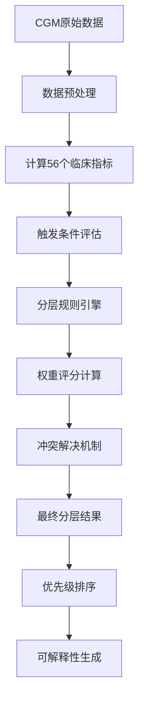

# AGP分层匹配算法详解

## 🎯 AGP分层匹配的完整机制

### 📊 **分层匹配流程图**



---

## 🔍 **第一步：触发条件评估**

### **1.1 硬触发条件** (必须满足)

#### **夜间极度危险层 (Layer 1)**
```python
def check_nocturnal_critical(metrics):
    conditions = {
        'NLGI': metrics.NLGI > 5.0,           # 夜间低血糖指数>5.0
        'NGMin': metrics.NGMin < 3.0,         # 夜间最低血糖<3.0mmol/L
        'NHLT': metrics.NHLT > 120,           # 低血糖持续>120分钟
        'data_quality': metrics.night_points > 20  # 夜间数据点足够
    }
    
    # 硬触发：任意2个条件满足且数据质量合格
    return sum(conditions.values()) >= 2
```

#### **餐后极差控制层 (Layer 14)**
```python
def check_postprandial_critical(metrics):
    conditions = {
        'peak_high': metrics.PPGPeak > 13.0,      # 餐后峰值>13mmol/L
        'excursion_high': metrics.PPGI > 5.0,    # 血糖增量>5mmol/L
        'recovery_slow': metrics.PPRT > 300,     # 恢复时间>5小时
        'auc_high': metrics.PPGAUC > threshold   # 曲线下面积过大
    }
    
    # 硬触发：峰值高且(增量大或恢复慢)
    return conditions['peak_high'] and (
        conditions['excursion_high'] or conditions['recovery_slow']
    )
```

### **1.2 软触发条件** (概率性满足)

#### **黎明现象显著层 (Layer 10)**
```python
def check_dawn_phenomenon_significant(metrics):
    # 多维度评分
    scores = {
        'magnitude': sigmoid_score(metrics.DPM, threshold=2.0, scale=3.5),
        'slope': sigmoid_score(metrics.DPS, threshold=0.8, scale=1.5),
        'duration': sigmoid_score(metrics.DPD, threshold=3, scale=5),
        'insulin_need': sigmoid_score(metrics.MBRI, threshold=1.3, scale=1.8)
    }
    
    # 加权计算
    weighted_score = (
        scores['magnitude'] * 0.4 +
        scores['slope'] * 0.3 +
        scores['duration'] * 0.2 +
        scores['insulin_need'] * 0.1
    )
    
    # 软触发：综合得分>0.6触发
    return weighted_score > 0.6
```

---

## ⚖️ **第二步：权重评分系统**

### **2.1 指标权重配置**

```python
INDICATOR_WEIGHTS = {
    # 安全相关指标 - 最高权重
    'NLGI': 1.0,    # 夜间低血糖指数
    'NGMin': 1.0,   # 夜间最低血糖
    'EHLR': 0.9,    # 运动后低血糖风险
    
    # 控制质量指标 - 高权重
    'PPGPeak': 0.8, # 餐后峰值
    'DPM': 0.8,     # 黎明现象幅度
    'TIR': 0.8,     # 目标范围内时间
    
    # 稳定性指标 - 中等权重
    'PPGCV': 0.6,   # 餐后变异
    'NGSC': 0.6,    # 夜间稳定系数
    
    # 特殊情况指标 - 条件权重
    'PGCI': lambda age, pregnant: 1.0 if pregnant else 0.0,
    'CGHI': lambda age, pregnant: 0.8 if age < 18 else 0.0,
    'EHSI': lambda age, pregnant: 0.9 if age > 65 else 0.0
}
```

### **2.2 动态权重调整**

```python
def adjust_weights_by_context(base_weights, patient_context):
    adjusted = base_weights.copy()
    
    # 年龄调整
    if patient_context['age'] > 65:
        adjusted['EHSI'] *= 1.5  # 老年低血糖风险加权
        adjusted['NLGI'] *= 1.3  # 夜间风险加权
    
    # 妊娠调整
    if patient_context['pregnant']:
        adjusted['PGCI'] = 1.0   # 启用妊娠指标
        adjusted['PPGPeak'] *= 1.2  # 餐后控制更严格
    
    # 病程调整
    if patient_context['duration'] < 2:  # 新诊断
        adjusted['TIR'] *= 0.8   # 降低TIR要求
        adjusted['PPGCV'] *= 1.1 # 提高稳定性要求
    
    return adjusted
```

---

## 🧮 **第三步：分层匹配算法**

### **3.1 多阶段匹配**

#### **阶段1：安全性优先筛选**
```python
def safety_priority_screening(metrics, weights):
    safety_layers = []
    
    # 检查生命威胁层
    if check_nocturnal_critical(metrics):
        safety_layers.append({
            'layer': 1,
            'name': '夜间极度危险',
            'score': calculate_layer_score(metrics, weights, layer=1),
            'priority': 'CRITICAL'
        })
    
    if check_exercise_critical(metrics):
        safety_layers.append({
            'layer': 23,
            'name': '运动高风险', 
            'score': calculate_layer_score(metrics, weights, layer=23),
            'priority': 'CRITICAL'
        })
    
    return safety_layers
```

#### **阶段2：主要问题识别**
```python
def main_issue_identification(metrics, weights):
    issue_layers = []
    
    # 时段分析
    time_segments = {
        'nocturnal': analyze_nocturnal_layers(metrics, weights),
        'dawn': analyze_dawn_layers(metrics, weights),
        'postprandial': analyze_postprandial_layers(metrics, weights),
        'exercise': analyze_exercise_layers(metrics, weights)
    }
    
    # 选择每个时段的最佳匹配
    for segment, candidates in time_segments.items():
        if candidates:
            best_match = max(candidates, key=lambda x: x['confidence'])
            if best_match['confidence'] > 0.5:  # 置信度阈值
                issue_layers.append(best_match)
    
    return issue_layers
```

#### **阶段3：综合风险评估**
```python
def comprehensive_risk_assessment(safety_layers, issue_layers, metrics):
    # 计算综合风险指数
    risk_components = {
        'safety_risk': max([layer['score'] for layer in safety_layers], default=0),
        'control_risk': calculate_control_risk(issue_layers),
        'variability_risk': calculate_variability_risk(metrics),
        'trend_risk': calculate_trend_risk(metrics)
    }
    
    # 综合风险评分
    total_risk = (
        risk_components['safety_risk'] * 0.4 +
        risk_components['control_risk'] * 0.3 +
        risk_components['variability_risk'] * 0.2 +
        risk_components['trend_risk'] * 0.1
    )
    
    # 匹配综合风险分层
    if total_risk > 0.8: return {'layer': 54, 'name': '多时段高风险'}
    elif total_risk > 0.6: return {'layer': 55, 'name': '血糖危险级联'}
    else: return {'layer': 56, 'name': '血糖脆性评估'}
```

---

## 🔄 **第四步：冲突解决机制**

### **4.1 互斥分层处理**
```python
def resolve_exclusive_conflicts(candidate_layers):
    # 定义互斥组
    exclusive_groups = {
        'nocturnal': [1, 2, 3, 4, 5, 6, 7, 8],  # 夜间分层互斥
        'dawn': [9, 10, 11, 12, 13],             # 黎明分层互斥
        'postprandial_control': [14, 15, 19, 20, 21]  # 餐后控制互斥
    }
    
    resolved_layers = []
    
    for group_name, layer_ids in exclusive_groups.items():
        group_candidates = [l for l in candidate_layers if l['layer'] in layer_ids]
        if group_candidates:
            # 选择得分最高的
            best = max(group_candidates, key=lambda x: x['score'])
            resolved_layers.append(best)
    
    # 添加非互斥分层
    non_exclusive = [l for l in candidate_layers 
                    if not any(l['layer'] in group for group in exclusive_groups.values())]
    resolved_layers.extend(non_exclusive)
    
    return resolved_layers
```

### **4.2 分层数量控制**
```python
def control_layer_count(layers, max_layers=8):
    if len(layers) <= max_layers:
        return layers
    
    # 按优先级和得分排序
    priority_order = {'CRITICAL': 4, 'HIGH': 3, 'MEDIUM': 2, 'LOW': 1}
    
    sorted_layers = sorted(layers, key=lambda x: (
        priority_order.get(x['priority'], 0),  # 优先级
        x['score'],                            # 得分
        -x['layer']                           # 分层编号（较小的优先）
    ), reverse=True)
    
    return sorted_layers[:max_layers]
```

---

## 📊 **第五步：实际匹配示例**

### **示例1：R002 v11患者匹配过程**

#### **输入数据**
```python
patient_metrics = {
    'PPGPeak': 16.7,    # 晚餐后峰值
    'PPGI': 4.9,        # 晚餐后增量
    'DPM': 3.5,         # 黎明现象幅度
    'NLGI': 0.0,        # 夜间低血糖指数
    'TIR': 34.8,        # 目标范围内时间
    'HBGI': 16.3,       # 高血糖风险指数
    # ... 其他指标
}
```

#### **匹配过程**
```python
# 阶段1：安全性筛选
safety_results = safety_priority_screening(patient_metrics, weights)
# 结果：无生命威胁分层

# 阶段2：主要问题识别
main_issues = main_issue_identification(patient_metrics, weights)
# 结果：
# - Layer 14 (餐后极差控制): score=0.89, confidence=0.92
# - Layer 10 (黎明现象显著): score=0.76, confidence=0.84
# - Layer 3 (夜间中风险): score=0.45, confidence=0.67

# 阶段3：综合风险
comprehensive = comprehensive_risk_assessment([], main_issues, patient_metrics)
# 结果：Layer 54 (多时段高风险): total_risk=0.83

# 最终匹配结果
final_layers = [
    {'layer': 14, 'name': '餐后极差控制', 'score': 0.89, 'priority': 'CRITICAL'},
    {'layer': 10, 'name': '黎明现象显著', 'score': 0.76, 'priority': 'HIGH'},
    {'layer': 54, 'name': '多时段高风险', 'score': 0.83, 'priority': 'CRITICAL'}
]
```

### **示例2：R016 v11患者匹配过程**

#### **输入数据**
```python
patient_metrics = {
    'PPGPeak': 11.8,    # 餐后峰值适中
    'TIR': 65.0,        # 接近达标
    'DPM': 1.8,         # 黎明现象轻度
    'NLGI': 0.0,        # 无夜间低血糖
    'HBGI': 8.1,        # 中等高血糖风险
    # ... 其他指标
}
```

#### **匹配结果**
```python
final_layers = [
    {'layer': 20, 'name': '餐后良好控制', 'score': 0.72, 'priority': 'MEDIUM'},
    {'layer': 13, 'name': '黎明基本正常', 'score': 0.68, 'priority': 'LOW'},
    {'layer': 7, 'name': '夜间基本安全', 'score': 0.85, 'priority': 'LOW'}
]
```

---

## 🎯 **匹配质量保证**

### **6.1 置信度计算**
```python
def calculate_confidence(metrics, layer_criteria):
    """计算分层匹配的置信度"""
    
    # 指标符合度
    match_scores = []
    for criterion, threshold in layer_criteria.items():
        actual_value = metrics.get(criterion, 0)
        match_score = calculate_match_score(actual_value, threshold)
        match_scores.append(match_score)
    
    # 数据完整度
    data_completeness = metrics.get('data_quality', 1.0)
    
    # 时间稳定性（连续多天的一致性）
    temporal_consistency = metrics.get('temporal_stability', 1.0)
    
    # 综合置信度
    confidence = (
        np.mean(match_scores) * 0.6 +
        data_completeness * 0.25 +
        temporal_consistency * 0.15
    )
    
    return min(max(confidence, 0.0), 1.0)
```

### **6.2 异常检测**
```python
def detect_anomalies(patient_layers, population_stats):
    """检测异常的分层组合"""
    
    anomalies = []
    
    # 检查不合理组合
    layer_combinations = [l['layer'] for l in patient_layers]
    
    if 1 in layer_combinations and 21 in layer_combinations:
        # 夜间极度危险 + 餐后优秀控制 = 不合理
        anomalies.append("矛盾组合：夜间极度危险与餐后优秀控制")
    
    if len([l for l in patient_layers if l['priority'] == 'CRITICAL']) > 3:
        # 超过3个紧急分层 = 可能过度诊断
        anomalies.append("可能过度分层：紧急分层过多")
    
    return anomalies
```

---

## 🔄 **动态调整机制**

### **7.1 时间演化**
```python
def temporal_layer_adjustment(historical_layers, current_metrics):
    """基于历史数据调整当前分层"""
    
    if len(historical_layers) < 3:
        return current_metrics  # 数据不足，不调整
    
    # 趋势分析
    trend_indicators = analyze_trends(historical_layers)
    
    # 分层稳定性
    layer_stability = calculate_layer_stability(historical_layers)
    
    # 调整建议
    if layer_stability < 0.5:  # 分层不稳定
        # 降低敏感度，避免频繁变动
        adjusted_metrics = reduce_sensitivity(current_metrics, factor=0.8)
    else:
        # 分层稳定，可以提高敏感度
        adjusted_metrics = current_metrics
    
    return adjusted_metrics
```

---

**🎯 总结**：AGP分层匹配是一个**多阶段、多权重、多约束**的复杂决策过程，通过硬触发条件、软评分机制、冲突解决和质量保证等多重机制，确保分层结果的准确性、合理性和临床实用性。
