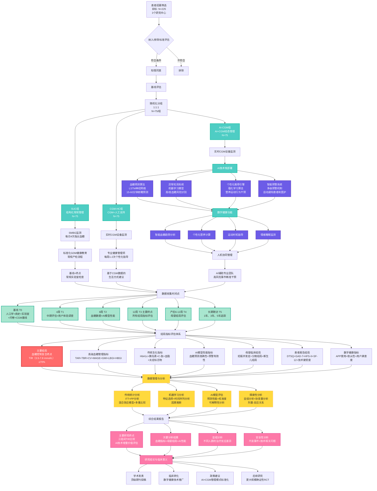

# AI+CGM动态管理模式对妊娠期糖尿病早期干预效果研究流程图

基于AI与连续血糖监测（CGM）的三臂随机对照研究流程

## 流程图说明

### 🎯 **三臂研究设计特点**
- **对照设计**: SUC → CGM-HC → AI-CGM递进式比较
- **样本量**: 总计225例，每组75例
- **研究周期**: 12周干预期 + 长期随访
- **核心目标**: 评估AI技术在CGM基础上的增量价值

### 🤖 **AI技术栈核心组件**
1. **血糖预测算法**
   - LSTM神经网络架构
   - 15-60分钟前瞻性预测
   - MAPE <15%, RMSE <1.5 mmol/L

2. **异常检测系统**
   - 机器学习风险评估模型
   - 实时高/低血糖风险识别
   - 多级预警机制

3. **个性化推荐引擎**
   - 强化学习算法
   - 营养、运动、行为干预建议
   - 基于用户反馈的在线学习

4. **数字健康平台**
   - 智能血糖趋势分析
   - 个性化营养计算
   - 运动时机指导
   - 情绪睡眠监测

### 📊 **结局评估体系**
- **主要结局**: TIR≥70%（血糖在3.5-7.8 mmol/L范围内时间）
- **次要结局**: 6大类指标体系
- **评估时点**: 6个关键时间节点（T0-T5）

### 📈 **分析策略**
- **主要比较**: AI-CGM vs SUC（主要假设）
- **次要比较**: AI-CGM vs CGM-HC（AI增量价值）
- **递进评估**: SUC vs CGM-HC vs AI-CGM（技术价值阶梯）

### 🎯 **预期成果**
- AI技术在GDM管理中的临床验证
- 数字健康干预效果量化
- 为大规模推广提供循证依据