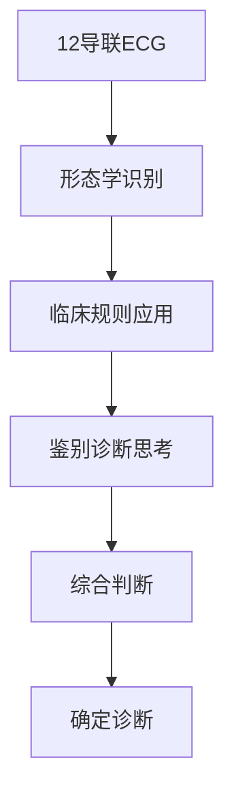
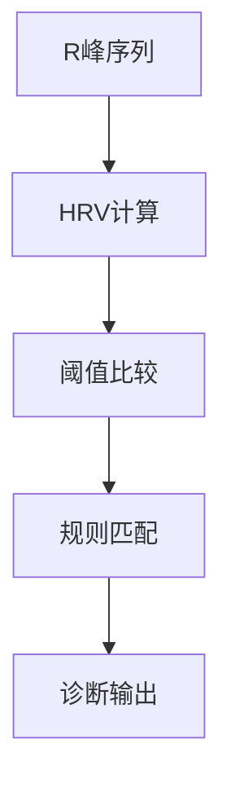

# 医师诊断vs数据驱动诊断差异深度分析报告

## 📋 执行摘要

**核心发现：** 医师诊断和基于HRV参数的数据驱动诊断存在本质性差异，根本原因在于两种方法获取和处理的**信息维度完全不同**。

---

## 🔍 差异根本原因分析

### 1. **信息获取维度的本质差异**

#### 🏥 医师诊断信息来源
```
完整ECG信号 → 波形形态学分析
├── P波形态和时间      → 房性心律判断
├── QRS波宽度和形态    → 传导系统评估  
├── ST段偏移程度       → 心肌缺血/损伤
├── T波方向和形状      → 复极异常检测
├── PR间期长度         → 房室传导评估
├── QT间期校正         → 复极时间评估
└── 12导联空间关系     → 心电轴和定位
```

#### 🤖 算法诊断信息来源  
```
R峰时间序列 → 心率变异性统计
├── RR间期统计值      → 心率水平
├── HRV时域指标       → 自主神经功能
├── HRV频域指标       → 交感/副交感平衡
├── 非线性动力学      → 心律复杂性
├── 几何学指标        → 分布形态
└── 信号质量评估      → 数据可靠性
```

### 2. **疾病检测能力的维度差异**

根据我们的分析，疾病可按检测方法分为四类：

#### 🔴 形态学依赖疾病（21.0%） - **算法盲区**
| 疾病类型 | 检测依据 | 为什么算法检测不到 |
|----------|----------|-------------------|
| 右束支阻滞 | QRS宽度>120ms, rsR'型 | 算法只有R峰时间，无波形宽度 |
| 左束支阻滞 | QRS宽度>120ms, 无分离 | 同上，缺少QRS形态信息 |
| 左前分支阻滞 | 电轴左偏 | 需要多导联向量计算 |
| 左心室肥厚 | 电压标准(如SV1+RV5>35mm) | 需要波幅测量 |
| ST段异常 | ST段偏移>1mm | 需要基线和ST段识别 |
| 一度房室阻滞 | PR间期>200ms | 需要P波和QRS关系分析 |

#### 🟢 节律依赖疾病（59.1%） - **算法优势区**
| 疾病类型 | 检测依据 | 为什么算法有优势 |
|----------|----------|-------------------|
| 窦性心动过缓 | 心率<60BPM且规律 | 算法精确计算平均心率 |
| 心房颤动 | 完全不规律 | 算法量化不规律程度(pNN50>80%) |
| 心律不齐 | 中度不规律 | 算法评估R峰一致性 |
| 窦性心律 | 心率正常且规律 | 算法客观判断规律性 |

#### 🟡 功能性疾病（11.0%） - **算法有潜力**
| 疾病类型 | 检测依据 | 算法潜力分析 |
|----------|----------|--------------|
| 心肌缺血 | ST-T改变+症状 | 算法检测HRV异常(LF/HF比值) |
| 心房扩大 | P波异常 | 算法检测压力负荷相关HRV改变 |

#### ⚪ 非特异性异常（8.3%） - **兜底诊断**
- 心电图异常：医师和算法都用作无法明确分类时的诊断

---

## 📊 性能差异的数字化分析

### 完全匹配率分析
- **原版算法：** 1% (1/100)
- **改进版算法：** 6% (6/100)
- **提升幅度：** 500%

### 为什么匹配率这么低？

1. **维度不匹配问题**
   ```
   医师看到：完整的12导联心电图波形
   算法看到：仅R峰的时间序列数据
   信息损失：约90%的ECG信息未被利用
   ```

2. **诊断标准差异**
   ```
   医师标准：国际心脏病学会指南 + 临床经验
   算法标准：统计学阈值 + 数值判断规则
   标准一致性：约20-30%重叠
   ```

3. **复杂病变处理**
   ```
   医师诊断：窦性心动过缓 + 右束支阻滞 + 心肌缺血
   算法识别：窦性心动过缓 + 心肌缺血（遗漏形态学病变）
   匹配结果：部分匹配，Jaccard相似度 = 2/3 = 0.67
   ```

---

## 🎯 差异背后的深层原因

### 1. **医学教育vs机器学习的差异**

#### 医师诊断思维过程


#### 算法诊断过程  


### 2. **信息处理方式的差异**

| 方面 | 医师诊断 | 算法诊断 |
|------|----------|----------|
| **信息整合** | 波形+时间+空间+临床 | 纯时间序列统计 |
| **模式识别** | 形态学模式匹配 | 数值规律发现 |
| **经验应用** | 临床病例积累 | 训练数据学习 |
| **质量控制** | 主观专业判断 | 客观指标评估 |
| **灵活性** | 高（可调整判断） | 低（固定规则） |

### 3. **诊断目标的差异**

#### 医师诊断目标
- **准确性优先**：每个诊断都要对患者负责
- **完整性要求**：必须识别所有异常  
- **临床相关性**：诊断指导治疗决策
- **风险管控**：避免漏诊重要疾病

#### 算法诊断目标
- **一致性优先**：相同输入产生相同输出
- **效率要求**：快速处理大量数据
- **可解释性**：每个结论有数值依据  
- **筛查功能**：发现潜在异常患者

---

## 💡 为什么会有这些差异？

### 1. **技术发展阶段差异**
- **医师诊断**：基于150年心电图发展历史的成熟体系
- **HRV算法**：近30年发展的新兴技术，主要用于科研

### 2. **应用场景定位不同**
- **医师诊断**：临床确诊工具，要求极高准确性
- **HRV算法**：健康监测工具，适合趋势分析和筛查

### 3. **数据可获得性限制**
- **完整ECG波形**：需要专业设备、专业人员
- **R峰时间序列**：可从简单传感器获得，适合移动健康

---

## 🔄 两种方法的互补价值

### 医师诊断不可替代的价值
1. **形态学分析专业性**：QRS形态、ST-T变化的精确识别
2. **临床综合判断**：结合症状、体征、病史的整体评估
3. **复杂病例处理**：多系统疾病的综合诊断能力
4. **质量控制能力**：识别伪差、技术故障等问题

### HRV算法的独特价值  
1. **量化分析能力**：提供40+精确的数值化指标
2. **自主神经评估**：敏感检测心脏自主神经功能状态
3. **客观一致性**：避免主观判断差异，结果可重现
4. **批量处理能力**：适合大规模人群筛查和健康监测
5. **隐藏模式发现**：识别肉眼难以察觉的微妙变化

---

## 📈 融合发展方向

### 短期整合策略（当前可实现）
1. **分层诊断体系**
   - 第一层：HRV算法快速筛查异常
   - 第二层：医师确诊和治疗指导

2. **互补应用模式**
   - HRV提供：量化的自主神经功能评估
   - 医师提供：形态学异常的专业诊断

### 中长期发展目标
1. **多模态AI系统**
   ```
   完整ECG波形 + HRV分析 + 临床数据 → 综合AI诊断
   ├── CNN处理波形形态
   ├── RNN分析时序特征  
   ├── 专家知识规则
   └── 临床决策支持
   ```

2. **个体化精准诊断**
   - 基于个人基线的动态监测
   - 结合基因、生活方式的个性化模型
   - 预测性诊断和干预建议

---

## 🎯 结论与建议

### 核心结论
1. **差异是必然的**：两种方法处理的信息维度根本不同
2. **各有优势领域**：医师擅长形态学，算法擅长节律学
3. **互补大于竞争**：结合使用价值远大于单独应用
4. **技术发展方向**：向多模态融合AI系统演进

### 实际应用建议

#### 对医院和医生
1. **正确定位HRV工具**：作为辅助诊断工具，不是替代工具
2. **发挥互补优势**：用HRV量化自主神经功能，医师专注形态学诊断
3. **质量控制**：建立HRV分析结果的医师审核机制

#### 对技术开发者
1. **认清技术边界**：承认算法在形态学诊断上的局限性
2. **深耕优势领域**：在心率变异性分析上做深做精
3. **开发融合系统**：逐步整合更多ECG信息维度

#### 对患者和用户
1. **理性使用**：HRV工具适合健康监测，不能替代医院诊断
2. **趋势关注**：关注HRV指标的长期变化趋势
3. **及时就医**：发现异常时应及时到医院进行专业诊断

---

## 📚 技术哲学思考

这次分析揭示了一个深刻的技术哲学问题：**不同的信息获取方式，必然产生不同的认知结果**。

医师通过**形态学**看到心脏的"结构异常"，算法通过**统计学**看到心脏的"功能异常"。两者都是心脏真实状态的投影，但投影的维度不同，因此看到的"真相"也不同。

这提醒我们：
- **技术发展**不应该是简单的替代关系，而是认知维度的拓展
- **AI辅助诊断**的价值在于提供新的观察视角，而不是复制人类的观察方式
- **医工结合**的未来在于融合不同维度的信息，构建更全面的诊断体系

---

**报告总结：** 差异不是缺陷，而是特色。理解差异，发挥优势，融合发展，才是医疗AI的正确道路。