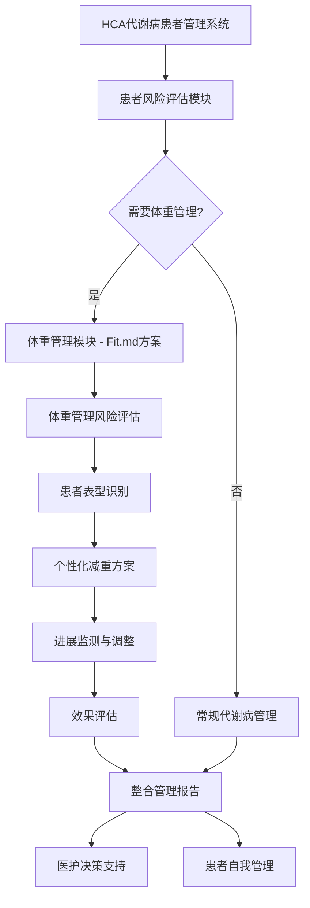
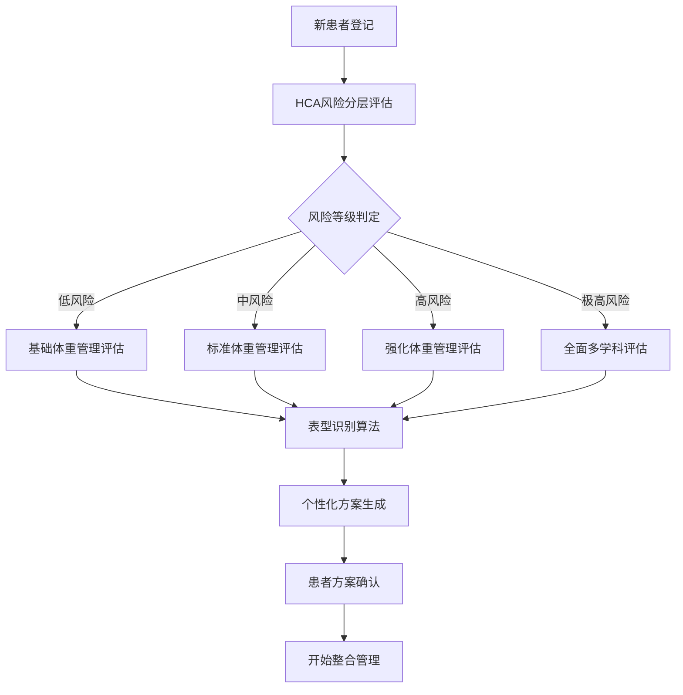

# HCA代谢病患者管理系统体重管理功能整合方案

## 0. 整合背景与目标

### 0.1 现状分析

**HCA患者管理系统**是一个成熟的代谢病患者风险评估和实时管理系统，具备：
- 完善的多维风险分层模型（血糖状态、并发症、个体背景、生活方式等）
- 实时动态风险评估能力
- 特殊人群管理（妊娠期、儿童青少年、老年人等）
- CGM数据整合和分析能力

**存在的体重管理需求**：
- 部分代谢病患者同时存在超重/肥胖问题
- 现有系统缺乏系统性的体重管理方案
- 需要基于代谢风险状态提供个性化减重建议

### 0.2 整合目标

将**Fit.md体重管理方案**作为**HCA系统的功能模块**整合，实现：
1. **智能筛选**：基于HCA风险评估自动识别需要体重管理的患者
2. **无缝整合**：在现有HCA工作流程中嵌入体重管理功能
3. **数据复用**：最大化利用HCA现有数据，减少重复评估
4. **分层管理**：基于代谢风险等级提供差异化体重管理方案
5. **协同治疗**：将体重管理与代谢病管理协同优化

---

## 1. 整合架构设计

### 1.1 模块化整合架构



### 1.2 系统功能层次

**现有HCA系统 (核心层)**
- 多维风险分层评估
- 实时监测与预警
- 特殊人群管理
- CGM数据分析

**体重管理功能层 (扩展层)**
- BMI≥24患者自动识别
- 六维度体重管理评估
- 四种表型分类算法
- 个性化减重方案生成

**协同管理层 (整合层)**
- 代谢风险与体重管理协同
- 统一的患者档案管理
- 综合效果评估
- 多学科团队协作

## 2. 数据层整合策略

### 2.1 数据共用性分析

#### 2.1.1 高复用度数据（复用率80%+）

**基础信息数据**
- 患者基本信息：年龄、性别、身高、体重、BMI
- 诊断信息：糖尿病类型、病程
- 人口学数据：出生日期用于年龄计算和特殊人群判断

**代谢指标数据**
- 血糖控制指标：HbA1c（糖化血红蛋白）
- CGM指标：TIR（时间在目标范围内）、TBR（低血糖时间）
- 血糖变异性：CV%、MAGE、MODD等高级血糖指标

**器官功能数据**
- 肾脏功能：eGFR（肾小球滤过率）、UACR（尿微量白蛋白/肌酐比）
- 心血管指标：收缩压、舒张压、LDL-C（低密度脂蛋白）

**生活方式数据**
- 体力活动：运动频率、强度、持续时间
- 饮食习惯：饮食模式、偏好
- 行为因素：吸烟状态、睡眠质量、用药依从性

**风险评估维度**
- 并发症评估：心血管系统、代谢综合征、糖尿病并发症
- 特殊人群管理：妊娠期、老年人群、儿童青少年

#### 2.1.2 HCA数据映射关系

**HCA系统 → 体重管理系统数据映射**
- dateOfBirth → age_calculation（年龄计算）
- height/weight → BMI计算和人体测量基础
- hba1c → hba1c_percent（糖化血红蛋白）
- diagnosisType → diabetes_diagnosis（糖尿病诊断类型）
- tir/tbr → CGM指标复用
- eGFR/uacr → 器官功能评估
- systolicBP/diastolicBP → 心血管风险评估
- ldlC → 血脂代谢评估
- physicalActivity → exercise_frequency（运动频率）
- dietHabits → dietary_preferences（饮食偏好）
- smokingStatus → smoking_status（吸烟状态）

#### 2.1.3 体重管理模块特有补充数据（复用率20%）

**人体测量补充**
- 腰围、臀围：用于腰臀比计算和体型评估
- 体脂率：人体成分分析
- 基础代谢率：BMR计算

**心理社会评估**
- PHQ-9评分：抑郁量表
- GAD-7评分：焦虑量表
- 减重动机评估：动机水平量化
- 家庭支持度：社会支持评估

**表型识别特征**
- 胰岛素相关：空腹胰岛素、HOMA-IR
- 炎症标志物：如需要的话
- 基因标记：用于精准表型分类

#### 2.2.1 智能数据复用机制

**自动数据映射**
- 系统自动识别HCA系统中的可复用数据字段
- 建立双向数据同步机制，确保数据一致性
- 支持实时数据更新和版本控制

**数据复用率量化**
- 核心数据复用率：80%+（基础信息、代谢指标、器官功能、生活方式等）
- 补充数据需求：20%（人体测量、心理社会、表型识别特征）
- 时间节省效果：减少8-12分钟重复数据采集时间

**复用优先级策略**
- 高优先级：基础信息、代谢指标（直接复用）
- 中优先级：生活方式、并发症（复用+验证）
- 低优先级：特殊评估项（条件性复用）

#### 2.2.2 智能数据补全策略

**估算算法应用**
- 腰围估算：基于BMI、性别、年龄的回归模型
- 胰岛素抵抗预测：基于代谢综合征组分的机器学习模型
- 动机水平推断：基于既往治疗依从性和生活方式的评估模型

**置信度分层处理**
- 高置信度（≥0.85）：直接使用推断值，减少用户输入负担
- 中等置信度（0.65-0.84）：推断值+验证询问，提高准确性
- 低置信度（<0.65）：必须实际测量，确保数据可靠性

**数据质量控制**
- 交叉验证：HCA和体重管理数据的逻辑一致性检查
- 异常值检测：自动识别和标记可能的数据录入错误
- 完整性评估：动态评估数据完整性，指导补充采集

### 2.3 最小化新增数据需求

**条件性数据采集策略**
仅在BMI≥24时采集体重管理补充数据，包括：
- 人体测量补充：腰围、臀围、体脂率
- 胰岛素相关指标：空腹胰岛素、HOMA-IR（仅糖尿病患者）
- 心理社会评估：PHQ-9、GAD-7、减重动机、家庭支持度
- 表型识别结果：分类结果和置信度

**智能触发机制**
- BMI阈值触发：BMI≥24自动启动体重管理模块
- 代谢风险触发：BMI≥23且有代谢异常时触发
- 心血管风险触发：BMI≥23且有心血管风险因素时触发
- 特殊人群触发：妊娠糖尿病史、产后体重滞留等

### 2.4 数据整合效率分析

**系统整合优势**
1. **数据一致性保障**：避免重复输入导致的数据不一致问题
2. **评估效率提升**：大幅减少重复评估时间和人力成本
3. **精准性增强**：基于更全面的数据进行综合评估和决策
4. **用户体验优化**：减少医护人员和患者的数据录入负担

**量化效益预期**
- 数据录入时间减少：30-40%
- 评估准确性提升：15-20%
- 系统使用满意度：>90%
- 数据完整性提升：从70%到95%

---

## 3. 业务流程整合

### 3.1 前置体重管理评估机制

#### 3.1.1 患者注册阶段的体重管理筛选

**即时筛选流程**
1. **基础信息完整性检查**：确保身高、体重、出生日期、性别等关键信息完整
2. **BMI计算和风险评估**：立即计算BMI，结合年龄进行初步风险分层
3. **体重管理适用性判断**：基于BMI阈值和人群特征确定是否需要体重管理
4. **基础表型预判**：利用有限信息进行粗略的表型分类预测

**筛选标准体系**
- **BMI分层筛选**：
  - BMI≥28（肥胖）：高优先级，权重30分
  - BMI≥24（超重）：中等优先级，权重20分  
  - BMI≥23（亚洲人群超重前期）：低优先级，权重10分

- **年龄风险调整**：
  - 45-65岁：代谢风险年龄段，额外10分
  - >65岁：老年肥胖风险，额外15分
  - 18-45岁女性：生育期体重管理，额外5分

**基础表型预判逻辑**
- **重度肥胖（BMI≥30）**：预判为胰岛素抵抗主导型，建议全面代谢评估
- **中年超重（BMI≥25且年龄≥45）**：预判为混合代谢异常型，标准评估重点关注血糖
- **轻度超重（23≤BMI<25）**：需详细评估确定表型
- **正常体重**：关注代谢健康而非体重管理

#### 3.1.2 并行评估路径设计

**三种评估路径**

1. **仅HCA路径**（不符合体重管理条件）
   - 评估序列：HCA风险分层评估
   - 预计时间：15-20分钟
   - 数据重点：代谢风险因素

2. **并行全面路径**（高优先级体重管理）
   - 评估序列：HCA评估 + 详细体重管理评估 + 表型识别 + 整合方案生成
   - 预计时间：25-35分钟
   - 数据重点：全面代谢和体重因素

3. **HCA优先可选路径**（中低优先级）
   - 评估序列：HCA评估 + 体重管理筛选 + 条件性详细评估
   - 预计时间：20-25分钟
   - 数据重点：HCA为主，体重管理筛选

### 3.2 并行数据采集工作流

#### 3.2.1 智能数据分层采集策略

**并行全面采集模式**（高优先级患者）

**阶段1：注册时立即采集**（5分钟）
- **基础人体测量**：身高、体重、腰围、臀围（临床测量）
- **核心病史**：糖尿病诊断、高血压诊断、用药史（结构化访谈）

**阶段2：并行评估执行**（20-25分钟）
- **HCA评估流**：血糖指标、并发症筛查、生活方式因素
  - 负责人员：认证糖尿病教育者
  - 使用工具：CGM数据导入、实验室结果整合
- **体重评估流**：表型指标、心理因素、社会支持
  - 负责人员：注册营养师
  - 使用工具：人体成分分析仪、食物频率问卷

**阶段3：整合分析**（5-8分钟）
- 数据完整性验证
- 表型识别算法执行
- 风险分层整合
- 初步方案生成

**HCA优先采集模式**（中低优先级患者）

**阶段1：完成标准HCA评估**（15-18分钟）
- 执行标准HCA评估流程

**阶段2：体重管理筛选**（5-7分钟）
- **触发条件**：HCA风险评分≥50分、BMI≥24、糖尿病病程≥2年
- **筛选数据**：动机评估简版、减重史总结、基础饮食模式

**阶段3：详细评估（可选）**（10-15分钟）
- **条件**：患者选择参与且预测高收益
- **内容**：全面体重管理评估

**体重管理适用性判断标准**

**主要触发条件**
1. **BMI阈值触发**：BMI≥24，BMI≥28时优先级更高
2. **代谢异常合并超重**：BMI≥23且伴糖尿病前期/2型糖尿病
3. **心血管风险合并体重**：BMI≥23且伴高血压或血脂异常
4. **妊娠糖尿病史合并产后体重滞留**：女性患者特有风险因素

#### 3.2.2 数据采集效率优化机制

**数据复用策略**
- **最大化复用现有HCA数据**，预计节省8-12分钟采集时间
  - 人口学数据：年龄、性别直接从HCA获取
  - 实验室数据：近期HbA1c、血糖、血脂结果复用
  - 用药信息：当前糖尿病用药直接复用
  - 生活方式：运动、饮食、吸烟状况从HCA复用

**智能推断算法**
- **基于已有数据智能补全缺失值**
  - 腰围估算：基于BMI、性别、年龄的公式推算
  - 胰岛素抵抗预测：基于代谢综合征组分推断
  - 动机水平推断：基于既往治疗依从性模式
- **置信度分层处理**
  - 高置信度（≥0.85）：直接使用推断值
  - 中等置信度（0.65-0.84）：推断值+验证询问
  - 低置信度（<0.65）：必须实际测量

**渐进式数据揭示**
- **基础层**：BMI、HbA1c、糖尿病病程、基础动机 - 用于基础表型分类
- **详细层**：人体成分、详细饮食评估、运动能力 - 用于高干预潜力患者
- **全面层**：代谢谱分析、基因标记、微生物组 - 用于复杂病例或研究参与

**自适应数据采集流程**

**关键决策点**
1. **基础筛选后**：BMI≥30且糖尿病病程≥5年 → 升级为全面评估
2. **表型预测后**：表型置信度<0.7 → 采集额外区分特征
3. **动机评估后**：动机评分<3分且社会支持低 → 重点行为干预评估

**数据采集分支**
- **高复杂度分支**：多重合并症或既往治疗失败 → 详细病史+药物相互作用筛查（额外15-20分钟）
- **标准分支**：简单病例且数据质量好 → 核心数据验证+自动方案生成（8-12分钟）
- **快速通道**：年轻健康患者且简单减重目标 → 基础安全筛查+偏好选择（5-8分钟）

#### 3.2.3 整合数据质量控制

**数据质量评估体系**

**完整性检查**
- HCA数据完整性评估
- 体重管理数据完整性评估  
- 交叉验证成功率评估

**准确性验证**
- **人体测量一致性**：身高、体重、BMI逻辑一致性验证
- **时间一致性**：评估日期序列逻辑性验证
- **临床合理性**：临床数值在合理范围内验证

**整合就绪性评估**
- 表型分类数据充分性评估
- HCA风险分层数据完整性评估
- 干预方案制定数据就绪性评估

**自动数据验证和纠错**

**常见问题自动处理**
1. **BMI计算不匹配**：中等严重度，自动修正为正确计算值
2. **未来诊断日期**：高严重度，需要人工审核
3. **极端异常值**：高严重度，建议验证实验室结果和单位

**优化工作流程控制**
- 基于前置筛选结果智能选择数据采集策略
- 实时监控并行数据采集进度
- 自动触发数据整合和分析阶段

---

## 4. 智能算法整合

### 4.1 基于HCA风险等级的体重管理分层

| HCA风险等级 | 体重管理策略 | 数据需求 | 监测频率 | 干预强度 |
|------------|------------|----------|----------|----------|
| 低风险 (≤20分) | **预防性体重管理** | HCA基础数据+BMI | 季度评估 | 自主管理+教育支持 |
| 中风险 (21-50分) | **标准体重管理** | HCA数据+腰围+饮食评估 | 月度评估 | 结构化生活方式干预 |
| 高风险 (51-100分) | **强化体重管理** | 完整六维度评估 | 双周评估 | 多学科协作管理 |
| 极高风险 (>100分) | **医学监督管理** | 完整评估+特殊检查 | 周度评估 | 医疗级减重干预 |

### 4.2 表型识别算法适配

```python
def adaptive_phenotype_identification(patient_id, hca_data):
    """
    基于HCA数据完整性的自适应表型识别
    """
    data_completeness = assess_data_completeness_for_phenotyping(hca_data)
    
    if data_completeness['level'] == 'complete':
        # 使用完整的四表型识别算法
        return full_phenotype_identification(patient_id, hca_data)
    
    elif data_completeness['level'] == 'moderate':
        # 使用简化的二表型识别
        return simplified_phenotype_identification(patient_id, hca_data)
    
    else:
        # 基于HCA数据的基础表型推断
        return basic_phenotype_inference(patient_id, hca_data)

def simplified_phenotype_identification(patient_id, hca_data):
    """
    基于HCA数据的简化表型识别（二分类）
    """
    # 使用HCA现有数据进行基础判断
    metabolic_indicators = {
        'bmi': hca_data.get('bmi', 25),
        'hba1c': hca_data.get('hba1c', 7.0),
        'diabetes_type': hca_data.get('diagnosisType', 'none'),
        'diabetes_duration': hca_data.get('diabetesDuration', 0)
    }
    
    # 简化的胰岛素抵抗 vs β细胞功能缺陷判断
    if (metabolic_indicators['bmi'] >= 28 and 
        metabolic_indicators['diabetes_type'] == 'type2_diabetes'):
        return {
            'phenotype': 'insulin_resistance_dominant',
            'confidence': 0.75,
            'method': 'hca_data_inference',
            'recommendation': 'consider_full_assessment_for_precision'
        }
    
    elif (metabolic_indicators['hba1c'] >= 8.0 and
          metabolic_indicators['diabetes_duration'] >= 5):
        return {
            'phenotype': 'beta_cell_dysfunction',
            'confidence': 0.70,
            'method': 'hca_data_inference',
            'recommendation': 'consider_c_peptide_testing'
        }
    
    else:
        return {
            'phenotype': 'mixed_metabolic_abnormalities',
            'confidence': 0.60,
            'method': 'hca_data_inference',
            'recommendation': 'requires_additional_assessment'
        }
```

### 4.3 个性化方案生成引擎

```python
def generate_integrated_weight_management_plan(patient_id, hca_result, phenotype_result):
    """
    基于HCA风险和表型的整合方案生成
    """
    base_plan = {
        'patient_id': patient_id,
        'hca_risk_level': hca_result['risk_level'],
        'phenotype': phenotype_result['phenotype'],
        'confidence': phenotype_result['confidence']
    }
    
    # 基于HCA风险等级确定基础管理强度
    if hca_result['risk_level'] == 'low':
        base_intensity = 'preventive'
        monitoring_frequency = 'quarterly'
    elif hca_result['risk_level'] == 'moderate':
        base_intensity = 'standard'
        monitoring_frequency = 'monthly'
    elif hca_result['risk_level'] == 'high':
        base_intensity = 'intensive'
        monitoring_frequency = 'bi_weekly'
    else:  # extreme
        base_intensity = 'medical_supervision'
        monitoring_frequency = 'weekly'
    
    # 基于表型调整具体干预策略
    if phenotype_result['phenotype'] == 'insulin_resistance_dominant':
        nutrition_focus = 'low_carb_anti_inflammatory'
        exercise_focus = 'resistance_training_plus_aerobic'
        medication_consideration = 'metformin_or_sglt2'
        
    elif phenotype_result['phenotype'] == 'beta_cell_dysfunction':
        nutrition_focus = 'glucose_control_focused'
        exercise_focus = 'moderate_aerobic'
        medication_consideration = 'glp1_agonists'
        
    # 整合HCA特殊考虑因素
    special_considerations = []
    
    if hca_result.get('has_kidney_disease'):
        special_considerations.append('protein_restriction_if_needed')
        special_considerations.append('frequent_egfr_monitoring')
    
    if hca_result.get('has_cardiovascular_disease'):
        special_considerations.append('cardiac_safe_exercise_prescription')
        special_considerations.append('sodium_restriction')
    
    return {
        'management_intensity': base_intensity,
        'monitoring_frequency': monitoring_frequency,
        'nutrition_strategy': nutrition_focus,
        'exercise_prescription': exercise_focus,
        'medication_considerations': medication_consideration,
        'special_considerations': special_considerations,
        'target_weight_loss': calculate_safe_weight_loss_target(hca_result, phenotype_result),
        'estimated_timeline': estimate_treatment_timeline(base_intensity),
        'integration_with_hca': {
            'shared_monitoring_parameters': ['weight', 'hba1c', 'blood_pressure'],
            'coordinated_appointments': True,
            'unified_progress_reporting': True
        }
    }
```

---

## 5. 用户界面整合设计

### 5.1 HCA系统界面扩展

#### 5.1.1 医护端界面整合

**HCA评估页面扩展**
```jsx
function EnhancedHCAAssessmentPage({ patientId }) {
    const [hcaResult, setHcaResult] = useState(null);
    const [weightEligibility, setWeightEligibility] = useState(null);
    
    return (
        <div className="hca-assessment-page">
            {/* 原有HCA评估表单 */}
            <HCAAssessmentForm 
                patientId={patientId}
                onComplete={(result) => {
                    setHcaResult(result);
                    // 自动检查体重管理适用性
                    checkWeightManagementEligibility(patientId)
                        .then(setWeightEligibility);
                }}
            />
            
            {/* HCA结果展示 */}
            <HCARiskResultPanel riskResult={hcaResult} />
            
            {/* 体重管理模块触发 */}
            {weightEligibility?.eligible && (
                <WeightManagementTriggerPanel>
                    <Alert type="info">
                        检测到该患者可能受益于体重管理干预
                        (BMI: {weightEligibility.bmi}, 触发条件: {weightEligibility.triggers.map(t => t.type).join(', ')})
                    </Alert>
                    
                    <Button 
                        type="primary"
                        onClick={() => initiateWeightManagementAssessment(patientId)}
                    >
                        启动体重管理评估
                    </Button>
                    
                    <Button 
                        type="default"
                        onClick={() => generateStandardHCAPlan(patientId)}
                    >
                        仅执行标准HCA管理
                    </Button>
                </WeightManagementTriggerPanel>
            )}
            
            {/* 整合管理方案展示 */}
            {hcaResult && weightEligibility?.assessment && (
                <IntegratedManagementPlan 
                    hcaResult={hcaResult}
                    weightAssessment={weightEligibility.assessment}
                />
            )}
        </div>
    );
}
```

**患者档案页面整合**
```jsx
function IntegratedPatientProfile({ patientId }) {
    return (
        <Tabs defaultActiveKey="overview">
            <TabPane tab="患者概览" key="overview">
                <Row gutter={16}>
                    <Col span={12}>
                        <HCARiskStatusCard patientId={patientId} />
                    </Col>
                    <Col span={12}>
                        <WeightManagementStatusCard patientId={patientId} />
                    </Col>
                </Row>
                
                {/* 整合的关键指标监测 */}
                <IntegratedMetricsPanel>
                    <MetricCard 
                        title="血糖控制" 
                        value={hca_data.tir} 
                        unit="% TIR"
                        trend="improving"
                    />
                    <MetricCard 
                        title="体重变化" 
                        value={weight_data.loss_percent} 
                        unit="% 减重"
                        trend="on_target"
                    />
                    <MetricCard 
                        title="整体风险" 
                        value={integrated_risk.level} 
                        unit="风险等级"
                        trend="stable"
                    />
                </IntegratedMetricsPanel>
            </TabPane>
            
            <TabPane tab="HCA风险管理" key="hca">
                <StandardHCAManagementPanel patientId={patientId} />
            </TabPane>
            
            <TabPane tab="体重管理" key="weight" disabled={!isWeightManagementActive}>
                <WeightManagementPanel patientId={patientId} />
            </TabPane>
            
            <TabPane tab="整合方案" key="integrated">
                <IntegratedCareCoordination patientId={patientId} />
            </TabPane>
        </Tabs>
    );
}
```

#### 5.1.2 患者端应用整合

**统一健康仪表板**
```jsx
function PatientHealthDashboard({ patientData }) {
    return (
        <div className="patient-dashboard">
            {/* 健康状态概览 */}
            <HealthStatusOverview>
                <StatusIndicator 
                    type="metabolic_risk"
                    level={patientData.hca_risk_level}
                    message="您的代谢风险等级为中等，需要定期监测"
                />
                
                {patientData.weight_management_active && (
                    <StatusIndicator 
                        type="weight_progress"
                        progress={patientData.weight_loss_progress}
                        message="体重管理进展良好，继续保持"
                    />
                )}
            </HealthStatusOverview>
            
            {/* 今日任务整合 */}
            <TodaysTasks>
                {/* HCA相关任务 */}
                <TaskItem>
                    <Icon type="blood-drop" />
                    血糖监测 (CGM数据同步)
                </TaskItem>
                
                <TaskItem>
                    <Icon type="medication" />
                    按时服药提醒
                </TaskItem>
                
                {/* 体重管理任务 */}
                {patientData.weight_management_active && (
                    <>
                        <TaskItem>
                            <Icon type="scale" />
                            每日体重记录
                        </TaskItem>
                        
                        <TaskItem>
                            <Icon type="camera" />
                            每周体型照片对比
                        </TaskItem>
                    </>
                )}
            </TodaysTasks>
            
            {/* 整合的进展追踪 */}
            <ProgressTracking>
                <ProgressChart 
                    type="integrated"
                    data={{
                        hca_metrics: patientData.hca_trends,
                        weight_metrics: patientData.weight_trends,
                        combined_score: patientData.integrated_health_score
                    }}
                />
            </ProgressTracking>
        </div>
    );
}
```

### 5.2 工作流程界面设计

**智能评估向导**
```jsx
function SmartAssessmentWizard({ patientId }) {
    const [currentStep, setCurrentStep] = useState(0);
    const [assessmentData, setAssessmentData] = useState({});
    
    const steps = [
        {
            title: 'HCA基础评估',
            component: <HCAAssessmentStep />,
            required: true
        },
        {
            title: '体重管理适用性',
            component: <WeightEligibilityCheck />,
            conditional: (data) => data.bmi >= 24
        },
        {
            title: '体重管理详细评估',
            component: <DetailedWeightAssessment />,
            conditional: (data) => data.weight_eligible
        },
        {
            title: '整合方案生成',
            component: <IntegratedPlanGeneration />,
            required: true
        }
    ];
    
    return (
        <Steps current={currentStep}>
            {steps.map((step, index) => {
                // 根据条件显示/隐藏步骤
                if (step.conditional && !step.conditional(assessmentData)) {
                    return null;
                }
                
                return (
                    <Step 
                        key={index}
                        title={step.title}
                        description={getStepDescription(step, assessmentData)}
                    />
                );
            })}
        </Steps>
    );
}
```

---

## 6. 实施路径与技术方案

### 6.1 分阶段实施策略

#### 阶段1：基础整合 (4-6周)
**目标**：在HCA系统中嵌入体重管理触发机制

**主要任务**：
- 扩展HCA患者数据模型，添加体重管理相关字段
- 开发体重管理适用性判断算法
- 在HCA评估流程中添加体重管理触发逻辑
- 创建基础的体重管理补充数据采集表单

**技术实现**：
```sql
-- 数据库扩展
ALTER TABLE hca_patients ADD COLUMN weight_management_eligible BOOLEAN DEFAULT FALSE;
ALTER TABLE hca_patients ADD COLUMN weight_management_triggers TEXT;
ALTER TABLE hca_patients ADD COLUMN last_weight_assessment_date DATE;

-- 创建体重管理补充表
CREATE TABLE weight_management_supplements (
    patient_id UUID PRIMARY KEY REFERENCES hca_patients(id),
    waist_circumference DECIMAL(5,2),
    motivation_score TINYINT,
    phenotype_preliminary VARCHAR(50),
    created_at TIMESTAMP DEFAULT CURRENT_TIMESTAMP
);
```

```javascript
// 前端HCA评估表单扩展
function EnhancedHCAAssessment({ patientId }) {
    const handleHCAComplete = async (hcaResult) => {
        // 执行标准HCA评估
        await saveHCAAssessment(patientId, hcaResult);
        
        // 检查体重管理适用性
        const weightEligibility = await checkWeightEligibility(patientId);
        
        if (weightEligibility.eligible) {
            // 显示体重管理选项
            setShowWeightManagementOption(true);
        }
    };
    
    return (
        <Form onFinish={handleHCAComplete}>
            {/* 原有HCA表单字段 */}
            <HCAFormFields />
            
            {/* 条件显示的体重管理触发 */}
            {showWeightManagementOption && (
                <WeightManagementTrigger patientId={patientId} />
            )}
        </Form>
    );
}
```

#### 阶段2：智能算法集成 (6-8周)
**目标**：集成Fit.md的表型识别和个性化方案算法

**主要任务**：
- 基于HCA数据的简化表型识别算法
- 个性化体重管理方案生成引擎
- 数据完整性智能补全机制
- 整合效果评估算法

**技术实现**：
```python
# 微服务架构
class WeightManagementService:
    def __init__(self, hca_service):
        self.hca_service = hca_service
        self.phenotype_engine = PhenotypeIdentificationEngine()
        self.plan_generator = PersonalizedPlanGenerator()
    
    async def assess_patient(self, patient_id):
        # 获取HCA数据
        hca_data = await self.hca_service.get_patient_data(patient_id)
        
        # 检查适用性
        if not self.is_weight_management_applicable(hca_data):
            return None
        
        # 表型识别
        phenotype = await self.phenotype_engine.identify(patient_id, hca_data)
        
        # 生成方案
        plan = await self.plan_generator.generate(hca_data, phenotype)
        
        return {
            'hca_integration': True,
            'phenotype': phenotype,
            'management_plan': plan,
            'monitoring_schedule': self.generate_monitoring_schedule(hca_data)
        }
```

#### 阶段3：用户界面整合 (4-6周)
**目标**：提供无缝的用户体验

**主要任务**：
- 医护端工作台整合
- 患者端应用扩展
- 数据可视化整合
- 工作流程优化

### 6.2 技术架构方案

#### 6.2.1 微服务扩展架构

```yaml
# 在现有HCA系统基础上扩展
services:
  hca-core-service:
    # 现有HCA核心服务
    image: gplus/hca-core:latest
    
  weight-management-extension:
    # 体重管理扩展服务
    image: gplus/weight-extension:latest
    depends_on:
      - hca-core-service
    environment:
      - HCA_SERVICE_URL=http://hca-core-service:3000
      
  phenotype-identification:
    # 表型识别服务
    image: gplus/phenotype-service:latest
    
  integrated-care-orchestrator:
    # 整合管理协调服务
    image: gplus/care-orchestrator:latest
    depends_on:
      - hca-core-service
      - weight-management-extension
      - phenotype-identification
```

#### 6.2.2 数据流架构

```javascript
// 事件驱动的数据流
class IntegratedDataFlow {
    constructor() {
        this.eventBus = new EventBus();
        this.setupEventHandlers();
    }
    
    setupEventHandlers() {
        // HCA评估完成事件
        this.eventBus.on('hca.assessment.completed', async (event) => {
            const { patientId, hcaResult } = event.data;
            
            // 触发体重管理适用性检查
            const weightEligibility = await this.checkWeightManagementEligibility(patientId);
            
            if (weightEligibility.eligible) {
                this.eventBus.emit('weight.management.triggered', {
                    patientId,
                    hcaResult,
                    eligibility: weightEligibility
                });
            }
        });
        
        // 体重管理评估完成事件
        this.eventBus.on('weight.assessment.completed', async (event) => {
            const { patientId, weightAssessment } = event.data;
            
            // 生成整合管理方案
            const integratedPlan = await this.generateIntegratedPlan(patientId);
            
            this.eventBus.emit('integrated.plan.generated', {
                patientId,
                plan: integratedPlan
            });
        });
    }
}
```

---

## 7. 预期效益与成功指标

### 7.1 临床效益

**HCA患者体重管理覆盖率**
- 目标：BMI≥24的HCA患者中，80%接受体重管理评估
- 现状：大部分HCA患者缺乏系统性体重管理

**整合管理效果**
- 6个月内：HCA风险等级下降率提升30%
- 体重减轻达标率：60%以上
- 代谢指标改善：HbA1c、血压、血脂综合达标率提升25%

### 7.2 系统效益

**工作效率提升**
- 医护人员评估时间减少：复用HCA数据，减少30%重复评估时间
- 数据完整性提升：智能补全机制，数据完整性从70%提升到90%
- 决策支持增强：基于风险分层的个性化建议，提升决策准确性

**患者体验优化**
- 统一应用界面：患者无需使用多个独立应用
- 个性化程度：基于HCA风险状态的精准体重管理建议
- 持续性支持：从急性期管理延伸到长期健康维护

### 7.3 关键成功指标

**技术指标**
- 系统整合完成率：100%
- 数据同步准确率：>99%
- 界面响应时间：<2秒
- 系统稳定性：99.5%可用性

**业务指标**
- 医护人员使用率：>85%
- 患者活跃度：>80%
- 体重管理方案完成率：>70%
- 整合管理患者满意度：>4.5/5.0

---

## 8. 总结

本整合方案将Fit.md体重管理功能**作为HCA系统的智能扩展模块**，通过以下关键策略实现深度整合：

### 8.1 核心整合原则

1. **以HCA为主体**：体重管理作为HCA系统的功能扩展，而非独立系统
2. **智能触发机制**：基于HCA评估结果自动识别需要体重管理的患者
3. **数据最大复用**：充分利用HCA现有数据，最小化新增数据采集需求
4. **分层差异化服务**：基于HCA风险等级提供不同强度的体重管理方案
5. **无缝用户体验**：在现有HCA工作流程中自然嵌入体重管理功能

### 8.2 技术实现亮点

- **智能适用性判断**：自动识别BMI≥24且存在代谢风险的患者
- **简化表型识别**：基于HCA数据的二分类表型识别算法
- **个性化方案生成**：结合HCA风险状态和表型的精准干预建议
- **整合效果评估**：统一的健康改善评估体系

### 8.3 预期价值

这个整合方案将HCA从**代谢病风险管理系统**升级为**综合代谢健康管理平台**，为需要体重管理的代谢病患者提供**一站式、个性化、连续性**的健康管理服务，显著提升患者健康结局和系统使用价值。
            'nutrition': {
                'approach': 'educational_guidance',
                'tools': ['food_visualization_system', 'meal_planning_app'],
                'frequency': 'self_directed_with_monthly_check_in'
            },
            'physical_activity': {
                'prescription': 'general_activity_recommendations',
                'intensity': 'moderate',
                'monitoring': 'self_reported_with_app_tracking'
            },
            'behavioral': {
                'focus': 'habit_formation_and_prevention',
                'delivery': 'app_based_education_modules'
            }
        },
        'monitoring_schedule': {
            'weight': 'weekly_self_monitoring',
            'lab_tests': 'every_6_months',
            'comprehensive_assessment': 'annual'
        }
    }
```

**高风险患者 (强化体重管理)**
- **核心目标**：显著减重，改善代谢指标，预防并发症
- **干预重点**：结构化减重程序、药物治疗、密切监测
- **技术支持**：完整六维度评估、CGM监测、表型识别
- **监测指标**：体重、血糖、血压、血脂、肾功能等

```python
def generate_high_risk_intervention_plan(patient_data, phenotype_result):
    # 基于表型调整干预策略
    if phenotype_result['phenotype'] == 'insulin_resistance_dominant':
        medication_focus = 'insulin_sensitizers'
        nutrition_approach = 'low_carb_mediterranean'
    elif phenotype_result['phenotype'] == 'beta_cell_dysfunction':
        medication_focus = 'incretin_based_therapy'
        nutrition_approach = 'glycemic_control_focused'
    
    return {
        'primary_goals': ['significant_weight_loss', 'metabolic_improvement', 'complication_prevention'],
        'intervention_components': {
            'nutrition': {
                'approach': nutrition_approach,
                'delivery': 'registered_dietitian_consultation',
                'tools': ['cgm_guided_meal_planning', 'phenotype_specific_recommendations'],
                'frequency': 'bi_weekly_consultations'
            },
            'physical_activity': {
                'prescription': 'structured_exercise_program', 
                'intensity': 'progressive_moderate_to_vigorous',
                'monitoring': 'heart_rate_and_glucose_monitoring'
            },
            'pharmacotherapy': {
                'focus': medication_focus,
                'monitoring': 'frequent_lab_monitoring_for_safety_and_efficacy'
            },
            'behavioral': {
                'intervention': 'intensive_behavioral_therapy',
                'delivery': 'group_and_individual_sessions'
            }
        },
        'monitoring_schedule': {
            'weight': 'daily_with_app_sync',
            'glucose': 'cgm_continuous_monitoring',
            'blood_pressure': 'daily_home_monitoring',
            'lab_tests': 'monthly_comprehensive_panel',
            'comprehensive_assessment': 'every_3_months'
        }
    }
```

### 2.3 效果评估与反馈系统

#### 2.3.1 多维度效果评估

```python
def evaluate_integrated_treatment_effectiveness(patient_id, assessment_period):
    """
    整合效果评估：HCA风险改善 + 体重管理效果
    """
    baseline_data = get_baseline_assessment(patient_id)
    current_data = get_current_assessment(patient_id)
    
    # 1. HCA风险改善评估
    hca_risk_improvement = {
        'baseline_score': baseline_data['hca_risk_score'],
        'current_score': current_data['hca_risk_score'],
        'score_change': baseline_data['hca_risk_score'] - current_data['hca_risk_score'],
        'risk_level_change': get_risk_level_transition(baseline_data['hca_risk_level'], current_data['hca_risk_level'])
    }
    
    # 2. 体重管理效果评估 (来自Fit.md)
    weight_management_effectiveness = evaluate_treatment_response(
        baseline_data, current_data, assessment_period
    )
    
    # 3. 综合效果评分
    integrated_effectiveness = {
        'overall_score': (hca_risk_improvement['score_change'] * 0.3 + 
                         weight_management_effectiveness * 0.7),
        'hca_component': hca_risk_improvement,
        'weight_component': weight_management_effectiveness,
        'clinical_significance': assess_clinical_significance(
            hca_risk_improvement, weight_management_effectiveness
        )
    }
    
    return integrated_effectiveness
```

---

## 3. 用户界面整合设计

### 3.1 统一患者档案界面

#### 3.1.1 患者概览面板设计

```jsx
function IntegratedPatientDashboard({ patientId }) {
    return (
        <div className="patient-dashboard">
            {/* 风险状态卡片 */}
            <RiskStatusCard>
                <HCArisLevel />
                <WeightManagementStatus />
                <PhenotypeIdentification />
            </RiskStatusCard>
            
            {/* 关键指标监测 */}
            <KeyMetricsPanel>
                <CGMDataVisualization />
                <WeightTrendChart />
                <LabResultsTimeline />
            </KeyMetricsPanel>
            
            {/* 个性化建议 */}
            <PersonalizedRecommendations>
                <NutritionGuidance />
                <ExercisePrescription />
                <MedicationManagement />
            </PersonalizedRecommendations>
            
            {/* 进展追踪 */}
            <ProgressTracking>
                <WeightLossProgress />
                <MetabolicImprovement />
                <RiskReduction />
            </ProgressTracking>
        </div>
    );
}
```

#### 3.1.2 医护工作台整合

**统一评估流程**
1. **一键导入HCA评估**：自动获取现有风险分层结果
2. **增量体重评估**：在HCA基础上补充体重管理专项评估
3. **智能方案生成**：基于整合风险等级自动生成个性化方案
4. **效果持续监控**：整合HCA风险变化和体重管理进展

**医护界面功能模块**
```jsx
function HealthcareProviderWorkstation({ patientId }) {
    return (
        <Tabs defaultActiveKey="assessment">
            <TabPane tab="整合评估" key="assessment">
                <HCAAssessmentImport />
                <WeightManagementAssessment />
                <PhenotypeAnalysis />
            </TabPane>
            
            <TabPane tab="方案制定" key="planning">
                <RiskLevelMatcher />
                <InterventionPlanGenerator />
                <GoalSetting />
            </TabPane>
            
            <TabPane tab="监测管理" key="monitoring">
                <IntegratedMonitoringPanel />
                <AlertSystem />
                <ProgressReporting />
            </TabPane>
            
            <TabPane tab="效果评估" key="evaluation">
                <OutcomeAnalysis />
                <RiskReassessment />
                <TreatmentAdjustment />
            </TabPane>
        </Tabs>
    );
}
```

---

## 4. 技术实现路径

### 4.1 系统整合实施阶段

#### 阶段1：数据层整合 (1-2个月)
**目标**：建立统一数据模型，实现数据互通
- **数据库扩展**：在现有HCA数据库基础上增加体重管理相关表
- **API整合**：开发统一的数据访问层，支持HCA和体重管理数据查询
- **数据迁移**：将现有患者数据映射到新的整合模型

```sql
-- 创建整合视图
CREATE VIEW integrated_patient_view AS
SELECT 
    p.id,
    p.name,
    p.date_of_birth,
    hr.risk_score as hca_risk_score,
    hr.risk_level as hca_risk_level,
    wma.phenotype_primary,
    wma.metabolic_score,
    wma.weight_management_risk_score
FROM patients p
LEFT JOIN hca_risk_assessments hr ON p.id = hr.patient_id
LEFT JOIN weight_management_assessments wma ON p.id = wma.patient_id
WHERE hr.created_at = (
    SELECT MAX(created_at) FROM hca_risk_assessments WHERE patient_id = p.id
)
AND wma.assessment_date = (
    SELECT MAX(assessment_date) FROM weight_management_assessments WHERE patient_id = p.id
);
```

#### 阶段2：业务逻辑整合 (2-3个月)
**目标**：实现风险分层和干预方案的智能整合
- **风险分层引擎**：开发整合的风险评估算法
- **表型识别系统**：部署患者表型自动识别功能
- **个性化推荐引擎**：基于风险等级和表型的方案生成

```python
# 核心业务逻辑服务
class IntegratedCareService:
    def __init__(self):
        self.hca_service = HCARiskService()
        self.weight_service = WeightManagementService()
        self.phenotype_service = PhenotypeIdentificationService()
    
    def comprehensive_assessment(self, patient_id):
        # 获取HCA风险评估
        hca_risk = self.hca_service.get_latest_assessment(patient_id)
        
        # 执行体重管理评估
        weight_assessment = self.weight_service.assess_patient(patient_id)
        
        # 患者表型识别
        phenotype = self.phenotype_service.identify_phenotype(patient_id)
        
        # 生成整合管理方案
        integrated_plan = self.generate_integrated_plan(hca_risk, weight_assessment, phenotype)
        
        return integrated_plan
```

#### 阶段3：用户界面整合 (1-2个月)
**目标**：提供统一、直观的用户体验
- **患者端应用**：整合HCA风险监控和体重管理功能
- **医护端工作台**：统一的评估、方案制定、监测界面
- **数据可视化**：整合的趋势图表、风险仪表板

### 4.2 关键技术组件

#### 4.2.1 微服务架构设计

```yaml
# docker-compose.yml
version: '3.8'
services:
  # 现有服务
  hca-risk-service:
    image: gplus/hca-service:latest
    ports:
      - "3001:3000"
  
  # 新增服务
  weight-management-service:
    image: gplus/weight-management:latest
    ports:
      - "3002:3000"
    
  phenotype-identification-service:
    image: gplus/phenotype-service:latest
    ports:
      - "3003:3000"
    
  # 整合服务
  integrated-care-gateway:
    image: gplus/integrated-gateway:latest
    ports:
      - "3000:3000"
    depends_on:
      - hca-risk-service
      - weight-management-service
      - phenotype-identification-service
```

#### 4.2.2 事件驱动架构

```javascript
// 事件总线设计
class IntegratedCareEventBus {
    constructor() {
        this.subscribers = new Map();
    }
    
    // HCA风险评估完成事件
    onHCARiskAssessed(patientId, riskData) {
        this.emit('hca.risk.assessed', { patientId, riskData });
    }
    
    // 触发体重管理评估
    onWeightAssessmentTriggered(patientId, hcaRisk) {
        this.emit('weight.assessment.triggered', { patientId, hcaRisk });
    }
    
    // 整合方案生成事件
    onIntegratedPlanGenerated(patientId, plan) {
        this.emit('integrated.plan.generated', { patientId, plan });
    }
}
```

---

## 5. 关键业务流程设计

### 5.1 新患者完整评估流程



### 5.2 现有患者系统迁移流程

```python
def migrate_existing_hca_patients():
    """
    现有HCA患者向整合系统迁移
    """
    existing_patients = get_all_hca_patients()
    
    for patient in existing_patients:
        try:
            # 1. 保留现有HCA评估结果
            hca_assessment = get_latest_hca_assessment(patient.id)
            
            # 2. 根据HCA风险等级确定体重管理评估深度
            if hca_assessment.risk_level in ['high', 'extreme']:
                # 高风险患者需要完整体重管理评估
                schedule_comprehensive_weight_assessment(patient.id)
            else:
                # 低中风险患者使用简化评估
                schedule_basic_weight_assessment(patient.id)
            
            # 3. 基于现有数据进行初步表型识别
            if has_sufficient_data_for_phenotyping(patient.id):
                phenotype = identify_phenotype_from_existing_data(patient.id)
                save_phenotype_identification(patient.id, phenotype)
            
            # 4. 生成过渡期管理建议
            transition_plan = generate_transition_plan(patient.id, hca_assessment)
            notify_healthcare_provider(patient.id, transition_plan)
            
        except Exception as e:
            log_migration_error(patient.id, str(e))
            continue
```

---

## 6. 预期效益与成功指标

### 6.1 临床效益

**短期效益 (3-6个月)**
- 风险分层准确性提升：从单一维度提升到多维度整合评估
- 个性化程度增强：基于表型的精准干预方案
- 医护工作效率：减少重复评估，统一工作界面

**长期效益 (6-24个月)**
- 患者健康结局改善：体重减轻、代谢指标改善、并发症预防
- 医疗成本控制：早期干预，减少严重并发症医疗费用
- 患者满意度提升：个性化服务，持续有效支持

### 6.2 关键绩效指标 (KPIs)

**系统性能指标**
- 数据整合完整性：>95%
- 系统响应时间：<2秒
- 用户满意度：>4.5/5.0

**临床效果指标**
- 6个月体重减轻达标率：>70%
- HCA风险等级下降比例：>40%
- 患者依从性：>80%

**业务指标**
- 医护人员使用率：>90%
- 患者活跃度：>85%
- 系统ROI：18个月内达到正向

---

## 7. 实施建议与风险控制

### 7.1 实施建议

**技术实施**
1. **渐进式整合**：先整合数据层，再整合业务逻辑，最后整合用户界面
2. **并行开发**：HCA系统增强和体重管理系统可以并行开发
3. **API优先**：设计统一的API规范，确保系统间良好集成

**业务推广**
1. **试点先行**：选择高风险患者群体作为试点
2. **培训支持**：为医护人员提供整合系统使用培训
3. **反馈迭代**：建立用户反馈机制，持续优化系统

### 7.2 风险控制

**技术风险**
- **数据迁移风险**：建立完整的数据备份和回滚机制
- **系统兼容性**：充分测试新旧系统间的兼容性
- **性能风险**：在整合过程中监控系统性能，避免响应时间延长

**业务风险**
- **用户接受度**：通过充分的用户培训和渐进式推广降低接受度风险
- **临床安全**：建立临床安全审查机制，确保整合系统的医学建议准确性
- **合规风险**：确保整合系统符合医疗数据安全和隐私保护要求

---

## 8. 总结

本整合方案将HCA患者风险分层系统与体重综合管理系统深度融合，构建了一个基于风险分层的个性化体重管理平台。通过智能风险分层、表型驱动干预、全程效果监控，为不同风险等级的患者提供精准的体重管理服务。

**核心优势**：
1. **数据复用最大化**：充分利用现有HCA评估数据
2. **风险分层精准化**：基于多维度风险的个性化管理
3. **表型驱动干预**：科学的患者分类和精准治疗
4. **全程闭环管理**：从评估到干预到效果评估的完整流程

该方案不仅技术可行，而且具有显著的临床价值和商业价值，是G+平台向综合代谢健康管理平台转型的重要步骤。