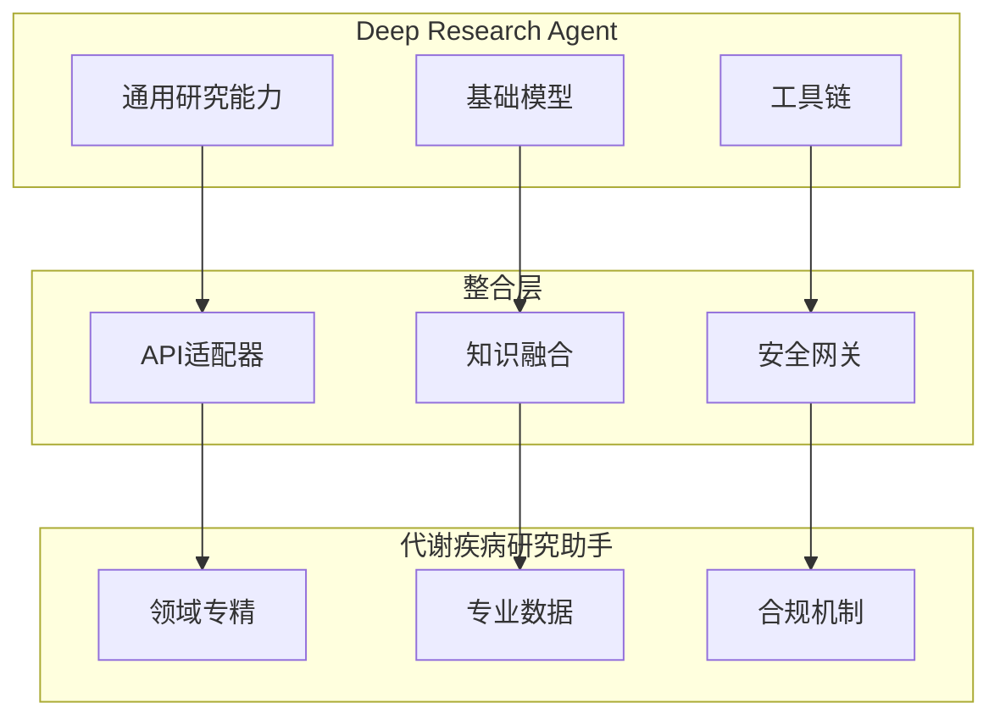
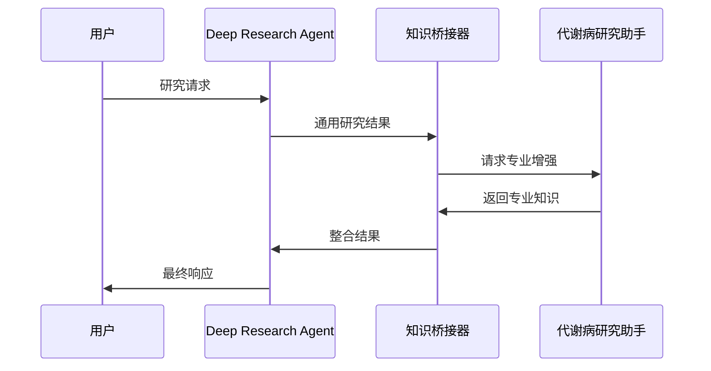

# Google Deep Research Agent 与代谢疾病研究助手对比分析

## 1. 功能对比

### 1.1 Google Deep Research Agent
- **优势**
  1. 通用研究能力
     - 跨领域研究支持
     - 广泛的知识基础
     - 灵活的研究策略

  2. 强大的基础模型
     - PaLM/Gemini为基础
     - 强大的理解和推理能力
     - 多模态处理能力

  3. 成熟的工具链
     - Google研究工具集成
     - 强大的搜索能力
     - 丰富的API支持

- **局限**
  1. 领域专注度
     - 非医学专用
     - 缺乏代谢病特定知识
     - 医学术语理解有限

  2. 临床应用
     - 缺乏医疗法规合规性
     - 临床决策支持有限
     - 医疗数据处理受限

### 1.2 代谢疾病研究助手
- **优势**
  1. 领域专精
     - 代谢病专业知识
     - 医学研究流程优化
     - 临床应用导向

  2. 专业数据源
     - 医学文献深度整合
     - 临床试验数据接入
     - 专业知识库对接

  3. 合规性设计
     - 医疗数据安全
     - 隐私保护机制
     - 临床规范遵守

- **局限**
  1. 通用性
     - 仅限代谢病领域
     - 跨领域能力有限
     - 知识迁移受限

  2. 模型能力
     - 基础模型能力较弱
     - 推理深度有限
     - 需要专门训练

## 2. 整合方案

### 2.1 架构整合


### 2.2 功能整合策略

1. **基础能力复用**
   ```python
   class IntegratedResearchAgent:
       """整合的研究代理"""
       
       def __init__(self):
           self.deep_research = GoogleDeepResearchAgent()
           self.metabolic = MetabolicResearchAssistant()
           self.knowledge_bridge = KnowledgeBridge()
           
       async def research(self, query: str) -> Research:
           """研究流程
           1. 通用研究：使用Deep Research Agent
           2. 专业增强：使用代谢病研究助手
           3. 结果整合：通过知识桥接
           """
           pass
   ```

2. **知识互补**
   ```python
   class KnowledgeBridge:
       """知识桥接器"""
       
       async def enhance_general_knowledge(self, 
                                        general_result: Dict,
                                        domain: str) -> Dict:
           """使用专业知识增强通用结果"""
           pass
           
       async def validate_medical_aspects(self,
                                        research: Research) -> ValidationResult:
           """医学验证"""
           pass
   ```

### 2.3 数据流整合



## 3. 使用建议

### 3.1 适用场景划分

| 场景 | 推荐方案 | 原因 |
|------|----------|------|
| 通用研究背景 | Deep Research Agent | 更强的通用研究能力 |
| 代谢病专研 | 代谢病研究助手 | 专业性和准确性更高 |
| 跨领域研究 | 整合方案 | 优势互补 |
| 临床应用 | 代谢病研究助手 | 合规性和安全性更好 |

### 3.2 整合使用指南

1. **研究流程**
   - 先使用Deep Research Agent进行广泛研究
   - 通过知识桥接器过滤和增强结果
   - 使用代谢病研究助手进行专业深化
   - 最后进行结果整合和验证

2. **数据处理**
   - 通用数据使用Deep Research Agent处理
   - 医学数据使用代谢病研究助手处理
   - 通过知识桥接器确保数据一致性

3. **结果验证**
   - 使用Deep Research Agent验证通用性
   - 使用代谢病研究助手验证专业性
   - 通过知识桥接器确保结论可靠性

## 4. 结论和建议

### 4.1 结论
1. Google Deep Research Agent **不能完全替代**代谢疾病研究助手
2. 两者各有优势，可以互补
3. 整合使用能获得最佳效果

### 4.2 建议
1. **短期**
   - 保持代谢病研究助手的独立发展
   - 开发与Deep Research Agent的接口
   - 建立知识bridge机制

2. **中期**
   - 实现基础能力的逐步整合
   - 建立专业知识验证机制
   - 优化协同工作流程

3. **长期**
   - 深度整合两个系统
   - 建立统一的研究平台
   - 保持医学专业特性

### 4.3 风险提示
1. 整合过程中需要特别注意：
   - 医疗数据安全
   - 结论可靠性
   - 专业性保持
   - 合规性要求
