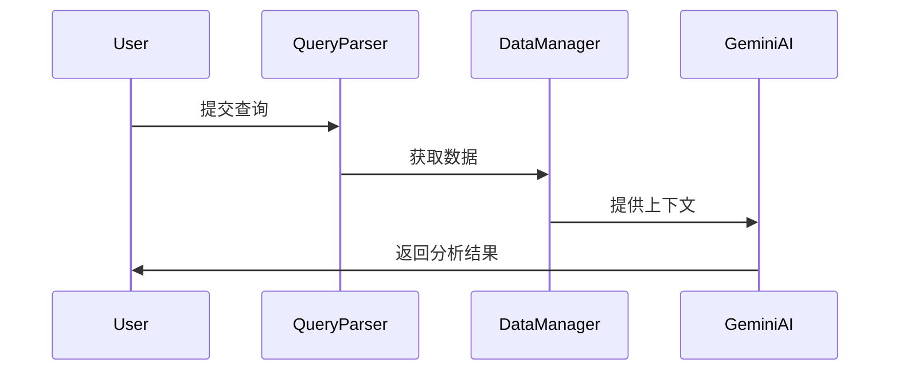

# 医学研究智能助手系统技术文档

## 系统概述

医学研究智能助手是一个结合了 Gemini 人工智能和专业医学数据源的研究辅助系统。本文档详细说明系统架构、实现方式和部署流程。

## 目录

1. [系统架构](#系统架构)
2. [数据源集成](#数据源集成)
3. [AI 集成](#AI集成)
4. [部署指南](#部署指南)
5. [API 参考](#API参考)
6. [最佳实践](#最佳实践)

## 系统架构

### 核心组件

1. **用户界面层**
   - Web 接口
   - API 接口
   - 命令行工具

2. **应用层**
   - 查询解析器
   - 结果生成器
   - 缓存管理器

3. **AI 层**
   - Gemini 接口
   - 提示工程
   - 结果验证

4. **数据源层**
   - 数据源适配器
   - 数据转换器
   - 结果合并器

### 关键流程

1. **查询处理**


2. **数据流转**


## 数据源集成

### 免费数据源

1. **PubMed API**
```python
class PubMedAdapter:
    base_url = "https://eutils.ncbi.nlm.nih.gov/entrez/eutils/"
    
    async def search(self, query: str) -> Dict:
        """执行PubMed搜索"""
        endpoint = f"{self.base_url}/esearch.fcgi"
        params = {
            "db": "pubmed",
            "term": query,
            "retmode": "json"
        }
        return await self._make_request(endpoint, params)
```

2. **ClinicalTrials.gov API**
```python
class ClinicalTrialsAdapter:
    base_url = "https://clinicaltrials.gov/api"
    
    async def search(self, query: str) -> Dict:
        """搜索临床试验"""
        endpoint = f"{self.base_url}/query/study_fields"
        params = {
            "expr": query,
            "fields": "NCTId,BriefTitle,Condition",
            "fmt": "json"
        }
        return await self._make_request(endpoint, params)
```

### 付费数据源

1. **DrugBank API**
   - 需要订阅
   - 提供详细的药物信息
   - 支持结构化查询

2. **专业期刊 API**
   - 按需订阅
   - 提供全文访问
   - 支持高级检索

## AI 集成

### Gemini 配置

```python
class GeminiConfig:
    model = "gemini-pro"
    temperature = 0.7
    max_tokens = 2048
    top_p = 0.95
```

### 提示工程

1. **基础提示模板**
```python
def build_prompt(query: str, context: Dict) -> str:
    return f"""
    作为医学研究助手，请分析以下问题：
    问题：{query}
    
    相关文献：
    {format_literature(context['publications'])}
    
    临床试验：
    {format_trials(context['trials'])}
    
    请提供：
    1. 主要发现
    2. 研究证据
    3. 临床意义
    4. 未来方向
    """
```

2. **结果验证**
```python
def validate_response(response: str) -> bool:
    required_sections = [
        "主要发现",
        "研究证据",
        "临床意义",
        "未来方向"
    ]
    return all(section in response for section in required_sections)
```

## 部署指南

### 环境要求

```bash
# 系统要求
Python >= 3.8
Redis >= 6.0
Node.js >= 14.0

# 依赖安装
pip install -r requirements.txt
```

### 配置文件

```yaml
# config/production.yaml
api_keys:
  gemini: ${GEMINI_API_KEY}
  pubmed: ${PUBMED_API_KEY}
  drugbank: ${DRUGBANK_API_KEY}

cache:
  provider: redis
  host: localhost
  port: 6379
  ttl: 3600

logging:
  level: INFO
  handlers:
    - console
    - file
```

### 部署步骤

1. **准备环境**
```bash
# 创建虚拟环境
python -m venv venv
source venv/bin/activate

# 安装依赖
pip install -r requirements.txt
```

2. **配置服务**
```bash
# 设置环境变量
export GEMINI_API_KEY=your_key_here
export PUBMED_API_KEY=your_key_here

# 启动Redis
redis-server
```

3. **启动应用**
```bash
# 开发环境
python app.py

# 生产环境
gunicorn app:app --workers 4 --bind 0.0.0.0:8000
```

## API 参考

### 研究查询 API

```http
POST /api/v1/research
Content-Type: application/json

{
    "query": "2型糖尿病患者中GLP-1受体激动剂的最新研究进展",
    "domain": "endocrinology",
    "context": "关注心血管获益和减重效果"
}
```

### 响应格式

```json
{
    "status": "success",
    "data": {
        "analysis": "...",
        "sources": [...],
        "confidence": 0.95,
        "timestamp": "2025-08-18T10:30:00Z"
    }
}
```

## 最佳实践

### 1. 错误处理

```python
try:
    result = await data_manager.search(query)
except DataSourceError as e:
    logger.error(f"数据源错误: {str(e)}")
    fallback_result = await cache_manager.get_fallback(query)
except AIError as e:
    logger.error(f"AI处理错误: {str(e)}")
    fallback_result = get_basic_analysis(query)
```

### 2. 缓存策略

```python
async def get_cached_data(query: str) -> Optional[Dict]:
    # 1. 检查缓存
    cached = await cache.get(query_hash)
    if cached:
        return cached
        
    # 2. 获取新数据
    data = await fetch_fresh_data(query)
    
    # 3. 更新缓存
    await cache.set(query_hash, data, ttl=3600)
    return data
```

### 3. 性能优化

```python
# 并行数据获取
async def fetch_all_sources(query: str) -> Dict:
    tasks = [
        pubmed_adapter.search(query),
        trials_adapter.search(query),
        drugbank_adapter.search(query)
    ]
    results = await asyncio.gather(*tasks)
    return combine_results(results)
```

### 4. 监控指标

```python
# 监控关键指标
metrics = {
    "api_calls": Counter("api_calls_total", "API调用次数"),
    "response_time": Histogram("response_time_seconds", "响应时间"),
    "error_rate": Gauge("error_rate_percent", "错误率")
}
```

## 附录

### A. 常见问题

1. **Q: 如何处理API限流？**
   A: 实现令牌桶算法进行限流控制
   
2. **Q: 如何确保数据质量？**
   A: 实施多层验证机制

### B. 更新日志

- 2025-08-18: 初始版本发布
- 2025-08-17: 完成数据源集成
- 2025-08-16: 完成AI集成
