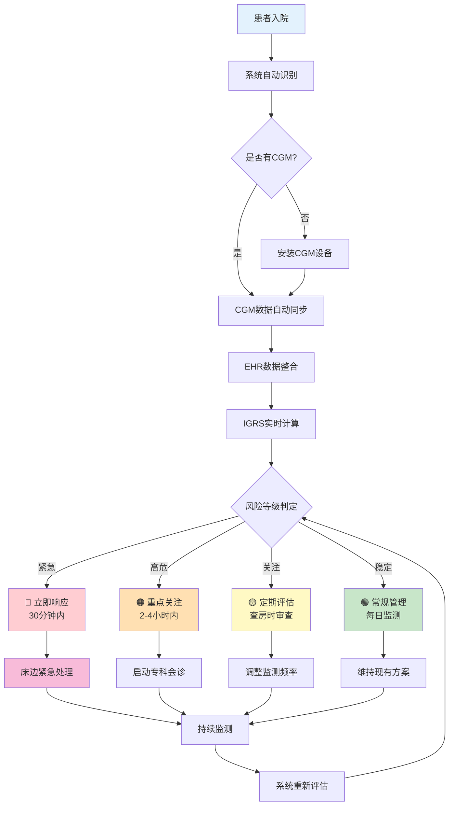
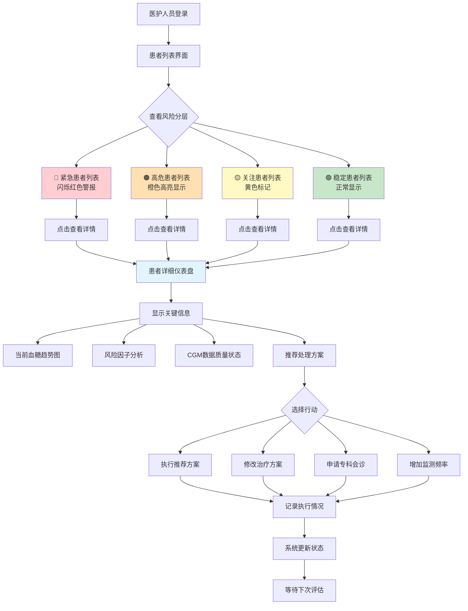
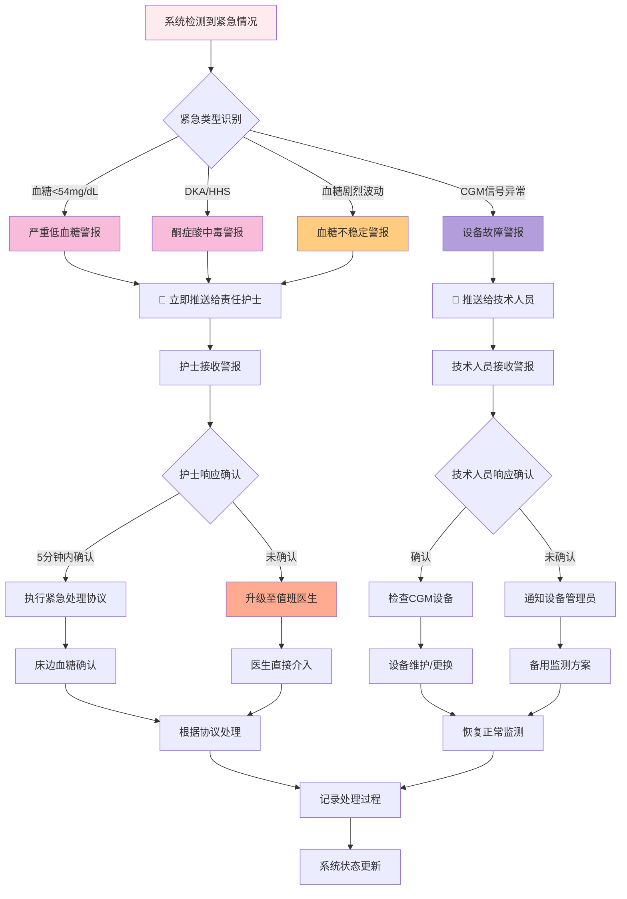
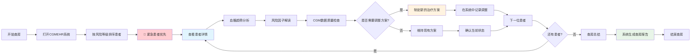
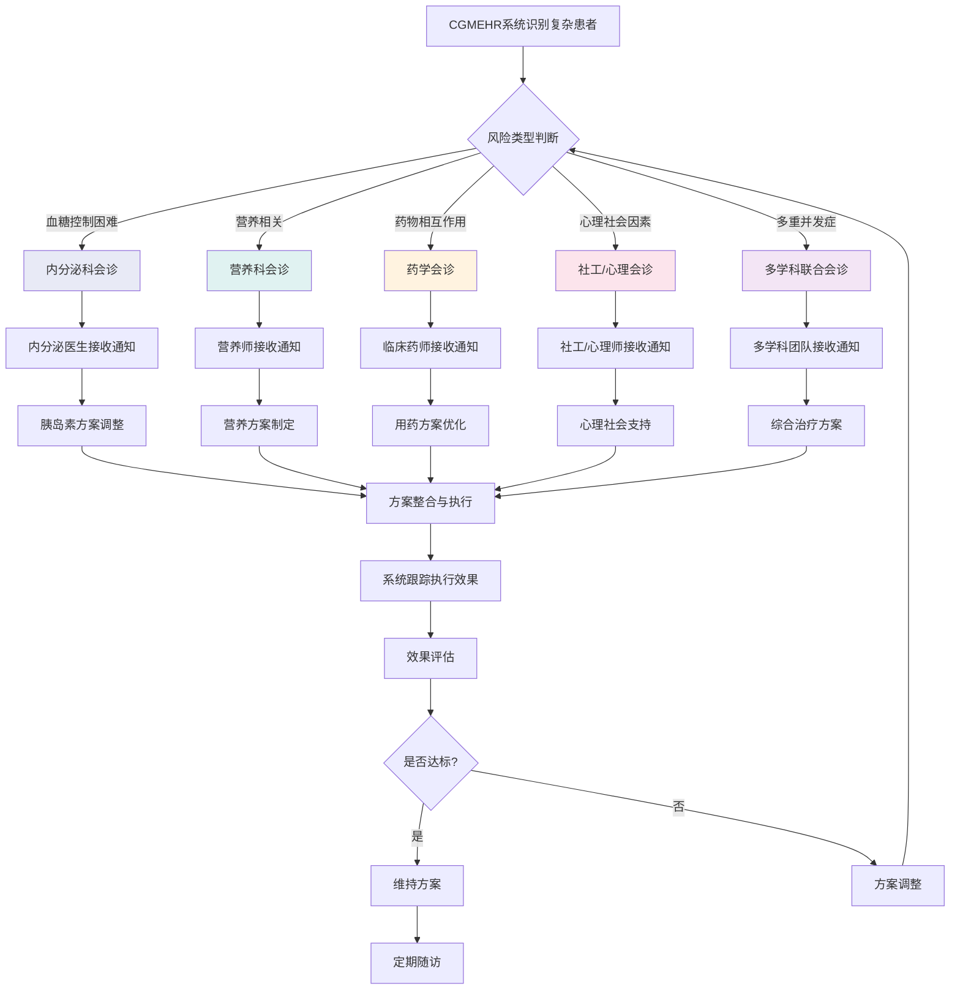
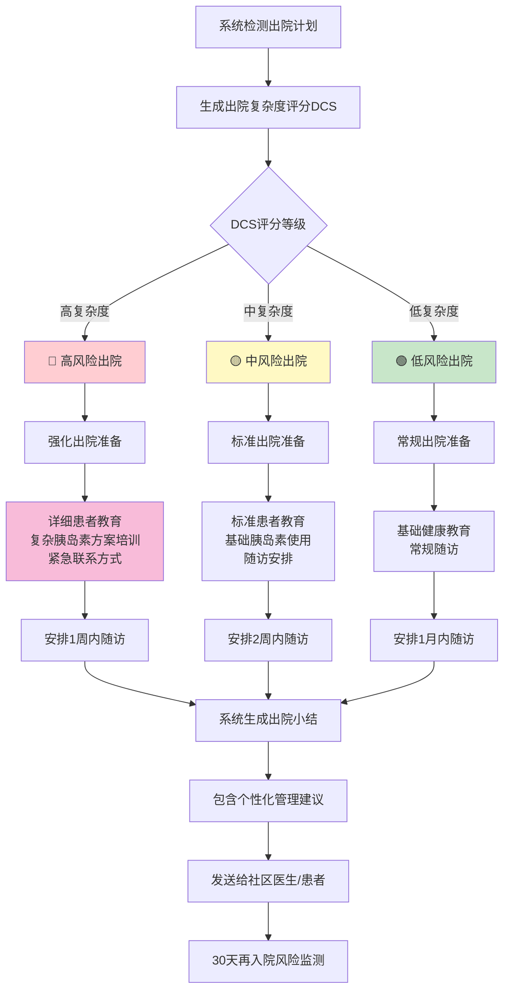
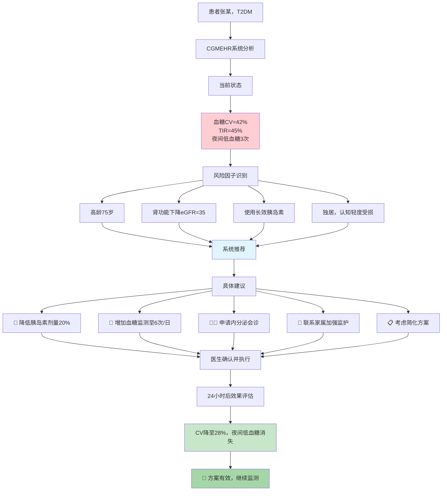

# CGMEHR系统临床应用流程图

## 临床工作流程总览

## 医护人员工作界面流程

## 紧急情况处理流程

## 查房工作流程整合

## 多学科协作流程

## 出院准备流程

## 临床决策支持示例

## 使用说明

### 临床应用要点：

1. **实时监控**：系统24小时持续评估，及时发现风险变化
2. **分级管理**：按风险等级优化医护资源分配
3. **智能提醒**：关键事件自动推送相关人员
4. **协作支持**：多学科会诊建议和协调
5. **质量保证**：CGM数据质量实时监控
6. **连续性管理**：从入院到出院的全程管理

### 展示建议：
- **医护培训**：重点使用"医护人员工作界面流程"
- **紧急预案**：重点使用"紧急情况处理流程"  
- **管理层汇报**：使用"临床工作流程总览"
- **多学科会议**：使用"多学科协作流程"

您可以选择其中最符合您展示需求的流程图进行重点介绍。