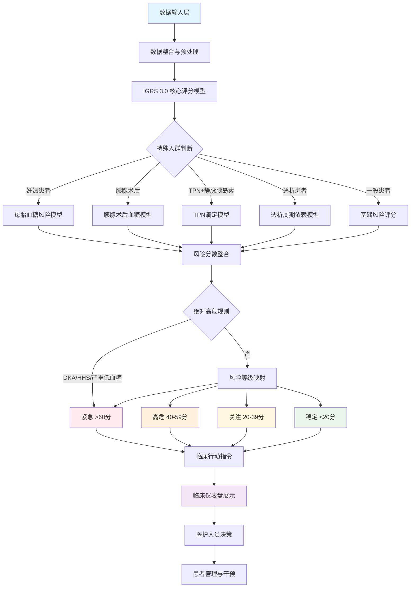
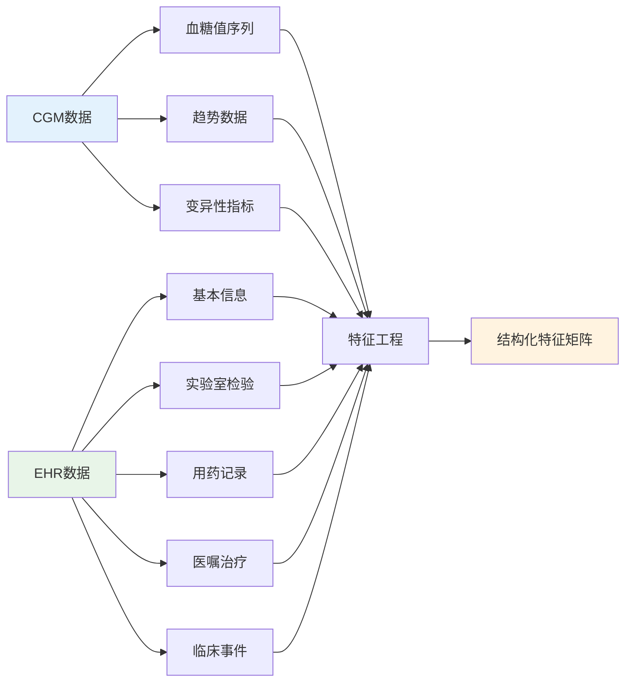
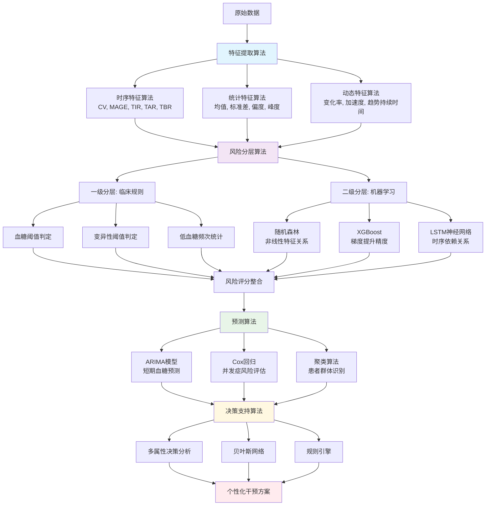
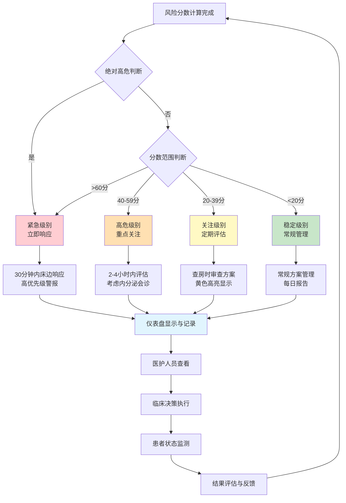
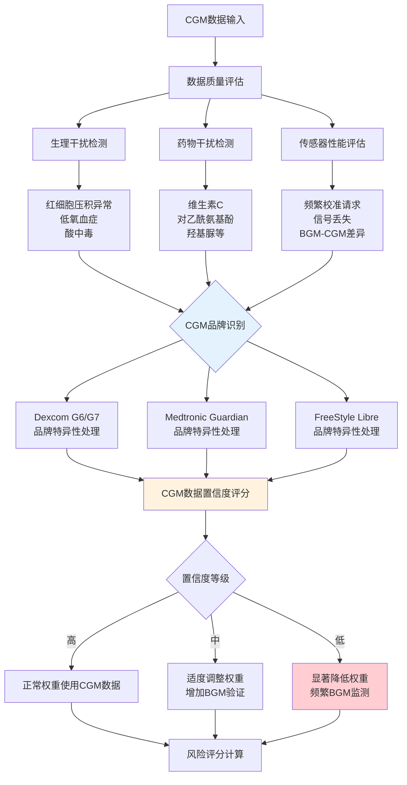

# CGMEHR系统流程图

## 整体系统架构流程图

## 数据输入详细流程

## 精确分层算法框架

## 风险等级与行动指令流程

## 数据质量与CGM性能监控

## 使用说明

### 生成图片方法：
1. 将上述Mermaid代码复制到 [Mermaid Live Editor](https://mermaid.live/)
2. 在线生成PNG或SVG格式图片
3. 或使用支持Mermaid的工具如Typora、VS Code等

### 展示建议：
1. **整体架构流程图** - 用于系统总体介绍
2. **精确分层算法框架** - 用于技术细节展示
3. **风险等级与行动指令流程** - 用于临床应用说明
4. **数据质量监控流程** - 用于质量保证说明

每个流程图都可以单独使用，也可以组合展示，根据受众需求选择合适的详细程度。