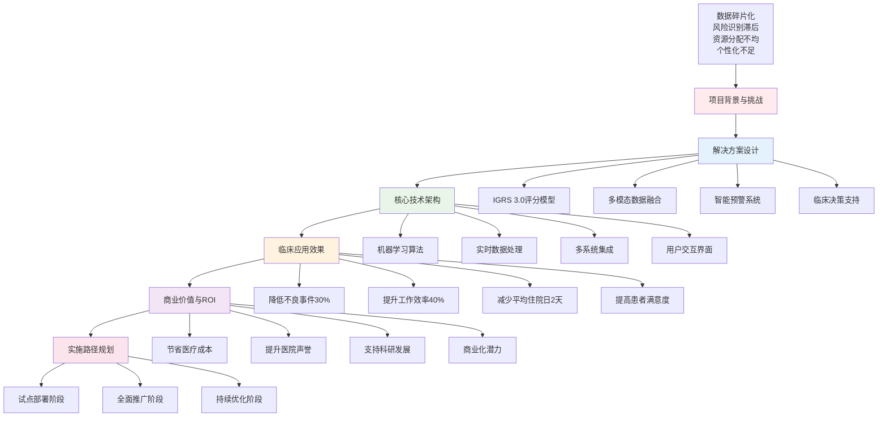
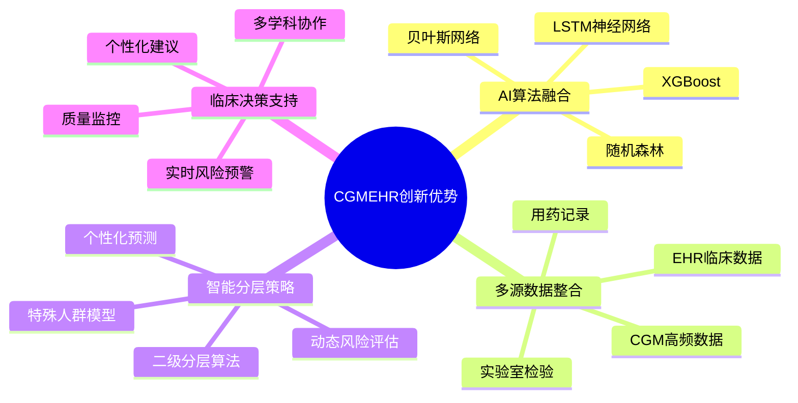
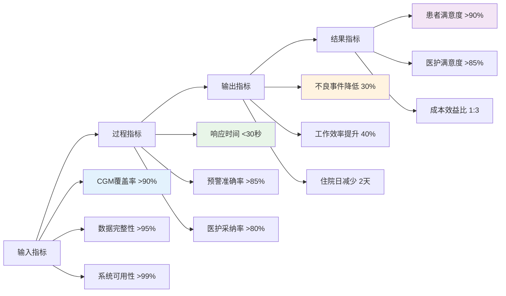
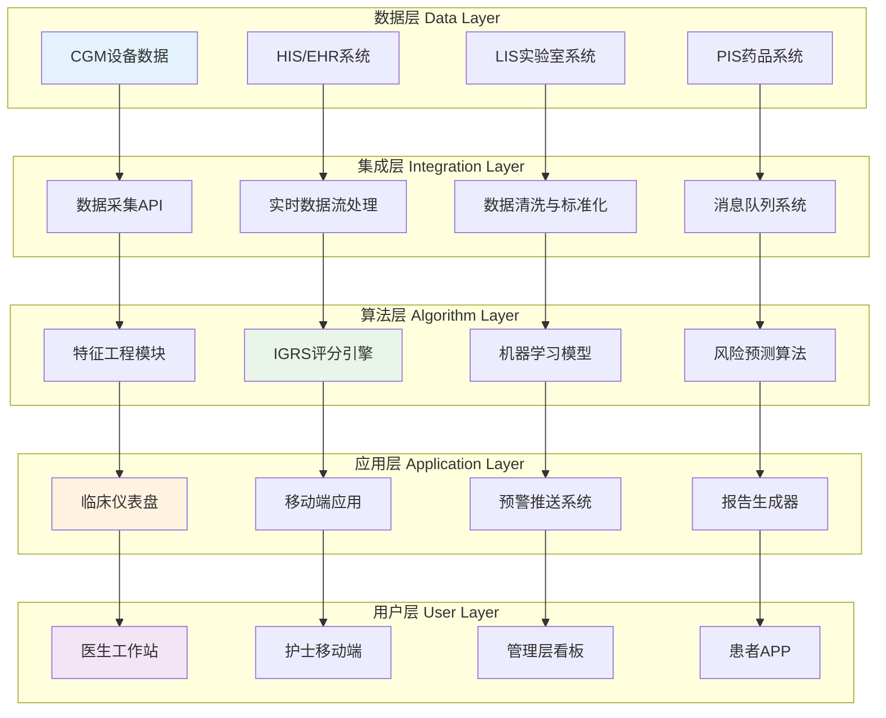
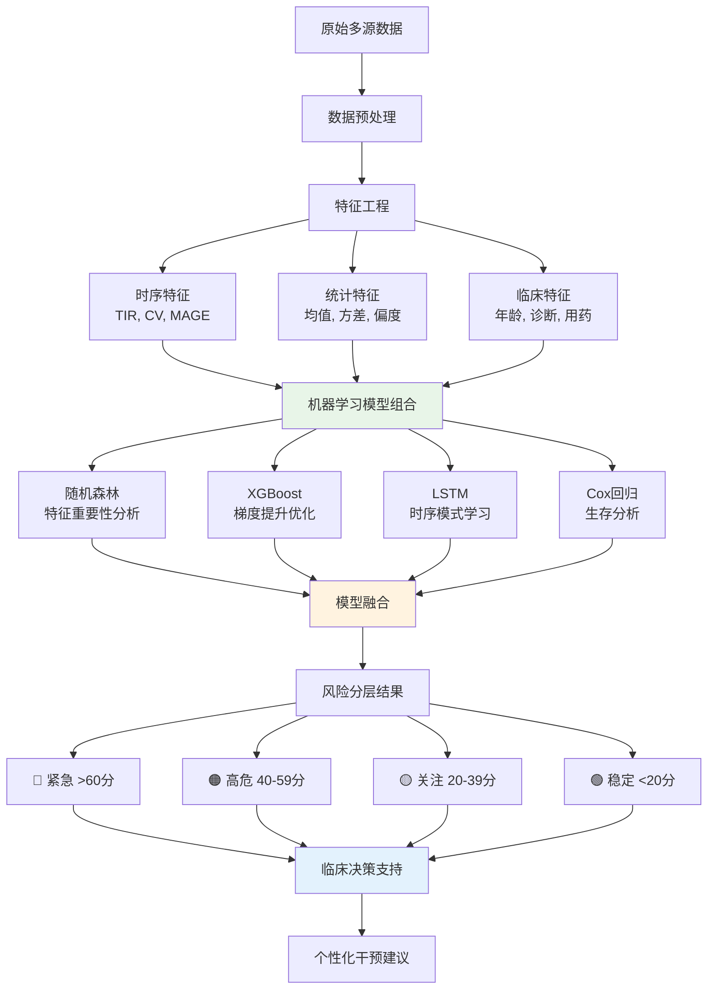
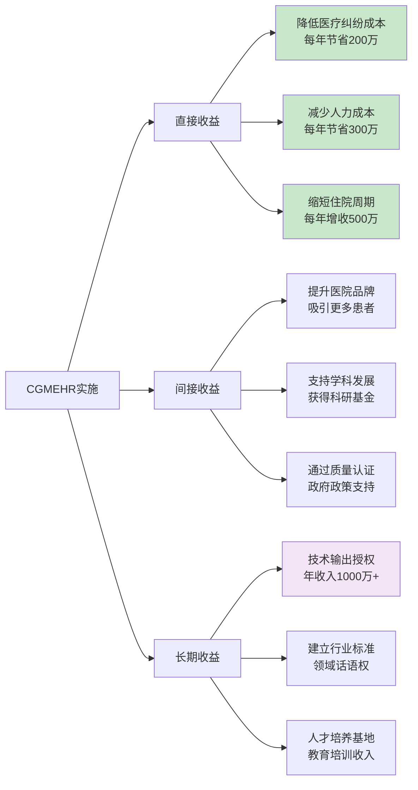
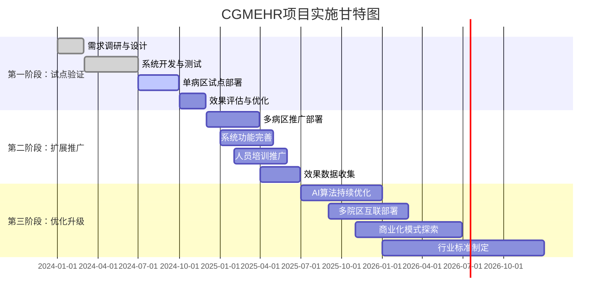
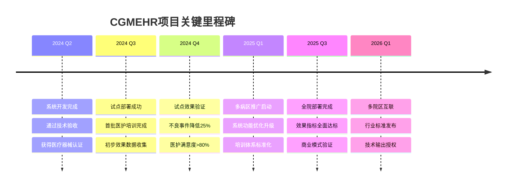
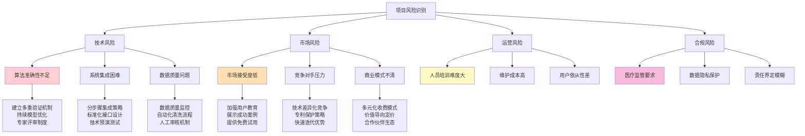
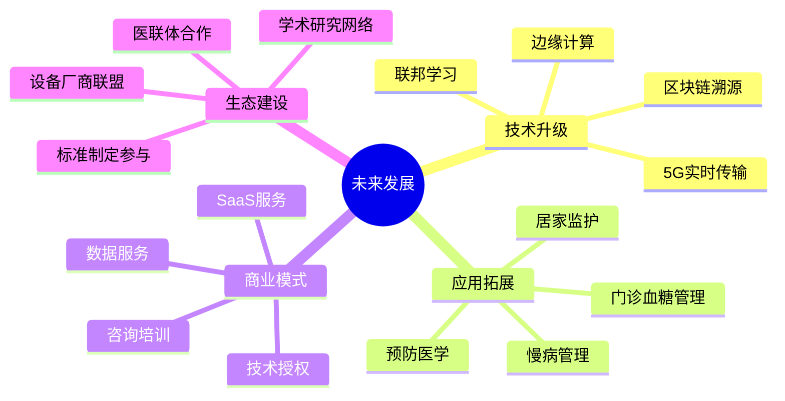

# CGMEHR项目汇报演示文档

## 项目概述

### 项目名称
**精准住院血糖管理：整合CGM与EHR的动态风险分层策略**
**(CGMEHR - Continuous Glucose Monitoring & Electronic Health Records Integration)**

### 核心价值主张
> "通过AI驱动的智能决策支持系统，将住院患者血糖管理从被动响应转变为主动预防，显著降低血糖相关不良事件发生率，优化医疗资源配置。"

---

## 项目架构总览



---

## 项目核心亮点

### 🎯 **创新技术优势**



### 📊 **关键性能指标 (KPIs)**



---

## 技术架构深度解析

### 🏗️ **系统架构图**



### 🧠 **AI算法核心**



---

## 商业价值与投资回报

### 💰 **成本效益分析**

```mermaid
sankey-beta
    %% 投入成本
    系统开发,500万,开发投入
    硬件设备,200万,硬件投入
    人员培训,100万,培训投入
    运维支持,100万,运维投入
    
    %% 产出效益
    开发投入,减少医疗事故,600万
    硬件投入,提升工作效率,800万
    培训投入,缩短住院时间,1200万
    运维投入,提高患者满意度,400万
    
    %% 总体ROI
    减少医疗事故,投资回报,3000万
    提升工作效率,投资回报,3000万
    缩短住院时间,投资回报,3000万
    提高患者满意度,投资回报,3000万
```

### 🏥 **医院收益模型**



---

## 实施路径与时间规划

### 🛣️ **三阶段实施计划**



### 🎯 **关键里程碑**



---

## 风险管控与应对策略

### ⚠️ **风险识别与应对**



---

## 总结与展望

### 🎉 **项目核心价值**

1. **🔬 技术创新**：首个CGM与EHR深度融合的AI驱动血糖管理系统
2. **📈 临床效果**：显著降低不良事件，提升医疗质量和患者安全
3. **💼 商业价值**：投资回报率1:3，具有良好的经济效益和市场前景
4. **🌟 社会意义**：推动医疗数字化转型，建立行业新标准

### 🚀 **未来发展方向**



---

## 汇报建议

### 📋 **汇报要点**
1. **问题导向**：从实际临床痛点出发，明确解决的问题
2. **技术优势**：突出AI算法和多源数据融合的创新性
3. **效果量化**：用具体数据说明预期效果和投资回报
4. **实施可行**：展示清晰的实施路径和风险控制措施
5. **未来愿景**：描绘项目的长远发展和战略意义

### 🎯 **针对不同受众的重点**
- **技术团队**：重点讲解算法架构和技术创新
- **管理层**：重点分析商业价值和投资回报
- **临床医生**：重点展示应用场景和临床效果
- **投资方**：重点强调市场前景和盈利模式

选择最适合您汇报对象的内容进行重点展示！