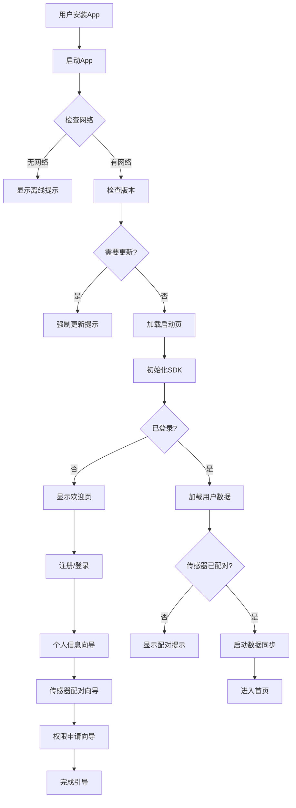
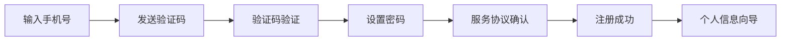
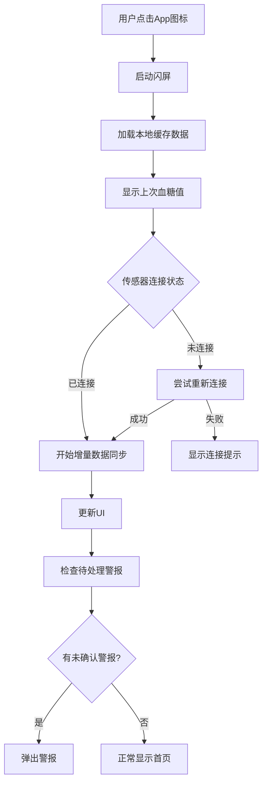
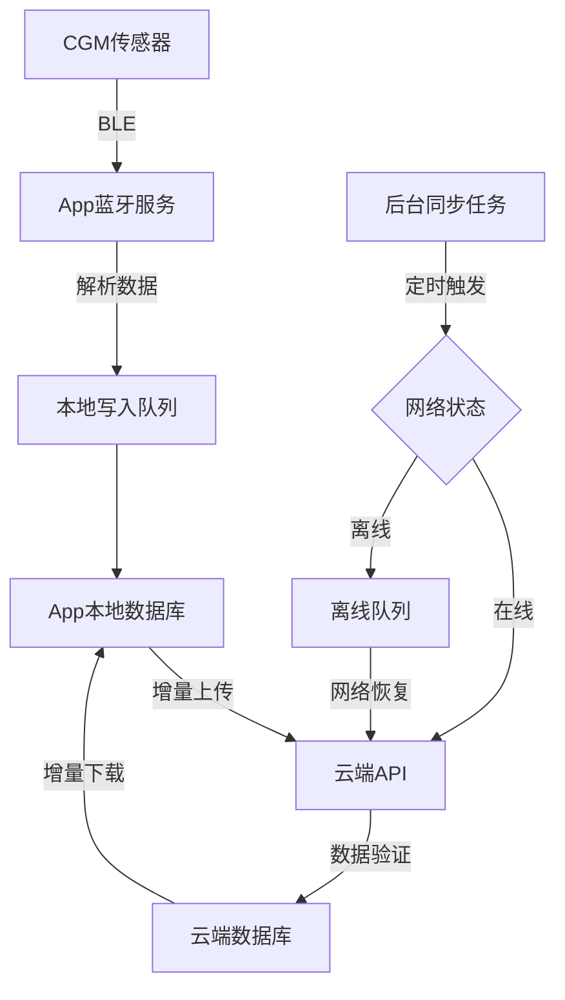

# 患者端CGM App 详细设计规范
## Patient CGM App - Detailed Design Specification

**文档编号**: DDS-Patient-App-001
**版本**: v1.0
**日期**: 2025-10-10
**作者**: [填写]

---

## 目录

1. [应用启动流程](#1-应用启动流程)
2. [核心功能详细设计](#2-核心功能详细设计)
3. [数据同步策略](#3-数据同步策略)
4. [警报系统深度设计](#4-警报系统深度设计)
5. [异常处理与容错](#5-异常处理与容错)
6. [性能优化](#6-性能优化)
7. [技术架构详细设计](#7-技术架构详细设计)

---

## 1. 应用启动流程

### 1.1 冷启动流程(首次安装)



**详细步骤说明**:

#### Step 1: 版本检查
```javascript
// 版本检查逻辑
async function checkAppVersion() {
  try {
    const response = await fetch('https://api.yourapp.com/version/check', {
      method: 'GET',
      headers: {
        'X-App-Version': DeviceInfo.getVersion(),
        'X-Platform': Platform.OS,
      }
    });

    const { latestVersion, forceUpdate, updateUrl } = await response.json();
    const currentVersion = DeviceInfo.getVersion();

    if (forceUpdate && compareVersions(currentVersion, latestVersion) < 0) {
      // 强制更新
      showForceUpdateDialog({
        currentVersion,
        latestVersion,
        updateUrl,
      });
      return false; // 阻止继续
    }

    return true; // 可以继续
  } catch (error) {
    // 版本检查失败,仍允许继续(容错)
    console.error('Version check failed:', error);
    return true;
  }
}
```

#### Step 2: 欢迎页(仅首次)
```jsx
// 欢迎页组件
<WelcomeScreen>
  <Swiper>
    <Slide1>
      <Image src="welcome-1.png" />
      <Title>实时监测您的血糖</Title>
      <Description>24小时连续监测,再也不用频繁扎手指</Description>
    </Slide1>

    <Slide2>
      <Image src="welcome-2.png" />
      <Title>及时警报,守护健康</Title>
      <Description>低血糖高血糖及时提醒,避免危险</Description>
    </Slide2>

    <Slide3>
      <Image src="welcome-3.png" />
      <Title>与医生协同管理</Title>
      <Description>数据实时分享,医生远程指导</Description>
    </Slide3>

    <Slide4>
      <Button>开始使用</Button>
      <Link>已有账户?登录</Link>
    </Slide4>
  </Swiper>
</WelcomeScreen>
```

#### Step 3: 注册流程


**表单验证规则**:
```javascript
const registrationValidation = {
  phoneNumber: {
    pattern: /^1[3-9]\d{9}$/,
    message: '请输入有效的手机号',
  },
  verificationCode: {
    length: 6,
    pattern: /^\d{6}$/,
    message: '请输入6位数字验证码',
    expiry: 300, // 5分钟过期
  },
  password: {
    minLength: 8,
    pattern: /^(?=.*[a-z])(?=.*[A-Z])(?=.*\d).{8,}$/,
    message: '密码至少8位,包含大小写字母和数字',
  },
};

// 密码强度检测
function checkPasswordStrength(password) {
  let strength = 0;
  if (password.length >= 8) strength++;
  if (/[a-z]/.test(password)) strength++;
  if (/[A-Z]/.test(password)) strength++;
  if (/\d/.test(password)) strength++;
  if (/[^a-zA-Z\d]/.test(password)) strength++; // 特殊字符

  return {
    score: strength,
    level: strength < 3 ? 'weak' : strength < 4 ? 'medium' : 'strong',
    color: strength < 3 ? '#FF3B30' : strength < 4 ? '#FFCC00' : '#34C759',
  };
}
```

#### Step 4: 个人信息向导
```jsx
<OnboardingWizard>
  {/* Step 1: 基本信息 */}
  <Step1 title="告诉我们一些基本信息">
    <FormField>
      <Label>您的姓名</Label>
      <Input placeholder="请输入真实姓名" required />
    </FormField>

    <FormField>
      <Label>性别</Label>
      <RadioGroup>
        <Radio value="male">男</Radio>
        <Radio value="female">女</Radio>
      </RadioGroup>
    </FormField>

    <FormField>
      <Label>出生日期</Label>
      <DatePicker maxDate={today} />
    </FormField>

    <FormField>
      <Label>身高 (cm)</Label>
      <NumericInput min={100} max={250} step={1} />
    </FormField>

    <FormField>
      <Label>体重 (kg)</Label>
      <NumericInput min={30} max={200} step={0.1} />
    </FormField>

    <Calculated>
      BMI: {calculateBMI(height, weight)}
      ({getBMICategory(bmi)})
    </Calculated>

    <Button>下一步</Button>
  </Step1>

  {/* Step 2: 糖尿病信息 */}
  <Step2 title="您的糖尿病情况">
    <FormField>
      <Label>糖尿病类型</Label>
      <Select required>
        <Option value="type1">1型糖尿病</Option>
        <Option value="type2">2型糖尿病</Option>
        <Option value="gestational">妊娠期糖尿病</Option>
        <Option value="other">其他类型</Option>
      </Select>
    </FormField>

    <FormField>
      <Label>确诊时间</Label>
      <DatePicker maxDate={today} />
    </FormField>

    <FormField>
      <Label>最近一次HbA1c (%)</Label>
      <NumericInput min={4} max={15} step={0.1} />
      <HelperText>不确定可以跳过,之后可补充</HelperText>
    </FormField>

    <FormField>
      <Label>当前治疗方案</Label>
      <CheckboxGroup>
        <Checkbox value="insulin_long">长效胰岛素</Checkbox>
        <Checkbox value="insulin_rapid">速效胰岛素</Checkbox>
        <Checkbox value="oral_medication">口服降糖药</Checkbox>
        <Checkbox value="diet_only">仅饮食控制</Checkbox>
      </CheckboxGroup>
    </FormField>

    <Button>下一步</Button>
  </Step2>

  {/* Step 3: 血糖目标设置 */}
  <Step3 title="设置您的血糖目标">
    <InfoBox>
      我们根据您的情况推荐了以下目标,您可以随时调整
    </InfoBox>

    <FormField>
      <Label>空腹血糖目标范围 (mg/dL)</Label>
      <RangeSlider
        min={60}
        max={150}
        defaultValue={[80, 130]}
        marks={{60: '60', 80: '80', 100: '100', 130: '130', 150: '150'}}
      />
      <CurrentValue>80 - 130 mg/dL</CurrentValue>
    </FormField>

    <FormField>
      <Label>餐后2小时目标 (mg/dL)</Label>
      <Slider
        min={100}
        max={250}
        defaultValue={180}
      />
      <CurrentValue>< 180 mg/dL</CurrentValue>
    </FormField>

    <FormField>
      <Label>HbA1c目标 (%)</Label>
      <Slider
        min={5}
        max={9}
        step={0.1}
        defaultValue={7.0}
      />
      <CurrentValue>< 7.0%</CurrentValue>
    </FormField>

    <RecommendationBox>
      💡 根据ADA指南,大多数成年糖尿病患者的目标为:
      - 空腹血糖: 80-130 mg/dL
      - 餐后2小时: <180 mg/dL
      - HbA1c: <7%

      请咨询您的医生确认适合您的目标
    </RecommendationBox>

    <Button>下一步</Button>
  </Step3>
</OnboardingWizard>
```

#### Step 5: 传感器配对向导
```jsx
<SensorPairingWizard>
  {/* Step 1: 准备 */}
  <Step1>
    <Title>准备配对您的CGM传感器</Title>
    <CheckList>
      <CheckItem checked>✓ 确保传感器已正确佩戴</CheckItem>
      <CheckItem checked>✓ 确保手机蓝牙已开启</CheckItem>
      <CheckItem>☐ 准备好传感器包装上的序列号</CheckItem>
    </CheckList>

    <Image src="sensor-location.png" />
    <Caption>传感器通常佩戴在上臂外侧</Caption>

    <Button>开始配对</Button>
  </Step1>

  {/* Step 2: 扫描或输入序列号 */}
  <Step2>
    <Title>扫描传感器序列号</Title>

    <CameraView>
      <BarcodeScanner
        onScan={handleScan}
        targetFormats={['CODE128', 'EAN13']}
      />
      <Overlay>
        <ScanFrame />
        <Instruction>将相机对准条形码</Instruction>
      </Overlay>
    </CameraView>

    <Divider>或</Divider>

    <ManualInput>
      <Input
        placeholder="手动输入序列号"
        maxLength={16}
        autoCapitalize="characters"
      />
      <HelperText>
        序列号位于传感器包装盒上,通常为16位字母数字组合
      </HelperText>
    </ManualInput>

    <Button onPress={handleVerifySerialNumber}>
      验证序列号
    </Button>
  </Step2>

  {/* Step 3: 蓝牙搜索与连接 */}
  <Step3>
    <Title>正在连接传感器...</Title>

    <AnimatedIcon type="bluetooth-searching" />

    <StatusText>正在搜索附近的传感器</StatusText>

    <ProgressSteps>
      <ProgressStep status="completed">
        ✓ 序列号验证成功
      </ProgressStep>
      <ProgressStep status="in-progress">
        ⟳ 搜索蓝牙设备...
      </ProgressStep>
      <ProgressStep status="pending">
        ○ 建立连接
      </ProgressStep>
      <ProgressStep status="pending">
        ○ 激活传感器
      </ProgressStep>
    </ProgressSteps>

    <TroubleshootingLink>
      连接有问题?查看故障排除指南
    </TroubleshootingLink>
  </Step3>

  {/* Step 4: 激活与预热 */}
  <Step4>
    <Title>传感器激活成功!</Title>

    <SuccessIcon />

    <InfoBox type="warning">
      <Icon>⏱️</Icon>
      <Text>
        传感器正在预热,预计需要2小时

        在此期间:
        • 传感器正在校准
        • 您将看不到血糖读数
        • 请勿摘除传感器

        我们会在预热完成时通知您
      </Text>
    </InfoBox>

    <CountdownTimer endTime={activationTime + 2 * 3600} />

    <Button>完成</Button>
  </Step4>
</SensorPairingWizard>
```

**蓝牙配对技术实现**:
```javascript
// 使用react-native-ble-plx
import { BleManager } from 'react-native-ble-plx';

class SensorPairingService {
  constructor() {
    this.bleManager = new BleManager();
    this.sensorDevice = null;
  }

  // 搜索传感器
  async searchForSensor(serialNumber, timeout = 30000) {
    return new Promise((resolve, reject) => {
      const timeoutId = setTimeout(() => {
        this.bleManager.stopDeviceScan();
        reject(new Error('传感器搜索超时,请确保传感器在附近'));
      }, timeout);

      this.bleManager.startDeviceScan(
        [SENSOR_SERVICE_UUID], // CGM传感器的Service UUID
        { allowDuplicates: false },
        (error, device) => {
          if (error) {
            clearTimeout(timeoutId);
            this.bleManager.stopDeviceScan();
            reject(error);
            return;
          }

          // 验证设备名称或广播数据中的序列号
          if (this.verifySensorDevice(device, serialNumber)) {
            clearTimeout(timeoutId);
            this.bleManager.stopDeviceScan();
            this.sensorDevice = device;
            resolve(device);
          }
        }
      );
    });
  }

  // 连接传感器
  async connectToSensor(device) {
    try {
      // 连接设备
      await device.connect();

      // 发现服务和特征
      await device.discoverAllServicesAndCharacteristics();

      // 读取传感器信息
      const sensorInfo = await this.readSensorInfo(device);

      // 订阅血糖数据通知
      await this.subscribeToGlucoseUpdates(device);

      // 激活传感器
      await this.activateSensor(device);

      return {
        success: true,
        sensorInfo,
        activationTime: Date.now(),
        warmupEndTime: Date.now() + 2 * 3600 * 1000, // 2小时后
      };
    } catch (error) {
      console.error('Sensor connection failed:', error);
      throw new Error('传感器连接失败:' + error.message);
    }
  }

  // 订阅血糖数据更新
  async subscribeToGlucoseUpdates(device) {
    device.monitorCharacteristicForService(
      SENSOR_SERVICE_UUID,
      GLUCOSE_CHARACTERISTIC_UUID,
      (error, characteristic) => {
        if (error) {
          console.error('Glucose monitoring error:', error);
          return;
        }

        // 解析血糖数据
        const glucoseData = this.parseGlucoseData(characteristic.value);

        // 发送到Redux store
        store.dispatch(updateGlucoseReading(glucoseData));

        // 检查警报
        this.checkAlerts(glucoseData);
      }
    );
  }

  // 解析血糖数据(从Base64)
  parseGlucoseData(base64Value) {
    const buffer = Buffer.from(base64Value, 'base64');

    // 假设数据格式:
    // Byte 0-1: 血糖值(mg/dL, little-endian uint16)
    // Byte 2: 趋势(0-4对应↓↘→↗↑)
    // Byte 3-6: 时间戳(Unix timestamp)

    const glucoseValue = buffer.readUInt16LE(0);
    const trendCode = buffer.readUInt8(2);
    const timestamp = buffer.readUInt32LE(3);

    const trendArrows = ['↓', '↘', '→', '↗', '↑'];

    return {
      value: glucoseValue,
      trend: trendArrows[trendCode] || '→',
      timestamp: timestamp * 1000, // 转为毫秒
      unit: 'mg/dL',
    };
  }
}
```

#### Step 6: 权限申请
```jsx
<PermissionsWizard>
  <Step title="需要您的授权">
    <PermissionCard>
      <Icon>🔔</Icon>
      <Title>通知权限</Title>
      <Description>
        用于发送血糖警报,确保您及时了解血糖变化
      </Description>
      <Status>{notificationStatus}</Status>
      <Button onPress={requestNotificationPermission}>
        授予权限
      </Button>
    </PermissionCard>

    <PermissionCard>
      <Icon>📱</Icon>
      <Title>始终允许运行</Title>
      <Description>
        允许应用在后台运行,持续监测血糖并发送警报
      </Description>
      <Status>{backgroundStatus}</Status>
      <Button onPress={requestBackgroundPermission}>
        授予权限
      </Button>
    </PermissionCard>

    <PermissionCard optional>
      <Icon>📍</Icon>
      <Title>位置权限(可选)</Title>
      <Description>
        用于在报告中记录活动地点,帮助分析血糖模式
      </Description>
      <Status>{locationStatus}</Status>
      <Button onPress={requestLocationPermission}>
        授予权限
      </Button>
      <SkipButton>跳过</SkipButton>
    </PermissionCard>

    <PermissionCard optional>
      <Icon>💪</Icon>
      <Title>健康数据(可选)</Title>
      <Description>
        同步Apple Health/Google Fit的运动数据
      </Description>
      <Status>{healthStatus}</Status>
      <Button onPress={requestHealthPermission}>
        授予权限
      </Button>
      <SkipButton>跳过</SkipButton>
    </PermissionCard>

    <Button primary>完成设置</Button>
  </Step>
</PermissionsWizard>
```

**权限请求时机策略**:
```javascript
const permissionStrategy = {
  // 必需权限:在onboarding时请求
  required: ['notifications', 'bluetooth'],

  // 可选权限:在首次使用相关功能时请求(JIT - Just In Time)
  optional: {
    location: {
      trigger: 'first_activity_log',
      message: '记录活动地点可以帮助分析血糖模式',
    },
    health: {
      trigger: 'first_exercise_log',
      message: '同步运动数据,自动记录运动对血糖的影响',
    },
    camera: {
      trigger: 'first_meal_photo',
      message: '拍照记录餐食',
    },
  },
};
```

---

### 1.2 热启动流程(日常使用)



**性能优化**:
```javascript
// 使用React Native的InteractionManager优化启动
import { InteractionManager } from 'react-native';

function App() {
  const [isReady, setIsReady] = useState(false);

  useEffect(() => {
    // 第一阶段:快速渲染(显示缓存数据)
    const cachedData = loadCachedGlucoseData();
    setCachedGlucose(cachedData);

    // 第二阶段:在交互完成后执行耗时任务
    InteractionManager.runAfterInteractions(() => {
      // 同步数据
      syncDataFromServer();

      // 重新连接传感器
      reconnectSensor();

      // 加载其他资源
      preloadResources();

      setIsReady(true);
    });
  }, []);

  if (!isReady) {
    return <SplashScreen glucoseValue={cachedGlucose} />;
  }

  return <MainApp />;
}

// 启动时间目标
const performanceTargets = {
  splashScreen: 300,  // 300ms内显示闪屏
  cachedData: 500,    // 500ms内显示缓存数据
  interactive: 1000,  // 1s内可交互
  fullLoad: 2000,     // 2s内完全加载
};
```

---

## 2. 核心功能详细设计

### 2.1 首页仪表盘 - 详细交互

#### 2.1.1 血糖值显示的状态机

```javascript
// 血糖显示状态
const GlucoseDisplayStates = {
  NORMAL: 'normal',           // 正常显示
  LOADING: 'loading',         // 加载中
  STALE: 'stale',            // 数据过期(>15分钟)
  ERROR: 'error',            // 数据错误
  SENSOR_WARMUP: 'warmup',   // 传感器预热中
  SENSOR_EXPIRED: 'expired', // 传感器过期
  NO_DATA: 'no_data',        // 无数据
};

function GlucoseDisplay({ glucose, lastUpdate, sensorStatus }) {
  const [displayState, setDisplayState] = useState(GlucoseDisplayStates.LOADING);

  // 状态判断逻辑
  useEffect(() => {
    if (sensorStatus === 'warmup') {
      setDisplayState(GlucoseDisplayStates.SENSOR_WARMUP);
    } else if (sensorStatus === 'expired') {
      setDisplayState(GlucoseDisplayStates.SENSOR_EXPIRED);
    } else if (!glucose) {
      setDisplayState(GlucoseDisplayStates.NO_DATA);
    } else if (Date.now() - lastUpdate > 15 * 60 * 1000) {
      setDisplayState(GlucoseDisplayStates.STALE);
    } else if (glucose < 20 || glucose > 600) {
      setDisplayState(GlucoseDisplayStates.ERROR);
    } else {
      setDisplayState(GlucoseDisplayStates.NORMAL);
    }
  }, [glucose, lastUpdate, sensorStatus]);

  // 根据状态渲染
  switch (displayState) {
    case GlucoseDisplayStates.NORMAL:
      return (
        <GlucoseCard>
          <GlucoseValue color={getGlucoseColor(glucose)}>
            {glucose}
          </GlucoseValue>
          <Unit>mg/dL</Unit>
          <TrendArrow>{trend}</TrendArrow>
          <LastUpdate>更新于 {formatLastUpdate(lastUpdate)}</LastUpdate>
        </GlucoseCard>
      );

    case GlucoseDisplayStates.SENSOR_WARMUP:
      return (
        <GlucoseCard type="info">
          <Icon>⏱️</Icon>
          <Message>传感器预热中</Message>
          <CountdownTimer endTime={warmupEndTime} />
          <Hint>预热完成后将开始显示血糖数据</Hint>
        </GlucoseCard>
      );

    case GlucoseDisplayStates.STALE:
      return (
        <GlucoseCard type="warning">
          <GlucoseValue color="#999">{glucose}</GlucoseValue>
          <Unit>mg/dL</Unit>
          <WarningBadge>
            数据可能过期 ({formatLastUpdate(lastUpdate)})
          </WarningBadge>
          <RefreshButton onPress={handleManualRefresh}>
            手动刷新
          </RefreshButton>
        </GlucoseCard>
      );

    case GlucoseDisplayStates.SENSOR_EXPIRED:
      return (
        <GlucoseCard type="error">
          <Icon>⚠️</Icon>
          <Message>传感器已到期</Message>
          <Description>
            您的传感器已佩戴{sensorDays}天,已达到使用寿命
          </Description>
          <Button onPress={() => navigate('SensorReplacement')}>
            更换传感器
          </Button>
        </GlucoseCard>
      );

    case GlucoseDisplayStates.NO_DATA:
      return (
        <GlucoseCard type="empty">
          <Icon>📊</Icon>
          <Message>暂无血糖数据</Message>
          <Description>
            请确保传感器已正确佩戴并完成激活
          </Description>
          <TroubleshootingSteps>
            <Step>1. 检查传感器连接状态</Step>
            <Step>2. 确认传感器未过期</Step>
            <Step>3. 尝试重新配对传感器</Step>
          </TroubleshootingSteps>
          <Button onPress={() => navigate('SensorSettings')}>
            传感器设置
          </Button>
        </GlucoseCard>
      );

    default:
      return <LoadingSpinner />;
  }
}

// 格式化最后更新时间
function formatLastUpdate(timestamp) {
  const now = Date.now();
  const diff = now - timestamp;
  const minutes = Math.floor(diff / 60000);

  if (minutes < 1) return '刚刚';
  if (minutes < 60) return `${minutes}分钟前`;

  const hours = Math.floor(minutes / 60);
  if (hours < 24) return `${hours}小时前`;

  return format(timestamp, 'MM-dd HH:mm');
}
```

#### 2.1.2 血糖曲线图 - 交互细节

```jsx
<GlucoseChart>
  {/* 图表头部 */}
  <ChartHeader>
    <TimeRangeSelector>
      {['3h', '6h', '12h', '24h'].map(range => (
        <RangeButton
          key={range}
          active={selectedRange === range}
          onPress={() => setSelectedRange(range)}
        >
          {range}
        </RangeButton>
      ))}
    </TimeRangeSelector>

    <Actions>
      <IconButton onPress={handleZoomIn}>🔍+</IconButton>
      <IconButton onPress={handleZoomOut}>🔍-</IconButton>
      <IconButton onPress={handleShare}>↗️</IconButton>
    </Actions>
  </ChartHeader>

  {/* 图表主体 */}
  <VictoryChart
    height={250}
    padding={{ left: 50, right: 20, top: 20, bottom: 40 }}
    domain={{ y: [40, 300] }}
    domainPadding={{ x: 10 }}
  >
    {/* 目标范围阴影 */}
    <VictoryArea
      data={[
        { x: startTime, y0: targetLow, y: targetHigh },
        { x: endTime, y0: targetLow, y: targetHigh },
      ]}
      style={{
        data: {
          fill: '#34C759',
          opacity: 0.1,
          stroke: '#34C759',
          strokeWidth: 1,
          strokeDasharray: '5,5',
        },
      }}
    />

    {/* 血糖曲线 */}
    <VictoryLine
      data={glucoseData}
      x="timestamp"
      y="value"
      interpolation="monotoneX"
      style={{
        data: {
          stroke: '#2E86DE',
          strokeWidth: 2,
        },
      }}
    />

    {/* 数据点 */}
    <VictoryScatter
      data={glucoseData}
      x="timestamp"
      y="value"
      size={({ datum }) => datum.isMarked ? 6 : 3}
      style={{
        data: {
          fill: ({ datum }) => getGlucoseColor(datum.value),
        },
      }}
      events={[{
        target: "data",
        eventHandlers: {
          onPress: () => ({
            target: "data",
            mutation: (props) => {
              handleDataPointPress(props.datum);
              return null;
            }
          })
        }
      }]}
    />

    {/* 事件标记(餐食/运动/用药) */}
    {events.map((event, index) => (
      <VictoryScatter
        key={index}
        data={[{ x: event.timestamp, y: event.glucoseValue || 50 }]}
        symbol={getEventSymbol(event.type)}
        size={8}
        style={{
          data: { fill: getEventColor(event.type) },
        }}
        events={[{
          target: "data",
          eventHandlers: {
            onPress: () => ({
              target: "data",
              mutation: () => {
                showEventDetails(event);
                return null;
              }
            })
          }
        }]}
      />
    ))}

    {/* X轴 */}
    <VictoryAxis
      tickFormat={(t) => format(t, 'HH:mm')}
      tickCount={6}
      style={{
        axis: { stroke: '#E0E0E0' },
        tickLabels: { fontSize: 12, fill: '#999' },
      }}
    />

    {/* Y轴 */}
    <VictoryAxis
      dependentAxis
      tickValues={[50, 100, 150, 200, 250, 300]}
      tickFormat={(t) => `${t}`}
      style={{
        axis: { stroke: '#E0E0E0' },
        tickLabels: { fontSize: 12, fill: '#999' },
        grid: { stroke: '#F0F0F0', strokeDasharray: '3,3' },
      }}
    />

    {/* 当前血糖指示线 */}
    <VictoryLine
      data={[
        { x: startTime, y: currentGlucose },
        { x: endTime, y: currentGlucose },
      ]}
      style={{
        data: {
          stroke: getGlucoseColor(currentGlucose),
          strokeWidth: 1,
          strokeDasharray: '5,5',
        },
      }}
    />
  </VictoryChart>

  {/* 图例 */}
  <ChartLegend>
    <LegendItem>
      <ColorBox color="#34C759" />
      <Label>目标范围 ({targetLow}-{targetHigh} mg/dL)</Label>
    </LegendItem>
    <LegendItem>
      <Icon>🍽️</Icon>
      <Label>餐食</Label>
    </LegendItem>
    <LegendItem>
      <Icon>💊</Icon>
      <Label>用药</Label>
    </LegendItem>
    <LegendItem>
      <Icon>🏃</Icon>
      <Label>运动</Label>
    </LegendItem>
  </ChartLegend>
</GlucoseChart>

{/* 数据点详情弹窗 */}
<DataPointModal visible={modalVisible} onClose={() => setModalVisible(false)}>
  <ModalHeader>
    <Time>{format(selectedPoint.timestamp, 'HH:mm')}</Time>
    <Date>{format(selectedPoint.timestamp, 'yyyy-MM-dd')}</Date>
  </ModalHeader>

  <GlucoseValue color={getGlucoseColor(selectedPoint.value)}>
    {selectedPoint.value} mg/dL {selectedPoint.trend}
  </GlucoseValue>

  <Section>
    <SectionTitle>关联事件</SectionTitle>
    {selectedPoint.relatedEvents.length > 0 ? (
      selectedPoint.relatedEvents.map(event => (
        <EventItem key={event.id}>
          <EventIcon>{getEventIcon(event.type)}</EventIcon>
          <EventDetails>
            <EventTitle>{event.title}</EventTitle>
            <EventTime>{formatRelativeTime(event.timestamp)}</EventTime>
          </EventDetails>
        </EventItem>
      ))
    ) : (
      <EmptyState>此时段无记录事件</EmptyState>
    )}
  </Section>

  <Actions>
    <Button variant="outline" onPress={handleAddNote}>
      添加备注
    </Button>
    <Button onPress={() => navigateToDetail(selectedPoint)}>
      查看详情
    </Button>
  </Actions>
</DataPointModal>
```

**图表性能优化**:
```javascript
// 数据抽稀 - 大数据量时降低渲染点数
function downsampleData(data, maxPoints = 288) {
  if (data.length <= maxPoints) return data;

  const bucketSize = Math.ceil(data.length / maxPoints);
  const downsampled = [];

  for (let i = 0; i < data.length; i += bucketSize) {
    const bucket = data.slice(i, i + bucketSize);
    // 使用LTTB算法(Largest-Triangle-Three-Buckets)保留重要点
    const point = selectRepresentativePoint(bucket);
    downsampled.push(point);
  }

  return downsampled;
}

// 虚拟化长列表
import { RecyclerListView } from 'recyclerlistview';

<RecyclerListView
  dataProvider={dataProvider}
  layoutProvider={layoutProvider}
  rowRenderer={renderGlucoseDataRow}
  canChangeSize
/>
```

---

### 2.2 警报系统 - 深度设计

#### 2.2.1 警报触发逻辑

```javascript
class AlertEngine {
  constructor() {
    this.alertQueue = [];
    this.alertHistory = [];
    this.snoozeMap = new Map(); // 暂停的警报
  }

  // 主检查函数(每次血糖更新时调用)
  checkAlerts(glucoseData) {
    const {value, trend, timestamp} = glucoseData;
    const settings = getUserAlertSettings();

    const潜在警报 = [];

    // 1. 紧急低血糖检查
    if (value < settings.criticalLowThreshold) {
      潜在警报.push({
        type: 'CRITICAL_LOW',
        priority: 1, // 最高优先级
        value,
        trend,
        timestamp,
        message: `紧急低血糖: ${value} mg/dL`,
        actions: ['处理', '通知紧急联系人'],
        canSnooze: false, // 不可暂停
        sound: 'critical_alert.mp3',
        vibration: [0, 500, 200, 500, 200, 500], // 强振动模式
      });
    }

    // 2. 低血糖检查
    else if (value < settings.lowThreshold) {
      潜在警报.push({
        type: 'LOW',
        priority: 2,
        value,
        trend,
        timestamp,
        message: `低血糖警报: ${value} mg/dL`,
        actions: ['处理', '暂停'],
        canSnooze: true,
        sound: 'low_alert.mp3',
        vibration: [0, 300, 200, 300],
      });
    }

    // 3. 即将低血糖(预测性警报)
    else if (value < settings.lowThreshold + 20 && trend === '↓') {
      const predictedValue = this.predictGlucose(glucoseData, 15); // 预测15分钟后

      if (predictedValue < settings.lowThreshold) {
        潜在警报.push({
          type: 'PREDICTED_LOW',
          priority: 3,
          value,
          predictedValue,
          trend,
          timestamp,
          message: `血糖快速下降,预计15分钟后低于${settings.lowThreshold} mg/dL`,
          actions: ['知道了', '暂停'],
          canSnooze: true,
          sound: 'warning_alert.mp3',
          vibration: [0, 200, 100, 200],
        });
      }
    }

    // 4. 高血糖检查
    if (value > settings.highThreshold) {
      const severity = value > 250 ? 'CRITICAL_HIGH' : 'HIGH';

      潜在警报.push({
        type: severity,
        priority: severity === 'CRITICAL_HIGH' ? 2 : 4,
        value,
        trend,
        timestamp,
        message: severity === 'CRITICAL_HIGH'
          ? `严重高血糖: ${value} mg/dL`
          : `高血糖警报: ${value} mg/dL`,
        actions: ['知道了', '暂停'],
        canSnooze: true,
        sound: 'high_alert.mp3',
        vibration: [0, 200, 100, 200],
      });
    }

    // 5. 快速变化警报
    const recentData = this.getRecentData(15); // 最近15分钟
    const changeRate = this.calculateChangeRate(recentData);

    if (Math.abs(changeRate) > settings.rapidChangeThreshold) {
      潜在警报.push({
        type: changeRate > 0 ? 'RAPID_RISE' : 'RAPID_FALL',
        priority: 3,
        value,
        changeRate,
        trend,
        timestamp,
        message: `血糖${changeRate > 0 ? '快速上升' : '快速下降'}: ${Math.abs(changeRate).toFixed(1)} mg/dL/min`,
        actions: ['知道了', '暂停'],
        canSnooze: true,
        sound: 'rapid_change_alert.mp3',
        vibration: [0, 200, 100, 200],
      });
    }

    // 过滤已暂停的警报
    const activeAlerts = 潜在警报.filter(alert => !this.isAlertSnoozed(alert));

    // 去重(避免重复警报)
    const uniqueAlerts = this.deduplicateAlerts(activeAlerts);

    // 触发警报
    uniqueAlerts.forEach(alert => this.triggerAlert(alert));
  }

  // 预测血糖值(简单线性预测)
  predictGlucose(currentData, minutesAhead) {
    const recentData = this.getRecentData(30); // 使用最近30分钟

    if (recentData.length < 3) return currentData.value;

    // 计算平均变化率
    const changeRate = this.calculateChangeRate(recentData);

    // 线性预测
    const predicted = currentData.value + changeRate * minutesAhead;

    // 限制在合理范围
    return Math.max(20, Math.min(600, predicted));
  }

  // 计算变化率(mg/dL per minute)
  calculateChangeRate(dataPoints) {
    if (dataPoints.length < 2) return 0;

    const first = dataPoints[0];
    const last = dataPoints[dataPoints.length - 1];

    const timeDiffMinutes = (last.timestamp - first.timestamp) / 60000;
    const valueDiff = last.value - first.value;

    return valueDiff / timeDiffMinutes;
  }

  // 去重逻辑
  deduplicateAlerts(alerts) {
    // 检查最近5分钟是否有相同类型的警报
    const recentAlerts = this.alertHistory.filter(
      a => Date.now() - a.timestamp < 5 * 60 * 1000
    );

    return alerts.filter(alert => {
      const duplicate = recentAlerts.find(
        recent => recent.type === alert.type
      );
      return !duplicate;
    });
  }

  // 检查警报是否被暂停
  isAlertSnoozed(alert) {
    const snoozeEnd = this.snoozeMap.get(alert.type);
    if (!snoozeEnd) return false;

    if (Date.now() > snoozeEnd) {
      this.snoozeMap.delete(alert.type);
      return false;
    }

    return true;
  }

  // 触发警报
  async triggerAlert(alert) {
    // 记录到历史
    this.alertHistory.push(alert);

    // 保存到数据库
    await saveAlertToDatabase(alert);

    // 发送本地通知
    await this.sendLocalNotification(alert);

    // 如果是紧急警报,显示全屏
    if (alert.priority === 1) {
      await this.showFullScreenAlert(alert);
    }

    // 触发振动
    if (alert.vibration) {
      Vibration.vibrate(alert.vibration);
    }

    // 播放声音
    if (alert.sound) {
      await this.playAlertSound(alert.sound);
    }

    // 如果设置了紧急联系人,且是紧急警报
    if (alert.type === 'CRITICAL_LOW' && settings.notifyEmergencyContacts) {
      await this.notifyEmergencyContacts(alert);
    }
  }

  // 发送本地通知
  async sendLocalNotification(alert) {
    const notificationId = await PushNotification.localNotification({
      channelId: this.getChannelId(alert.priority),
      title: alert.message,
      message: `当前血糖: ${alert.value} mg/dL ${alert.trend}`,
      playSound: true,
      soundName: alert.sound,
      importance: alert.priority === 1 ? 'max' : 'high',
      priority: alert.priority === 1 ? 'max' : 'high',
      vibrate: true,
      vibration: alert.vibration,
      ongoing: alert.priority === 1, // 紧急警报不可滑动消除
      autoCancel: alert.priority !== 1,
      userInfo: {
        alertType: alert.type,
        glucoseValue: alert.value,
        timestamp: alert.timestamp,
      },
      actions: alert.actions.map(action => ({
        id: action.toLowerCase().replace(/\s/g, '_'),
        title: action,
      })),
    });

    return notificationId;
  }

  // 显示全屏警报
  async showFullScreenAlert(alert) {
    // 使用react-native-modal或自定义全屏组件
    navigation.navigate('FullScreenAlert', {
      alert,
    });
  }

  // 通知紧急联系人
  async notifyEmergencyContacts(alert) {
    const contacts = await getEmergencyContacts();

    for (const contact of contacts) {
      // 发送SMS
      if (contact.sms) {
        await Linking.openURL(
          `sms:${contact.phone}?body=${encodeURIComponent(
            `紧急:${userName}的血糖异常低(${alert.value} mg/dL),请立即联系。`
          )}`
        );
      }

      // 如果设置了自动拨打电话
      if (contact.autoCall && alert.value < 40) {
        await Linking.openURL(`tel:${contact.phone}`);
      }
    }
  }

  // 暂停警报
  snoozeAlert(alertType, duration = 3600000) { // 默认1小时
    this.snoozeMap.set(alertType, Date.now() + duration);
  }
}
```

#### 2.2.2 警报UI组件

```jsx
// 全屏紧急警报
function FullScreenAlert({ route }) {
  const { alert } = route.params;
  const [countdown, setCountdown] = useState(60); // 60秒倒计时

  useEffect(() => {
    // 每秒更新倒计时
    const timer = setInterval(() => {
      setCountdown(prev => {
        if (prev <= 1) {
          // 如果60秒内未确认,自动通知紧急联系人
          handleAutoNotify();
          return 0;
        }
        return prev - 1;
      });
    }, 1000);

    return () => clearInterval(timer);
  }, []);

  // 阻止返回按钮
  useEffect(() => {
    const backHandler = BackHandler.addEventListener('hardwareBackPress', () => true);
    return () => backHandler.remove();
  }, []);

  return (
    <FullScreenContainer backgroundColor="#FF3B30">
      {/* 动画警报图标 */}
      <AnimatedIcon>
        <LottieView
          source={require('./animations/alert.json')}
          autoPlay
          loop
          style={{ width: 150, height: 150 }}
        />
      </AnimatedIcon>

      {/* 警报标题 */}
      <AlertTitle>⚠️ 紧急低血糖</AlertTitle>

      {/* 血糖值 */}
      <GlucoseValue fontSize={64} color="#FFF">
        {alert.value}
      </GlucoseValue>
      <Unit>mg/dL</Unit>
      <Trend>{alert.trend}</Trend>

      {/* 建议行动 */}
      <ActionBox>
        <ActionTitle>请立即采取行动:</ActionTitle>
        <ActionSteps>
          <Step>1. 摄入15g快速碳水化合物</Step>
          <Step>   (果汁、葡萄糖片、糖果)</Step>
          <Step>2. 等待15分钟</Step>
          <Step>3. 重新测量血糖</Step>
        </ActionSteps>
      </ActionBox>

      {/* 倒计时警告 */}
      {countdown > 0 && (
        <CountdownWarning>
          {countdown}秒后将自动通知紧急联系人
        </CountdownWarning>
      )}

      {/* 操作按钮 */}
      <ButtonGroup>
        <PrimaryButton onPress={handleAcknowledge}>
          我已处理
        </PrimaryButton>

        <SecondaryButton onPress={handleCallEmergency}>
          拨打急救电话
        </SecondaryButton>

        <TertiaryButton onPress={handleNotifyContacts}>
          立即通知紧急联系人
        </TertiaryButton>
      </ButtonGroup>

      {/* 处理确认弹窗 */}
      <Modal visible={showConfirmModal}>
        <ModalContent>
          <ModalTitle>请确认处理情况</ModalTitle>

          <CheckboxList>
            <Checkbox
              label="已摄入快速碳水"
              checked={consumed}
              onChange={setConsumed}
            />
            <Checkbox
              label="感觉好转"
              checked={feelingBetter}
              onChange={setFeelingBetter}
            />
          </CheckboxList>

          <Input
            placeholder="补充说明(可选)"
            multiline
            value={notes}
            onChange={setNotes}
          />

          <ModalButtons>
            <Button onPress={handleConfirm}>确认</Button>
            <Button variant="outline" onPress={() => setShowConfirmModal(false)}>
              取消
            </Button>
          </ModalButtons>
        </ModalContent>
      </Modal>
    </FullScreenContainer>
  );
}

// 普通警报卡片
function AlertCard({ alert, onAcknowledge, onSnooze }) {
  return (
    <Card type={getAlertSeverity(alert)}>
      <CardHeader>
        <AlertIcon type={alert.type} />
        <AlertTitle>{alert.message}</AlertTitle>
        <CloseButton onPress={() => onAcknowledge(alert)} />
      </CardHeader>

      <CardBody>
        <GlucoseInfo>
          <Value>{alert.value} mg/dL</Value>
          <Trend>{alert.trend}</Trend>
        </GlucoseInfo>

        <Timestamp>{formatTime(alert.timestamp)}</Timestamp>

        {alert.recommendation && (
          <Recommendation>
            💡 {alert.recommendation}
          </Recommendation>
        )}
      </CardBody>

      <CardActions>
        <ActionButton
          primary
          onPress={() => onAcknowledge(alert)}
        >
          知道了
        </ActionButton>

        {alert.canSnooze && (
          <ActionButton
            onPress={() => onSnooze(alert, 3600000)}
          >
            暂停1小时
          </ActionButton>
        )}

        <ActionButton
          variant="text"
          onPress={() => navigateToDetail(alert)}
        >
          查看详情
        </ActionButton>
      </CardActions>
    </Card>
  );
}
```

---

## 3. 数据同步策略

### 3.1 同步架构概览



**同步原则**:
- **优先本地**: 所有数据先写入本地SQLite,确保不丢失
- **增量同步**: 只同步变化的数据,减少流量和时间
- **双向同步**: 支持多设备数据一致性
- **冲突解决**: 使用"最后写入胜出"(LWW)策略,但关键数据保留所有版本

### 3.2 增量同步实现

```javascript
// 数据同步服务
class DataSyncService {
  constructor() {
    this.syncQueue = [];
    this.isSyncing = false;
    this.lastSyncTime = null;
  }

  // 主同步函数
  async sync() {
    if (this.isSyncing) {
      console.log('Sync already in progress');
      return;
    }

    this.isSyncing = true;

    try {
      // 1. 检查网络
      const isConnected = await NetInfo.fetch().then(state => state.isConnected);
      if (!isConnected) {
        throw new Error('No network connection');
      }

      // 2. 上传本地变更
      await this.uploadLocalChanges();

      // 3. 下载远程变更
      await this.downloadRemoteChanges();

      // 4. 更新最后同步时间
      this.lastSyncTime = Date.now();
      await AsyncStorage.setItem('lastSyncTime', this.lastSyncTime.toString());

      console.log('Sync completed successfully');
    } catch (error) {
      console.error('Sync failed:', error);
      throw error;
    } finally {
      this.isSyncing = false;
    }
  }

  // 上传本地变更
  async uploadLocalChanges() {
    // 获取自上次同步后的所有变更
    const changes = await this.getLocalChanges(this.lastSyncTime);

    if (changes.length === 0) {
      console.log('No local changes to upload');
      return;
    }

    // 分批上传(每批100条)
    const batchSize = 100;
    for (let i = 0; i < changes.length; i += batchSize) {
      const batch = changes.slice(i, i + batchSize);

      const response = await apiClient.post('/sync/upload', {
        changes: batch,
        deviceId: DeviceInfo.getUniqueId(),
        timestamp: Date.now(),
      });

      // 处理服务器返回的冲突
      if (response.conflicts && response.conflicts.length > 0) {
        await this.resolveConflicts(response.conflicts);
      }

      // 标记已上传
      await this.markChangesAsSynced(batch);
    }

    console.log(`Uploaded ${changes.length} changes`);
  }

  // 获取本地变更
  async getLocalChanges(since) {
    const db = await getDatabase();

    // 使用sync_status表追踪变更
    const query = `
      SELECT
        table_name,
        record_id,
        operation,
        data,
        client_timestamp
      FROM sync_changes
      WHERE
        synced = 0
        AND client_timestamp > ?
      ORDER BY client_timestamp ASC
    `;

    const results = await db.executeSql(query, [since || 0]);
    return results[0].rows.raw();
  }

  // 下载远程变更
  async downloadRemoteChanges() {
    const response = await apiClient.post('/sync/download', {
      lastSyncTime: this.lastSyncTime,
      deviceId: DeviceInfo.getUniqueId(),
    });

    const { changes, serverTime } = response.data;

    if (changes.length === 0) {
      console.log('No remote changes to download');
      return;
    }

    // 应用远程变更到本地
    await this.applyRemoteChanges(changes);

    console.log(`Downloaded ${changes.length} changes`);
  }

  // 应用远程变更
  async applyRemoteChanges(changes) {
    const db = await getDatabase();

    for (const change of changes) {
      try {
        switch (change.operation) {
          case 'INSERT':
            await this.insertRecord(db, change);
            break;
          case 'UPDATE':
            await this.updateRecord(db, change);
            break;
          case 'DELETE':
            await this.deleteRecord(db, change);
            break;
        }
      } catch (error) {
        console.error('Failed to apply change:', change, error);
        // 记录失败的变更以便后续处理
        await this.recordFailedChange(change, error);
      }
    }
  }

  // 冲突解决策略
  async resolveConflicts(conflicts) {
    for (const conflict of conflicts) {
      const { recordId, localVersion, remoteVersion, field } = conflict;

      // 策略1: 时间戳较新的胜出(Last Write Wins)
      if (localVersion.timestamp > remoteVersion.timestamp) {
        // 本地版本保持,标记远程版本为过期
        await apiClient.post('/sync/resolve-conflict', {
          recordId,
          resolution: 'local',
          localTimestamp: localVersion.timestamp,
        });
      } else {
        // 远程版本胜出,覆盖本地
        await this.updateRecord(db, {
          table: conflict.table,
          id: recordId,
          data: remoteVersion.data,
        });
      }

      // 策略2: 对于关键数据(警报、血糖值),保留两个版本
      if (field === 'glucose_value' || field === 'alert') {
        await this.preserveBothVersions(conflict);
      }

      // 策略3: 用户可配置字段(如警报设置),本地优先
      if (field in userConfigurableFields) {
        // 本地保持不变
      }
    }
  }

  // 标记变更已同步
  async markChangesAsSynced(changes) {
    const db = await getDatabase();
    const ids = changes.map(c => c.id).join(',');

    await db.executeSql(
      `UPDATE sync_changes SET synced = 1 WHERE id IN (${ids})`
    );
  }
}

// 初始化后台同步任务
function setupBackgroundSync() {
  // iOS使用Background Fetch
  if (Platform.OS === 'ios') {
    BackgroundFetch.configure({
      minimumFetchInterval: 15, // 最小15分钟
      stopOnTerminate: false,
      startOnBoot: true,
    }, async (taskId) => {
      console.log('[BackgroundFetch] taskId:', taskId);

      try {
        await syncService.sync();
        BackgroundFetch.finish(taskId, BackgroundFetch.FETCH_RESULT_NEW_DATA);
      } catch (error) {
        BackgroundFetch.finish(taskId, BackgroundFetch.FETCH_RESULT_FAILED);
      }
    }, (error) => {
      console.error('[BackgroundFetch] failed:', error);
    });
  }

  // Android使用Headless JS
  if (Platform.OS === 'android') {
    // 注册后台任务
    AppRegistry.registerHeadlessTask('SyncTask', () => async (taskData) => {
      console.log('[HeadlessTask] SyncTask started');
      await syncService.sync();
    });
  }
}
```

### 3.3 离线队列管理

```javascript
class OfflineQueueManager {
  constructor() {
    this.queue = [];
    this.maxRetries = 3;
  }

  // 添加到队列
  async enqueue(operation) {
    const queueItem = {
      id: uuid(),
      operation,
      retries: 0,
      timestamp: Date.now(),
      status: 'pending',
    };

    this.queue.push(queueItem);

    // 持久化到存储
    await this.persistQueue();

    // 如果有网络,立即尝试处理
    const netInfo = await NetInfo.fetch();
    if (netInfo.isConnected) {
      await this.processQueue();
    }
  }

  // 处理队列
  async processQueue() {
    if (this.queue.length === 0) return;

    // 按时间戳排序
    this.queue.sort((a, b) => a.timestamp - b.timestamp);

    for (const item of this.queue) {
      if (item.status !== 'pending') continue;

      try {
        item.status = 'processing';
        await this.executeOperation(item.operation);

        // 成功,从队列移除
        this.queue = this.queue.filter(q => q.id !== item.id);
      } catch (error) {
        item.retries++;

        if (item.retries >= this.maxRetries) {
          // 超过最大重试次数,标记为失败
          item.status = 'failed';
          item.error = error.message;

          // 通知用户
          await this.notifyUserOfFailure(item);
        } else {
          // 重置为pending,等待下次重试
          item.status = 'pending';
        }
      }
    }

    await this.persistQueue();
  }

  // 执行操作
  async executeOperation(operation) {
    switch (operation.type) {
      case 'upload_glucose':
        await apiClient.post('/glucose', operation.data);
        break;
      case 'upload_event':
        await apiClient.post('/events', operation.data);
        break;
      case 'update_settings':
        await apiClient.put('/settings', operation.data);
        break;
      default:
        throw new Error(`Unknown operation type: ${operation.type}`);
    }
  }

  // 持久化队列
  async persistQueue() {
    await AsyncStorage.setItem('offlineQueue', JSON.stringify(this.queue));
  }

  // 从存储加载队列
  async loadQueue() {
    const stored = await AsyncStorage.getItem('offlineQueue');
    if (stored) {
      this.queue = JSON.parse(stored);
    }
  }
}

// 监听网络状态变化
NetInfo.addEventListener(state => {
  if (state.isConnected) {
    console.log('Network connected, processing offline queue');
    offlineQueueManager.processQueue();
  }
});
```

### 3.4 数据完整性保证

```javascript
// 数据验证服务
class DataIntegrityService {
  // 验证血糖数据完整性
  async verifyGlucoseData() {
    const db = await getDatabase();

    // 检查是否有缺失的数据点
    const query = `
      SELECT
        g1.timestamp as t1,
        g2.timestamp as t2,
        (g2.timestamp - g1.timestamp) as gap_ms
      FROM glucose_readings g1
      JOIN glucose_readings g2 ON g2.id = (
        SELECT id FROM glucose_readings
        WHERE timestamp > g1.timestamp
        ORDER BY timestamp ASC
        LIMIT 1
      )
      WHERE (g2.timestamp - g1.timestamp) > 600000
      ORDER BY g1.timestamp DESC
    `;

    const gaps = await db.executeSql(query);

    if (gaps[0].rows.length > 0) {
      console.warn(`Found ${gaps[0].rows.length} data gaps`);

      // 尝试从服务器回填缺失数据
      for (let i = 0; i < gaps[0].rows.length; i++) {
        const gap = gaps[0].rows.item(i);
        await this.backfillData(gap.t1, gap.t2);
      }
    }
  }

  // 回填缺失数据
  async backfillData(startTime, endTime) {
    try {
      const response = await apiClient.get('/glucose/range', {
        params: {
          start: startTime,
          end: endTime,
        }
      });

      const missingData = response.data;

      if (missingData.length > 0) {
        await this.insertBatch(missingData);
        console.log(`Backfilled ${missingData.length} missing data points`);
      }
    } catch (error) {
      console.error('Backfill failed:', error);
    }
  }

  // 批量插入
  async insertBatch(data) {
    const db = await getDatabase();

    await db.transaction(tx => {
      data.forEach(record => {
        tx.executeSql(
          `INSERT OR IGNORE INTO glucose_readings
           (id, value, trend, timestamp, synced)
           VALUES (?, ?, ?, ?, 1)`,
          [record.id, record.value, record.trend, record.timestamp]
        );
      });
    });
  }

  // 数据一致性校验
  async verifyDataConsistency() {
    const localChecksum = await this.calculateLocalChecksum();

    const response = await apiClient.post('/sync/verify', {
      checksum: localChecksum,
      lastSyncTime: this.lastSyncTime,
    });

    if (response.data.checksum !== localChecksum) {
      console.warn('Data inconsistency detected, triggering full sync');
      await this.fullSync();
    }
  }

  // 计算本地数据校验和
  async calculateLocalChecksum() {
    const db = await getDatabase();

    const result = await db.executeSql(`
      SELECT
        COUNT(*) as count,
        SUM(value) as sum,
        MAX(timestamp) as last_timestamp
      FROM glucose_readings
      WHERE timestamp > ?
    `, [this.lastSyncTime]);

    const { count, sum, last_timestamp } = result[0].rows.item(0);

    // 简单的校验和算法
    return `${count}-${sum}-${last_timestamp}`;
  }
}
```

---

## 4. 健康记录 - 详细流程

### 4.1 餐食记录

```jsx
<MealLoggingScreen>
  {/* 快速记录 */}
  <QuickActions>
    <QuickButton onPress={() => logMeal('breakfast')}>
      🌅 早餐
    </QuickButton>
    <QuickButton onPress={() => logMeal('lunch')}>
      ☀️ 午餐
    </QuickButton>
    <QuickButton onPress={() => logMeal('dinner')}>
      🌙 晚餐
    </QuickButton>
    <QuickButton onPress={() => logMeal('snack')}>
      🍎 加餐
    </QuickButton>
  </QuickActions>

  {/* 详细表单 */}
  <MealForm>
    <FormField>
      <Label>餐次</Label>
      <Select value={mealType} onChange={setMealType}>
        <Option value="breakfast">早餐</Option>
        <Option value="lunch">午餐</Option>
        <Option value="dinner">晚餐</Option>
        <Option value="snack">加餐</Option>
      </Select>
    </FormField>

    <FormField>
      <Label>时间</Label>
      <DateTimePicker
        value={mealTime}
        onChange={setMealTime}
        mode="datetime"
      />
    </FormField>

    <FormField>
      <Label>碳水化合物 (g)</Label>
      <CarbInput>
        <NumericInput
          value={carbs}
          onChange={setCarbs}
          min={0}
          max={500}
          step={5}
        />
        <CarbSuggestions>
          {/* AI推荐 */}
          {suggestedCarbs && (
            <Suggestion onPress={() => setCarbs(suggestedCarbs)}>
              💡 推荐: {suggestedCarbs}g
              (基于照片分析)
            </Suggestion>
          )}
        </CarbSuggestions>
      </CarbInput>
    </FormField>

    <FormField>
      <Label>餐食照片(可选)</Label>
      <PhotoUpload>
        {photos.length > 0 ? (
          <PhotoGrid>
            {photos.map((photo, index) => (
              <PhotoItem key={index}>
                <Image source={{ uri: photo.uri }} />
                <DeleteButton onPress={() => removePhoto(index)}>
                  ×
                </DeleteButton>
              </PhotoItem>
            ))}
            {photos.length < 4 && (
              <AddPhotoButton onPress={handleTakePhoto}>
                📷 添加照片
              </AddPhotoButton>
            )}
          </PhotoGrid>
        ) : (
          <PhotoPlaceholder>
            <Icon>📸</Icon>
            <Text>拍摄餐食照片可获得AI碳水估算</Text>
            <Button onPress={handleTakePhoto}>拍照</Button>
            <Button variant="outline" onPress={handlePickPhoto}>
              从相册选择
            </Button>
          </PhotoPlaceholder>
        )}
      </PhotoUpload>
    </FormField>

    <FormField optional>
      <Label>餐食描述</Label>
      <TextInput
        placeholder="例如: 白米饭1碗,红烧肉,炒青菜"
        multiline
        numberOfLines={3}
        value={description}
        onChange={setDescription}
      />
    </FormField>

    <FormField optional>
      <Label>其他营养成分</Label>
      <NutritionGrid>
        <NutritionInput>
          <Label>蛋白质 (g)</Label>
          <Input value={protein} onChange={setProtein} />
        </NutritionInput>
        <NutritionInput>
          <Label>脂肪 (g)</Label>
          <Input value={fat} onChange={setFat} />
        </NutritionInput>
        <NutritionInput>
          <Label>纤维 (g)</Label>
          <Input value={fiber} onChange={setFiber} />
        </NutritionInput>
        <NutritionInput>
          <Label>热量 (kcal)</Label>
          <Input value={calories} onChange={setCalories} />
        </NutritionInput>
      </NutritionGrid>
    </FormField>

    <SaveButton onPress={handleSaveMeal}>
      保存餐食记录
    </SaveButton>
  </MealForm>
</MealLoggingScreen>
```

**餐食照片AI分析**:
```javascript
class MealPhotoAnalyzer {
  async analyzePhoto(photoUri) {
    try {
      // 1. 压缩图片
      const compressedUri = await ImageResizer.createResizedImage(
        photoUri,
        800,
        800,
        'JPEG',
        80
      );

      // 2. 转为Base64
      const base64 = await RNFS.readFile(compressedUri, 'base64');

      // 3. 调用AI API分析
      const response = await apiClient.post('/ai/analyze-meal', {
        image: base64,
      });

      const { foods, estimatedCarbs, estimatedCalories } = response.data;

      return {
        foods,           // 识别的食物列表
        estimatedCarbs,  // 估算碳水
        estimatedCalories,
        confidence: response.data.confidence, // 置信度
      };
    } catch (error) {
      console.error('Photo analysis failed:', error);
      return null;
    }
  }
}
```

### 4.2 运动记录

```jsx
<ExerciseLoggingScreen>
  {/* 运动类型快速选择 */}
  <ExerciseTypeGrid>
    {exerciseTypes.map(type => (
      <ExerciseTypeCard
        key={type.id}
        onPress={() => selectExerciseType(type)}
      >
        <Icon>{type.icon}</Icon>
        <Label>{type.name}</Label>
      </ExerciseTypeCard>
    ))}
  </ExerciseTypeGrid>

  {/* 运动详情表单 */}
  <ExerciseForm>
    <FormField>
      <Label>运动类型</Label>
      <Select value={exerciseType} onChange={setExerciseType}>
        <Option value="walking">步行</Option>
        <Option value="running">跑步</Option>
        <Option value="cycling">骑行</Option>
        <Option value="swimming">游泳</Option>
        <Option value="strength">力量训练</Option>
        <Option value="yoga">瑜伽</Option>
        <Option value="other">其他</Option>
      </Select>
    </FormField>

    <FormField>
      <Label>运动强度</Label>
      <IntensitySelector>
        <IntensityButton
          active={intensity === 'light'}
          onPress={() => setIntensity('light')}
        >
          轻度
        </IntensityButton>
        <IntensityButton
          active={intensity === 'moderate'}
          onPress={() => setIntensity('moderate')}
        >
          中度
        </IntensityButton>
        <IntensityButton
          active={intensity === 'vigorous'}
          onPress={() => setIntensity('vigorous')}
        >
          剧烈
        </IntensityButton>
      </IntensitySelector>
    </FormField>

    <FormField>
      <Label>开始时间</Label>
      <DateTimePicker
        value={startTime}
        onChange={setStartTime}
        mode="datetime"
      />
    </FormField>

    <FormField>
      <Label>时长</Label>
      <DurationPicker>
        <NumericInput
          value={duration}
          onChange={setDuration}
          min={1}
          max={300}
          step={5}
        />
        <Unit>分钟</Unit>
      </DurationPicker>
    </FormField>

    {/* Apple Health / Google Fit 同步 */}
    <HealthKitSync>
      <SyncButton onPress={handleSyncHealthKit}>
        <Icon>💪</Icon>
        <Text>从 {Platform.OS === 'ios' ? 'Apple Health' : 'Google Fit'} 导入</Text>
      </SyncButton>

      {healthKitData && (
        <HealthKitData>
          <DataItem>
            <Label>步数</Label>
            <Value>{healthKitData.steps}</Value>
          </DataItem>
          <DataItem>
            <Label>活动消耗</Label>
            <Value>{healthKitData.activeCalories} kcal</Value>
          </DataItem>
          <DataItem>
            <Label>心率</Label>
            <Value>{healthKitData.heartRate} bpm</Value>
          </DataItem>
        </HealthKitData>
      )}
    </HealthKitSync>

    <FormField optional>
      <Label>备注</Label>
      <TextInput
        placeholder="运动感受、地点等"
        multiline
        value={notes}
        onChange={setNotes}
      />
    </FormField>

    <SaveButton onPress={handleSaveExercise}>
      保存运动记录
    </SaveButton>
  </ExerciseForm>
</ExerciseLoggingScreen>
```

**HealthKit/Google Fit集成**:
```javascript
import AppleHealthKit from 'react-native-health';
import GoogleFit from 'react-native-google-fit';

class HealthDataIntegration {
  async initialize() {
    if (Platform.OS === 'ios') {
      await this.initializeAppleHealth();
    } else {
      await this.initializeGoogleFit();
    }
  }

  async initializeAppleHealth() {
    const permissions = {
      permissions: {
        read: [
          AppleHealthKit.Constants.Permissions.Steps,
          AppleHealthKit.Constants.Permissions.ActiveEnergyBurned,
          AppleHealthKit.Constants.Permissions.HeartRate,
          AppleHealthKit.Constants.Permissions.DistanceWalkingRunning,
          AppleHealthKit.Constants.Permissions.Workout,
        ],
      },
    };

    AppleHealthKit.initHealthKit(permissions, (error) => {
      if (error) {
        console.error('HealthKit init failed:', error);
      }
    });
  }

  async getWorkouts(startDate, endDate) {
    return new Promise((resolve, reject) => {
      const options = {
        startDate: startDate.toISOString(),
        endDate: endDate.toISOString(),
      };

      AppleHealthKit.getSamples(options, (error, results) => {
        if (error) {
          reject(error);
        } else {
          resolve(results);
        }
      });
    });
  }

  async getSteps(date) {
    return new Promise((resolve, reject) => {
      const options = {
        date: date.toISOString(),
      };

      AppleHealthKit.getStepCount(options, (error, results) => {
        if (error) {
          reject(error);
        } else {
          resolve(results.value);
        }
      });
    });
  }
}
```

### 4.3 用药记录

```jsx
<MedicationLoggingScreen>
  {/* 常用药物快捷按钮 */}
  <FrequentMedications>
    <SectionTitle>常用药物</SectionTitle>
    {frequentMeds.map(med => (
      <MedicationQuickButton
        key={med.id}
        onPress={() => logMedication(med)}
      >
        <MedIcon>{med.icon}</MedIcon>
        <MedName>{med.name}</MedName>
        <MedDose>{med.dosage}</MedDose>
      </MedicationQuickButton>
    ))}
    <AddButton onPress={() => setShowForm(true)}>
      + 添加其他药物
    </AddButton>
  </FrequentMedications>

  {/* 详细表单 */}
  {showForm && (
    <MedicationForm>
      <FormField>
        <Label>药物类型</Label>
        <SegmentedControl
          values={['胰岛素', '口服降糖药', '其他']}
          selectedIndex={medTypeIndex}
          onChange={setMedTypeIndex}
        />
      </FormField>

      {medTypeIndex === 0 && (
        <>
          {/* 胰岛素类型 */}
          <FormField>
            <Label>胰岛素类型</Label>
            <Select value={insulinType} onChange={setInsulinType}>
              <Option value="rapid">速效胰岛素</Option>
              <Option value="short">短效胰岛素</Option>
              <Option value="intermediate">中效胰岛素</Option>
              <Option value="long">长效胰岛素</Option>
              <Option value="premixed">预混胰岛素</Option>
            </Select>
          </FormField>

          <FormField>
            <Label>剂量 (单位)</Label>
            <DoseInput>
              <NumericInput
                value={dose}
                onChange={setDose}
                min={0}
                max={100}
                step={0.5}
              />
              <Unit>U</Unit>
            </DoseInput>

            {/* 剂量计算器 */}
            <DoseCalculator>
              <CalculatorButton onPress={() => setShowCalculator(true)}>
                🧮 剂量计算器
              </CalculatorButton>
            </DoseCalculator>
          </FormField>

          <FormField>
            <Label>注射部位</Label>
            <InjectionSiteSelector>
              <BodyMap onPress={handleSelectInjectionSite}>
                {/* 人体图,可点击选择部位 */}
                <SvgBodyMap />
                {selectedSite && (
                  <SiteMarker position={selectedSite} />
                )}
              </BodyMap>
              <SiteList>
                <SiteButton onPress={() => setSelectedSite('abdomen')}>
                  腹部
                </SiteButton>
                <SiteButton onPress={() => setSelectedSite('arm')}>
                  上臂
                </SiteButton>
                <SiteButton onPress={() => setSelectedSite('thigh')}>
                  大腿
                </SiteButton>
                <SiteButton onPress={() => setSelectedSite('buttock')}>
                  臀部
                </SiteButton>
              </SiteList>
            </InjectionSiteSelector>
          </FormField>
        </>
      )}

      {medTypeIndex === 1 && (
        <>
          {/* 口服降糖药 */}
          <FormField>
            <Label>药物名称</Label>
            <AutocompleteInput
              value={medicationName}
              onChange={setMedicationName}
              suggestions={medicationSuggestions}
              placeholder="例如: 二甲双胍"
            />
          </FormField>

          <FormField>
            <Label>剂量</Label>
            <DoseInput>
              <NumericInput
                value={dose}
                onChange={setDose}
                min={0}
                max={10}
                step={0.5}
              />
              <UnitSelect value={doseUnit} onChange={setDoseUnit}>
                <Option value="mg">mg</Option>
                <Option value="g">g</Option>
                <Option value="tablet">片</Option>
              </UnitSelect>
            </DoseInput>
          </FormField>
        </>
      )}

      <FormField>
        <Label>服用时间</Label>
        <DateTimePicker
          value={medicationTime}
          onChange={setMedicationTime}
          mode="datetime"
        />
      </FormField>

      <FormField optional>
        <Label>备注</Label>
        <TextInput
          placeholder="例如: 餐前/餐后,副作用等"
          multiline
          value={notes}
          onChange={setNotes}
        />
      </FormField>

      <SaveButton onPress={handleSaveMedication}>
        保存用药记录
      </SaveButton>
    </MedicationForm>
  )}

  {/* 胰岛素剂量计算器弹窗 */}
  <Modal visible={showCalculator}>
    <InsulinCalculator>
      <CalculatorTitle>胰岛素剂量计算</CalculatorTitle>

      <CalculatorField>
        <Label>当前血糖 (mg/dL)</Label>
        <NumericInput
          value={currentGlucose}
          onChange={setCurrentGlucose}
        />
      </CalculatorField>

      <CalculatorField>
        <Label>目标血糖 (mg/dL)</Label>
        <NumericInput
          value={targetGlucose}
          onChange={setTargetGlucose}
        />
      </CalculatorField>

      <CalculatorField>
        <Label>碳水化合物 (g)</Label>
        <NumericInput
          value={mealCarbs}
          onChange={setMealCarbs}
        />
      </CalculatorField>

      <CalculatorField>
        <Label>胰岛素敏感系数 (ISF)</Label>
        <NumericInput
          value={isf}
          onChange={setIsf}
        />
        <HelperText>
          1单位胰岛素降低多少mg/dL血糖
        </HelperText>
      </CalculatorField>

      <CalculatorField>
        <Label>碳水化合物系数 (I:C)</Label>
        <NumericInput
          value={carbRatio}
          onChange={setCarbRatio}
        />
        <HelperText>
          1单位胰岛素覆盖多少克碳水
        </HelperText>
      </CalculatorField>

      <CalculatorResult>
        <ResultLabel>推荐剂量:</ResultLabel>
        <ResultValue>
          {calculateInsulinDose()} U
        </ResultValue>
        <ResultBreakdown>
          • 校正剂量: {correctionDose} U
          • 餐时剂量: {mealDose} U
        </ResultBreakdown>
      </CalculatorResult>

      <CalculatorActions>
        <Button onPress={handleApplyDose}>应用</Button>
        <Button variant="outline" onPress={() => setShowCalculator(false)}>
          取消
        </Button>
      </CalculatorActions>
    </InsulinCalculator>
  </Modal>
</MedicationLoggingScreen>
```

**胰岛素剂量计算逻辑**:
```javascript
function calculateInsulinDose(params) {
  const {
    currentGlucose,
    targetGlucose,
    mealCarbs,
    isf,           // Insulin Sensitivity Factor
    carbRatio,     // Insulin-to-Carb Ratio
  } = params;

  // 校正剂量 = (当前血糖 - 目标血糖) / 胰岛素敏感系数
  const correctionDose = Math.max(0, (currentGlucose - targetGlucose) / isf);

  // 餐时剂量 = 碳水化合物 / 碳水系数
  const mealDose = mealCarbs / carbRatio;

  // 总剂量(四舍五入到0.5单位)
  const totalDose = Math.round((correctionDose + mealDose) * 2) / 2;

  return {
    correctionDose: Math.round(correctionDose * 2) / 2,
    mealDose: Math.round(mealDose * 2) / 2,
    totalDose,
  };
}
```

---

## 5. 异常处理与容错

### 5.1 网络异常处理

```javascript
class NetworkErrorHandler {
  // 网络请求包装器
  async request(config) {
    const maxRetries = 3;
    let retries = 0;

    while (retries < maxRetries) {
      try {
        // 检查网络状态
        const netInfo = await NetInfo.fetch();
        if (!netInfo.isConnected) {
          throw new NetworkError('NO_CONNECTION', '网络未连接');
        }

        // 发送请求
        const response = await axios(config);

        // 请求成功
        return response.data;
      } catch (error) {
        retries++;

        // 判断错误类型
        if (error.code === 'NO_CONNECTION') {
          // 无网络连接,不重试
          await this.handleOfflineError(config);
          throw error;
        } else if (error.response) {
          // 服务器返回错误
          await this.handleServerError(error.response, config);

          if (retries >= maxRetries) {
            throw error;
          }
        } else if (error.request) {
          // 请求超时
          await this.handleTimeoutError(config);

          if (retries >= maxRetries) {
            throw error;
          }

          // 指数退避重试
          await this.delay(1000 * Math.pow(2, retries));
        } else {
          // 其他错误
          throw error;
        }
      }
    }
  }

  // 处理离线错误
  async handleOfflineError(config) {
    // 添加到离线队列
    await offlineQueueManager.enqueue({
      type: this.getOperationType(config),
      data: config.data,
    });

    // 显示用户提示
    Toast.show({
      type: 'info',
      text1: '当前网络未连接',
      text2: '数据已保存,将在网络恢复后自动同步',
    });
  }

  // 处理服务器错误
  async handleServerError(response, config) {
    const { status, data } = response;

    switch (status) {
      case 401:
        // 未授权,刷新token
        await this.refreshToken();
        break;

      case 403:
        // 禁止访问
        Toast.show({
          type: 'error',
          text1: '访问被拒绝',
          text2: '您没有权限执行此操作',
        });
        break;

      case 404:
        // 资源不存在
        console.error('Resource not found:', config.url);
        break;

      case 429:
        // 请求过于频繁
        const retryAfter = response.headers['retry-after'] || 60;
        await this.delay(retryAfter * 1000);
        break;

      case 500:
      case 502:
      case 503:
        // 服务器错误,可重试
        console.error('Server error:', status, data);
        break;

      default:
        console.error('Unknown server error:', status, data);
    }
  }

  // 处理超时错误
  async handleTimeoutError(config) {
    console.warn('Request timeout:', config.url);

    Toast.show({
      type: 'warning',
      text1: '请求超时',
      text2: '正在重试...',
    });
  }

  // 刷新token
  async refreshToken() {
    try {
      const refreshToken = await AsyncStorage.getItem('refreshToken');

      const response = await axios.post('/auth/refresh', {
        refreshToken,
      });

      const { accessToken, refreshToken: newRefreshToken } = response.data;

      await AsyncStorage.setItem('accessToken', accessToken);
      await AsyncStorage.setItem('refreshToken', newRefreshToken);

      // 更新axios默认header
      axios.defaults.headers.common['Authorization'] = `Bearer ${accessToken}`;
    } catch (error) {
      // 刷新失败,跳转到登录页
      navigation.navigate('Login');
      throw new Error('Token refresh failed');
    }
  }

  // 延迟函数
  delay(ms) {
    return new Promise(resolve => setTimeout(resolve, ms));
  }
}
```

### 5.2 CGM传感器异常处理

```javascript
class SensorErrorHandler {
  // 传感器连接异常
  handleConnectionError(error) {
    const errorType = this.identifyErrorType(error);

    switch (errorType) {
      case 'BLUETOOTH_OFF':
        this.showBluetoothOffAlert();
        break;

      case 'SENSOR_NOT_FOUND':
        this.showSensorNotFoundAlert();
        break;

      case 'PAIRING_FAILED':
        this.showPairingFailedAlert();
        break;

      case 'CONNECTION_LOST':
        this.handleConnectionLost();
        break;

      case 'SENSOR_EXPIRED':
        this.showSensorExpiredAlert();
        break;

      default:
        this.showGenericErrorAlert(error);
    }
  }

  // 蓝牙未开启
  showBluetoothOffAlert() {
    Alert.alert(
      '蓝牙未开启',
      '请在系统设置中开启蓝牙,以连接CGM传感器',
      [
        { text: '取消', style: 'cancel' },
        {
          text: '去设置',
          onPress: () => {
            if (Platform.OS === 'ios') {
              Linking.openURL('App-Prefs:Bluetooth');
            } else {
              Linking.sendIntent('android.settings.BLUETOOTH_SETTINGS');
            }
          }
        }
      ]
    );
  }

  // 传感器未找到
  showSensorNotFoundAlert() {
    Alert.alert(
      '无法找到传感器',
      '请确保:\n• 传感器已正确佩戴\n• 传感器在手机附近(约1米内)\n• 传感器电量充足',
      [
        { text: '取消', style: 'cancel' },
        { text: '重新搜索', onPress: () => this.retryConnection() }
      ]
    );
  }

  // 配对失败
  showPairingFailedAlert() {
    Alert.alert(
      '配对失败',
      '无法与传感器建立连接',
      [
        { text: '取消', style: 'cancel' },
        { text: '重试', onPress: () => this.retryPairing() },
        {
          text: '查看帮助',
          onPress: () => navigation.navigate('Help', { topic: 'pairing' })
        }
      ]
    );
  }

  // 连接丢失
  handleConnectionLost() {
    // 尝试自动重连
    this.attemptReconnection();

    // 显示通知
    Toast.show({
      type: 'warning',
      text1: '传感器连接断开',
      text2: '正在尝试重新连接...',
    });

    // 在UI显示断线状态
    store.dispatch(setSensorStatus('disconnected'));
  }

  // 自动重连
  async attemptReconnection() {
    const maxAttempts = 5;
    let attempts = 0;

    while (attempts < maxAttempts) {
      attempts++;

      try {
        console.log(`Reconnection attempt ${attempts}/${maxAttempts}`);

        // 等待一段时间后重试
        await this.delay(attempts * 2000);

        // 尝试重新连接
        await sensorPairingService.reconnect();

        // 重连成功
        Toast.show({
          type: 'success',
          text1: '传感器已重新连接',
        });

        store.dispatch(setSensorStatus('connected'));
        return;
      } catch (error) {
        console.error('Reconnection failed:', error);
      }
    }

    // 重连失败
    this.showReconnectionFailedAlert();
  }

  // 重连失败提示
  showReconnectionFailedAlert() {
    Alert.alert(
      '无法重新连接传感器',
      '请手动重新配对传感器',
      [
        { text: '稍后', style: 'cancel' },
        {
          text: '重新配对',
          onPress: () => navigation.navigate('SensorPairing')
        }
      ]
    );

    store.dispatch(setSensorStatus('failed'));
  }

  // 传感器过期
  showSensorExpiredAlert() {
    Alert.alert(
      '传感器已过期',
      `您的传感器已佩戴${sensorDays}天,已达到使用寿命(14天)。请更换新的传感器。`,
      [
        { text: '稍后提醒', style: 'cancel' },
        {
          text: '更换传感器',
          onPress: () => navigation.navigate('SensorReplacement')
        }
      ]
    );
  }

  // 数据异常检测
  validateGlucoseData(data) {
    const { value, trend, timestamp } = data;

    // 检查数值范围
    if (value < 20 || value > 600) {
      console.error('Glucose value out of range:', value);
      return {
        valid: false,
        error: 'VALUE_OUT_OF_RANGE',
        message: '血糖值超出可测量范围(20-600 mg/dL)',
      };
    }

    // 检查时间戳合理性
    const now = Date.now();
    if (Math.abs(timestamp - now) > 5 * 60 * 1000) {
      console.warn('Glucose timestamp anomaly:', new Date(timestamp));
      return {
        valid: false,
        error: 'TIMESTAMP_ANOMALY',
        message: '数据时间戳异常',
      };
    }

    // 检查趋势箭头有效性
    const validTrends = ['↓', '↘', '→', '↗', '↑'];
    if (!validTrends.includes(trend)) {
      console.warn('Invalid trend value:', trend);
      return {
        valid: false,
        error: 'INVALID_TREND',
        message: '趋势数据无效',
      };
    }

    // 检查数据变化率异常
    const previousData = this.getPreviousGlucoseData();
    if (previousData) {
      const timeDiff = (timestamp - previousData.timestamp) / 60000; // 分钟
      const valueDiff = Math.abs(value - previousData.value);
      const changeRate = valueDiff / timeDiff;

      // 变化率超过10 mg/dL/min视为异常
      if (changeRate > 10) {
        console.warn('Abnormal change rate:', changeRate);
        return {
          valid: false,
          error: 'ABNORMAL_CHANGE_RATE',
          message: '血糖变化速率异常',
        };
      }
    }

    return { valid: true };
  }
}
```

### 5.3 数据库异常处理

```javascript
class DatabaseErrorHandler {
  // 数据库操作包装器
  async executeQuery(query, params = []) {
    try {
      const db = await getDatabase();
      const results = await db.executeSql(query, params);
      return results;
    } catch (error) {
      await this.handleDatabaseError(error, query, params);
      throw error;
    }
  }

  // 处理数据库错误
  async handleDatabaseError(error, query, params) {
    console.error('Database error:', error);
    console.error('Query:', query);
    console.error('Params:', params);

    // 错误类型判断
    if (error.message.includes('SQLITE_CORRUPT')) {
      await this.handleCorruptionError();
    } else if (error.message.includes('SQLITE_FULL')) {
      await this.handleStorageFullError();
    } else if (error.message.includes('SQLITE_LOCKED')) {
      await this.handleLockError(query, params);
    } else {
      await this.logErrorToServer(error, query, params);
    }
  }

  // 数据库损坏
  async handleCorruptionError() {
    Alert.alert(
      '数据库错误',
      '应用数据出现问题,需要修复。您的数据已备份到云端。',
      [
        {
          text: '修复',
          onPress: async () => {
            try {
              // 1. 备份当前数据库
              await this.backupDatabase();

              // 2. 重建数据库
              await this.rebuildDatabase();

              // 3. 从云端恢复数据
              await this.restoreFromCloud();

              Toast.show({
                type: 'success',
                text1: '数据库已修复',
              });

              // 重启应用
              RNRestart.Restart();
            } catch (error) {
              console.error('Database repair failed:', error);
              Alert.alert('修复失败', '请联系客服支持');
            }
          }
        }
      ]
    );
  }

  // 存储空间已满
  async handleStorageFullError() {
    const storageInfo = await RNFS.getFSInfo();
    const freeSpaceMB = storageInfo.freeSpace / (1024 * 1024);

    Alert.alert(
      '存储空间不足',
      `设备剩余空间: ${freeSpaceMB.toFixed(0)} MB\n请清理设备存储空间后继续使用。`,
      [
        { text: '取消', style: 'cancel' },
        {
          text: '清理数据',
          onPress: () => navigation.navigate('DataManagement')
        }
      ]
    );
  }

  // 数据库锁定
  async handleLockError(query, params) {
    // 等待后重试
    await this.delay(100);

    try {
      return await this.executeQuery(query, params);
    } catch (error) {
      console.error('Retry failed:', error);
      throw error;
    }
  }

  // 数据迁移失败处理
  async handleMigrationError(error, fromVersion, toVersion) {
    console.error(`Migration failed: v${fromVersion} -> v${toVersion}`, error);

    Alert.alert(
      '应用升级失败',
      '数据库升级过程中出现错误,应用将回退到之前的版本。',
      [
        {
          text: '确定',
          onPress: async () => {
            // 回滚到之前的版本
            await this.rollbackMigration(fromVersion);

            // 通知服务器
            await this.reportMigrationFailure(error, fromVersion, toVersion);
          }
        }
      ]
    );
  }

  // 备份数据库
  async backupDatabase() {
    const dbPath = `${RNFS.DocumentDirectoryPath}/cgm_app.db`;
    const backupPath = `${RNFS.DocumentDirectoryPath}/cgm_app_backup_${Date.now()}.db`;

    await RNFS.copyFile(dbPath, backupPath);
    console.log('Database backed up to:', backupPath);
  }

  // 重建数据库
  async rebuildDatabase() {
    const dbPath = `${RNFS.DocumentDirectoryPath}/cgm_app.db`;

    // 删除损坏的数据库
    await RNFS.unlink(dbPath);

    // 重新初始化
    await initDatabase();
  }
}
```

### 5.4 崩溃处理与日志上报

```javascript
import Sentry from '@sentry/react-native';

// 初始化Sentry
Sentry.init({
  dsn: 'YOUR_SENTRY_DSN',
  environment: __DEV__ ? 'development' : 'production',
  enableAutoSessionTracking: true,
  sessionTrackingIntervalMillis: 10000,
  beforeSend(event) {
    // 过滤敏感信息
    if (event.request) {
      delete event.request.cookies;
      delete event.request.headers;
    }

    // 脱敏用户信息
    if (event.user) {
      event.user.phone = maskPhoneNumber(event.user.phone);
    }

    return event;
  },
});

// 全局错误处理
class GlobalErrorHandler {
  static init() {
    // 捕获未处理的Promise拒绝
    global.onunhandledrejection = (event) => {
      console.error('Unhandled promise rejection:', event.reason);

      Sentry.captureException(event.reason, {
        tags: {
          type: 'unhandled_rejection',
        },
      });
    };

    // React错误边界
    ErrorUtils.setGlobalHandler((error, isFatal) => {
      console.error('Global error:', error, 'isFatal:', isFatal);

      Sentry.captureException(error, {
        level: isFatal ? 'fatal' : 'error',
        tags: {
          type: 'global_handler',
          isFatal,
        },
      });

      if (isFatal) {
        Alert.alert(
          '应用发生错误',
          '应用需要重启。错误信息已发送给开发团队。',
          [
            {
              text: '重启',
              onPress: () => RNRestart.Restart(),
            }
          ]
        );
      }
    });
  }

  // 手动记录错误
  static logError(error, context = {}) {
    console.error('Error:', error, 'Context:', context);

    Sentry.captureException(error, {
      contexts: {
        custom: context,
      },
    });
  }

  // 记录面包屑
  static addBreadcrumb(category, message, data = {}) {
    Sentry.addBreadcrumb({
      category,
      message,
      data,
      level: 'info',
    });
  }

  // 设置用户信息
  static setUser(user) {
    Sentry.setUser({
      id: user.id,
      username: maskString(user.name),
      phone: maskPhoneNumber(user.phone),
    });
  }
}

// React错误边界组件
class ErrorBoundary extends React.Component {
  constructor(props) {
    super(props);
    this.state = { hasError: false, error: null };
  }

  static getDerivedStateFromError(error) {
    return { hasError: true, error };
  }

  componentDidCatch(error, errorInfo) {
    console.error('Error boundary caught:', error, errorInfo);

    Sentry.captureException(error, {
      contexts: {
        react: {
          componentStack: errorInfo.componentStack,
        },
      },
    });
  }

  render() {
    if (this.state.hasError) {
      return (
        <ErrorScreen
          error={this.state.error}
          onRetry={() => this.setState({ hasError: false, error: null })}
        />
      );
    }

    return this.props.children;
  }
}
```

### 5.5 权限拒绝处理

```javascript
class PermissionHandler {
  // 请求权限
  async requestPermission(permission) {
    try {
      const status = await this.checkPermissionStatus(permission);

      if (status === 'granted') {
        return true;
      }

      if (status === 'blocked') {
        this.showPermissionBlockedAlert(permission);
        return false;
      }

      // 请求权限
      const result = await this.requestPermissionNative(permission);

      if (result === 'granted') {
        return true;
      } else if (result === 'denied') {
        this.showPermissionDeniedAlert(permission);
        return false;
      } else if (result === 'never_ask_again') {
        this.showPermissionBlockedAlert(permission);
        return false;
      }
    } catch (error) {
      console.error('Permission request failed:', error);
      return false;
    }
  }

  // 权限被拒绝
  showPermissionDeniedAlert(permission) {
    const permissionInfo = this.getPermissionInfo(permission);

    Alert.alert(
      `需要${permissionInfo.name}权限`,
      permissionInfo.rationale,
      [
        { text: '取消', style: 'cancel' },
        {
          text: '授权',
          onPress: () => this.requestPermission(permission)
        }
      ]
    );
  }

  // 权限被永久拒绝
  showPermissionBlockedAlert(permission) {
    const permissionInfo = this.getPermissionInfo(permission);

    Alert.alert(
      `${permissionInfo.name}权限已被禁用`,
      `${permissionInfo.rationale}\n\n请在系统设置中手动开启。`,
      [
        { text: '取消', style: 'cancel' },
        {
          text: '去设置',
          onPress: () => Linking.openSettings()
        }
      ]
    );
  }

  // 获取权限信息
  getPermissionInfo(permission) {
    const permissionMap = {
      notifications: {
        name: '通知',
        rationale: '用于发送血糖警报,确保您及时了解血糖变化',
      },
      bluetooth: {
        name: '蓝牙',
        rationale: '用于连接CGM传感器,接收血糖数据',
      },
      camera: {
        name: '相机',
        rationale: '用于拍摄餐食照片,帮助记录饮食',
      },
      location: {
        name: '位置',
        rationale: '用于记录活动地点,帮助分析血糖模式',
      },
      health: {
        name: '健康数据',
        rationale: '用于同步运动数据,自动记录运动对血糖的影响',
      },
    };

    return permissionMap[permission] || { name: '未知权限', rationale: '' };
  }
}
```

---