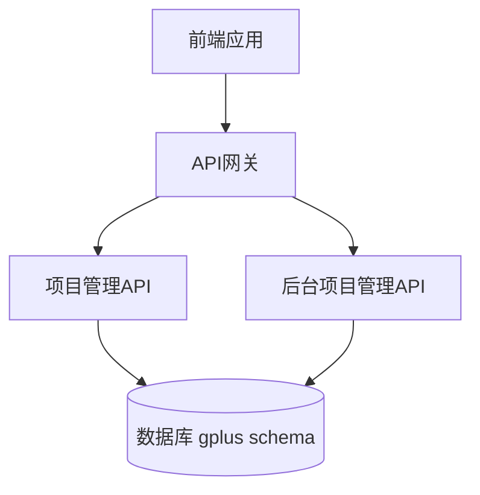
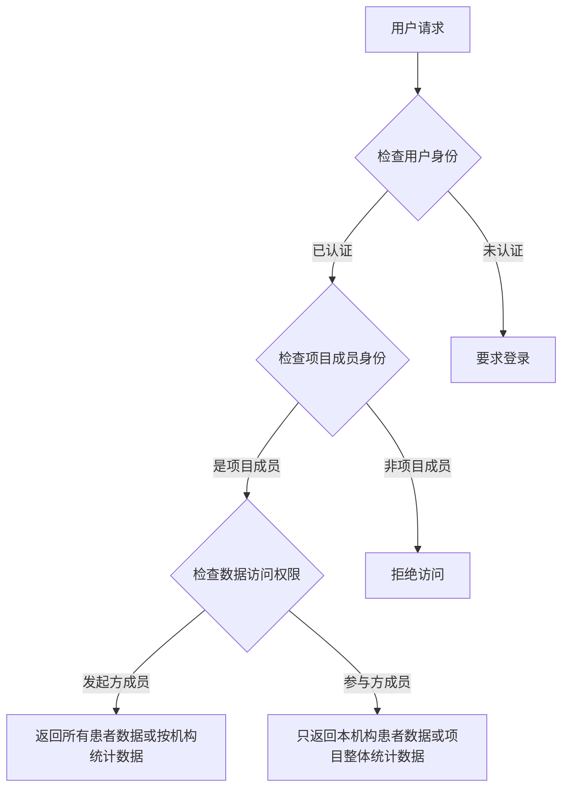

# 1. Title: PRD for 科研项目协作平台

<version>1.0.0</version>

## Status: Approved

## Intro

本文档描述了一个跨机构科研项目协作平台的产品需求。该平台旨在解决多租户系统中不同机构间数据共享的挑战，使得机构可以在保持数据隔离的前提下进行科研合作。该平台由超级管理员在后台创建项目并指定发起机构，邀请其他机构参与，各参与机构可以将其患者数据纳入项目，但只有发起方机构可以访问所有患者数据，而其他参与机构只能访问自己提交的数据。

## Goals

- 构建一个安全可靠的跨机构科研项目协作平台
- 由超级管理员在后台管理科研项目，包括创建项目及指定发起机构和发起人
- 由超级管理员在后台添加参与机构并指定机构负责人
- 实现严格的数据隔离和访问控制，保护患者隐私
- 支持机构内部成员管理，确保只有授权人员可以访问项目数据
- 提供灵活的项目患者管理功能，方便数据收集和分析
- 确保系统与现有多租户架构无缝集成

## Features and Requirements

### 功能需求

- 项目创建与管理：仅限超级管理员在后台创建、编辑和删除科研项目，并指定发起机构和发起人
- 机构参与管理：仅限超级管理员在后台添加和移除参与机构，并指定机构负责人
- 成员管理：允许机构负责人在机构自己的管理界面上管理本机构中哪些成员可以参与项目
- 患者数据管理：允许项目成员将本机构患者纳入项目
- 数据访问控制：确保参与机构只能看到自己提交的患者数据，而发起方可以看到所有数据
- 项目统计与导出：提供项目数据统计和导出功能

### 非功能需求

- 安全性：严格的数据访问控制和审计日志
- 可扩展性：支持未来功能扩展和不同类型的项目
- 性能：高效处理大量患者数据和并发用户访问
- 用户体验：直观的界面和清晰的数据共享状态指示

## Epic List

### Epic-1: 项目管理核心功能（后台管理）

### Epic-2: 机构协作与成员管理

### Epic-3: 患者数据管理与隐私保护

### Epic-N: 未来扩展功能（超出当前PRD范围）

## Epic 1: Story List

- Story 1: 项目数据模型设计
  Status: Completed
  Requirements:
  - 设计项目相关的数据库表结构
  - 确保与现有系统架构兼容
  - 使用gplus schema进行设计

- Story 2: 后台项目管理API实现
  Status: Completed
  Requirements:
  - 实现超级管理员项目CRUD操作的API（admin模块下）
  - 实现项目列表和详情查询API
  - 确保权限控制逻辑正确实现
  - 实现超级管理员添加/移除参与机构到项目的API
  - 实现添加/移除项目成员的API

- Story 3: 后台项目管理及参与机构管理前端实现
  Status: Completed
  Requirements:
  - 实现后台项目列表页面
  - 实现项目创建和编辑表单
  - 实现项目详情页面
  - 实现参与机构列表管理界面
  - 实现项目成员角色管理功能
  - 实现项目成员列表界面

## Epic 2: Story List

- Story 4: 机构用户项目访问与成员管理API及前端
  Status: To Do
  Requirements:
    - 前端实现:
      - 用户项目列表页面 (`client/src/pages/Project/ProjectList.tsx`)
      - 用户项目详情页面 (`client/src/pages/Project/ProjectDetail.tsx`)
      - 机构管理员成员管理界面 (例如 `client/src/pages/Project/MemberManagement.tsx`)

- Story 5: 项目患者管理功能实现
  Status: To Do
  Requirements:
  - 实现基于机构的数据访问控制
  - 实现项目患者列表和详情界面
  - 实现添加/移除项目患者的前端界面

- Story 6: 患者数据统计与导出功能
  Status: 
  Requirements:
  - 实现项目整体数据统计API以及按参与机构分别统计的API。
  - 对于按机构统计，项目发起方应能查看其项目中各参与机构的独立统计数据。
  - 统计维度与项目整体统计维度保持一致，但需针对每个参与机构进行独立计算。
  - 实现按机构筛选的数据导出功能
  - 实现数据统计可视化界面，其中项目发起方能看到各参与机构的统计列表。

## Technology Stack

| 技术/组件        | 描述                                    |
|-----------------|----------------------------------------|
| TypeScript      | 主要开发语言                             |
| NestJS 11       | 后端API框架                              |
| TypeORM         | ORM框架用于数据库交互                     |
| PostgreSQL 16   | 关系型数据库，使用gplus schema            |
| React 16        | 前端UI框架                               |
| Ant Design 4.x  | UI组件库                                 |
| Ant Design Pro  | UI组件库（与Ant Design同步版本）           |
| UmiJS (最新版)   | 前端应用框架                             |

## Reference

### 系统架构图



### 数据访问控制流程图



## Data Models, API Specs, Schemas, etc...

### Projects表结构

```typescript
{
  id: string;                 // 主键 (uuid)
  name: string;               // 项目名称
  description: string;        // 项目描述
  organizationId: number;     // 发起机构ID
  status: number;             // 项目状态：1=草稿，2=进行中，3=已完成，4=已关闭
  startDate: Date;            // 开始时间
  endDate: Date;              // 结束时间
  metadata: JsonObject;       // 额外元数据
  createdAt: Date;            // 创建时间
  updatedAt: Date;            // 更新时间
  createdBy: number;          // 创建者ID
  updatedBy: number;          // 更新者ID
}
```

### ProjectOrganizations表结构

```typescript
{
  id: string;                 // 主键 (uuid)
  projectId: string;          // 项目ID (uuid)
  organizationId: number;     // 机构ID
  role: number;               // 机构角色：1=发起方，2=参与方
  createdAt: Date;            // 创建时间
  updatedAt: Date;            // 更新时间
}
```

### ProjectMembers表结构

```typescript
{
  id: string;                 // 主键 (uuid)
  projectId: string;          // 项目ID (uuid)
  organizationId: number;     // 机构ID
  userId: number;             // 用户ID
  role: number;               // 角色：1=普通成员，2=机构管理员
  createdAt: Date;            // 创建时间
  updatedAt: Date;            // 更新时间
}
```

### ProjectPatients表结构

```typescript
{
  id: string;                 // 主键 (uuid)
  projectId: string;          // 项目ID (uuid)
  patientId: number;          // 患者ID
  organizationId: number;     // 添加该患者的机构ID
  addedByUserId: number;      // 添加该患者的用户ID
  projectData: JsonObject;    // 项目特定的患者数据
  createdAt: Date;            // 创建时间
  updatedAt: Date;            // 更新时间
}
```

### API Endpoints for Statistics (Story 6)

#### Existing/Overall Project Statistics
- **Endpoint:** `GET /api/projects/:projectId/statistics`
- **Description:** Retrieves overall statistical data for the entire project.
- **Response:** `ProjectStatisticsRo` (as previously defined)

#### Per-Organization Statistics (New)
- **Endpoint:** `GET /api/projects/:projectId/organization-statistics`
- **Description:** Retrieves statistical data for each participating organization within the specified project. This endpoint is typically accessible by the initiating organization of the project.
- **Response Body:** An array of `MemberOrganizationStatisticsRo`.
  ```typescript
  [
    {
      "organizationId": number,
      "organizationName": string, // Name of the participating organization
      "statistics": { // Same structure as ProjectStatisticsRo
        "totalCases": number,
        "totalSensors": number,
        "averageSensorsPerPatient": number,
        "genderRatio": { "male": number, "female": number },
        "averageAge": number | null,
        "averageCourseInMonths": number | null,
        "averageSensorDurationDays": number | null
      }
    }
    // ... more organizations
  ]
  ```
  *(Note: `MemberOrganizationStatisticsRo` and the nested statistics object structure would need to be formally defined in DTOs/ROs)*

## Project Structure

```
/server/src/modules/project/
├── dto/
│   ├── project.dto.ts               # 项目DTO定义
│   ├── project-organization.dto.ts  # 项目机构DTO定义
│   ├── project-member.dto.ts        # 项目成员DTO定义
│   ├── project-patient.dto.ts       # 项目患者DTO定义
│   └── project.ro.ts                # 项目响应对象定义
├── entities/
│   ├── project.entity.ts            # 项目实体定义
│   ├── project-organization.entity.ts # 项目机构实体定义
│   ├── project-member.entity.ts     # 项目成员实体定义
│   └── project-patient.entity.ts    # 项目患者实体定义
├── project.controller.ts            # 项目控制器
├── project.module.ts                # 项目模块定义
├── project.service.ts               # 项目服务实现
└── project.subscriber.ts            # 项目实体订阅者
```

## Change Log

| Change               | Story ID | Description                                 |
| -------------------- | -------- | ------------------------------------------- |
| 初始草稿             | N/A      | 初始PRD草稿                                 |
| 修改项目管理逻辑     | N/A      | 项目管理改为仅超级管理员在后台操作          | 