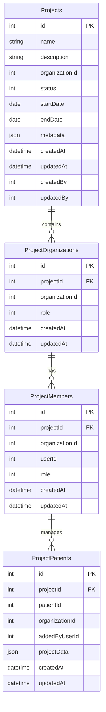

# Epic-1 - Story-1

项目数据模型设计

**As a** developer
**I want** to design the database schema for the scientific collaboration platform
**so that** we can store and manage project data with proper relationships and access controls

## Status

Completed

## Context

This is the first story for implementing the scientific collaboration platform. The platform requires a multi-tenant architecture where different organizations can collaborate on research projects while maintaining data isolation. This story focuses on designing the database schema according to the requirements in the PRD and architecture documents.

The key feature of this platform is that only the initiating organization can access all patient data, while participating organizations can only access their own submitted data.

## Estimation

Story Points: 2

## Tasks

1. - [x] Design Projects table
   1. - [x] Define all required fields
   2. - [x] Set appropriate constraints and relationships
   3. - [x] Document all columns with detailed descriptions
2. - [x] Design ProjectOrganizations table
   1. - [x] Define all required fields
   2. - [x] Set up proper relationships with Projects table
   3. - [x] Implement role-based organization model
3. - [x] Design ProjectMembers table
   1. - [x] Define all required fields
   2. - [x] Set up proper relationships with ProjectOrganizations table
   3. - [x] Implement member role system
4. - [x] Design ProjectPatients table
   1. - [x] Define all required fields
   2. - [x] Set up proper relationships with other tables
   3. - [x] Design for data privacy requirements
5. - [x] Create TypeORM entity definitions
   1. - [x] Implement all entities with proper TypeORM decorators
   2. - [x] Set up relationships between entities
   3. - [x] Add validation decorators
6. - [x] Generate database migration scripts
   1. - [x] Create initial migration
   2. - [x] Test migration in development environment
   3. - [x] Document migration process

## Constraints

- Must use gplus schema in PostgreSQL
- Must ensure compatibility with existing system architecture
- Must implement strict data isolation between organizations
- Required to use TypeORM for database interactions

## Data Models / Schema

### Projects table

```typescript
{
  id: number;                 // Primary key
  name: string;               // Project name
  description: string;        // Project description
  organizationId: number;     // Initiating organization ID
  status: number;             // Project status: 1=draft, 2=in progress, 3=completed, 4=closed
  startDate: Date;            // Start date
  endDate: Date;              // End date
  metadata: JsonObject;       // Additional metadata
  createdAt: Date;            // Creation timestamp
  updatedAt: Date;            // Last update timestamp
  createdBy: number;          // Creator user ID
  updatedBy: number;          // Last updater user ID
}
```

### ProjectOrganizations table

```typescript
{
  id: number;                 // Primary key
  projectId: number;          // Project ID (foreign key)
  organizationId: number;     // Organization ID
  role: number;               // Organization role: 1=initiator, 2=participant
  createdAt: Date;            // Creation timestamp
  updatedAt: Date;            // Last update timestamp
}
```

### ProjectMembers table

```typescript
{
  id: number;                 // Primary key
  projectId: number;          // Project ID (foreign key)
  organizationId: number;     // Organization ID
  userId: number;             // User ID
  role: number;               // Role: 1=regular member, 2=organization admin
  createdAt: Date;            // Creation timestamp
  updatedAt: Date;            // Last update timestamp
}
```

### ProjectPatients table

```typescript
{
  id: number;                 // Primary key
  projectId: number;          // Project ID (foreign key)
  patientId: number;          // Patient ID
  organizationId: number;     // Organization ID that added this patient
  addedByUserId: number;      // User ID who added this patient
  projectData: JsonObject;    // Project-specific patient data
  createdAt: Date;            // Creation timestamp
  updatedAt: Date;            // Last update timestamp
}
```

## Structure

The project will be implemented according to the following structure:

```
/server/src/modules/admin/                   # Admin project controllers
├── dto/
│   ├── admin-project.dto.ts                 # Admin project DTOs
│   ├── admin-project-organization.dto.ts    # Admin project organization DTOs
│   └── admin-project.ro.ts                  # Admin project response objects
├── admin-project.controller.ts              # Admin project controller
└── ...                                      # Other admin related files

/server/src/modules/project/                 # Regular project module
├── dto/
│   ├── project.dto.ts                       # Project DTOs
│   ├── project-organization.dto.ts          # Project organization DTOs
│   ├── project-member.dto.ts                # Project member DTOs
│   ├── project-patient.dto.ts               # Project patient DTOs
│   └── project.ro.ts                        # Project response objects
├── entities/
│   ├── project.entity.ts                    # Project entity
│   ├── project-organization.entity.ts       # Project organization entity
│   ├── project-member.entity.ts             # Project member entity
│   └── project-patient.entity.ts            # Project patient entity
├── controllers/
│   └── project.controller.ts                # Regular project controller
├── services/
│   ├── project.service.ts                   # Project service implementation
│   ├── project-organization.service.ts      # Project organization service
│   ├── project-member.service.ts            # Project member service
│   ├── project-patient.service.ts           # Project patient service
│   └── project-access.service.ts            # Project access control service
├── guards/
│   └── project-access.guard.ts              # Project access guard
├── project.module.ts                        # Project module definition
└── project.subscriber.ts                    # Project entity subscriber
```

Notes:
- The admin API project structure is located in `/server/src/modules/admin/project/` and mainly contains admin controllers
- These controllers should be implemented with reference to other controllers under `/server/src/modules/admin/`
- The services called by the controllers are located in the `/server/src/modules/project/services/` directory
- The implementation style for `/server/src/modules/project/` should reference modules such as `server/src/modules/product-item` and `server/src/modules/schedule`

## Diagrams

Entity Relationship Diagram:



## Dev Notes

- Ensure indexes are created for frequently queried columns
- Consider adding soft delete functionality for all entities
- Set up cascading delete constraints appropriately
- Use TypeORM's RelationId decorator to optimize queries
- Consider adding a timestamp trigger for automatic updates of updatedAt field
- Admin controllers should follow the implementation pattern of other controllers under `/server/src/modules/admin/`
- Project service implementation should reference the implementation style of modules such as `server/src/modules/product-item` and `server/src/modules/schedule`

## Chat Command Log

- User: 遵循@workflow-agile-manual.mdc，下一步是根据@prd.md 和@arch.md 更新story
- Agent: Created first story draft based on project requirements
- User: Provided additional requirements about project structure and requested story in Chinese
- Agent: Updated story document with project structure requirements and translated to Chinese
- User: Requested to revert back to English and approve the document
- Agent: Reverted document to English and updated status to Approved

- ProjectMembers表需支持通过API由超级管理员为任意项目下任意机构添加/删除成员，相关API见story-2. 