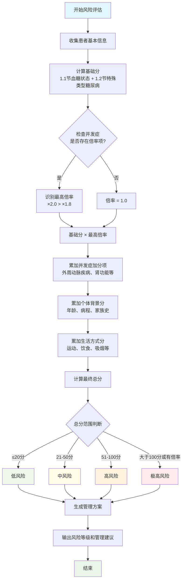

# 患者多维风险分层模型

## 第一部分：风险分层框架

这是一个基于加权评分系统的多维度风险分层模型，旨在对不同健康状况的个体进行系统性的风险评估。模型将患者分为**低风险、中风险、高风险、极高风险**四个等级。

### 1. 风险维度与关键因素 (鱼骨图模型)

#### 1.1. 血糖状态 (Glycemic Status)

**说明：** 除“严重低血糖事件史”外，以下CGM相关指标（TIR, TBR, GV, MAGE, MODD, LBGI, HBGI）应优先通过CGM设备接口自动读取原始数据并计算。仅当无法获取CGM数据时，才允许医护人员手动填写。

| 风险因素                         | 指标/分类      | 分值                | **条件显示**                                  |
| :------------------------------- | :------------- | :------------------ | :---------------------------------------------------- |
| **诊断类型**               | 健康/未诊断    | 0                   | 始终显示                                              |
|                                  | 糖尿病前期     | 10                  | 始终显示                                              |
|                                  | 2型糖尿病      | 20                  | 始终显示                                              |
|                                  | 1型糖尿病      | 25                  | 始终显示                                              |
|                                  | 妊娠糖尿病     | **15**              | 始终显示                                              |
|                                  | 特殊类型糖尿病 | *见1.2节*         | 始终显示                                              |
| **HbA1c**                  | < 7.0%         | 0                   | 仅当诊断类型为糖尿病相关时显示                        |
|                                  | 7.0% - 8.0%    | 5                   | 仅当诊断类型为糖尿病相关时显示                        |
|                                  | 8.1% - 9.0%    | 15                  | 仅当诊断类型为糖尿病相关时显示                        |
|                                  | > 9.0%         | 20                  | 仅当诊断类型为糖尿病相关时显示                        |
| **TIR (Time in Range)**    | > 70%          | 0                   | 仅当诊断类型为糖尿病相关且有CGM数据时显示 (优先自动计算) |
|                                  | 50% - 70%      | 10                  | 仅当诊断类型为糖尿病相关且有CGM数据时显示 (优先自动计算) |
|                                  | < 50%          | 20                  | 仅当诊断类型为糖尿病相关且有CGM数据时显示 (优先自动计算) |
| **TBR (Time Below Range)** | < 1%           | 0                   | 仅当诊断类型为糖尿病相关且有CGM数据时显示 (优先自动计算) |
|                                  | 1% - 4%        | 10                  | 仅当诊断类型为糖尿病相关且有CGM数据时显示 (优先自动计算) |
|                                  | > 4%           | 25                  | 仅当诊断类型为糖尿病相关且有CGM数据时显示 (优先自动计算) |
| **CGM 血糖变异性 (GV)**    | CV < 36%       | 0                   | 仅当诊断类型为糖尿病相关且有CGM数据时显示 (优先自动计算) |
|                                  | CV 36% - 45%   | 5                   | 仅当诊断类型为糖尿病相关且有CGM数据时显示 (优先自动计算) |
|                                  | CV > 45%       | 10                  | 仅当诊断类型为糖尿病相关且有CGM数据时显示 (优先自动计算) |
| **MAGE (Mean Amplitude of Glycemic Excursions)** | < 5.0 mmol/L   | 0                   | 仅当诊断类型为糖尿病相关且有CGM数据时显示 (优先自动计算) |
|                                  | 5.0-7.0 mmol/L | 5                   | 仅当诊断类型为糖尿病相关且有CGM数据时显示 (优先自动计算) |
|                                  | > 7.0 mmol/L   | 10                  | 仅当诊断类型为糖尿病相关且有CGM数据时显示 (优先自动计算) |
| **MODD (Mean of Daily Differences)** | < 2.0 mmol/L   | 0                   | 仅当诊断类型为糖尿病相关且有CGM数据时显示 (优先自动计算) |
|                                  | 2.0-3.0 mmol/L | 5                   | 仅当诊断类型为糖尿病相关且有CGM数据时显示 (优先自动计算) |
|                                  | > 3.0 mmol/L   | 10                  | 仅当诊断类型为糖尿病相关且有CGM数据时显示 (优先自动计算) |
| **LBGI (Low Blood Glucose Index)** | < 2.5          | 0                   | 仅当诊断类型为糖尿病相关且有CGM数据时显示 (优先自动计算) |
|                                  | 2.5-5.0        | 5                   | 仅当诊断类型为糖尿病相关且有CGM数据时显示 (优先自动计算) |
|                                  | > 5.0          | 10                  | 仅当诊断类型为糖尿病相关且有CGM数据时显示 (优先自动计算) |
| **HBGI (High Blood Glucose Index)** | < 5.0          | 0                   | 仅当诊断类型为糖尿病相关且有CGM数据时显示 (优先自动计算) |
|                                  | 5.0-10.0       | 5                   | 仅当诊断类型为糖尿病相关且有CGM数据时显示 (优先自动计算) |
|                                  | > 10.0         | 10                  | 仅当诊断类型为糖尿病相关且有CGM数据时显示 (优先自动计算) |
| **GRI (Glycemia Risk Index)** | 低风险         | 0                   | 仅当诊断类型为糖尿病相关且有CGM数据时显示 (优先自动计算) |
|                                  | 中风险         | 5                   | 仅当诊断类型为糖尿病相关且有CGM数据时显示 (优先自动计算) |
|                                  | 高风险         | 10                  | 仅当诊断类型为糖尿病相关且有CGM数据时显示 (优先自动计算) |
| **严重低血糖事件史**       | 无             | 0                   | 仅当诊断类型为糖尿病相关时显示                        |
|                                  | 有             | 25                  | 仅当诊断类型为糖尿病相关时显示                        |

**CGM数据在风险评估中的作用：**

连续血糖监测 (CGM) 提供了比传统指尖血糖和HbA1c更全面、动态的血糖信息，对于风险分层具有重要价值。系统支持多种CGM品牌：

**支持的CGM设备及质量指标：**
- **Dexcom系列**: 使用GRI (Glycemia Risk Index) 作为综合质量指标
- **FreeStyle Libre系列**: 基于TIR、TAR、TBR计算等效综合质量评分
- **Medtronic Guardian系列**: 使用血糖管理指标(GMI)和TIR综合评估
- **其他CGM品牌**: 系统可根据TIR、血糖变异性等通用指标计算等效质量评分

- **低血糖风险识别：** TBR直接反映低血糖发生频率和持续时间，是评估低血糖风险的关键指标。
- **血糖波动性评估：** CV等指标量化血糖波动幅度，高波动性是心血管事件和并发症的独立风险因素。
- **餐后血糖管理：** CGM能捕捉餐后血糖峰值，有助于识别和管理餐后高血糖。
- **数据完整性：** CGM数据的佩戴依从性和数据完整性本身也反映了患者的自我管理能力和风险。

#### 1.2. 特殊类型糖尿病的详细分类与风险考量

*基于ADA诊疗标准，此处的“基础分”用于替代“2型糖尿病”的20分基础分*

| 类型                       | 子类型                                                | 核心病理生理                   | 风险考量与基础分                            | **条件显示**                     |
| :------------------------- | :---------------------------------------------------- | :----------------------------- | :------------------------------------------ | :------------------------------------- |
| **单基因糖尿病**     | **MODY (Maturity-Onset Diabetes of the Young)** | 基因突变导致胰岛β细胞功能缺陷 | **15-25分** (不同基因型预后差异大)    | 仅当诊断类型为“特殊类型糖尿病”时显示 |
| **胰腺外分泌疾病**   | **胰腺炎、胰腺切除、囊性纤维化**                | 胰岛细胞被破坏                 | **25分** (血糖波动极大，低血糖风险高) | 仅当诊断类型为“特殊类型糖尿病”时显示 |
| **药物或化学品诱导** | **糖皮质激素、某些抗精神病药等**                | 导致胰岛素抵抗或β细胞功能障碍 | **20-25分** (取决于药物和时长)        | 仅当诊断类型为“特殊类型糖尿病”时显示 |

#### 1.3. 并发症与合并症 (清单式评估)

**指导语:** 请根据患者的病历记录或询问患者，勾选所有符合的项目。

| 风险领域                          | 评估项目                                                                              | 分值/处理            | **条件显示**             |
| :-------------------------------- | :------------------------------------------------------------------------------------ | :------------------- | :----------------------------- |
| **心脑血管系统 (最高风险)** | **A.** 是否有过**心肌梗死** (心脏病发作)？                                | **总分 x 2.0** | 仅当患者根据出生日期计算的年龄 >= 18岁时显示     |
|                                   | **B.** 是否有过**缺血性脑卒中** (中风)？                                  | **总分 x 2.0** | 仅当患者根据出生日期计算的年龄 >= 18岁时显示     |
|                                   | **C.** 是否做过**心脏支架/搭桥手术**？                                    | **总分 x 2.0** | 仅当患者根据出生日期计算的年龄 >= 18岁时显示     |
|                                   | **D.** 是否诊断为**心力衰竭** (心衰)？                                    | **总分 x 1.8** | 仅当患者根据出生日期计算的年龄 >= 18岁时显示     |
|                                   | **E.** 是否诊断为**外周动脉疾病** (如腿部血管堵塞)？                      | **+15**        | 仅当患者根据出生日期计算的年龄 >= 18岁时显示     |
| **肾脏系统**                | **A.** 是否处于**终末期肾病** (尿毒症) 或正在**透析**？             | **总分 x 1.8** | 始终显示                       |
|                                   | **B.** eGFR (肾小球滤过率) 45-59                                                | **+15**        | 始终显示                       |
|                                   | **C.** eGFR (肾小球滤过率) 30-44                                                | **+20**        | 始终显示                       |
|                                   | **D.** UACR (尿微量白蛋白/肌酐比) 30-300 mg/g                                   | **+10**        | 始终显示                       |
|                                   | **E.** UACR (尿微量白蛋白/肌酐比) > 300 mg/g                                    | **+20**        | 始终显示                       |
| **其他合并症**              | **A.** 是否诊断为**高血压**，且目前血压**未达标** (>130/80 mmHg)？  | **+10**        | 始终显示                       |
|                                   | **B.** 是否诊断为**高血脂**，且目前LDL-C (低密度脂蛋白)**未达标**？ | **+10**        | 始终显示                       |
|                                   | **C.** 是否诊断为**非酒精性脂肪肝**？                                     | **+5**         | 始终显示                       |
|                                   | **D.** 是否诊断为**糖尿病视网膜病变**？                                   | **+5**         | 仅当诊断类型为糖尿病相关时显示 |
|                                   | **E.** 是否诊断为**糖尿病周围神经病变** (如手脚麻木、疼痛)？              | **+5**         | 仅当诊断类型为糖尿病相关时显示 |

#### 1.4. 个体背景因素 (Individual Background)

| 风险因素                   | 指标/分类 | 分值 | **条件显示**             |
| :------------------------- | :-------- | :--- | :----------------------------- |
| **年龄**             | 计算年龄 < 45岁 | 0    | 始终显示 (根据出生日期计算)    |
|                            | 计算年龄 45-64岁 | 5    | 始终显示 (根据出生日期计算)    |
|                            | 计算年龄 ≥ 65岁 | 10   | 始终显示 (根据出生日期计算)    |
| **糖尿病病程**       | < 5年     | 0    | 仅当诊断类型为糖尿病相关时显示 |
|                            | 5-10年    | 5    | 仅当诊断类型为糖尿病相关时显示 |
|                            | > 10年    | 10   | 仅当诊断类型为糖尿病相关时显示 |
| **心血管疾病家族史** | 无        | 0    | 始终显示                       |
|                            | 有        | 5    | 始终显示                       |

#### 1.5. 生活方式与行为 (细化评估)

| 风险维度             | 评估选项 (请选择最符合的一项)                                                             | 分值                              | **条件显示**                           |
| :------------------- | :---------------------------------------------------------------------------------------- | :-------------------------------- | :------------------------------------------- |
| **体力活动**   | **A.** 每周至少进行150分钟中等强度运动 或 75分钟高强度运动，并包含2次以上抗阻训练。 | **-5** (积极运动，降低风险) | 始终显示                                     |
|                      | **B.** 每周至少进行150分钟中等强度运动 或 75分钟高强度运动。                        | **0**                       | 始终显示                                     |
|                      | **C.** 每周能进行75-150分钟中等强度运动。                                           | **3**                       | 始终显示                                     |
|                      | **D.** 每周运动不足75分钟，大部分时间久坐。                                         | **5**                       | 始终显示                                     |
| **饮食习惯**   | **A.** 遵循明确的健康饮食模式，营养均衡。                                           | **0**                       | 始终显示                                     |
|                      | **B.** 有控制饮食的意识，但难以严格执行。                                           | **3**                       | 始终显示                                     |
|                      | **C.** 经常食用高油、高盐、高糖食物。                                               | **8**                       | 始终显示                                     |
| **吸烟状况**   | **A.** 从不吸烟或已戒烟超过1年。                                                    | **0**                       | 始终显示                                     |
|                      | **B.** 目前仍在吸烟。                                                               | **10**                      | 始终显示                                     |
| **睡眠质量**   | **A.** 每晚平均睡眠7-8小时，质量良好。                                              | **0**                       | 始终显示                                     |
|                      | **B.** 睡眠不足6小时或超过9小时，或质量不佳。                                       | **5**                       | 始终显示                                     |
| **用药依从性** | **A.** 能完全按照医嘱用药。                                                         | **0**                       | 仅当诊断类型为糖尿病相关或有其他慢性病时显示 |
|                      | **B.** 偶尔 (每月1-2次) 漏服。                                                      | **5**                       | 仅当诊断类型为糖尿病相关或有其他慢性病时显示 |
|                      | **C.** 经常 (每周≥1次) 漏服。                                                      | **10**                      | 仅当诊断类型为糖尿病相关或有其他慢性病时显示 |

### 2. 风险分层算法

#### 2.1. 详细计算规则

**基础分定义:**
- **基础分** = 1.1节（血糖状态）分值 + 1.2节（特殊类型糖尿病）分值
- 基础分通过累加方式计算，包含诊断类型、HbA1c、CGM相关指标等所有血糖相关评估项

**倍率应用规则:**
- 倍率**仅对基础分生效**，不影响其他部分分值
- 如果患者同时命中多个倍率项目，**只选择最高倍率**，其他倍率项目不再计入任何分值
- 倍率项目包括：
  - **×2.0:** 心肌梗死、缺血性脑卒中、心脏支架/搭桥手术
  - **×1.8:** 心力衰竭、终末期肾病/透析

**加分项应用时机:**
- 所有加分项（如外周动脉疾病+15分、肾功能损害+15/+20分等）在倍率应用**之后**再进行累加

**完整计算公式:**
```
最终总分 = (基础分 × 最高倍率) + 并发症加分项 + 个体背景分 + 生活方式分
```

#### 2.2. 计算步骤

1. **计算基础分:** 累加1.1节血糖状态和1.2节特殊类型糖尿病的所有分值
2. **识别最高倍率:** 检查1.3节并发症，如存在多个倍率项，选择最高倍率
3. **应用倍率:** 基础分乘以最高倍率（无倍率项则倍率为1.0）
4. **累加其他分值:** 依次加上并发症加分项、个体背景分、生活方式分
5. **确定风险等级:** 根据最终总分确定风险等级

#### 2.3. 计算示例

**示例患者:**
- 2型糖尿病（20分）+ HbA1c 8.5%（15分）= 基础分35分
- 心肌梗死（×2.0倍率）+ 心衰（×1.8倍率，被忽略）
- 外周动脉疾病（+15分）+ 高血压未达标（+10分）
- 年龄65岁（+10分）+ 吸烟（+10分）

**计算过程:**
```
基础分：35分
应用最高倍率：35 × 2.0 = 70分
加上其他分值：70 + 15 + 10 + 10 + 10 = 115分
最终等级：极高风险（>100分）
```

#### 2.4. 风险等级划分

- **低风险:** ≤ 20分
- **中风险:** 21 - 50分  
- **高风险:** 51 - 100分
- **极高风险:** > 100分 或 触发任何风险倍率

#### 2.5. 算法流程图



---

## 第二部分：特殊人群的详细风险分层

*此部分为对特定人群的风险补充调整，优先级高于第一部分通用框架。*

### 1. 妊娠期 (GDM 及合并糖尿病的妊娠)

**核心目标:** 优化母婴结局，严格控制血糖，预防巨大儿、新生儿低血糖、先兆子痫、早产等风险，并关注母婴长期健康。

| 风险维度                     | 关键因素与分层                                                                                    | 风险等级调增/管理建议      | **条件显示**                        |
| :--------------------------- | :------------------------------------------------------------------------------------------------ | :------------------------- | :---------------------------------------- |
| **诊断类型**           | 妊娠期糖尿病 (GDM)                                                                                | 中高风险基础               | 仅当患者性别为女性且处于育龄期时显示      |
|                              | 孕前糖尿病 (1型/2型)                                                                              | 极高风险基础               | 仅当患者性别为女性且处于育龄期时显示      |
| **孕周与血糖目标**     | **孕早期 (1-13周):** 血糖目标严格，避免高血糖致畸。                                         |                            | 仅当诊断类型为妊娠糖尿病时显示            |
|                              | &nbsp;&nbsp;&nbsp;&nbsp;空腹血糖 < 5.3 mmol/L                                                     | 0                          | 仅当诊断类型为妊娠糖尿病时显示            |
|                              | &nbsp;&nbsp;&nbsp;&nbsp;餐后1小时血糖 < 7.8 mmol/L                                                | 0                          | 仅当诊断类型为妊娠糖尿病时显示            |
|                              | &nbsp;&nbsp;&nbsp;&nbsp;餐后2小时血糖 < 6.7 mmol/L                                                | 0                          | 仅当诊断类型为妊娠糖尿病时显示            |
|                              | **孕中期 (14-27周):** 血糖波动可能增大，需密切监测。                                        |                            | 仅当诊断类型为妊娠糖尿病时显示            |
|                              | &nbsp;&nbsp;&nbsp;&nbsp;空腹血糖 < 5.3 mmol/L                                                     | 0                          | 仅当诊断类型为妊娠糖尿病时显示            |
|                              | &nbsp;&nbsp;&nbsp;&nbsp;餐后1小时血糖 < 7.8 mmol/L                                                | 0                          | 仅当诊断类型为妊娠糖尿病时显示            |
|                              | &nbsp;&nbsp;&nbsp;&nbsp;餐后2小时血糖 < 6.7 mmol/L                                                | 0                          | 仅当诊断类型为妊娠糖尿病时显示            |
|                              | **孕晚期 (≥28周):** 胎儿生长加速，胰岛素抵抗加剧，低血糖风险增加。                         |                            | 仅当诊断类型为妊娠糖尿病时显示            |
|                              | &nbsp;&nbsp;&nbsp;&nbsp;空腹血糖 < 5.3 mmol/L                                                     | 0                          | 仅当诊断类型为妊娠糖尿病时显示            |
|                              | &nbsp;&nbsp;&nbsp;&nbsp;餐后1小时血糖 < 7.8 mmol/L                                                | 0                          | 仅当诊断类型为妊娠糖尿病时显示            |
|                              | &nbsp;&nbsp;&nbsp;&nbsp;餐后2小时血糖 < 6.7 mmol/L                                                | 0                          | 仅当诊断类型为妊娠糖尿病时显示            |
| **血糖控制 (CGM)**     | TIR (63-140mg/dL) > 85%                                                                           | 0                          | 仅当诊断类型为妊娠糖尿病且有CGM数据时显示 |
|                              | TIR 70-85%                                                                                        | +10 (高风险)               | 仅当诊断类型为妊娠糖尿病且有CGM数据时显示 |
|                              | TIR < 70%                                                                                         | +20 (极高风险)             | 仅当诊断类型为妊娠糖尿病且有CGM数据时显示 |
|                              | TBR > 4% (任何孕周)                                                                               | +20 (极高风险，需立即干预) | 仅当诊断类型为妊娠糖尿病且有CGM数据时显示 |
|                              | TAR > 25% (任何孕周)                                                                              | +15 (高风险)               | 仅当诊断类型为妊娠糖尿病且有CGM数据时显示 |
| **合并症与并发症**     | 孕前糖尿病 (1型/2型)                                                                              | +15 (高风险)               | 仅当诊断类型为妊娠糖尿病时显示            |
|                              | 合并高血压/子痫前期                                                                               | +20 (极高风险)             | 仅当诊断类型为妊娠糖尿病时显示            |
|                              | 巨大儿/羊水过多史                                                                                 | +10 (高风险)               | 仅当诊断类型为妊娠糖尿病时显示            |
|                              | 胎儿生长受限 (FGR)                                                                                | +15 (高风险)               | 仅当诊断类型为妊娠糖尿病时显示            |
|                              | 胎儿畸形史                                                                                        | +20 (极高风险)             | 仅当诊断类型为妊娠糖尿病时显示            |
| **管理方案**           | **生活方式干预:** 营养师指导，个体化饮食计划，每日30分钟中等强度运动。                      | 0                          | 仅当诊断类型为妊娠糖尿病时显示            |
|                              | **药物治疗:** 若生活方式干预无效，及时启动胰岛素治疗。口服降糖药需谨慎评估。                | 0                          | 仅当诊断类型为妊娠糖尿病时显示            |
|                              | **CGM全程监测:** 强烈推荐，实时了解血糖波动，优化治疗方案，预防低血糖和高血糖对母婴的影响。 | 0                          | 仅当诊断类型为妊娠糖尿病时显示            |
|                              | **多学科协作:** 内分泌科、产科、营养科、儿科、眼科等团队协作。                              | 0                          | 仅当诊断类型为妊娠糖尿病时显示            |
| **产后管理与长期福祉** | **产后6-12周糖耐量复查:** 评估未来2型糖尿病风险。                                           | 0                          | 仅当诊断类型为妊娠糖尿病时显示            |
|                              | **产后T2DM风险评估和干预:** 持续生活方式指导，必要时药物干预。                              | 0                          | 仅当诊断类型为妊娠糖尿病时显示            |
|                              | **母乳喂养:** 鼓励母乳喂养，有助于降低母婴双方未来糖尿病风险。                              | 0                          | 仅当诊断类型为妊娠糖尿病时显示            |

*参考指南: American College of Obstetricians and Gynecologists (ACOG) Practice Bulletin No. 201, Gestational Diabetes Mellitus (2018); American Diabetes Association (ADA) Standards of Medical Care in Diabetes (Published annually).*

### 2. 儿童与青少年 (<18岁)

**核心目标:** 在保证正常生长发育的前提下，实现最佳血糖控制，同时关注心理健康和生活质量。

| 风险维度                 | 关键因素与分层   | 风险等级调增            | **条件显示**                   |
| :----------------------- | :--------------- | :---------------------- | :----------------------------------- |
| **年龄/发育阶段**  | 学龄前 (<6岁)    | 高风险 (低血糖不敏感)   | 仅当患者年龄 < 18岁时显示            |
|                          | 学龄期 (6-12岁)  | 中风险                  | 仅当患者年龄 < 18岁时显示            |
|                          | 青春期 (13-18岁) | 高风险 (胰岛素抵抗增加) | 仅当患者年龄 < 18岁时显示            |
| **血糖控制 (CGM)** | TIR > 70%        | 0                       | 仅当患者年龄 < 18岁且有CGM数据时显示 |
|                          | TIR 50-70%       | +10 (高风险)            | 仅当患者年龄 < 18岁且有CGM数据时显示 |
|                          | TIR < 50%        | +20 (极高风险)          | 仅当患者年龄 < 18岁且有CGM数据时显示 |
|                          | TBR > 4%         | +20 (极高风险)          | 仅当患者年龄 < 18岁且有CGM数据时显示 |
|                          | HbA1c > 9%       | +15 (高风险)            | 仅当患者年龄 < 18岁时显示            |
| **自我管理能力**   | 家长管理         | 视家长能力而定          | 仅当患者年龄 < 18岁时显示            |
|                          | 自主管理过渡期   | +10 (高风险)            | 仅当患者年龄 < 18岁时显示            |
|                          | 可自主管理       | 0                       | 仅当患者年龄 < 18岁时显示            |

*参考指南: ISPAD Clinical Practice Consensus Guidelines, ADA Standards of Care.*

### 3. 老年人 (≥65岁)

**核心目标:** 优先避免低血糖，简化治疗方案，维持功能状态和生活质量。

| 风险维度             | 关键因素与分层               | 风险等级调增   | **条件显示**         |
| :------------------- | :--------------------------- | :------------- | :------------------------- |
| **健康状况**   | 健康 (认知/功能完好)         | 标准同一般成人 | 仅当患者年龄 >= 65岁时显示 |
|                      | 中等复杂 (合并多种慢性病)    | 高风险基础     | 仅当患者年龄 >= 65岁时显示 |
|                      | 非常复杂 (功能受限/临终)     | 极高风险基础   | 仅当患者年龄 >= 65岁时显示 |
| **功能状态**   | 可自理                       | 0              | 仅当患者年龄 >= 65岁时显示 |
|                      | 日常生活需部分协助 (ADL受限) | +10 (高风险)   | 仅当患者年龄 >= 65岁时显示 |
|                      | 完全依赖他人                 | +20 (极高风险) | 仅当患者年龄 >= 65岁时显示 |
| **低血糖风险** | 严重低血糖事件史             | +25 (极高风险) | 仅当患者年龄 >= 65岁时显示 |
|                      | TBR > 1%                     | +15 (高风险)   | 仅当患者年龄 >= 65岁时显示 |
|                      | 多重用药                     | ≥ 5种药物     | +5 (中高风险)              |

*参考指南: ADA Standards of Care - Older Adults.*

### 4. 运动员/长期运动人员

**核心目标:** 优化运动表现，预防运动相关血糖波动（尤其是低血糖），确保安全有效的运动管理。

| 风险维度                     | 关键因素与分层                                        | 风险等级调增/管理建议  | **条件显示**                                          |
| :--------------------------- | :---------------------------------------------------- | :--------------------- | :---------------------------------------------------------- |
| **运动类型与强度**     | 高强度间歇训练 (HIIT) / 耐力运动 (马拉松、长距离骑行) | +10 (高低血糖风险并存) | 仅当患者被识别为运动员/长期运动人员时显示                   |
|                              | 中等强度有氧运动 / 力量训练                           | +5 (中等风险)          | 仅当患者被识别为运动员/长期运动人员时显示                   |
| **运动频率与持续时间** | 每日高强度长时间运动                                  | +10 (低血糖风险增加)   | 仅当患者被识别为运动员/长期运动人员时显示                   |
|                              | 每周多次规律运动                                      | 0                      | 仅当患者被识别为运动员/长期运动人员时显示                   |
| **运动前血糖水平**     | 运动前血糖 < 5.0 mmol/L                               | +15 (低血糖风险极高)   | 仅当诊断类型为糖尿病相关且被识别为运动员/长期运动人员时显示 |
|                              | 运动前血糖 5.0-7.0 mmol/L                             | 0                      | 仅当诊断类型为糖尿病相关且被识别为运动员/长期运动人员时显示 |
|                              | 运动前血糖 > 13.9 mmol/L (伴酮体)                     | +20 (酮症酸中毒风险)   | 仅当诊断类型为糖尿病相关且被识别为运动员/长期运动人员时显示 |
| **运动中补给策略**     | 无规律补给或补给不足                                  | +10 (低血糖风险)       | 仅当诊断类型为糖尿病相关且被识别为运动员/长期运动人员时显示 |
|                              | 规律且充足的碳水化合物补给                            | 0                      | 仅当诊断类型为糖尿病相关且被识别为运动员/长期运动人员时显示 |
| **胰岛素/药物调整**    | 运动前未调整胰岛素/口服药剂量                         | +15 (低血糖风险)       | 仅当诊断类型为糖尿病相关且被识别为运动员/长期运动人员时显示 |
|                              | 根据运动计划调整胰岛素/口服药剂量                     | 0                      | 仅当诊断类型为糖尿病相关且被识别为运动员/长期运动人员时显示 |
| **运动后血糖监测**     | 运动后未监测血糖                                      | +5 (迟发性低血糖风险)  | 仅当诊断类型为糖尿病相关且被识别为运动员/长期运动人员时显示 |
|                              | 运动后规律监测血糖                                    | 0                      | 仅当诊断类型为糖尿病相关且被识别为运动员/长期运动人员时显示 |

*参考指南: American Diabetes Association (ADA) Standards of Medical Care in Diabetes - Physical Activity; International Society for Pediatric and Adolescent Diabetes (ISPAD) Clinical Practice Consensus Guidelines - Exercise in Children and Adolescents with Diabetes.*

---

## 第三部分：整合评估流程

本部分旨在为医护人员提供一个系统性的、多级结构的风险评估流程，确保评估的全面性和操作的便捷性。

### 1. 第一层：初步筛查与诊断类型、年龄及特殊身份

* **目的：** 快速确定患者的基础诊断、年龄和特殊生理状态（如妊娠、运动员），为后续评估设定方向和基础分，并决定后续评估项的动态显示。
* **操作：**
  * 询问或查阅病史，确认患者的诊断类型（健康体检人群、糖尿病前期、1型糖尿病、2型糖尿病、妊娠糖尿病、特殊类型糖尿病）。
  * 根据患者的出生日期计算其年龄，以便后续评估使用。
  * 识别患者是否为**运动员/长期运动人员**。
  * 根据诊断类型、年龄和特殊身份，获取对应的**基础分**（参见第一部分1.1节），并识别是否属于特殊人群（妊娠期、儿童与青少年、老年人、运动员/长期运动人员）。
* **输出：** 患者的基础诊断类型、年龄、特殊人群标识和初始风险基础分。

### 2. 第二层：核心并发症与高危因素快速识别 (条件显示)

* **目的：** 识别可能导致患者风险等级急剧升高的关键并发症和高危因素。这些因素通常会触发风险乘数，并根据患者根据出生日期计算的年龄动态显示。
* **操作：**
  * 根据患者病史或最新检查结果，快速筛查是否存在以下情况（参见第一部分1.3节“心脑血管系统”和“肾脏系统”）。**注意：心脑血管系统相关评估项仅当患者根据出生日期计算的年龄 >= 18岁时显示。**
    * 已确诊的动脉粥样硬化性心血管疾病 (ASCVD) 史（如心肌梗死、脑卒中、心脏支架/搭桥手术）。
    * 心力衰竭 (HF)。
    * 终末期肾病 (尿毒症) 或正在透析。
  * 若存在上述任一情况，立即应用对应的**风险乘数**。
* **输出：** 是否存在高风险乘数，并更新当前总风险分。

### 3. 第三层：血糖控制与主要器官功能评估 (条件显示)

* **目的：** 详细评估患者的血糖控制状况和主要器官（特别是肾脏）的损伤程度，量化其对风险分数的贡献。**注意：血糖相关评估项仅当诊断类型为糖尿病相关时显示。**
* **操作：**
  * **血糖控制：** 获取最新的HbA1c、TIR、TBR、CGM血糖变异性（CV）（参见第一部分1.1节）。根据数值范围，累加对应的分值。
  * **肾脏功能：** 获取最新的eGFR和UACR数值（参见第一部分1.3节“肾脏系统”）。根据数值范围，累加对应的分值。
* **输出：** 详细的血糖和肾脏相关风险累加分。

### 4. 第四层：个体背景与生活方式行为评估 (条件显示)

* **目的：** 全面刻画患者的风险画像，识别可干预的生活方式因素，为后续管理方案提供依据。**注意：用药依从性仅当诊断类型为糖尿病相关或有其他慢性病时显示。**
* **操作：**
  * **个体背景：** 记录患者根据出生日期计算的年龄、糖尿病病程、心血管疾病家族史（参见第一部分1.4节）。根据对应分值累加。
  * **生活方式与行为：** 通过询问或问卷形式，评估患者的体力活动、饮食习惯、吸烟状况、睡眠质量和用药依从性（参见第一部分1.5节）。根据选择的选项，累加对应的分值。
* **输出：** 个体背景和生活方式相关风险累加分。

### 5. 第五层：特殊人群的额外考量 (动态评估)

* **目的：** 对于特定人群，进行额外的风险调整和管理建议，确保个性化和精准管理。
* **操作：**
  * 若患者属于妊娠期、儿童与青少年、老年人或**运动员/长期运动人员**（参见第二部分），则根据其对应的详细风险分层表格，**动态显示**并进行额外的风险评估和管理建议的调整。
  * 这些调整可能包括更严格的血糖目标、特定的并发症预防、心理支持、简化治疗方案或**用药建议**等。
* **输出：** 针对特殊人群的最终风险调整和个性化管理建议。

### 6. 最终风险等级确定与管理方案生成

* **操作：** 将所有累加的分值和乘数效应汇总，得出患者的最终总风险分。根据总风险分，确定患者的最终风险等级（低、中、高、极高风险）。**同时，根据患者的风险等级、特殊人群标识、并发症情况以及生活方式评估结果，自动生成包含用药建议、建议日程安排/来院随访、随访内容要点和居家管理任务的个性化管理方案。**
* **输出：** 患者的最终风险等级和完整的个性化管理方案。
