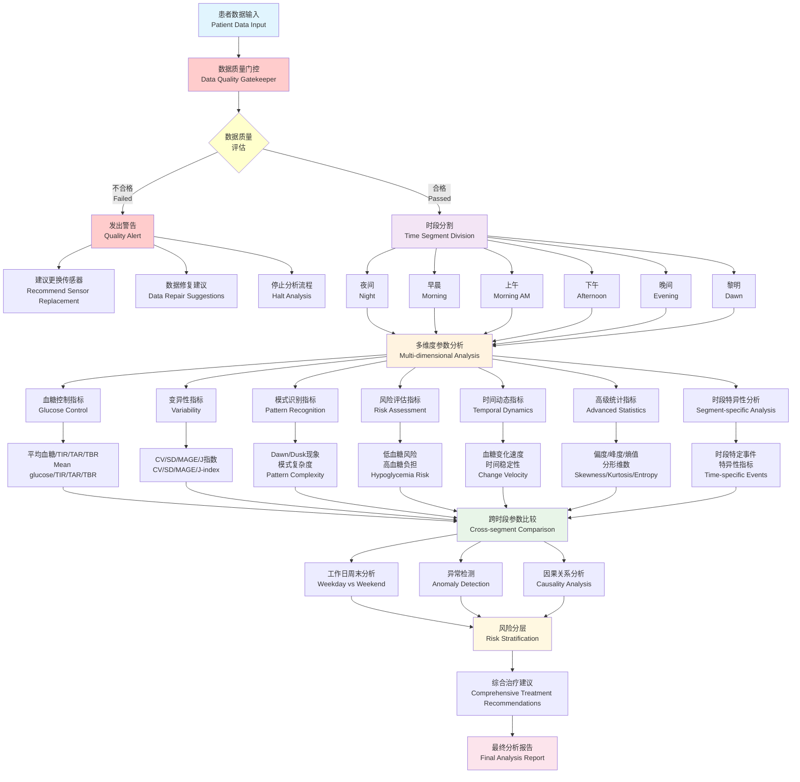

# AGPAI 综合分析流程图

本文档展示了AGPAI系统对患者CGM数据进行综合分析的完整流程。

## 分析流程图

## 流程说明

### 1. 数据输入阶段 (Patient Data Input)
- 导入患者CGM连续血糖监测数据
- 基础数据预处理和格式验证

### 2. 数据质量门控 (Data Quality Gatekeeper) ⭐ **新增关键节点**
这是整个分析流程中**最关键的质量控制节点**，采用严格的"门控"机制：

#### 🔍 五大核心检测模块

**A. 数据完整性检测**
- 时间跨度检查（最少7天，推荐14天）
- 数据覆盖率检查（最低60%，推荐85%以上）
- 每日数据点数验证（最少60个/天）

**B. 实时性和及时性校验**
- 数据延迟检测（超过90分钟为不可接受）
- 实时传输状态验证
- 数据时间戳合理性检查

**C. 传感器故障诊断**
- **传感器卡死检测**: 连续相同读数超过2小时
- **传感器漂移检测**: 漂移率>0.3 mmol/L/小时为严重
- **信号质量评估**: 信噪比、平滑度、一致性综合评估
- **校准状态验证**: 平均血糖合理性检查
- **传感器寿命评估**: 超过14天建议更换

**D. 数据来源验证**
- 设备ID一致性检查
- 数据格式标准验证  
- 传输协议版本验证

**E. 综合质量评分**
- 五级质量分类：优秀/良好/可接受/较差/不可接受
- 加权综合评分算法
- 智能决策引擎

#### 🚪 门控决策机制

**质量门控输出5种决策：**

1. **✅ 继续分析** (PROCEED)
   - 数据质量优秀/良好
   - 直接进入后续分析流程

2. **⚠️ 警告下继续** (PROCEED_WITH_WARNING)  
   - 数据质量可接受但有轻微问题
   - 生成警告信息，继续分析

3. **🔧 修复后重试** (REPAIR_AND_RETRY)
   - 数据质量较差但可修复
   - 建议数据清洗后重新评估

4. **🔄 更换传感器** (REPLACE_SENSOR)
   - 检测到传感器故障
   - **强烈建议立即更换传感器**

5. **🚫 拒绝分析** (REJECT_ANALYSIS)
   - 数据质量不可接受
   - **完全停止分析流程**

#### 💡 智能建议系统

门控系统会根据检测结果生成具体的行动建议：

- **临界优先级**: 立即更换传感器、停止分析
- **高优先级**: 校准传感器、检查连接
- **中优先级**: 监测24小时、数据清理
- **信息级**: 定期检查、预防性维护

### 3. 质量控制决策点
如果数据质量**不合格**：
- 🚨 **发出质量警告**
- 📋 **生成详细问题报告**  
- 🔄 **建议更换传感器**
- ⛔ **停止分析流程**

如果数据质量**合格**：
- ✅ 继续进入后续分析

### 4. 时段分割 (Time Segment Division)
将24小时数据分为6个生理时段：
- **夜间** (23:00-06:00): 睡眠期血糖模式
- **黎明** (05:00-08:00): Dawn现象分析
- **早晨** (06:00-10:00): 晨起血糖控制
- **上午** (08:00-12:00): 早餐后血糖反应
- **下午** (12:00-18:00): 午餐后血糖管理
- **晚间** (18:00-23:00): 晚餐及睡前血糖

### 5. 多维度参数分析
每个时段进行7大类120+个指标的全面分析：

#### 血糖控制指标 (Glucose Control)
- 平均血糖、中位数血糖
- TIR (Time in Range): 3.9-10.0, 3.9-7.8, 严格5.4-7.8
- TAR (Time Above Range): >10.0, >13.9, >16.7
- TBR (Time Below Range): <3.9, <3.0
- 血糖管理指标GMI、估算HbA1c

#### 变异性指标 (Variability)
- CV变异系数、SD标准差
- MAGE平均血糖波动幅度
- MAD平均绝对偏差、J指数
- LBGI/HBGI血糖指数、ADRR风险范围
- GRADE评分、CONGA、MODD等

#### 模式识别指标 (Pattern Recognition)
- Dawn/Dusk现象强度
- 餐后反应模式、夜间稳定性
- 血糖峰值分析、趋势斜率
- 周期性模式、振荡频率
- 模式复杂度、时间序列平稳性

#### 风险评估指标 (Risk Assessment)
- 低血糖风险指数
- 高血糖风险指数和负担
- 血糖波动风险
- 整体血糖风险评分
- 并发症风险、血糖管理困难度

#### 时间动态指标 (Temporal Dynamics)
- 血糖变化速度和加速度
- 血糖惯性、时间稳定性
- 血糖持续性、方向一致性
- 血糖回归倾向、时间相关性

#### 高级统计指标 (Advanced Statistics)
- 偏度、峰度、分布熵
- 近似熵、样本熵、多尺度熵
- 分形维数、Hurst指数
- 去趋势波动分析、Lyapunov指数

#### 时段特异性分析 (Segment-specific Analysis)
- 各时段特定的生理指标
- 时段内血糖事件检测
- 时段特异性风险评估

### 6. 跨时段参数比较 (Cross-segment Comparison)
- 不同时段间参数对比分析
- 时段间血糖控制差异识别
- 最优和最差控制时段确定

### 7. 高级分析模块

#### 工作日周末分析 (Weekday vs Weekend)
- 生活方式对血糖控制的影响
- 工作日和周末血糖模式差异

#### 异常检测 (Anomaly Detection)
- 识别异常血糖模式和事件
- 检测设备故障或数据异常

#### 因果关系分析 (Causality Analysis)
- 分析各参数间的因果关系
- 识别血糖波动的主要驱动因素

### 8. 风险分层 (Risk Stratification)
- 综合所有分析结果进行风险评估
- 患者风险等级分类
- 个性化风险预警

### 9. 综合治疗建议 (Comprehensive Treatment Recommendations)
- 基于分析结果生成个性化治疗方案
- 药物调整建议
- 生活方式干预建议
- 监测策略优化

### 10. 最终分析报告 (Final Analysis Report)
- 生成完整的临床分析报告
- 图表可视化展示
- 为临床决策提供数据支持

## 技术特点

1. **数据质量门控**: 业界首创的严格数据质量准入机制，确保分析可靠性
2. **智能传感器诊断**: 实时检测传感器故障，主动建议更换
3. **全面性**: 120+个血糖相关参数的综合分析
4. **时段化**: 基于生理节律的6时段精细化分析  
5. **智能化**: 多种AI算法的模式识别和异常检测
6. **个性化**: 基于个体数据的定制化分析和建议
7. **临床化**: 符合临床指南的专业级分析报告
8. **预防性**: 主动质量监控和预警系统

## 应用价值

- **数据质量保障**: 确保分析建立在可靠数据基础上，避免错误决策
- **传感器故障预警**: 提前发现传感器问题，减少数据丢失和误诊风险  
- **临床决策支持**: 为医生提供全面、可信的血糖管理数据
- **个性化治疗**: 基于高质量数据的精准医疗方案制定
- **风险预警**: 早期识别血糖管理风险和设备故障风险
- **疗效评估**: 量化治疗效果和改善建议
- **成本控制**: 通过智能传感器管理降低医疗成本
- **科研支持**: 为糖尿病研究提供丰富的分析工具

## 💡 创新亮点

这个增强的数据质量门控系统是AGPAI的重要创新，它：

1. **变被动为主动**: 从事后发现问题变为事前预防问题
2. **提升分析可信度**: 确保所有分析都建立在高质量数据基础上
3. **智能化管理**: 自动识别传感器故障，减少人工干预
4. **成本效益优化**: 及时更换故障传感器，避免数据丢失和重复检查
5. **临床安全保障**: 防止基于劣质数据做出错误医疗决策

这使AGPAI从一个"血糖分析系统"升级为"智能血糖监测质量管理系统"。