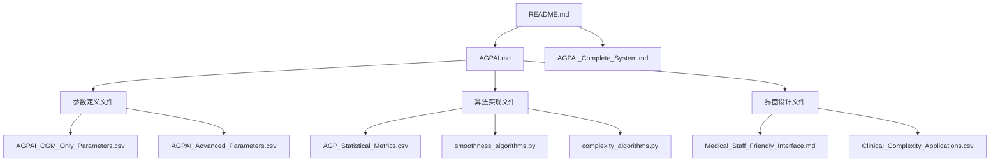

# AGPAI文件整合指南

## 当前问题
AGPAI文件夹目前有13个分散的文件，缺乏清晰的组织结构，不便于使用和维护。

## 🎯 推荐整合方案

### 方案A: 保持现有结构 + 添加导航
**优点**: 不需要移动文件，保持现有工作
**实施**: 已创建 `README.md` 和 `AGPAI_Complete_System.md` 作为导航

```
当前结构 (推荐) ✅
├── README.md                    # 📍 入口文档
├── AGPAI_Complete_System.md     # 📍 整合导航
├── AGPAI.md                     # 核心设计
├── Medical_Staff_Friendly_Interface.md
├── [其他11个专业文件...]
```

### 方案B: 按功能重新组织文件夹
**优点**: 结构更清晰，便于维护
**缺点**: 需要移动文件和更新引用

```
建议结构:
AGPAI/
├── README.md
├── docs/                        # 📁 文档
│   ├── system-design/
│   │   ├── AGPAI.md
│   │   └── Medical_Staff_Friendly_Interface.md
│   └── specifications/
│       ├── parameters/
│       ├── algorithms/
│       └── clinical-applications/
├── algorithms/                  # 📁 算法代码
│   ├── smoothness_algorithms.py
│   └── complexity_algorithms.py
└── data/                       # 📁 数据定义
    ├── parameters/
    ├── metrics/
    └── patterns/
```

## 🚀 立即可用的整合方案

### 1. 使用新创建的导航文件
现在您有两个关键的导航文件：

#### 📖 README.md - 项目入口
- 项目概述和快速开始
- 文件结构清晰说明  
- 技术栈和实施指南
- **推荐**: 作为项目的主入口

#### 📋 AGPAI_Complete_System.md - 完整系统导航
- 所有文件的详细说明
- 按角色分类的使用指南
- 实施建议和技术支持
- **推荐**: 作为技术人员的详细指南

### 2. 按需使用文件的建议优先级

#### 🔥 核心必读 (5个文件)
```
1. README.md                     # 项目入口
2. AGPAI.md                     # 系统设计核心
3. AGPAI_CGM_Only_Parameters.csv # 基础参数定义
4. AGP_Statistical_Metrics.csv   # ADA标准指标
5. smoothness_algorithms.py      # 基础算法实现
```

#### ⭐ 进阶推荐 (4个文件)
```
6. AGP_Visual_Pattern_Analysis.csv      # 视觉分析
7. complexity_algorithms.py             # 复杂度算法
8. Medical_Staff_Friendly_Interface.md  # 界面设计
9. Clinical_Complexity_Applications.csv # 临床应用
```

#### 📚 完整参考 (4个文件)
```
10. AGPAI_Advanced_Parameters.csv
11. AGP_Clinical_Pattern_Metrics.csv
12. Blood_Glucose_Complexity_Calculation.csv
13. AGP_Smoothness_Calculation_Methods.csv
```

## 💡 实际使用建议

### 对于项目经理
```bash
# 快速了解项目 (10分钟)
1. 阅读 README.md
2. 浏览 AGPAI.md 的系统概述部分

# 深入了解 (30分钟)  
3. 阅读 AGPAI_Complete_System.md
4. 查看实施路线图部分
```

### 对于开发人员
```bash
# 技术理解 (1小时)
1. 阅读 AGPAI.md 完整内容
2. 查看 AGPAI_CGM_Only_Parameters.csv
3. 运行 smoothness_algorithms.py 示例

# 完整实现 (1-2天)
4. 研究所有 CSV 参数文件
5. 理解 complexity_algorithms.py
6. 参考界面设计文档
```

### 对于医学专家
```bash
# 临床理解 (30分钟)
1. 阅读 README.md 的临床价值部分
2. 查看 Clinical_Complexity_Applications.csv

# 深入评估 (2小时)
3. 研究 AGP_Clinical_Pattern_Metrics.csv
4. 阅读 Medical_Staff_Friendly_Interface.md
5. 评估各种临床场景的适用性
```

## 🔧 文件关系图



## ✅ 推荐的下一步行动

### 立即执行 (已完成)
- ✅ 创建 README.md 作为项目入口
- ✅ 创建 AGPAI_Complete_System.md 作为完整导航
- ✅ 所有文件都有清晰的说明和引用

### 可选优化 (根据需要)
1. **创建快速参考卡片** - 将最常用的参数制作成一页纸的参考
2. **制作演示文档** - 基于实际数据的分析示例
3. **API文档生成** - 从Python代码自动生成API文档

## 🎯 总结

现在AGPAI文件夹已经通过 **README.md** 和 **AGPAI_Complete_System.md** 两个导航文件得到了很好的整合：

1. **入口清晰** - README.md 提供项目概览和快速开始
2. **导航完整** - AGPAI_Complete_System.md 提供详细的文件导航
3. **分级使用** - 按重要性和角色提供不同的使用路径
4. **保持灵活** - 不破坏现有文件结构，便于持续开发

**建议**: 直接使用当前结构，通过导航文件来管理和使用所有内容。这样既保持了文件的完整性，又提供了清晰的使用指南。