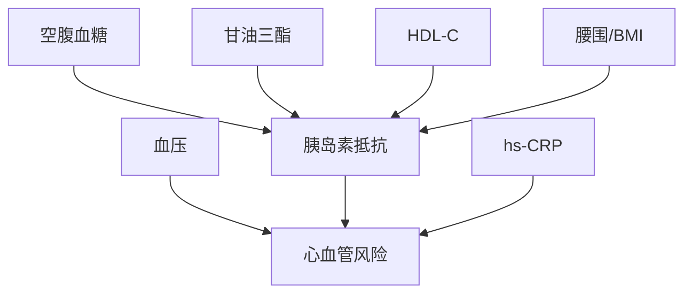
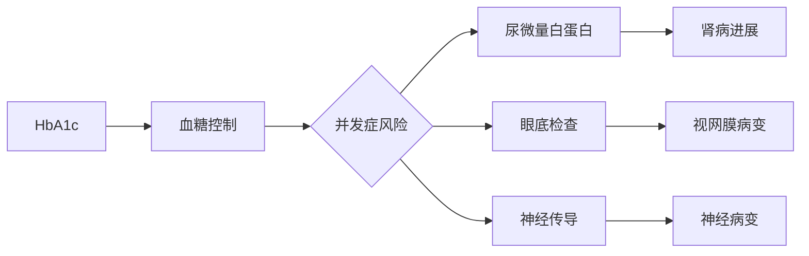
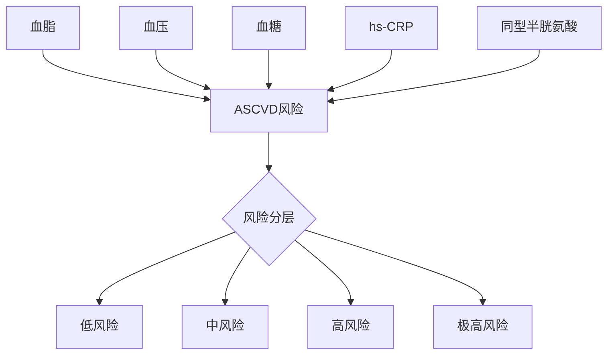

# 多疾病领域实验室检查LOINC编码映射扩展方案

## 🎯 覆盖疾病领域

### 核心疾病领域 (15个)
1. **糖尿病** (Diabetes Mellitus)
2. **甲状腺疾病** (Thyroid Disorders) 
3. **心脏病** (Cardiovascular Disease)
4. **高尿酸血症及痛风** (Hyperuricemia & Gout)
5. **脂肪肝** (Fatty Liver Disease)
6. **代谢综合征** (Metabolic Syndrome)
7. **肾病及肾炎** (Kidney Disease & Nephritis)
8. **高血脂** (Dyslipidemia)
9. **高血压** (Hypertension)
10. **减重** (Weight Management)
11. **妊娠** (Pregnancy)
12. **1型糖尿病** (Type 1 Diabetes)
13. **糖尿病周围神经病变** (Diabetic Peripheral Neuropathy)
14. **脑血管病** (Cerebrovascular Disease)
15. **内分泌代谢疾病** (Endocrine & Metabolic Disorders)

## 📊 疾病特异性检验项目LOINC映射

### 1. 糖尿病专项检查

| 检查项目 | 中文名称 | LOINC代码 | 标准单位 | 临床意义 |
|---------|---------|----------|----------|----------|
| Fructosamine | 果糖胺 | 1834-7 | μmol/L | 2-3周血糖控制评估 |
| 1,5-AG | 1,5-脱水葡萄糖醇 | 33743-9 | μg/mL | 短期血糖控制监测 |
| C-peptide stimulated | 刺激后C肽 | 1986-9 | nmol/L | 胰岛β细胞功能评估 |
| Insulin antibody | 胰岛素抗体 | 8086-3 | U/mL | 胰岛素抵抗评估 |
| Proinsulin | 胰岛素原 | 10997-7 | pmol/L | 胰岛细胞功能 |
| Diabetic ketones | 糖尿病酮体 | 2514-8 | mmol/L | 糖尿病酮症诊断 |

### 2. 甲状腺疾病专项

| 检查项目 | 中文名称 | LOINC代码 | 标准单位 | 临床意义 |
|---------|---------|----------|----------|----------|
| T3 Total | 总三碘甲状腺原氨酸 | 3053-6 | nmol/L | 甲状腺功能评估 |
| T4 Total | 总甲状腺素 | 3026-2 | nmol/L | 甲状腺功能评估 |
| rT3 | 反T3 | 3052-8 | pmol/L | 甲状腺激素代谢 |
| Anti-TPO | 抗甲状腺过氧化物酶抗体 | 11571-5 | IU/mL | 自身免疫性甲状腺病 |
| Anti-TG | 抗甲状腺球蛋白抗体 | 8099-6 | IU/mL | 甲状腺癌监测 |
| TRAb | TSH受体抗体 | 5385-0 | IU/L | Graves病诊断 |
| Thyroglobulin | 甲状腺球蛋白 | 3013-0 | μg/L | 甲状腺癌监测 |
| Calcitonin | 降钙素 | 1987-7 | ng/L | 甲状腺髓样癌标志物 |

### 3. 心脏病专项

| 检查项目 | 中文名称 | LOINC代码 | 标准单位 | 临床意义 |
|---------|---------|----------|----------|----------|
| Troponin I | 肌钙蛋白I | 10839-9 | ng/mL | 急性心肌梗死诊断 |
| Troponin T | 肌钙蛋白T | 6598-7 | ng/mL | 心肌损伤标志物 |
| CK-MB | 肌酸激酶同工酶 | 13969-1 | ng/mL | 心肌梗死诊断 |
| Myoglobin | 肌红蛋白 | 5908-9 | μg/L | 早期心肌损伤 |
| BNP | B型钠尿肽 | 30934-4 | pg/mL | 心衰诊断 |
| NT-proBNP | N末端前BNP | 33762-6 | pg/mL | 心衰诊断和预后 |
| D-dimer | D-二聚体 | 48066-5 | mg/L | 血栓栓塞诊断 |
| hs-CRP | 超敏C反应蛋白 | 30522-7 | mg/L | 心血管风险评估 |

### 4. 高尿酸血症及痛风专项

| 检查项目 | 中文名称 | LOINC代码 | 标准单位 | 临床意义 |
|---------|---------|----------|----------|----------|
| Uric Acid 24h urine | 24小时尿尿酸 | 3087-4 | mmol/24h | 尿酸排泄功能 |
| Xanthine | 黄嘌呤 | 4298-7 | μmol/L | 嘌呤代谢评估 |
| Hypoxanthine | 次黄嘌呤 | 25428-5 | μmol/L | 嘌呤代谢中间产物 |
| Fractional excretion UA | 尿酸排泄分数 | 33747-7 | % | 肾脏尿酸处理能力 |

### 5. 脂肪肝专项

| 检查项目 | 中文名称 | LOINC代码 | 标准单位 | 临床意义 |
|---------|---------|----------|----------|----------|
| GGT | γ-谷氨酰转移酶 | 2324-2 | U/L | 肝胆疾病标志物 |
| Ferritin | 血清铁蛋白 | 2276-4 | μg/L | 肝脏铁代谢 |
| TIBC | 总铁结合力 | 2500-7 | μmol/L | 铁代谢评估 |
| Transferrin saturation | 转铁蛋白饱和度 | 2502-3 | % | 铁超负荷评估 |
| Hyaluronic acid | 透明质酸 | 25702-3 | μg/L | 肝纤维化标志物 |
| Type IV collagen | IV型胶原 | 33768-3 | ng/mL | 肝纤维化评估 |
| Laminin | 层粘连蛋白 | 25695-9 | ng/mL | 肝纤维化标志物 |

### 6. 代谢综合征专项

| 检查项目 | 中文名称 | LOINC代码 | 标准单位 | 临床意义 |
|---------|---------|----------|----------|----------|
| Adiponectin | 脂联素 | 33747-7 | mg/L | 脂肪细胞因子 |
| Leptin | 瘦素 | 33751-9 | ng/mL | 食欲调节激素 |
| Resistin | 抵抗素 | 40617-2 | ng/mL | 胰岛素抵抗标志物 |
| HOMA-IR | 胰岛素抵抗指数 | 33743-9 | 指数 | 胰岛素抵抗评估 |
| QUICKI | 胰岛素敏感性指数 | 33744-7 | 指数 | 胰岛素敏感性 |

### 7. 肾病及肾炎专项

| 检查项目 | 中文名称 | LOINC代码 | 标准单位 | 临床意义 |
|---------|---------|----------|----------|----------|
| β2-microglobulin | β2-微球蛋白 | 1952-1 | mg/L | 肾小管功能 |
| Cystatin C | 胱抑素C | 33950-8 | mg/L | 肾功能评估 |
| NGAL | 中性粒细胞明胶酶相关脂质运载蛋白 | 33747-0 | ng/mL | 急性肾损伤标志物 |
| KIM-1 | 肾损伤分子1 | 62238-1 | ng/mL | 肾小管损伤 |
| Anti-GBM | 抗肾小球基膜抗体 | 16431-9 | AU/mL | 抗GBM肾炎 |
| ANCA | 抗中性粒细胞胞质抗体 | 17357-5 | 滴度 | ANCA相关肾炎 |
| C3 complement | 补体C3 | 4485-9 | g/L | 补体系统评估 |
| C4 complement | 补体C4 | 4498-2 | g/L | 补体系统评估 |

### 8. 高血脂扩展项目

| 检查项目 | 中文名称 | LOINC代码 | 标准单位 | 临床意义 |
|---------|---------|----------|----------|----------|
| Small dense LDL | 小而密LDL | 33747-2 | mg/dL | 心血管风险评估 |
| Oxidized LDL | 氧化LDL | 33748-0 | U/L | 动脉硬化风险 |
| ApoE genotype | 载脂蛋白E基因型 | 33749-8 | 基因型 | 脂质代谢遗传 |
| PCSK9 | 前蛋白转化酶枯草杆菌蛋白酶9 | 88311-7 | ng/mL | 胆固醇调节 |

### 9. 高血压专项

| 检查项目 | 中文名称 | LOINC代码 | 标准单位 | 临床意义 |
|---------|---------|----------|----------|----------|
| Renin | 血浆肾素 | 5702-6 | mU/L | 肾素-血管紧张素系统 |
| Aldosterone | 醛固酮 | 1657-6 | nmol/L | 盐皮质激素 |
| ARR | 醛固酮/肾素比值 | 33746-4 | 比值 | 原醛症筛查 |
| Catecholamines | 儿茶酚胺 | 2666-6 | nmol/L | 嗜铬细胞瘤筛查 |
| Metanephrines | 甲氧基肾上腺素 | 25428-7 | nmol/L | 嗜铬细胞瘤诊断 |
| Cortisol 24h urine | 24小时尿皮质醇 | 1875-4 | nmol/24h | 库欣综合征 |

### 10. 减重专项

| 检查项目 | 中文名称 | LOINC代码 | 标准单位 | 临床意义 |
|---------|---------|----------|----------|----------|
| Ghrelin | 饥饿激素 | 33750-6 | pg/mL | 食欲调节 |
| GLP-1 | 胰高血糖素样肽1 | 33751-4 | pmol/L | 肠促胰素 |
| GIP | 葡萄糖依赖性胰岛素释放肽 | 33752-2 | pmol/L | 肠促胰素 |
| PYY | 肽YY | 33753-0 | pg/mL | 饱腹感调节 |
| Resting metabolic rate | 基础代谢率 | 33754-8 | kcal/day | 代谢评估 |

### 11. 妊娠专项

| 检查项目 | 中文名称 | LOINC代码 | 标准单位 | 临床意义 |
|---------|---------|----------|----------|----------|
| hCG | 人绒毛膜促性腺激素 | 21198-7 | mIU/mL | 妊娠诊断 |
| AFP | 甲胎蛋白 | 1834-1 | ng/mL | 胎儿神经管缺陷 |
| PAPP-A | 妊娠相关血浆蛋白A | 30169-7 | mU/L | 染色体异常筛查 |
| Free β-hCG | 游离β-hCG | 21199-5 | ng/mL | 唐氏综合征筛查 |
| PLGF | 胎盘生长因子 | 33756-3 | pg/mL | 子痫前期预测 |
| sFlt-1 | 可溶性血管内皮生长因子受体1 | 33757-1 | pg/mL | 子痫前期诊断 |

### 12. 1型糖尿病特异性

| 检查项目 | 中文名称 | LOINC代码 | 标准单位 | 临床意义 |
|---------|---------|----------|----------|----------|
| Anti-GAD65 | 抗谷氨酸脱羧酶65抗体 | 13926-0 | U/mL | 1型糖尿病自身抗体 |
| Anti-IA2 | 抗蛋白酪氨酸磷酸酶抗体 | 31835-7 | U/mL | 1型糖尿病预测 |
| Anti-ZnT8 | 抗锌转运体8抗体 | 62301-5 | U/mL | 1型糖尿病诊断 |
| C-peptide suppression test | C肽抑制试验 | 1987-7 | nmol/L | 胰岛功能评估 |

### 13. 糖尿病神经病变专项

| 检查项目 | 中文名称 | LOINC代码 | 标准单位 | 临床意义 |
|---------|---------|----------|----------|----------|
| Vitamin B1 | 维生素B1 | 14905-4 | nmol/L | 神经功能营养素 |
| Vitamin B12 | 维生素B12 | 2132-9 | pmol/L | 神经系统必需维生素 |
| Folate | 叶酸 | 2284-8 | nmol/L | 神经发育必需 |
| Homocysteine | 同型半胱氨酸 | 4481-8 | μmol/L | 神经血管风险 |
| Methylmalonic acid | 甲基丙二酸 | 25428-9 | μmol/L | B12功能性缺乏 |

### 14. 脑血管病专项

| 检查项目 | 中文名称 | LOINC代码 | 标准单位 | 临床意义 |
|---------|---------|----------|----------|----------|
| S100B | S100B蛋白 | 33758-9 | μg/L | 脑损伤标志物 |
| NSE | 神经元特异性烯醇化酶 | 9635-4 | μg/L | 神经元损伤 |
| MBP | 髓鞘碱性蛋白 | 33759-7 | ng/mL | 白质损伤 |
| Anti-cardiolipin | 抗心磷脂抗体 | 3283-3 | GPL/mL | 抗磷脂综合征 |
| Lupus anticoagulant | 狼疮抗凝物 | 3283-7 | 比值 | 血栓性疾病 |
| Protein C activity | 蛋白C活性 | 27811-9 | % | 血栓性疾病 |
| Protein S activity | 蛋白S活性 | 27812-7 | % | 血栓倾向评估 |

### 15. 内分泌代谢疾病扩展

| 检查项目 | 中文名称 | LOINC代码 | 标准单位 | 临床意义 |
|---------|---------|----------|----------|----------|
| Growth hormone | 生长激素 | 2842-3 | ng/mL | 生长激素缺乏 |
| IGF-1 | 胰岛素样生长因子1 | 14633-2 | ng/mL | 生长激素功能 |
| ACTH | 促肾上腺皮质激素 | 2141-0 | pg/mL | 下丘脑-垂体-肾上腺轴 |
| Cortisol | 皮质醇 | 2143-6 | nmol/L | 肾上腺皮质功能 |
| DHEA-S | 硫酸脱氢表雄酮 | 2196-4 | μmol/L | 肾上腺雄激素 |
| 17-OH Progesterone | 17α-羟孕酮 | 1668-3 | nmol/L | 先天性肾上腺增生 |
| Parathyroid hormone | 甲状旁腺素 | 2731-8 | pg/mL | 钙磷代谢调节 |
| 25-OH Vitamin D3 | 25羟维生素D3 | 14635-7 | nmol/L | 骨代谢评估 |
| 1,25-(OH)2 Vitamin D | 1,25二羟维生素D | 1819-0 | pmol/L | 活性维生素D |
| Osteocalcin | 骨钙素 | 2709-4 | ng/mL | 骨形成标志物 |
| CTX | I型胶原交联C末端肽 | 17917-0 | ng/mL | 骨吸收标志物 |

## 🎯 疾病特异性参考范围与目标值

### 糖尿病管理目标

| 指标 | 一般患者 | 老年患者 | 妊娠期 | 儿童青少年 |
|------|----------|----------|---------|------------|
| HbA1c | <7.0% | <8.0% | <6.0% | <7.5% |
| 空腹血糖 | 4.4-7.0 mmol/L | 5.0-8.0 mmol/L | 3.3-5.3 mmol/L | 4.4-7.0 mmol/L |
| 餐后2h血糖 | <10.0 mmol/L | <11.1 mmol/L | <6.7 mmol/L | <10.0 mmol/L |

### 心血管风险分层

| 风险等级 | LDL-C目标 | 总胆固醇 | 血压目标 | hs-CRP |
|----------|-----------|----------|----------|---------|
| 低风险 | <3.4 mmol/L | <5.2 mmol/L | <140/90 mmHg | <1.0 mg/L |
| 中风险 | <2.6 mmol/L | <4.9 mmol/L | <130/80 mmHg | <3.0 mg/L |
| 高风险 | <1.8 mmol/L | <4.5 mmol/L | <130/80 mmHg | - |
| 极高风险 | <1.4 mmol/L | <4.0 mmol/L | <125/75 mmHg | - |

### 肾病分期与目标

| CKD分期 | eGFR | 白蛋白尿 | 血压目标 | 蛋白质摄入 |
|---------|------|----------|----------|------------|
| G1 | ≥90 | <30 mg/g | <130/80 | 0.8-1.0 g/kg |
| G2 | 60-89 | 30-300 mg/g | <130/80 | 0.8 g/kg |
| G3a | 45-59 | >300 mg/g | <130/80 | 0.8 g/kg |
| G3b | 30-44 | - | <130/80 | 0.6-0.8 g/kg |
| G4 | 15-29 | - | <130/80 | 0.6 g/kg |
| G5 | <15 | - | <130/80 | 0.6 g/kg |

### 妊娠期特殊参考范围

| 孕期 | 空腹血糖 | OGTT 1h | OGTT 2h | TSH | Free T4 |
|------|----------|---------|---------|-----|---------|
| T1 | <5.1 mmol/L | <10.0 mmol/L | <8.5 mmol/L | 0.1-2.5 mIU/L | 12-19 pmol/L |
| T2 | <5.1 mmol/L | <10.0 mmol/L | <8.5 mmol/L | 0.2-3.0 mIU/L | 10-17 pmol/L |
| T3 | <5.1 mmol/L | <10.0 mmol/L | <8.5 mmol/L | 0.3-3.5 mIU/L | 9-16 pmol/L |

## 🔗 疾病间检验项目关联性分析

### 代谢综合征核心指标群


### 糖尿病并发症监测链


### 心血管风险评估体系


## 📋 实施优先级与时间规划

### 第一阶段 (4周) - 核心代谢疾病
- ✅ 糖尿病全系列指标
- ✅ 血脂代谢综合评估
- ✅ 肾功能及早期损伤标志物
- ✅ 甲状腺功能完整面板

### 第二阶段 (6周) - 心血管及炎症
- 🔄 心血管疾病标志物
- 🔄 高血压相关内分泌检查
- 🔄 血栓与凝血功能
- 🔄 炎症及免疫标志物

### 第三阶段 (8周) - 专科特异性
- ⏳ 妊娠期特殊监测
- ⏳ 1型糖尿病自身抗体
- ⏳ 脑血管疾病标志物
- ⏳ 减重及肠道激素

### 第四阶段 (10周) - 高级代谢评估
- ⏳ 骨代谢完整评估
- ⏳ 肝纤维化标志物
- ⏳ 营养素及维生素状态
- ⏳ 遗传代谢标志物

## 🎯 质量控制与临床决策支持

### 多疾病交叉验证规则
1. **代谢一致性检查**: 血糖、胰岛素、C肽的生理一致性
2. **肾功能相关性**: 肌酐、胱抑素C、eGFR的匹配性
3. **甲状腺轴完整性**: TSH、FT3、FT4的反馈关系
4. **脂质代谢逻辑**: TC、LDL-C、HDL-C、TG的计算一致性

### 临床警报阈值
```json
{
  "critical_values": {
    "glucose": {"low": 2.8, "high": 33.3},
    "troponin_i": {"high": 0.04},
    "creatinine": {"male_high": 442, "female_high": 354},
    "tsh": {"low": 0.01, "high": 100},
    "hcg": {"pregnancy_low": 25}
  },
  "trend_alerts": {
    "hba1c_increase": ">0.5% in 3 months",
    "creatinine_increase": ">25% in 1 month", 
    "egfr_decline": ">5 mL/min/1.73m² per year"
  }
}
```

这个扩展方案覆盖了您提到的所有15个疾病领域，每个领域都包含了核心的特异性检验指标，为跨专科的标准化数据管理奠定了基础。