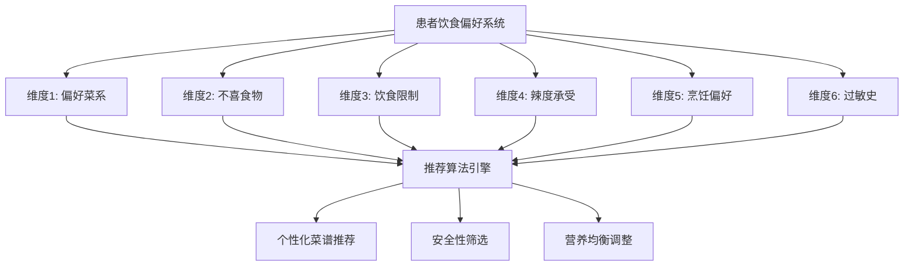

# 饮食偏好六维度详细设计文档

**文档版本**: v2.0
**创建时间**: 2025年09月21日
**适用系统**: 整合版营养管理系统 v2.0
**设计目标**: 构建全面的个性化饮食偏好管理体系

---

## 📋 六维度概览

### 系统架构图


### 维度重要性分级
| 维度 | 安全等级 | 影响范围 | 权重系数 | 必填程度 |
|------|----------|----------|----------|----------|
| 过敏史 | 🔴 Critical | 生命安全 | 1.0 | 必填 |
| 饮食限制 | 🟡 High | 健康/宗教 | 0.9 | 重要 |
| 不喜食物 | 🟢 Medium | 接受度 | 0.6 | 建议 |
| 偏好菜系 | 🟢 Medium | 满意度 | 0.5 | 建议 |
| 辣度承受 | 🟢 Low | 口感体验 | 0.4 | 可选 |
| 烹饪偏好 | 🟢 Low | 制作方式 | 0.3 | 可选 |

---

## 🍽️ 维度1: 偏好菜系

### 定义与作用
**定义**: 患者喜好的菜系风味，影响菜谱推荐的基础风味方向
**作用**: 提高患者对推荐菜谱的接受度和满意度，增强饮食依从性

### 详细分类体系

#### 1.1 八大传统菜系
```python
TRADITIONAL_CUISINES = {
    "川菜": {
        "特色": "麻辣鲜香，调味多变",
        "代表调料": ["花椒", "辣椒", "豆瓣酱", "泡菜"],
        "烹饪特点": ["炒", "煮", "炖", "烧"],
        "适宜人群": ["喜辣人群", "胃寒体质"],
        "注意事项": ["高血压患者需控制盐分", "胃炎患者谨慎食用"]
    },
    "粤菜": {
        "特色": "清淡鲜美，原汁原味",
        "代表调料": ["生抽", "料酒", "姜葱", "蚝油"],
        "烹饪特点": ["蒸", "煮", "炖", "煲"],
        "适宜人群": ["老人", "儿童", "消化不良者"],
        "注意事项": ["适合大多数疾病患者"]
    },
    "鲁菜": {
        "特色": "咸鲜为主，突出原味",
        "代表调料": ["大葱", "生姜", "大蒜"],
        "烹饪特点": ["爆", "炒", "烧", "蒸"],
        "适宜人群": ["北方人群", "体力劳动者"],
        "注意事项": ["注意盐分控制"]
    },
    "苏菜": {
        "特色": "清淡微甜，精工细作",
        "代表调料": ["糖", "料酒", "醋"],
        "烹饪特点": ["炖", "焖", "煨", "焐"],
        "适宜人群": ["南方人群", "糖尿病患者（控制糖分）"],
        "注意事项": ["糖尿病患者需要调整甜度"]
    },
    "浙菜": {
        "特色": "清香嫩滑，鲜美爽脆",
        "代表调料": ["黄酒", "醋", "糖"],
        "烹饪特点": ["炒", "炸", "烩", "焖"],
        "适宜人群": ["江南人群", "老年人"],
        "注意事项": ["适合多数慢病患者"]
    },
    "闽菜": {
        "特色": "清鲜爽淡，甜酸适宜",
        "代表调料": ["红糟", "虾油", "沙茶酱"],
        "烹饪特点": ["炒", "炸", "焖", "炖"],
        "适宜人群": ["东南沿海人群"],
        "注意事项": ["海鲜过敏者需谨慎"]
    },
    "湘菜": {
        "特色": "酸辣鲜香，口味浓重",
        "代表调料": ["辣椒", "胡椒", "醋"],
        "烹饪特点": ["炒", "煸", "腊", "蒸"],
        "适宜人群": ["湖南及周边人群", "喜酸辣者"],
        "注意事项": ["胃病、高血压患者需控制辣度"]
    },
    "徽菜": {
        "特色": "重油重色，浓淡适宜",
        "代表调料": ["徽州毛豆腐", "火腿", "冬笋"],
        "烹饪特点": ["烧", "炖", "熏", "蒸"],
        "适宜人群": ["安徽及周边人群"],
        "注意事项": ["油腻较重，血脂异常者需调整"]
    }
}
```

#### 1.2 现代饮食风格
```python
MODERN_STYLES = {
    "清淡": {
        "特色": "少油少盐，突出食材本味",
        "适宜疾病": ["高血压", "心血管疾病", "肾病", "消化不良"],
        "烹饪方式": ["蒸", "煮", "炖", "凉拌"],
        "调味原则": "以天然香料代替重调料"
    },
    "地中海": {
        "特色": "橄榄油、鱼类、蔬果为主",
        "适宜疾病": ["心血管疾病", "糖尿病", "肥胖"],
        "核心食材": ["橄榄油", "深海鱼", "坚果", "全谷物"],
        "健康效益": "降低心血管疾病风险"
    },
    "日式": {
        "特色": "新鲜、低脂、营养均衡",
        "适宜疾病": ["肥胖", "高血脂", "糖尿病"],
        "烹饪特点": ["生食", "蒸煮", "少油炸"],
        "调味特色": ["味噌", "酱油", "味醂"]
    }
}
```

### 1.3 推荐逻辑算法

```python
def cuisine_recommendation_logic(patient_profile):
    """菜系推荐算法"""

    # 步骤1: 获取患者偏好菜系
    preferred_cuisines = patient_profile.preferred_cuisines

    # 步骤2: 疾病适应性检查
    disease_restrictions = {
        "高血压": ["少盐菜系", "清淡", "粤菜", "苏菜"],
        "糖尿病": ["低糖菜系", "清淡", "粤菜", "地中海"],
        "高血脂": ["低脂菜系", "清淡", "日式", "地中海"],
        "胃病": ["温和菜系", "粤菜", "苏菜", "清淡"]
    }

    # 步骤3: 菜系安全性评估
    safe_cuisines = []
    for cuisine in preferred_cuisines:
        safety_score = calculate_cuisine_safety(cuisine, patient_profile.diagnosed_diseases)
        if safety_score >= 0.7:  # 安全阈值
            safe_cuisines.append(cuisine)

    # 步骤4: 替代菜系推荐
    if not safe_cuisines:
        safe_cuisines = get_disease_appropriate_cuisines(patient_profile.diagnosed_diseases)

    return safe_cuisines

def calculate_cuisine_safety(cuisine, diseases):
    """计算菜系安全性分数"""
    base_score = 1.0

    risk_factors = {
        "川菜": {"高血压": -0.3, "胃炎": -0.4, "心血管疾病": -0.2},
        "湘菜": {"高血压": -0.3, "胃病": -0.4},
        "徽菜": {"高血脂": -0.3, "肥胖": -0.2}
    }

    if cuisine in risk_factors:
        for disease in diseases:
            if disease in risk_factors[cuisine]:
                base_score += risk_factors[cuisine][disease]

    return max(0.0, min(1.0, base_score))
```

---

## 🚫 维度2: 不喜食物

### 定义与作用
**定义**: 患者明确表示不喜欢或不愿意食用的具体食物
**作用**: 避免推荐患者不接受的食物，提高饮食方案的可执行性

### 2.1 分类体系

#### 食物大类分类
```python
DISLIKE_CATEGORIES = {
    "肉类": {
        "子类": ["猪肉", "牛肉", "羊肉", "鸡肉", "鸭肉", "鹅肉", "兔肉"],
        "影响范围": "主要蛋白质来源",
        "替代方案": ["鱼类", "豆制品", "蛋类", "奶类"]
    },
    "海鲜类": {
        "子类": ["鱼类", "虾类", "蟹类", "贝类", "章鱼", "鱿鱼"],
        "影响范围": "优质蛋白质和Omega-3来源",
        "替代方案": ["淡水鱼", "禽肉", "豆制品", "坚果"]
    },
    "内脏类": {
        "子类": ["猪肝", "鸡肝", "腰子", "心脏", "肚子", "肠子"],
        "影响范围": "维生素A、铁、B族维生素来源",
        "替代方案": ["瘦肉", "蛋黄", "深绿叶蔬菜", "坚果"]
    },
    "蔬菜类": {
        "子类": ["苦瓜", "茄子", "冬瓜", "豆角", "韭菜", "芹菜"],
        "影响范围": "维生素、矿物质、纤维来源",
        "替代方案": ["其他同类营养蔬菜"]
    },
    "调料类": {
        "子类": ["香菜", "洋葱", "蒜", "姜", "八角", "花椒"],
        "影响范围": "调味和风味",
        "替代方案": ["其他天然香料", "柠檬", "醋"]
    }
}
```

#### 2.2 不喜程度分级
```python
DISLIKE_LEVELS = {
    "极度不喜": {
        "分数": 1.0,
        "处理": "完全排除，不出现在任何推荐中",
        "标识": "🚫",
        "影响": "该食物及其制品完全不推荐"
    },
    "比较不喜": {
        "分数": 0.7,
        "处理": "避免作为主要食材，可作为少量配料",
        "标识": "⚠️",
        "影响": "降低推荐优先级，寻找替代"
    },
    "一般不喜": {
        "分数": 0.4,
        "处理": "可以尝试不同烹饪方式",
        "标识": "💡",
        "影响": "提供烹饪建议，改善口感"
    },
    "偶尔可接受": {
        "分数": 0.2,
        "处理": "少量使用，特殊情况下推荐",
        "标识": "✨",
        "影响": "营养需要时可适量推荐"
    }
}
```

### 2.3 营养替代算法

```python
def nutrition_substitution_algorithm(disliked_foods, target_nutrients):
    """营养替代算法"""

    # 营养素来源映射
    nutrient_sources = {
        "蛋白质": {
            "动物性": ["肉类", "鱼类", "蛋类", "奶类"],
            "植物性": ["豆类", "坚果", "谷物"]
        },
        "维生素A": {
            "动物性": ["肝脏", "蛋黄", "奶制品"],
            "植物性": ["胡萝卜", "菠菜", "红薯"]
        },
        "铁": {
            "动物性": ["红肉", "肝脏", "血制品"],
            "植物性": ["菠菜", "豆类", "坚果"]
        },
        "钙": {
            "奶制品": ["牛奶", "酸奶", "奶酪"],
            "非奶制品": ["绿叶菜", "豆腐", "芝麻"]
        }
    }

    substitution_plan = {}

    for nutrient in target_nutrients:
        available_sources = []

        # 筛选未被排除的营养来源
        for category, sources in nutrient_sources[nutrient].items():
            for source in sources:
                if not is_disliked(source, disliked_foods):
                    available_sources.append({
                        "source": source,
                        "category": category,
                        "bioavailability": get_bioavailability(source, nutrient)
                    })

        # 按生物利用率排序
        available_sources.sort(key=lambda x: x["bioavailability"], reverse=True)
        substitution_plan[nutrient] = available_sources

    return substitution_plan

def is_disliked(food_item, disliked_foods):
    """判断食物是否被排斥"""
    for disliked in disliked_foods:
        if disliked.lower() in food_item.lower():
            return True
    return False
```

---

## 🍽️ 维度3: 饮食限制

### 定义与作用
**定义**: 基于宗教、健康、伦理或个人原因的强制性饮食限制
**作用**: 确保推荐方案符合患者的价值观和健康需求，避免违反禁忌

### 3.1 限制类型分层

#### 宗教性限制
```python
RELIGIOUS_RESTRICTIONS = {
    "清真": {
        "禁忌食物": ["猪肉", "猪油", "酒精", "明胶", "非清真认证肉类"],
        "允许食物": ["清真认证牛羊肉", "鸡肉", "鱼类", "蔬菜", "水果"],
        "注意事项": ["检查食品添加剂", "避免交叉污染", "选择清真餐厅"],
        "营养关注": "确保蛋白质来源充足"
    },
    "素食": {
        "禁忌食物": ["所有肉类", "鱼类", "海鲜", "明胶", "荤油"],
        "允许食物": ["蔬菜", "水果", "豆类", "坚果", "谷物", "奶蛋"],
        "营养关注": ["蛋白质互补", "维生素B12", "铁", "锌", "Omega-3"],
        "特殊建议": "豆类+谷类搭配提高蛋白质质量"
    },
    "严格素食": {
        "禁忌食物": ["所有动物性食品", "蜂蜜", "明胶"],
        "允许食物": ["植物性食品"],
        "营养关注": ["B12补充", "钙", "铁", "锌", "维生素D"],
        "监测重点": "定期检查营养状况"
    }
}
```

#### 健康性限制
```python
HEALTH_RESTRICTIONS = {
    "低盐": {
        "目标": "钠摄入量 <2300mg/天（高血压患者 <1500mg/天）",
        "禁忌": ["腌制食品", "加工肉类", "咸菜", "味精", "酱油"],
        "替代": ["天然香料", "柠檬汁", "醋", "新鲜香草"],
        "烹饪技巧": "后加盐、减量替代、增加其他风味"
    },
    "低糖": {
        "目标": "添加糖 <25g/天",
        "禁忌": ["精制糖", "蜂蜜", "果糖浆", "甜饮料", "糖果"],
        "替代": ["天然甜味剂", "肉桂", "香草", "新鲜水果"],
        "注意": "选择低血糖指数食物"
    },
    "低脂": {
        "目标": "脂肪 <总热量30%，饱和脂肪 <10%",
        "禁忌": ["油炸食品", "肥肉", "全脂奶", "坚果过量"],
        "替代": ["蒸煮烹饪", "瘦肉", "脱脂奶", "适量坚果"],
        "重点": "选择不饱和脂肪"
    },
    "无麸质": {
        "目标": "麸质含量 <20ppm",
        "禁忌": ["小麦", "大麦", "黑麦", "燕麦（非认证）"],
        "替代": ["大米", "玉米", "藜麦", "荞麦", "马铃薯"],
        "注意": "避免交叉污染"
    }
}
```

### 3.2 限制等级与处理逻辑

```python
RESTRICTION_HIERARCHY = {
    "Level 1 - 绝对禁忌": {
        "类型": ["宗教禁忌", "严重过敏", "医嘱禁忌"],
        "处理": "100%排除，无例外",
        "检查频度": "每次推荐都检查",
        "违反后果": "可能危及生命或严重违背信仰"
    },
    "Level 2 - 严格限制": {
        "类型": ["医疗饮食限制", "严格素食"],
        "处理": "严格控制，偶尔例外需医生同意",
        "检查频度": "每次推荐都检查",
        "违反后果": "影响治疗效果"
    },
    "Level 3 - 建议限制": {
        "类型": ["减重饮食", "预防性限制"],
        "处理": "大部分时间遵守，特殊情况可调整",
        "检查频度": "定期检查",
        "违反后果": "影响健康目标达成"
    }
}

def apply_dietary_restrictions(food_list, restrictions):
    """应用饮食限制算法"""

    filtered_foods = []
    restriction_log = []

    for food in food_list:
        passed_all_restrictions = True

        for restriction in restrictions:
            restriction_level = get_restriction_level(restriction)

            if restriction_level == "Level 1":
                if violates_restriction(food, restriction):
                    passed_all_restrictions = False
                    restriction_log.append(f"❌ {food} 违反 {restriction} (绝对禁忌)")
                    break

            elif restriction_level == "Level 2":
                if violates_restriction(food, restriction):
                    # 检查是否有医生许可
                    if not has_medical_exemption(food, restriction):
                        passed_all_restrictions = False
                        restriction_log.append(f"⚠️ {food} 违反 {restriction} (严格限制)")
                        break

            elif restriction_level == "Level 3":
                if violates_restriction(food, restriction):
                    # 降低推荐优先级但不完全排除
                    food.priority_score *= 0.5
                    restriction_log.append(f"💡 {food} 受限于 {restriction} (建议限制)")

        if passed_all_restrictions:
            filtered_foods.append(food)

    return filtered_foods, restriction_log
```

---

## 🌶️ 维度4: 辣度承受

### 定义与作用
**定义**: 患者对辣椒素的耐受程度和偏好强度
**作用**: 确保推荐菜品的辣度符合患者承受能力，提升饮食体验

### 4.1 辣度分级体系

```python
SPICE_TOLERANCE_LEVELS = {
    "不能吃辣": {
        "辣椒素含量": "0-100 SHU (史高维尔辣度单位)",
        "代表食物": ["甜椒", "胡椒粉(极少量)"],
        "生理反应": "极低耐受，微量辣椒素即不适",
        "适宜人群": ["儿童", "老人", "胃病患者", "南方部分人群"],
        "调味替代": ["胡椒", "姜蒜", "香料", "酸甜调味"],
        "注意事项": "完全避免辣椒及其制品"
    },
    "微辣": {
        "辣椒素含量": "100-1000 SHU",
        "代表食物": ["小米椒(少量)", "黑胡椒", "白胡椒"],
        "生理反应": "轻微发热感，可接受",
        "适宜人群": ["初试辣味者", "轻度胃炎患者"],
        "调味建议": "少量辣椒粉、胡椒调味",
        "菜品举例": ["微辣水煮鱼", "胡椒猪肚汤"]
    },
    "中等": {
        "辣椒素含量": "1000-8000 SHU",
        "代表食物": ["青椒", "红椒", "一般辣椒"],
        "生理反应": "明显辣感，出汗轻微",
        "适宜人群": ["一般成年人", "适应期辣味者"],
        "调味建议": "适量干辣椒、辣椒粉",
        "菜品举例": ["宫保鸡丁", "麻婆豆腐"]
    },
    "重辣": {
        "辣椒素含量": "8000-50000 SHU",
        "代表食物": ["朝天椒", "小米椒", "辣椒油"],
        "生理反应": "强烈辣感，大量出汗",
        "适宜人群": ["川渝人群", "湖南人群", "嗜辣者"],
        "调味建议": "大量辣椒、花椒、辣椒油",
        "菜品举例": ["水煮鱼", "辣子鸡", "火锅"]
    },
    "极辣": {
        "辣椒素含量": ">50000 SHU",
        "代表食物": ["魔鬼椒", "卡罗莱纳死神椒"],
        "生理反应": "极度刺激，需特殊体质",
        "适宜人群": "极少数嗜辣成瘾者",
        "健康警告": "可能造成胃肠道损伤",
        "推荐策略": "系统不推荐此等级"
    }
}
```

### 4.2 辣度适配算法

```python
def spice_level_adaptation(patient_profile, base_recipe):
    """辣度适配算法"""

    tolerance = patient_profile.spice_tolerance
    diseases = patient_profile.diagnosed_diseases

    # 疾病辣度限制
    disease_spice_limits = {
        "胃炎": "不能吃辣",
        "胃溃疡": "不能吃辣",
        "食道炎": "不能吃辣",
        "高血压": "微辣",  # 辣椒可能影响血压
        "痔疮": "微辣",
        "口腔溃疡": "不能吃辣"
    }

    # 确定最终辣度等级
    final_tolerance = tolerance
    for disease in diseases:
        if disease in disease_spice_limits:
            disease_limit = disease_spice_limits[disease]
            if get_spice_level_value(disease_limit) < get_spice_level_value(tolerance):
                final_tolerance = disease_limit

    # 调整菜谱
    adapted_recipe = adapt_recipe_spice_level(base_recipe, final_tolerance)

    return adapted_recipe

def adapt_recipe_spice_level(recipe, target_tolerance):
    """调整菜谱辣度"""

    spice_adjustments = {
        "不能吃辣": {
            "辣椒": "完全移除",
            "花椒": "完全移除",
            "胡椒": "极少量",
            "替代调料": ["姜", "蒜", "香菜", "柠檬"]
        },
        "微辣": {
            "辣椒": "减量80%",
            "花椒": "减量90%",
            "胡椒": "适量",
            "替代调料": ["温和香料"]
        },
        "中等": {
            "辣椒": "标准用量",
            "花椒": "适量",
            "胡椒": "正常用量"
        },
        "重辣": {
            "辣椒": "增量50%",
            "花椒": "增量30%",
            "辣椒油": "额外添加"
        }
    }

    adjustment = spice_adjustments.get(target_tolerance, spice_adjustments["中等"])

    adapted_recipe = recipe.copy()
    adapted_recipe.spice_adjustments = adjustment
    adapted_recipe.final_spice_level = target_tolerance

    return adapted_recipe
```

### 4.3 健康影响评估

```python
def evaluate_spice_health_impact(spice_level, patient_profile):
    """评估辣度对健康的影响"""

    health_impacts = {
        "正面影响": {
            "新陈代谢": "适度辣椒素可提高代谢率",
            "抗氧化": "辣椒含维生素C和类胡萝卜素",
            "抗炎": "辣椒素具有抗炎特性",
            "食欲": "适度辣味可促进食欲"
        },
        "负面影响": {
            "胃肠道": "过量可能刺激胃黏膜",
            "心血管": "可能短期内升高血压",
            "皮肤": "敏感者可能出现皮疹",
            "睡眠": "晚餐过辣可能影响睡眠"
        }
    }

    risk_assessment = {
        "风险等级": "低",
        "建议": [],
        "监测指标": []
    }

    # 基于疾病评估风险
    high_risk_conditions = ["胃炎", "胃溃疡", "高血压", "痔疮"]
    if any(condition in patient_profile.diagnosed_diseases for condition in high_risk_conditions):
        risk_assessment["风险等级"] = "高"
        risk_assessment["建议"].append("建议选择清淡口味")
        risk_assessment["监测指标"].extend(["胃部不适", "血压变化"])

    return risk_assessment
```

---

## 👨‍🍳 维度5: 烹饪偏好

### 定义与作用
**定义**: 患者偏好的食物制作方式和烹饪技法
**作用**: 确保推荐菜品的制作方式符合患者喜好和健康需求

### 5.1 烹饪方法分类

```python
COOKING_METHODS = {
    "蒸": {
        "健康指数": 95,
        "营养保存率": "90-95%",
        "油脂需求": "无需添加油",
        "适宜食材": ["鱼类", "蔬菜", "蛋类", "豆腐"],
        "适宜疾病": ["糖尿病", "高血脂", "心血管疾病", "肥胖"],
        "优点": ["保持原味", "营养损失最少", "易消化"],
        "缺点": ["口感相对单一", "制作时间较长"],
        "典型菜品": ["清蒸鲈鱼", "蒸蛋羹", "蒸南瓜"]
    },
    "煮": {
        "健康指数": 90,
        "营养保存率": "80-90%",
        "油脂需求": "无需或少量油",
        "适宜食材": ["根茎类", "叶菜类", "豆类", "谷物"],
        "适宜疾病": ["消化不良", "胃病", "肾病", "高血压"],
        "优点": ["易消化", "营养溶于汤中", "制作简单"],
        "缺点": ["水溶性维生素易流失"],
        "典型菜品": ["白水煮蛋", "水煮青菜", "小米粥"]
    },
    "炖": {
        "健康指数": 85,
        "营养保存率": "85-90%",
        "油脂需求": "少量油或无油",
        "适宜食材": ["肉类", "根茎类", "豆类"],
        "适宜疾病": ["体质虚弱", "消化不良", "贫血"],
        "优点": ["营养充分释放", "口感软烂", "易吸收"],
        "缺点": ["制作时间长", "部分维生素损失"],
        "典型菜品": ["红烧排骨", "土豆炖牛肉", "冬瓜排骨汤"]
    },
    "炒": {
        "健康指数": 70,
        "营养保存率": "70-80%",
        "油脂需求": "中等用油量",
        "适宜食材": ["蔬菜", "肉丝", "蛋类"],
        "适宜疾病": ["一般健康人群"],
        "优点": ["制作快速", "口感丰富", "色香味俱全"],
        "缺点": ["用油较多", "高温可能产生有害物"],
        "典型菜品": ["青椒肉丝", "西红柿炒蛋", "小白菜"]
    },
    "烤": {
        "健康指数": 65,
        "营养保存率": "60-75%",
        "油脂需求": "少量或无油",
        "适宜食材": ["鱼类", "禽肉", "蔬菜"],
        "适宜疾病": ["需要控制油脂摄入者"],
        "优点": ["脂肪流失", "口感独特", "无需额外油脂"],
        "缺点": ["可能产生致癌物", "营养损失较多"],
        "典型菜品": ["烤鱼", "烤鸡胸肉", "烤蔬菜"]
    },
    "炸": {
        "健康指数": 40,
        "营养保存率": "50-60%",
        "油脂需求": "大量油",
        "适宜食材": ["特定场合的特色食品"],
        "适宜疾病": ["健康人群偶尔食用"],
        "优点": ["口感酥脆", "香味浓郁"],
        "缺点": ["高热量", "高脂肪", "可能致癌"],
        "健康建议": "尽量避免或极少食用"
    }
}
```

### 5.2 烹饪偏好适配算法

```python
def cooking_preference_matching(patient_profile, available_recipes):
    """烹饪偏好匹配算法"""

    preferred_methods = patient_profile.cooking_preferences
    diseases = patient_profile.diagnosed_diseases

    # 疾病与烹饪方法适配表
    disease_cooking_recommendations = {
        "糖尿病": ["蒸", "煮", "炖", "烤"],
        "高血脂": ["蒸", "煮", "炖"],
        "高血压": ["蒸", "煮", "炖"],
        "心血管疾病": ["蒸", "煮", "炖"],
        "胃病": ["蒸", "煮", "炖"],
        "肾病": ["蒸", "煮"],
        "肝病": ["蒸", "煮", "炖"],
        "肥胖": ["蒸", "煮", "烤"]
    }

    # 计算每种烹饪方法的适宜度
    method_scores = {}

    for method in preferred_methods:
        score = 1.0  # 基础偏好分数

        # 健康加分
        health_bonus = COOKING_METHODS[method]["健康指数"] / 100
        score += health_bonus * 0.5

        # 疾病适配性检查
        for disease in diseases:
            if disease in disease_cooking_recommendations:
                if method in disease_cooking_recommendations[disease]:
                    score += 0.3  # 疾病适配加分
                else:
                    score -= 0.5  # 疾病不适配减分

        method_scores[method] = score

    # 筛选和排序菜谱
    suitable_recipes = []
    for recipe in available_recipes:
        recipe_method = recipe.cooking_method
        if recipe_method in method_scores:
            recipe.preference_score = method_scores[recipe_method]
            suitable_recipes.append(recipe)

    # 按偏好分数排序
    suitable_recipes.sort(key=lambda x: x.preference_score, reverse=True)

    return suitable_recipes

def suggest_cooking_alternatives(original_method, patient_profile):
    """建议烹饪方法替代方案"""

    alternatives = {
        "炸": {
            "替代方法": ["烤", "蒸", "炒"],
            "替代理由": "减少油脂摄入，降低热量",
            "口感保持": "烤制可保持酥脆感"
        },
        "红烧": {
            "替代方法": ["清蒸", "白灼", "炖"],
            "替代理由": "减少糖和盐的摄入",
            "口感保持": "炖制可保持软烂口感"
        },
        "爆炒": {
            "替代方法": ["水炒", "蒸炒", "焯烫"],
            "替代理由": "减少高温油炸",
            "口感保持": "保持蔬菜脆嫩"
        }
    }

    if original_method in alternatives:
        return alternatives[original_method]
    else:
        return {"建议": "当前烹饪方法已较为健康"}
```

### 5.3 营养保存率分析

```python
def analyze_nutrition_retention(cooking_method, nutrients):
    """分析不同烹饪方法的营养保存率"""

    retention_rates = {
        "维生素C": {
            "蒸": 0.90, "煮": 0.60, "炒": 0.70, "炖": 0.65, "烤": 0.50, "炸": 0.30
        },
        "维生素B": {
            "蒸": 0.85, "煮": 0.70, "炒": 0.75, "炖": 0.70, "烤": 0.60, "炸": 0.40
        },
        "蛋白质": {
            "蒸": 0.95, "煮": 0.90, "炒": 0.90, "炖": 0.92, "烤": 0.85, "炸": 0.80
        },
        "矿物质": {
            "蒸": 0.95, "煮": 0.80, "炒": 0.90, "炖": 0.85, "烤": 0.90, "炸": 0.85
        },
        "不饱和脂肪酸": {
            "蒸": 0.95, "煮": 0.90, "炒": 0.70, "炖": 0.80, "烤": 0.60, "炸": 0.40
        }
    }

    nutrition_analysis = {}

    for nutrient in nutrients:
        if nutrient in retention_rates and cooking_method in retention_rates[nutrient]:
            retention = retention_rates[nutrient][cooking_method]
            nutrition_analysis[nutrient] = {
                "保存率": f"{retention*100:.0f}%",
                "评级": get_retention_grade(retention),
                "建议": get_retention_advice(nutrient, retention)
            }

    return nutrition_analysis

def get_retention_grade(retention):
    """获取营养保存等级"""
    if retention >= 0.90:
        return "优秀 ⭐⭐⭐⭐⭐"
    elif retention >= 0.80:
        return "良好 ⭐⭐⭐⭐"
    elif retention >= 0.70:
        return "一般 ⭐⭐⭐"
    elif retention >= 0.60:
        return "较差 ⭐⭐"
    else:
        return "很差 ⭐"
```

---

## ⚠️ 维度6: 过敏史

### 定义与作用
**定义**: 患者已知的食物过敏原，可能引起过敏反应的具体食物
**作用**: 确保食品安全，避免过敏反应，保护患者生命健康

### 6.1 过敏分级体系

```python
ALLERGY_CLASSIFICATION = {
    "严重过敏 (危及生命)": {
        "反应类型": "过敏性休克",
        "症状": ["呼吸困难", "血压下降", "意识丧失", "全身荨麻疹"],
        "反应时间": "数分钟内",
        "处理级别": "Level 1 - 绝对禁止",
        "标识": "🚨",
        "常见过敏原": ["花生", "坚果", "海鲜", "鸡蛋"],
        "交叉污染风险": "极高"
    },
    "中度过敏": {
        "反应类型": "明显过敏症状",
        "症状": ["皮疹", "瘙痒", "肠胃不适", "呼吸急促"],
        "反应时间": "30分钟-2小时",
        "处理级别": "Level 2 - 严格避免",
        "标识": "⚠️",
        "常见过敏原": ["牛奶", "大豆", "芝麻"],
        "交叉污染风险": "高"
    },
    "轻度过敏": {
        "反应类型": "轻微不适",
        "症状": ["轻微皮疹", "消化不良", "轻度瘙痒"],
        "反应时间": "2-24小时",
        "处理级别": "Level 3 - 谨慎避免",
        "标识": "💡",
        "常见过敏原": ["某些水果", "蔬菜", "添加剂"],
        "交叉污染风险": "中等"
    },
    "食物不耐受": {
        "反应类型": "消化系统反应",
        "症状": ["腹胀", "腹泻", "消化不良"],
        "反应时间": "数小时",
        "处理级别": "Level 4 - 限量摄入",
        "标识": "ℹ️",
        "常见过敏原": ["乳糖", "麸质", "FODMAP"],
        "交叉污染风险": "低"
    }
}
```

### 6.2 常见过敏原详细分析

```python
COMMON_ALLERGENS = {
    "花生": {
        "过敏类型": "蛋白质过敏",
        "严重程度": "极高",
        "隐藏来源": ["花生油", "五香粉", "沙茶酱", "某些巧克力"],
        "交叉反应": ["其他豆类(低风险)", "树坚果(部分人群)"],
        "替代品": ["葵花籽", "南瓜籽", "其他种子类"],
        "检查要点": "仔细阅读所有食品标签",
        "紧急处理": "立即使用肾上腺素自动注射器"
    },
    "虾蟹类": {
        "过敏类型": "甲壳类蛋白过敏",
        "严重程度": "高",
        "隐藏来源": ["虾皮", "蟹粉", "海鲜酱", "某些调味品"],
        "交叉反应": ["其他甲壳类海鲜", "昆虫类食品"],
        "替代品": ["淡水鱼", "禽肉", "豆制品"],
        "检查要点": "避免海鲜餐厅交叉污染",
        "注意事项": "煮熟后蛋白质结构不变，仍可致敏"
    },
    "鸡蛋": {
        "过敏类型": "蛋白质过敏",
        "严重程度": "中-高",
        "隐藏来源": ["蛋液", "蛋黄酱", "面包", "糕点", "疫苗"],
        "交叉反应": ["鸡肉(极少数)", "其他禽蛋"],
        "替代品": ["植物蛋白", "豆腐", "鹰嘴豆粉"],
        "检查要点": "烘焙食品常含鸡蛋",
        "发展趋势": "儿童期过敏可能随年龄缓解"
    },
    "牛奶": {
        "过敏类型": "酪蛋白过敏",
        "严重程度": "中等",
        "隐藏来源": ["乳清", "酪蛋白", "奶粉", "巧克力", "冰淇淋"],
        "交叉反应": ["羊奶", "马奶(部分人群)"],
        "替代品": ["豆浆", "燕麦奶", "杏仁奶", "椰浆"],
        "检查要点": "与乳糖不耐受不同",
        "营养补充": "注意钙和维生素D的补充"
    },
    "坚果类": {
        "过敏类型": "树坚果蛋白过敏",
        "严重程度": "高",
        "包括种类": ["核桃", "杏仁", "腰果", "榛子", "开心果"],
        "隐藏来源": ["坚果油", "坚果粉", "某些酱料"],
        "交叉反应": ["不同坚果间可能交叉", "椰子(极少数)"],
        "替代品": ["种子类", "豆类"],
        "注意事项": "不同坚果过敏程度可能不同"
    },
    "大豆": {
        "过敏类型": "大豆蛋白过敏",
        "严重程度": "中等",
        "隐藏来源": ["豆浆", "豆腐", "味噌", "大豆油", "卵磷脂"],
        "交叉反应": ["其他豆类(少见)"],
        "替代品": ["其他植物蛋白", "动物蛋白"],
        "检查要点": "亚洲食品中常见",
        "精炼油脂": "高度精炼的大豆油通常安全"
    }
}
```

### 6.3 过敏安全检查算法

```python
class AllergyDatabaseSystem:
    def __init__(self):
        self.allergen_database = self._load_allergen_database()
        self.cross_reaction_map = self._load_cross_reactions()

    def comprehensive_allergy_check(self, patient_allergies, recipe_ingredients):
        """全面过敏安全检查"""

        safety_report = {
            "安全状态": "待评估",
            "风险等级": 0,
            "发现的风险": [],
            "隐藏过敏原": [],
            "交叉反应风险": [],
            "安全建议": []
        }

        for allergy in patient_allergies:
            # 1. 直接过敏原检查
            direct_risks = self._check_direct_allergens(allergy, recipe_ingredients)
            safety_report["发现的风险"].extend(direct_risks)

            # 2. 隐藏过敏原检查
            hidden_risks = self._check_hidden_allergens(allergy, recipe_ingredients)
            safety_report["隐藏过敏原"].extend(hidden_risks)

            # 3. 交叉反应检查
            cross_risks = self._check_cross_reactions(allergy, recipe_ingredients)
            safety_report["交叉反应风险"].extend(cross_risks)

        # 4. 风险等级评估
        total_risks = len(safety_report["发现的风险"]) + \
                     len(safety_report["隐藏过敏原"]) + \
                     len(safety_report["交叉反应风险"])

        if total_risks == 0:
            safety_report["安全状态"] = "安全"
            safety_report["风险等级"] = 0
        elif total_risks <= 2:
            safety_report["安全状态"] = "低风险"
            safety_report["风险等级"] = 1
        elif total_risks <= 5:
            safety_report["安全状态"] = "中风险"
            safety_report["风险等级"] = 2
        else:
            safety_report["安全状态"] = "高风险"
            safety_report["风险等级"] = 3

        # 5. 生成安全建议
        safety_report["安全建议"] = self._generate_safety_recommendations(safety_report)

        return safety_report

    def _check_direct_allergens(self, allergy, ingredients):
        """检查直接过敏原"""
        risks = []
        allergen_data = COMMON_ALLERGENS.get(allergy, {})

        for ingredient in ingredients:
            if allergy.lower() in ingredient.lower():
                risks.append({
                    "类型": "直接过敏原",
                    "过敏原": allergy,
                    "食材": ingredient,
                    "风险等级": allergen_data.get("严重程度", "未知")
                })

        return risks

    def _check_hidden_allergens(self, allergy, ingredients):
        """检查隐藏过敏原"""
        risks = []
        allergen_data = COMMON_ALLERGENS.get(allergy, {})
        hidden_sources = allergen_data.get("隐藏来源", [])

        for ingredient in ingredients:
            for hidden_source in hidden_sources:
                if hidden_source.lower() in ingredient.lower():
                    risks.append({
                        "类型": "隐藏过敏原",
                        "过敏原": allergy,
                        "隐藏来源": hidden_source,
                        "食材": ingredient,
                        "风险等级": "高"
                    })

        return risks

    def _check_cross_reactions(self, allergy, ingredients):
        """检查交叉反应"""
        risks = []
        allergen_data = COMMON_ALLERGENS.get(allergy, {})
        cross_reactants = allergen_data.get("交叉反应", [])

        for ingredient in ingredients:
            for cross_reactant in cross_reactants:
                if cross_reactant.lower() in ingredient.lower():
                    risks.append({
                        "类型": "交叉反应",
                        "原过敏原": allergy,
                        "交叉反应物": cross_reactant,
                        "食材": ingredient,
                        "风险等级": "中等"
                    })

        return risks

    def _generate_safety_recommendations(self, safety_report):
        """生成安全建议"""
        recommendations = []

        if safety_report["风险等级"] == 0:
            recommendations.append("✅ 该菜谱对您是安全的")

        elif safety_report["风险等级"] == 1:
            recommendations.append("⚠️ 存在轻微风险，建议谨慎食用")
            recommendations.append("📋 仔细检查食材标签")

        elif safety_report["风险等级"] == 2:
            recommendations.append("🚨 存在中等风险，建议避免食用")
            recommendations.append("🔄 寻找替代菜谱")
            recommendations.append("👨‍⚕️ 如需食用请咨询医生")

        else:  # 风险等级 3
            recommendations.append("🛑 高风险，强烈建议避免")
            recommendations.append("🚑 准备应急药物")
            recommendations.append("👨‍⚕️ 立即联系过敏专科医生")

        return recommendations

def create_allergy_safe_menu(patient_allergies, base_menu):
    """创建过敏安全菜单"""

    allergy_system = AllergyDatabaseSystem()
    safe_menu = []

    for recipe in base_menu:
        safety_check = allergy_system.comprehensive_allergy_check(
            patient_allergies,
            recipe.ingredients
        )

        if safety_check["风险等级"] == 0:
            safe_menu.append({
                "菜谱": recipe,
                "安全等级": "完全安全",
                "标识": "✅"
            })
        elif safety_check["风险等级"] == 1:
            # 可以提供改良版本
            modified_recipe = suggest_ingredient_substitutions(recipe, patient_allergies)
            safe_menu.append({
                "菜谱": modified_recipe,
                "安全等级": "改良后安全",
                "标识": "⚠️",
                "修改说明": "已替换风险食材"
            })

    return safe_menu
```

---

## 🔄 六维度综合决策流程

### 决策优先级和权重分配

```python
class DietaryPreferenceDecisionEngine:
    def __init__(self):
        self.dimension_weights = {
            "过敏史": 1.0,        # 最高优先级 - 安全第一
            "饮食限制": 0.9,      # 宗教/医疗强制性限制
            "不喜食物": 0.6,      # 影响接受度
            "偏好菜系": 0.5,      # 影响满意度
            "辣度承受": 0.4,      # 口感体验
            "烹饪偏好": 0.3       # 制作方式偏好
        }

    def comprehensive_recommendation(self, patient_profile, available_recipes):
        """综合六维度生成推荐"""

        recommendation_pipeline = [
            self._safety_screening,      # 第1步：安全筛选
            self._restriction_filtering, # 第2步：限制过滤
            self._preference_scoring,    # 第3步：偏好评分
            self._final_optimization    # 第4步：最终优化
        ]

        candidates = available_recipes.copy()

        for step_function in recommendation_pipeline:
            candidates = step_function(patient_profile, candidates)
            if not candidates:
                return self._emergency_fallback(patient_profile)

        return self._format_final_recommendations(candidates[:10])  # 返回top10

    def _safety_screening(self, patient_profile, recipes):
        """第1步：安全筛选 - 过敏史检查"""
        if not patient_profile.allergies:
            return recipes

        safe_recipes = []
        allergy_checker = AllergyDatabaseSystem()

        for recipe in recipes:
            safety_check = allergy_checker.comprehensive_allergy_check(
                patient_profile.allergies,
                recipe.ingredients
            )

            if safety_check["风险等级"] <= 1:  # 只接受无风险或低风险
                recipe.safety_score = 1.0 - (safety_check["风险等级"] * 0.1)
                safe_recipes.append(recipe)

        return safe_recipes

    def _restriction_filtering(self, patient_profile, recipes):
        """第2步：限制过滤 - 饮食限制检查"""
        if not patient_profile.dietary_restrictions:
            return recipes

        filtered_recipes = []

        for recipe in recipes:
            passes_restrictions = True

            for restriction in patient_profile.dietary_restrictions:
                if not self._check_restriction_compliance(recipe, restriction):
                    passes_restrictions = False
                    break

            if passes_restrictions:
                filtered_recipes.append(recipe)

        return filtered_recipes

    def _preference_scoring(self, patient_profile, recipes):
        """第3步：偏好评分 - 综合偏好评估"""

        for recipe in recipes:
            total_score = 0.0

            # 菜系偏好评分
            if patient_profile.preferred_cuisines:
                cuisine_score = self._calculate_cuisine_score(
                    recipe.cuisine_type,
                    patient_profile.preferred_cuisines
                )
                total_score += cuisine_score * self.dimension_weights["偏好菜系"]

            # 不喜食物评分
            dislike_penalty = self._calculate_dislike_penalty(
                recipe.ingredients,
                patient_profile.disliked_foods or []
            )
            total_score -= dislike_penalty * self.dimension_weights["不喜食物"]

            # 辣度适配评分
            spice_score = self._calculate_spice_compatibility(
                recipe.spice_level,
                patient_profile.spice_tolerance
            )
            total_score += spice_score * self.dimension_weights["辣度承受"]

            # 烹饪方法评分
            cooking_score = self._calculate_cooking_score(
                recipe.cooking_method,
                patient_profile.cooking_preferences or []
            )
            total_score += cooking_score * self.dimension_weights["烹饪偏好"]

            recipe.preference_score = total_score

        # 按综合评分排序
        recipes.sort(key=lambda x: x.preference_score, reverse=True)
        return recipes

    def _final_optimization(self, patient_profile, recipes):
        """第4步：最终优化 - 营养平衡和多样性"""

        optimized_recipes = []
        selected_cuisines = set()
        selected_cooking_methods = set()

        for recipe in recipes:
            # 确保多样性
            diversity_bonus = 0
            if recipe.cuisine_type not in selected_cuisines:
                diversity_bonus += 0.1
                selected_cuisines.add(recipe.cuisine_type)

            if recipe.cooking_method not in selected_cooking_methods:
                diversity_bonus += 0.1
                selected_cooking_methods.add(recipe.cooking_method)

            # 疾病适配性检查
            disease_compatibility = self._check_disease_compatibility(
                recipe,
                patient_profile.diagnosed_diseases
            )

            # 综合最终评分
            recipe.final_score = (
                recipe.preference_score +
                diversity_bonus +
                disease_compatibility
            )

            optimized_recipes.append(recipe)

        # 最终排序
        optimized_recipes.sort(key=lambda x: x.final_score, reverse=True)
        return optimized_recipes

    def generate_preference_report(self, patient_profile, final_recommendations):
        """生成偏好分析报告"""

        report = f"""
# 🍽️ 个性化饮食偏好分析报告

**患者**: {patient_profile.name}
**生成时间**: {datetime.now().strftime('%Y年%m月%d日')}

## 📊 偏好维度分析

### 1. 🚨 安全性分析
"""

        if patient_profile.allergies:
            report += f"**过敏史**: {', '.join(patient_profile.allergies)}\n"
            report += "✅ 所有推荐已通过过敏安全检查\n\n"
        else:
            report += "✅ 无已知食物过敏\n\n"

        if patient_profile.dietary_restrictions:
            report += f"### 2. 🔒 饮食限制\n"
            report += f"**限制类型**: {', '.join(patient_profile.dietary_restrictions)}\n"
            report += "✅ 所有推荐符合饮食限制要求\n\n"

        if patient_profile.preferred_cuisines:
            report += f"### 3. 🏮 菜系偏好\n"
            report += f"**偏好菜系**: {', '.join(patient_profile.preferred_cuisines)}\n"

            cuisine_distribution = {}
            for recipe in final_recommendations:
                cuisine = recipe.cuisine_type
                cuisine_distribution[cuisine] = cuisine_distribution.get(cuisine, 0) + 1

            report += "**推荐分布**:\n"
            for cuisine, count in cuisine_distribution.items():
                report += f"  - {cuisine}: {count}道菜品\n"
            report += "\n"

        if patient_profile.disliked_foods:
            report += f"### 4. 🚫 不喜食物\n"
            report += f"**不喜食物**: {', '.join(patient_profile.disliked_foods)}\n"
            report += "✅ 所有推荐已排除不喜食物\n\n"

        report += f"### 5. 🌶️ 辣度偏好\n"
        report += f"**辣度承受**: {patient_profile.spice_tolerance}\n"
        report += "✅ 所有推荐已适配辣度偏好\n\n"

        if patient_profile.cooking_preferences:
            report += f"### 6. 👨‍🍳 烹饪偏好\n"
            report += f"**偏好方法**: {', '.join(patient_profile.cooking_preferences)}\n"

            cooking_distribution = {}
            for recipe in final_recommendations:
                method = recipe.cooking_method
                cooking_distribution[method] = cooking_distribution.get(method, 0) + 1

            report += "**推荐分布**:\n"
            for method, count in cooking_distribution.items():
                report += f"  - {method}: {count}道菜品\n"
            report += "\n"

        report += f"""
## 🎯 推荐策略总结

1. **安全优先**: 严格排除所有过敏风险食材
2. **限制遵守**: 100%符合饮食限制要求
3. **偏好匹配**: 优先推荐偏好菜系和烹饪方式
4. **营养均衡**: 确保营养素摄入均衡
5. **多样化**: 避免推荐过于单一

## 📈 个性化程度评估

- **安全性**: {'⭐⭐⭐⭐⭐' if patient_profile.allergies else '⭐⭐⭐⭐'}
- **限制适配**: {'⭐⭐⭐⭐⭐' if patient_profile.dietary_restrictions else '⭐⭐⭐⭐'}
- **偏好匹配**: {'⭐⭐⭐⭐⭐' if patient_profile.preferred_cuisines else '⭐⭐⭐'}
- **口味适配**: {'⭐⭐⭐⭐⭐' if patient_profile.spice_tolerance != '中等' else '⭐⭐⭐⭐'}
- **制作适配**: {'⭐⭐⭐⭐⭐' if patient_profile.cooking_preferences else '⭐⭐⭐'}

**总体个性化程度**: 高度个性化 🎯

---
*本报告基于六维度饮食偏好分析系统生成*
"""

        return report
```

---

## 📋 实施建议和最佳实践

### 临床实施流程

1. **初诊采集** (15-20分钟)
   - 使用标准化偏好采集表单
   - 重点关注过敏史和饮食限制
   - 详细询问不喜食物的具体原因

2. **风险评估** (5分钟)
   - 系统自动进行安全性检查
   - 标识高风险组合
   - 生成个人风险档案

3. **推荐生成** (自动)
   - 六维度综合分析
   - 生成个性化菜谱
   - 营养平衡验证

4. **方案调整** (10分钟)
   - 与患者讨论推荐方案
   - 根据反馈进行微调
   - 制定实施计划

5. **定期更新** (每3-6个月)
   - 重新评估偏好变化
   - 更新健康状况
   - 调整推荐策略

### 质量控制要点

- **数据准确性**: 建立多重验证机制
- **更新及时性**: 定期更新偏好信息
- **安全监控**: 持续监控过敏反应
- **效果评估**: 定期评估满意度和依从性

---

*本文档为饮食偏好六维度系统的完整设计方案，为临床营养管理提供科学、安全、个性化的解决方案。*