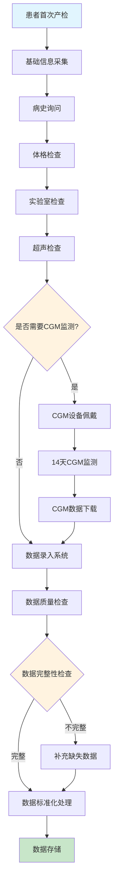
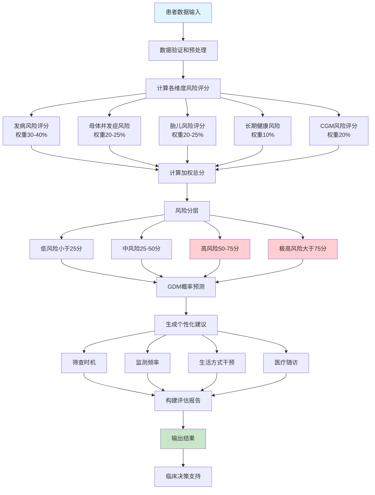
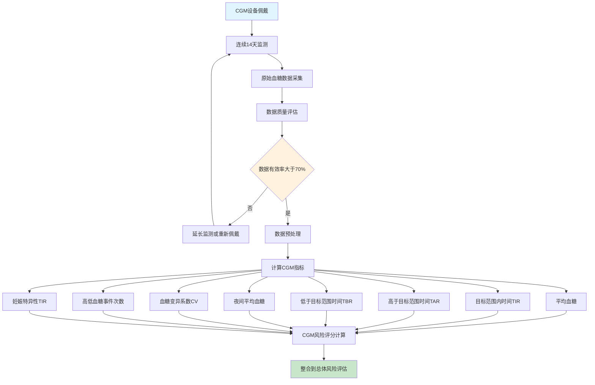
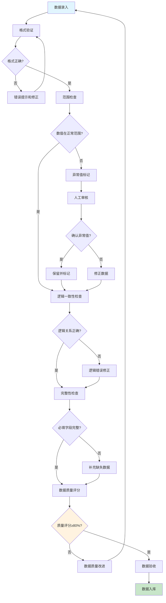
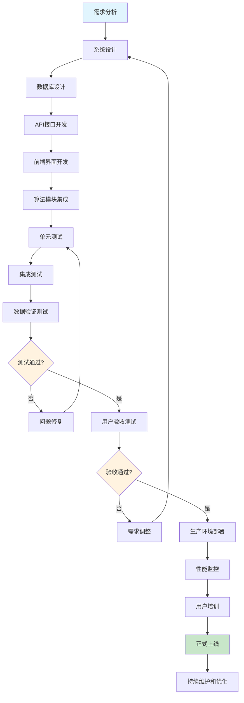
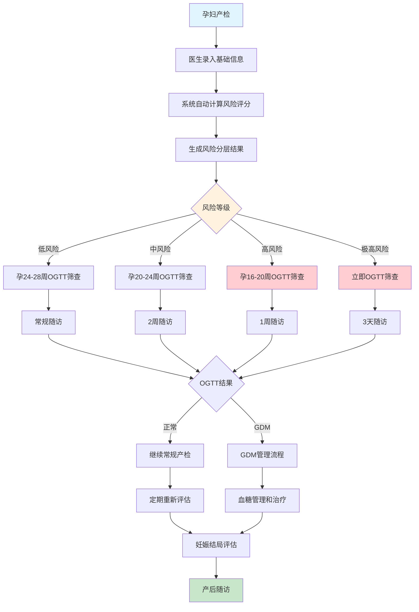
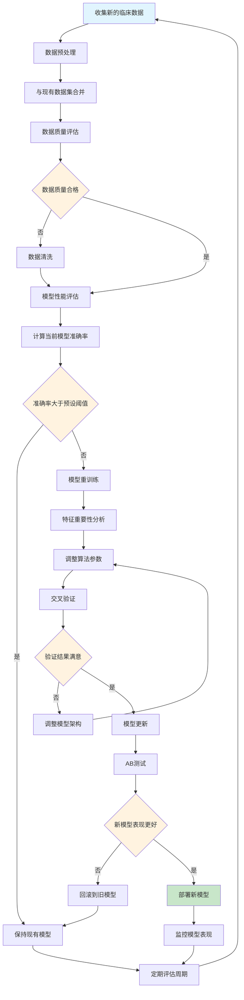

# GDM风险评估工具数据收集与分析流程

## 1. 数据收集流程

## 2. 风险评估算法流程

## 3. CGM数据处理流程

## 4. 数据质量控制流程

## 5. 系统集成与部署流程

## 6. 临床应用流程

## 7. 数据更新与模型优化流程

## 数据收集关键要点

### 必需的患者数据类别：
1. **基础信息**: 年龄、孕周、种族、教育程度
2. **体格测量**: 身高、孕前体重、腰围
3. **病史信息**: 既往GDM史、家族糖尿病史、PCOS等
4. **实验室检查**: 血糖、HbA1c、血脂、炎症指标
5. **CGM数据**: TIR、TAR、平均血糖、血糖变异性
6. **生活方式**: 运动、饮食、吸烟史

### 数据质量要求：
- **完整性**: 核心字段完整率≥95%
- **准确性**: 数值范围验证和逻辑检查
- **一致性**: 多次测量数据的一致性
- **时效性**: 数据采集时间窗口控制

### 系统集成考虑：
- **HIS系统对接**: 自动获取实验室数据
- **CGM设备集成**: 自动下载监测数据
- **决策支持**: 实时风险评估和建议生成
- **数据安全**: 患者隐私保护和数据加密