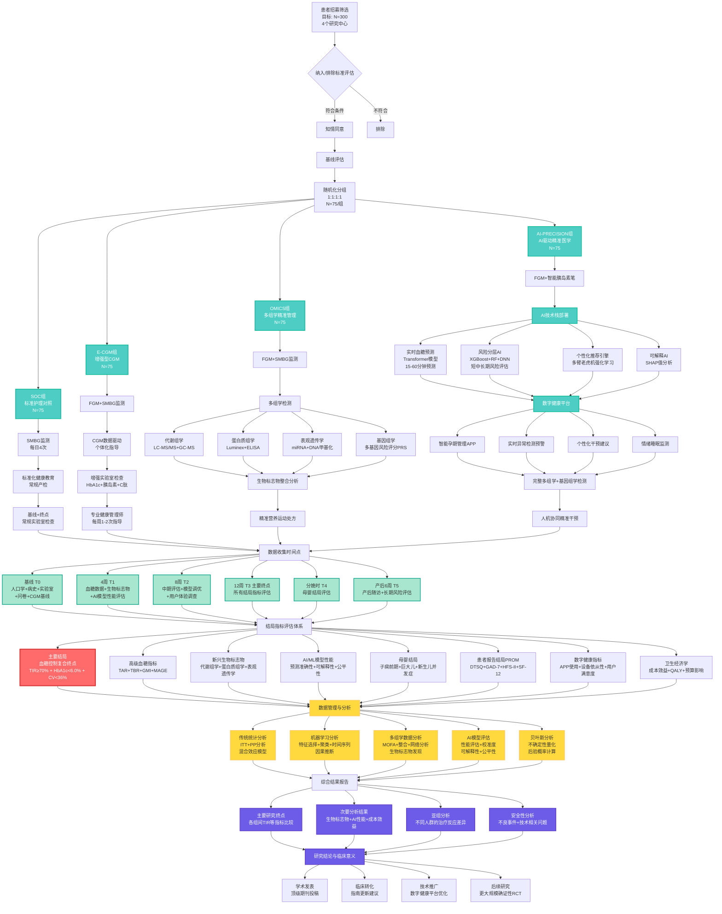

# PRECISION-GDM研究流程图

基于多组学生物标志物与AI驱动精准医学的妊娠期糖尿病(GDM)个体化管理效果评估研究流程

## 流程图说明

### 🎯 **研究设计特点**
- **多中心**: 4个研究中心协作
- **四臂设计**: SOC → E-CGM → OMICS → AI-PRECISION
- **样本量**: 总计300例，每组75例
- **研究周期**: 12周干预期 + 产后随访

### 🔬 **核心技术栈**
1. **AI/ML技术**
   - Transformer血糖预测模型
   - 集成学习风险分层
   - 强化学习个性化推荐
   - SHAP可解释性分析

2. **多组学检测**
   - 代谢组学：LC-MS/MS + GC-MS
   - 蛋白质组学：Luminex + ELISA
   - 表观遗传学：miRNA + DNA甲基化
   - 基因组学：多基因风险评分

3. **数字健康平台**
   - FGM连续血糖监测
   - 智能胰岛素笔
   - AI驱动的孕期管理APP
   - 实时预警系统

### 📊 **结局评估体系**
- **主要结局**: 血糖控制复合终点（TIR+HbA1c+CV）
- **次要结局**: 7大类指标体系
- **时间节点**: 6个关键评估时点（T0-T5）

### 📈 **数据分析策略**
- 传统统计学方法
- 机器学习分析
- 多组学数据整合
- AI模型性能评估
- 贝叶斯不确定性量化

### 🎯 **预期成果**
- 顶级期刊学术发表
- 临床指南更新建议
- 数字健康技术推广
- 大规模确证性研究基础