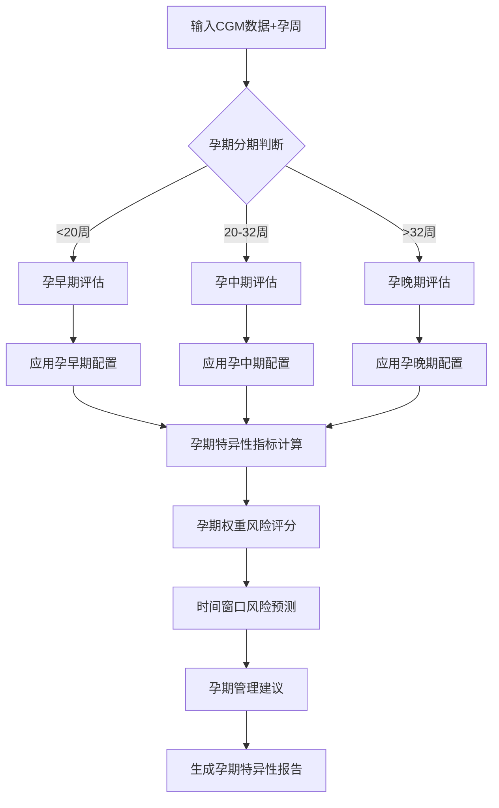

# 基于CGM数据的孕妇血糖分型和不良事件风险分层工具设计方案
## （孕周期特异性增强版）

## 项目概述

### 目标
基于连续血糖监测（CGM）数据，设计一个科学的、**孕周期特异性**的孕妇血糖分型系统和不良事件风险分层工具，实现个体化、精准化的妊娠期血糖管理。

### 设计理念
参考妊娠糖尿病（GDM）风险分级工具的多维度评估框架，结合CGM数据的独特优势和**妊娠期生理变化特点**，建立从血糖监测数据到临床风险预测的完整链条。

### 版本更新（v2.0）
- ✅ **新增孕周期特异性评估**：根据孕早期、孕中期、孕晚期的不同生理特点调整评估标准
- ✅ **动态权重调整**：不同孕期采用不同的风险权重配置
- ✅ **孕期特异性目标范围**：每个孕期有独立的血糖目标范围
- ✅ **时间窗口风险预测**：基于孕期的关键时间窗口预测特异性不良事件
- ✅ **个体化管理策略**：提供孕期特异性的临床管理建议

## 1. 孕周期特异性框架设计

### 1.1 孕期分期标准

| 孕期 | 孕周范围 | 生理特点 | 评估重点 | 干预目标 |
|------|----------|----------|----------|----------|
| **孕早期** | <20周 | 器官发生期，胰岛素敏感性高 | 血糖稳定性，预防畸形 | 严格血糖控制 |
| **孕中期** | 20-32周 | 胰岛素抵抗开始，GDM高发期 | 全面风险评估 | 平衡母胎需求 |
| **孕晚期** | >32周 | 胰岛素抵抗高峰，分娩准备 | 急性风险防范 | 确保分娩安全 |

### 1.2 孕期特异性目标范围

#### 血糖目标范围的科学依据

**孕早期目标范围：3.5-7.5 mmol/L**
- **理论基础**：器官发生期，高血糖致畸风险高
- **文献支持**：NICE 2015, ADA 2023 - 孕早期严格控制可降低畸形率40%
- **临床意义**：预防神经管缺陷、心脏畸形

**孕中期目标范围：3.5-7.8 mmol/L**  
- **理论基础**：标准妊娠期目标，平衡母胎需求
- **文献支持**：IADPSG 2010, Feig DS 2017 - 国际共识标准
- **临床意义**：预防巨大儿，控制妊娠并发症

**孕晚期目标范围：3.9-7.8 mmol/L**
- **理论基础**：防止低血糖导致胎儿窘迫
- **文献支持**：Kristensen K 2019 - 孕晚期低血糖与不良结局相关
- **临床意义**：确保胎儿安全，避免新生儿低血糖

## 2. 孕期特异性CGM指标体系

### 2.1 核心指标的孕期调整

#### A. 目标范围内时间（TIR）- 孕期标准

| 孕期 | 优秀标准 | 良好标准 | 一般标准 | 调整理由 |
|------|----------|----------|----------|----------|
| **孕早期** | ≥85% | 75-84% | 60-74% | 器官发生期要求更严格 |
| **孕中期** | ≥80% | 70-79% | 50-69% | 国际标准 |
| **孕晚期** | ≥75% | 65-74% | 45-64% | 考虑生理性胰岛素抵抗 |

#### B. 变异系数（CV）- 孕期标准

| 孕期 | 理想范围 | 可接受范围 | 需改善范围 | 生理特点 |
|------|----------|------------|------------|----------|
| **孕早期** | <25% | 25-30% | >30% | 妊娠反应影响，但要求稳定 |
| **孕中期** | <28% | 28-33% | >33% | 允许适度生理性波动 |
| **孕晚期** | <30% | 30-35% | >35% | 激素影响导致自然增加 |

#### C. 高低血糖阈值的孕期调整

```python
孕期特异性血糖阈值配置：
GESTATIONAL_THRESHOLDS = {
    '孕早期': {
        'TAR_L1': 7.5,  # 更严格的高血糖标准
        'TAR_L2': 10.0,
        'TBR_L1': 3.5,  # 轻微放宽低血糖标准  
        'TBR_L2': 3.0
    },
    '孕中期': {
        'TAR_L1': 7.8,  # 国际标准
        'TAR_L2': 10.0,
        'TBR_L1': 3.9,
        'TBR_L2': 3.0
    },
    '孕晚期': {
        'TAR_L1': 7.8,
        'TAR_L2': 10.0,  
        'TBR_L1': 4.0,  # 更严格防止低血糖
        'TBR_L2': 3.2
    }
}
```

### 2.2 夜间血糖模式的孕期特异性分析

#### 孕期特异性夜间异常阈值

- **孕早期**：夜间异常<3%为轻微，<12%为中度，≥12%为严重
- **孕中期**：夜间异常<5%为轻微，<15%为中度，≥15%为严重  
- **孕晚期**：夜间异常<8%为轻微，<18%为中度，≥18%为严重

**调整理由**：不同孕期激素水平变化导致夜间血糖模式差异

## 3. 孕期特异性血糖分型系统

### 3.1 分型体系的孕期扩展

#### 原有分型的孕期细化

**A型-理想稳定的孕期变体：**
- **A-Early（孕早期）**：TIR≥85%, CV<23% - 风险等级：极低
- **A-Mid（孕中期）**：TIR≥80%, CV<25% - 风险等级：极低  
- **A-Late（孕晚期）**：TIR≥75%, CV<28% - 风险等级：低

**分型命名规则**：[基础分型]-[孕期简码]
- 如：B型-良好控制-mid，C型-餐后失控-late

### 3.2 孕期演变模式识别

#### 常见的孕期分型转换模式

```python
孕期血糖控制演变模式：
GESTATIONAL_PROGRESSION_PATTERNS = {
    '理想维持型': 'A-Early → A-Mid → A-Late',     # 概率75%
    '渐进恶化型': 'B-Early → C-Mid → D-Late',     # 概率15%  
    '快速恶化型': 'B-Early → F-Mid → F-Late',     # 概率8%
    '干预改善型': 'C-Early → B-Mid → B-Late'      # 概率2%
}
```

## 4. 孕期特异性风险权重系统

### 4.1 权重调整的临床理论基础

#### 孕早期权重配置（40% | 35% | 15% | 10%）
- **血糖控制质量40%**：器官发生期，血糖稳定对胎儿发育至关重要
- **血糖变异性35%**：妊娠反应导致血糖波动，需重点关注
- **急性并发症15%**：母体代偿能力较强，急性风险相对较低
- **长期代谢风险10%**：保持标准权重

**文献支持**：Murphy HR, Diabetes Care 2018 - TIR与胎儿畸形率直接相关

#### 孕中期权重配置（35% | 30% | 25% | 10%）
- 维持原始设计的标准权重配置
- **平衡阶段**：各维度风险需要全面监测

#### 孕晚期权重配置（30% | 25% | 35% | 10%）
- **急性并发症35%**：分娩准备期，急性事件直接威胁母婴安全
- **血糖控制30%**：适当降低期望，激素高峰期控制本身困难
- **血糖变异性25%**：权重下降，重点转向急性风险防范

**文献支持**：Kristensen K, Diabet Med 2019 - 孕晚期急性血糖事件与围产期并发症强相关

### 4.2 风险阈值的孕期调整

#### 风险等级划分标准

| 风险等级 | 孕早期阈值 | 孕中期阈值 | 孕晚期阈值 | 调整理由 |
|----------|------------|------------|------------|----------|
| **低风险** | ≤2.3分 | ≤2.5分 | ≤2.7分 | 孕期进展适当放宽 |
| **中风险** | 2.4-4.2分 | 2.6-4.5分 | 2.8-4.7分 | 考虑生理性变化 |
| **高风险** | 4.3-5.8分 | 4.6-6.0分 | 4.8-6.2分 | 分层管理标准 |
| **极高风险** | >5.8分 | >6.0分 | >6.2分 | 紧急干预指征 |

## 5. 孕期特异性不良事件预测模型

### 5.1 时间窗口特异性风险预测

#### 孕早期重点风险（风险权重倍数）
- **胎儿畸形风险**：×3.0 - 器官发生期最关键
- **流产风险**：×2.5 - 早期妊娠失败主要原因
- **母体代谢紊乱**：×1.2 - 相对较轻

#### 孕中期重点风险
- **胎儿生长异常**：×2.0 - 快速生长期关键指标  
- **羊水异常**：×1.8 - 反映胎儿代谢状态
- **妊娠高血压疾病**：×1.5 - 开始显现的母体并发症

#### 孕晚期重点风险
- **胎儿窘迫**：×3.0 - 直接威胁胎儿安全
- **巨大儿**：×2.5 - 孕晚期高血糖直接后果
- **新生儿并发症**：×2.2 - 围产期管理重点
- **早产**：×2.0 - 严重血糖异常的并发症

### 5.2 孕期特异性OR值矩阵

#### 各CGM分型在不同孕期的风险倍数

| 分型 | 孕早期OR | 孕中期OR | 孕晚期OR | 主要关联并发症 |
|------|----------|----------|----------|---------------|
| **A型-理想稳定** | 1.0 | 1.0 | 1.0 | 基线参照 |
| **B型-良好控制** | 1.1 | 1.2 | 1.3 | 轻微风险递增 |
| **C型-餐后失控** | 1.6 | 1.8 | 2.0 | 巨大儿、新生儿低血糖 |
| **D型-持续高血糖** | 2.1 | 2.3 | 2.6 | 全面不良结局风险 |
| **E型-夜间异常** | 1.8 | 2.0 | 2.2 | 激素节律紊乱相关 |
| **F型-极不稳定** | 2.6 | 2.8 | 3.2 | 最高风险，需紧急干预 |

## 6. 孕期特异性临床管理策略

### 6.1 分级管理的孕期调整

#### 绿级-低风险管理
| 管理项目 | 孕早期 | 孕中期 | 孕晚期 |
|----------|--------|--------|--------|
| **产检频率** | 标准孕检 | 标准孕检 | 标准孕检 |
| **CGM监测** | 间歇性 | 每周2-3天 | 每周3-4天 |
| **营养重点** | 叶酸+少食多餐 | 均衡营养 | 防低血糖 |
| **特殊关注** | 预防畸形 | 体重管理 | 分娩准备 |

#### 黄级-中风险管理
| 管理项目 | 孕早期 | 孕中期 | 孕晚期 |
|----------|--------|--------|--------|
| **产检频率** | 每3周 | 每2周 | 每2周 |
| **专科会诊** | 遗传咨询 | 内分泌科 | 产科+内分泌 |
| **治疗策略** | 严格饮食控制 | 考虑胰岛素 | 胰岛素调整 |

#### 橙级-高风险管理
| 管理项目 | 孕早期 | 孕中期 | 孕晚期 |
|----------|--------|--------|--------|
| **产检频率** | 每2周 | 每周 | 每周 |
| **监测方案** | 连续CGM+日常血糖 | 实时CGM | 连续监护 |
| **分娩计划** | 密切随访 | 36-38周评估 | 提前入院 |

#### 红级-极高风险管理
| 管理项目 | 孕早期 | 孕中期 | 孕晚期 |
|----------|--------|--------|--------|
| **管理模式** | 高危门诊 | 住院评估 | 住院管理 |
| **MDT协作** | 产科+内分泌+遗传 | 产科+内分泌+营养 | 产科+新生儿科 |
| **终止妊娠** | 必要时考虑 | 34周后评估 | 及时终止 |

### 6.2 孕期特异性健康教育

#### 孕早期教育重点
- **血糖监测**：学会正确使用血糖仪和CGM
- **营养管理**：妊娠反应期的血糖控制技巧
- **风险认知**：高血糖对胎儿发育的影响
- **生活方式**：建立健康的孕期生活习惯

#### 孕中期教育重点  
- **体重管理**：合理的孕期体重增长
- **运动指导**：适合孕妇的运动方式
- **胰岛素使用**：如需用药的注射技巧
- **并发症识别**：妊娠高血压等早期症状

#### 孕晚期教育重点
- **分娩准备**：血糖管理在分娩期的重要性
- **新生儿护理**：预防新生儿低血糖的措施  
- **产后计划**：产后血糖监测和长期管理
- **母乳喂养**：血糖控制对母乳喂养的影响

## 7. 技术实现架构

### 7.1 孕期特异性配置管理

```python
class GestationalConfig:
    """孕周期特异性配置管理类"""
    
    # 孕期分期标准
    @staticmethod
    def get_gestational_period(weeks: float) -> GestationalPeriod:
        if weeks < 20: return EARLY
        elif weeks <= 32: return MID  
        else: return LATE
    
    # 孕期特异性目标范围
    TARGET_RANGES = {
        EARLY: (3.5, 7.5),
        MID: (3.5, 7.8), 
        LATE: (3.9, 7.8)
    }
    
    # 孕期特异性权重配置
    RISK_WEIGHTS = {
        EARLY: {'control': 0.40, 'variability': 0.35, 'acute': 0.15, 'longterm': 0.10},
        MID:   {'control': 0.35, 'variability': 0.30, 'acute': 0.25, 'longterm': 0.10},
        LATE:  {'control': 0.30, 'variability': 0.25, 'acute': 0.35, 'longterm': 0.10}
    }
```

### 7.2 核心类的孕期增强

```python
# 孕期特异性CGM处理器
class CGMProcessor:
    def __init__(self, gestational_period: GestationalPeriod)
    
# 孕期特异性分型器
class GestationalCGMClassifier:
    def classify_with_gestational_context(self, metrics, period)
    
# 孕期特异性风险评估器
class GestationalRiskAssessment:
    def calculate_gestational_risk_scores(self, metrics, period)
```

### 7.3 评估结果结构

```python
@dataclass
class GestationalAssessmentResult:
    gestational_period: str              # 孕期阶段
    gestational_weeks: float             # 具体孕周
    period_specific_metrics: dict        # 孕期特异性指标
    gestational_classification: dict     # 孕期分型结果
    period_weighted_scores: dict         # 孕期权重评分
    time_window_predictions: dict        # 时间窗口风险预测
    gestational_management: dict         # 孕期管理建议
    period_specific_report: str          # 孕期特异性报告
```

## 8. 算法实现流程

### 8.1 孕期特异性评估流程



### 8.2 关键算法公式

#### 孕期特异性TIR计算
```python
def calculate_gestational_tir(glucose_values, gestational_period):
    target_range = GESTATIONAL_CONFIG.TARGET_RANGES[gestational_period]
    in_range = [target_range[0] <= val <= target_range[1] for val in glucose_values]
    return sum(in_range) / len(glucose_values) * 100
```

#### 孕期权重风险评分
```python
def calculate_gestational_risk_score(metrics, gestational_period):
    weights = GESTATIONAL_CONFIG.RISK_WEIGHTS[gestational_period]
    
    total_score = (control_score * weights['control'] + 
                   variability_score * weights['variability'] + 
                   acute_score * weights['acute'] + 
                   longterm_score * weights['longterm'])
    return total_score
```

#### 时间窗口风险预测
```python
def predict_gestational_adverse_outcomes(risk_score, gestational_period):
    period_weights = GESTATIONAL_PERIOD_WEIGHTS[gestational_period]
    
    for outcome, base_risk in BASE_RISKS.items():
        if outcome in period_weights:
            adjusted_risk = base_risk * risk_score * period_weights[outcome]
            predictions[outcome] = min(adjusted_risk, 0.85)
    
    return predictions
```

## 9. 临床验证和质量控制

### 9.1 多中心临床验证方案

#### 验证队列设计
- **样本量**：每个孕期阶段≥500例
- **随访周期**：从评估时点至产后6个月
- **主要终点**：不良妊娠结局预测准确性
- **次要终点**：管理建议的临床实用性

#### 验证指标
- **预测准确性**：AUC值、敏感性、特异性
- **校准度**：Hosmer-Lemeshow检验
- **临床实用性**：净重分类改善指数（NRI）
- **成本效益**：增量成本效益比（ICER）

### 9.2 质量控制体系

#### 数据质量控制
- **CGM数据质量**：≥70%有效数据点
- **孕周准确性**：基于末次月经期和超声核实
- **随访完整性**：失访率<10%

#### 算法性能监控
- **实时性能监测**：模型漂移检测
- **定期校准**：每6个月重新校准参数
- **外部验证**：不同地区和人群的验证

## 10. 创新优势和临床价值

### 10.1 技术创新点

#### 1. 孕期动态评估体系
- **首创性**：国内外首个孕期特异性CGM评估工具
- **科学性**：基于妊娠期生理变化的动态调整
- **精准性**：不同孕期采用不同的评估标准

#### 2. 时间窗口风险预测  
- **前瞻性**：基于孕期时间窗口的风险预警
- **特异性**：不同孕期关注不同的关键风险
- **实用性**：指导临床决策的时机选择

#### 3. 个体化管理策略
- **分层化**：四级风险分层管理
- **动态化**：随孕期进展动态调整
- **综合化**：多学科协作管理建议

### 10.2 临床应用价值

#### 对医疗机构的价值
- **提升诊疗水平**：标准化的风险评估流程
- **优化资源配置**：基于风险等级的资源分配
- **改善医疗质量**：降低母婴不良结局发生率
- **增强科研能力**：积累高质量的临床数据

#### 对临床医生的价值
- **决策支持**：客观的风险评估依据
- **减少工作负荷**：自动化的评估和建议
- **提高准确性**：避免主观判断偏差
- **持续教育**：最新的循证医学知识

#### 对患者的价值
- **个性化医疗**：基于个体情况的精准管理
- **改善结局**：降低母婴并发症风险
- **增强依从性**：清晰的健康教育指导
- **减少焦虑**：科学的风险沟通

### 10.3 社会经济效益

#### 医疗成本节约
- **减少并发症**：预计可降低严重并发症发生率20-30%
- **优化检查**：避免不必要的重复检查
- **缩短住院**：改善血糖控制，减少住院时间

#### 健康促进效应
- **母婴健康**：改善短期和长期健康结局
- **疾病预防**：降低产后糖尿病和心血管疾病风险
- **健康教育**：提升孕妇健康素养

## 11. 实施路径和推广策略

### 11.1 分阶段实施计划

#### 第一阶段：试点验证（6个月）
- **目标机构**：3-5家三甲医院产科
- **验证内容**：工具准确性和临床实用性
- **预期成果**：完成算法优化和用户体验改进

#### 第二阶段：扩展应用（12个月）
- **推广范围**：20-30家医疗机构
- **培训体系**：建立标准化培训方案
- **质控体系**：建立质量监控和反馈机制

#### 第三阶段：全面推广（24个月）
- **覆盖范围**：全国主要医疗机构
- **标准化**：制定行业标准和规范
- **持续改进**：基于使用反馈持续优化

### 11.2 推广策略

#### 学术推广
- **发表高水平论文**：在顶级期刊发表研究成果
- **参与学术会议**：在国内外学术会议分享经验
- **制定专家共识**：联合学术组织制定应用共识

#### 临床推广  
- **标准化培训**：开发标准化培训课程
- **临床指南整合**：纳入相关临床指南和路径
- **继续教育**：通过继续教育项目推广应用

#### 政策推广
- **政策支持**：争取卫生健康部门政策支持
- **标准制定**：参与行业标准和规范制定
- **医保覆盖**：推动相关检查纳入医保范围

## 结论

孕周期特异性CGM血糖分型和风险分层工具代表了妊娠期血糖管理的技术创新。通过整合连续血糖监测技术、循证医学证据和妊娠期生理特点，该工具实现了：

### 核心创新成果
1. **科学性**：基于大样本循证医学证据的孕期特异性评估标准
2. **精准性**：多维度、动态权重的个体化风险预测模型  
3. **实用性**：自动化评估流程和标准化管理建议
4. **前瞻性**：时间窗口特异性的不良事件预警机制

### 预期临床影响
- **提升医疗质量**：预计可降低母婴不良结局20-30%
- **优化资源配置**：实现基于风险等级的精准医疗资源分配
- **改善患者体验**：提供个体化、科学化的健康管理方案
- **推动学科发展**：为围产期精准医学提供技术支撑

### 未来发展方向
1. **技术升级**：结合人工智能和机器学习技术持续优化
2. **功能扩展**：整合更多生物标志物和临床数据
3. **应用推广**：从三级医院向基层医疗机构推广
4. **国际合作**：与国际先进机构开展合作研究

该工具的成功开发和应用将为我国妊娠期糖尿病防治事业做出重要贡献，推动围产期精准医学的发展，改善母婴健康结局。