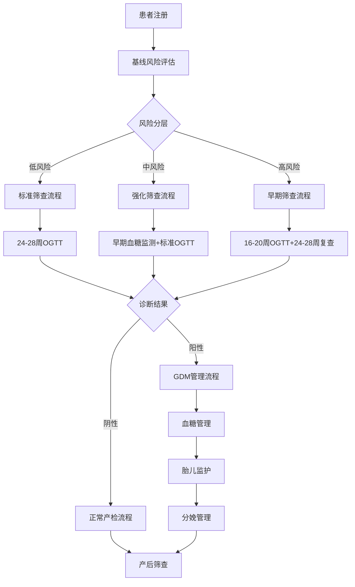

# 妊娠糖尿病(GDM)筛查工作流集成方案

## 概述

本文档详细描述了GDM筛查工作流的系统集成方案，旨在将风险评估、筛查检测、诊断确认和后续管理整合为一个无缝的临床工作流程。该方案支持多种筛查策略，并能根据患者风险等级自动调整筛查时间表和管理策略。

### 系统架构特点
- **智能风险分层**: 自动识别高风险患者并调整筛查策略
- **时间轴管理**: 基于孕周的动态筛查时间表
- **多模态集成**: 整合CGM、OGTT、实验室检测等多种检测手段
- **决策支持**: 提供循证的诊断和治疗建议
- **质量控制**: 全程质量监控和数据验证

## 工作流架构设计

### 核心组件架构



### 数据流架构

```json
{
  "workflow_components": {
    "risk_assessment": {
      "input_sources": [
        "EMR_patient_demographics",
        "laboratory_results",
        "medical_history",
        "family_history",
        "current_pregnancy_data"
      ],
      "processing_engine": "GDM_RiskScoring_Algorithm",
      "output": "risk_stratification_result"
    },
    "screening_scheduler": {
      "input": "risk_stratification_result",
      "processing": "timeline_optimization",
      "output": "personalized_screening_schedule"
    },
    "test_management": {
      "supported_tests": ["OGTT_75g", "FPG", "RPG", "HbA1c", "CGM"],
      "quality_control": "automated_validation",
      "result_interpretation": "evidence_based_criteria"
    },
    "decision_support": {
      "diagnosis_engine": "IADPSG_criteria",
      "treatment_recommendations": "guideline_based",
      "monitoring_protocols": "risk_adjusted"
    }
  }
}
```

## 详细工作流程

### 1. 患者注册与初始评估

#### 1.1 数据收集清单
```yaml
patient_registration:
  demographic_data:
    - age
    - ethnicity
    - socioeconomic_status
    - insurance_information
  
  medical_history:
    - previous_pregnancies
    - gdm_history
    - diabetes_family_history
    - chronic_conditions
    - current_medications
  
  anthropometric:
    - pre_pregnancy_weight
    - height
    - bmi
    - waist_circumference
  
  current_pregnancy:
    - lmp_date
    - edd_date
    - gestational_age
    - multiple_pregnancy
    - conception_method
```

#### 1.2 风险评估触发点
- **首次产检** (6-10周): 基础风险评估
- **孕中期开始** (14周): 风险重新评估
- **筛查前** (根据风险等级): 最终风险确认
- **异常结果后**: 风险重新分层

### 2. 智能筛查策略分配

#### 2.1 低风险组 (风险评分 0-25分)
```python
low_risk_protocol = {
    "screening_schedule": {
        "primary_screening": {
            "timing": "24-28_weeks",
            "test": "75g_OGTT",
            "location": "outpatient_clinic"
        },
        "follow_up": {
            "frequency": "routine_prenatal",
            "additional_tests": ["random_glucose_if_symptoms"]
        }
    },
    "quality_metrics": {
        "screening_compliance": ">95%",
        "false_positive_rate": "<5%"
    }
}
```

#### 2.2 中风险组 (风险评分 26-45分)
```python
moderate_risk_protocol = {
    "screening_schedule": {
        "early_monitoring": {
            "timing": "16-20_weeks",
            "test": "fasting_glucose_hba1c",
            "frequency": "monthly"
        },
        "standard_screening": {
            "timing": "24-28_weeks",
            "test": "75g_OGTT",
            "enhanced_monitoring": True
        }
    },
    "intervention_threshold": {
        "fpg_threshold": "5.1_mmol_L",
        "hba1c_threshold": "5.7_percent"
    }
}
```

#### 2.3 高风险组 (风险评分 46-65分)
```python
high_risk_protocol = {
    "screening_schedule": {
        "early_screening": {
            "timing": "16-20_weeks",
            "test": "75g_OGTT",
            "cgm_consideration": True
        },
        "standard_screening": {
            "timing": "24-28_weeks",
            "test": "75g_OGTT_repeat",
            "intensive_monitoring": True
        }
    },
    "specialist_referral": {
        "endocrinology": "automatic",
        "maternal_fetal_medicine": "if_complications"
    }
}
```

#### 2.4 极高风险组 (风险评分 >65分)
```python
very_high_risk_protocol = {
    "screening_schedule": {
        "immediate_assessment": {
            "timing": "first_visit",
            "test": "comprehensive_glucose_assessment",
            "cgm_initiation": "consider_immediate"
        },
        "frequent_monitoring": {
            "frequency": "biweekly",
            "tests": ["fpg", "ppg", "hba1c_monthly"]
        }
    },
    "multidisciplinary_care": {
        "team_members": ["obstetrician", "endocrinologist", "dietitian", "diabetes_educator"]
    }
}
```

### 3. 检测流程标准化

#### 3.1 75g OGTT标准流程
```yaml
ogtt_protocol:
  preparation:
    fasting_duration: "8-14_hours"
    normal_diet_3days: "150g_carbohydrate_daily"
    medication_restrictions: ["avoid_glucose_affecting_drugs"]
    patient_education: "procedure_explanation"
  
  execution:
    baseline_sample:
      timing: "0_minutes"
      tests: ["plasma_glucose", "hba1c"]
    
    glucose_load:
      amount: "75g_anhydrous_glucose"
      volume: "300ml_water"
      consumption_time: "<5_minutes"
    
    follow_up_samples:
      - timing: "60_minutes"
        test: "plasma_glucose"
      - timing: "120_minutes"
        test: "plasma_glucose"
  
  quality_control:
    glucose_meter_calibration: "daily"
    laboratory_standards: "ISO_15189"
    result_validation: "automated_range_checking"
```

#### 3.2 CGM集成流程
```python
cgm_integration_workflow = {
    "indication_criteria": {
        "high_risk_patients": True,
        "previous_gdm": True,
        "abnormal_glucose_patterns": True,
        "patient_preference": "consider"
    },
    
    "implementation_protocol": {
        "device_selection": "pregnancy_validated_cgm",
        "calibration_schedule": "per_manufacturer_guidelines",
        "monitoring_duration": "minimum_14_days",
        "data_download_frequency": "weekly"
    },
    
    "interpretation_guidelines": {
        "target_ranges": {
            "fasting": "<5.1_mmol_L",
            "1h_postprandial": "<10.0_mmol_L",
            "2h_postprandial": "<8.5_mmol_L"
        },
        "pattern_analysis": "automated_algorithm",
        "alert_thresholds": "customizable_by_risk_level"
    }
}
```

### 4. 诊断决策支持系统

#### 4.1 IADPSG诊断标准实现
```python
class GDM_DiagnosticCriteria:
    def __init__(self):
        self.iadpsg_thresholds = {
            'fasting': 5.1,      # mmol/L
            '1_hour': 10.0,      # mmol/L
            '2_hour': 8.5        # mmol/L
        }
    
    def diagnose_gdm(self, ogtt_results):
        """
        GDM诊断算法 - 满足任一条件即诊断
        """
        diagnosis = {
            'gdm_positive': False,
            'criteria_met': [],
            'recommendations': []
        }
        
        # 检查各时间点血糖值
        for timepoint, threshold in self.iadpsg_thresholds.items():
            if ogtt_results.get(timepoint, 0) >= threshold:
                diagnosis['gdm_positive'] = True
                diagnosis['criteria_met'].append(f"{timepoint}_glucose")
        
        # 生成相应建议
        if diagnosis['gdm_positive']:
            diagnosis['recommendations'] = [
                "确诊妊娠糖尿病",
                "立即启动血糖管理",
                "营养师会诊",
                "制定个体化治疗方案",
                "安排内分泌科随访"
            ]
        else:
            diagnosis['recommendations'] = [
                "当前OGTT结果正常",
                "继续规律产检",
                "维持健康生活方式",
                "如有症状及时复查"
            ]
        
        return diagnosis
```

#### 4.2 边界值处理策略
```python
borderline_management = {
    "glucose_levels": {
        "fasting_borderline": {
            "range": "4.8-5.0_mmol_L",
            "action": "enhanced_monitoring",
            "follow_up": "monthly_glucose_checks"
        },
        "postprandial_elevated": {
            "range": "7.8-8.4_mmol_L_2h",
            "action": "lifestyle_intervention",
            "follow_up": "repeat_ogtt_if_risk_factors"
        }
    },
    
    "clinical_judgment_factors": [
        "strong_family_history",
        "previous_macrosomia",
        "rapid_weight_gain",
        "polyhydramnios",
        "fetal_macrosomia_ultrasound"
    ]
}
```

### 5. 治疗管理工作流

#### 5.1 血糖管理分级
```yaml
glucose_management_tiers:
  tier_1_lifestyle:
    duration: "2_weeks_trial"
    components:
      - nutritional_counseling
      - exercise_prescription
      - glucose_self_monitoring
    success_criteria:
      fasting: "<5.1_mmol_L"
      postprandial: "<7.8_mmol_L"
  
  tier_2_medication:
    indication: "lifestyle_failure_or_severe_hyperglycemia"
    first_line: "insulin_therapy"
    monitoring: "intensive_glucose_monitoring"
    titration: "weekly_dose_adjustment"
  
  tier_3_specialized:
    indication: "refractory_hyperglycemia"
    interventions:
      - mfm_consultation
      - cgm_implementation
      - multidisciplinary_team_care
      - consider_delivery_timing
```

#### 5.2 胎儿监护集成
```python
fetal_surveillance_integration = {
    "ultrasound_schedule": {
        "growth_assessment": {
            "frequency": "every_4_weeks_after_diagnosis",
            "parameters": ["EFW", "AC", "AFI", "umbilical_doppler"]
        },
        "anomaly_screening": {
            "timing": "20-24_weeks",
            "enhanced_focus": ["cardiac_defects", "neural_tube_defects"]
        }
    },
    
    "antepartum_testing": {
        "indication": "poor_glucose_control_or_complications",
        "methods": ["NST", "BPP", "AFI"],
        "frequency": "twice_weekly_after_32_weeks"
    },
    
    "delivery_planning": {
        "timing_considerations": [
            "glucose_control_status",
            "fetal_weight_estimate",
            "maternal_complications",
            "cervical_favorability"
        ],
        "mode_considerations": [
            "estimated_fetal_weight_>4500g",
            "previous_shoulder_dystocia",
            "maternal_preference"
        ]
    }
}
```

### 6. 产后随访集成

#### 6.1 产后筛查流程
```python
postpartum_screening_workflow = {
    "immediate_postpartum": {
        "timing": "24-72_hours",
        "assessments": [
            "glucose_level_normalization",
            "insulin_requirement_adjustment",
            "breastfeeding_glucose_impact"
        ]
    },
    
    "early_postpartum": {
        "timing": "6-12_weeks",
        "tests": ["75g_OGTT", "HbA1c"],
        "interpretation": "WHO_diabetes_criteria",
        "follow_up_planning": "based_on_results"
    },
    
    "long_term_follow_up": {
        "annual_screening": {
            "tests": ["FPG", "HbA1c", "or_OGTT"],
            "cardiovascular_risk_assessment": True
        },
        "preconception_counseling": {
            "timing": "when_planning_next_pregnancy",
            "components": ["risk_assessment", "optimization_strategies"]
        }
    }
}
```

## 系统集成技术实现

### 7. 数据库设计

#### 7.1 核心数据表结构
```sql
-- 患者主表
CREATE TABLE patients (
    patient_id VARCHAR(50) PRIMARY KEY,
    medical_record_number VARCHAR(20) UNIQUE,
    first_name VARCHAR(50),
    last_name VARCHAR(50),
    date_of_birth DATE,
    ethnicity VARCHAR(30),
    created_at TIMESTAMP DEFAULT CURRENT_TIMESTAMP
);

-- 妊娠记录表
CREATE TABLE pregnancies (
    pregnancy_id VARCHAR(50) PRIMARY KEY,
    patient_id VARCHAR(50) REFERENCES patients(patient_id),
    lmp_date DATE,
    edd_date DATE,
    pregnancy_number INTEGER,
    multiple_pregnancy BOOLEAN DEFAULT FALSE,
    conception_method VARCHAR(20),
    pregnancy_status VARCHAR(20) DEFAULT 'active'
);

-- 风险评估表
CREATE TABLE risk_assessments (
    assessment_id VARCHAR(50) PRIMARY KEY,
    pregnancy_id VARCHAR(50) REFERENCES pregnancies(pregnancy_id),
    assessment_date DATE,
    gestational_week INTEGER,
    total_risk_score DECIMAL(5,2),
    risk_level VARCHAR(20),
    risk_factors JSONB,
    recommendations JSONB
);

-- 筛查事件表
CREATE TABLE screening_events (
    event_id VARCHAR(50) PRIMARY KEY,
    pregnancy_id VARCHAR(50) REFERENCES pregnancies(pregnancy_id),
    event_type VARCHAR(50),
    scheduled_date DATE,
    completed_date DATE,
    gestational_week INTEGER,
    test_results JSONB,
    interpretation JSONB,
    status VARCHAR(20) DEFAULT 'scheduled'
);

-- OGTT结果表
CREATE TABLE ogtt_results (
    result_id VARCHAR(50) PRIMARY KEY,
    screening_event_id VARCHAR(50) REFERENCES screening_events(event_id),
    test_date DATE,
    fasting_glucose DECIMAL(4,2),
    glucose_1h DECIMAL(4,2),
    glucose_2h DECIMAL(4,2),
    hba1c DECIMAL(3,1),
    diagnosis_result VARCHAR(20),
    quality_flags JSONB
);

-- CGM数据表
CREATE TABLE cgm_data (
    data_id VARCHAR(50) PRIMARY KEY,
    pregnancy_id VARCHAR(50) REFERENCES pregnancies(pregnancy_id),
    device_serial VARCHAR(50),
    timestamp TIMESTAMP,
    glucose_value DECIMAL(4,2),
    trend_arrow VARCHAR(10),
    data_quality INTEGER,
    notes TEXT
);
```

#### 7.2 工作流状态管理
```sql
-- 工作流状态表
CREATE TABLE workflow_states (
    state_id VARCHAR(50) PRIMARY KEY,
    pregnancy_id VARCHAR(50) REFERENCES pregnancies(pregnancy_id),
    current_stage VARCHAR(50),
    stage_status VARCHAR(20),
    next_action VARCHAR(100),
    due_date DATE,
    priority_level INTEGER,
    automated_reminders BOOLEAN DEFAULT TRUE
);

-- 工作流事件日志
CREATE TABLE workflow_events (
    log_id VARCHAR(50) PRIMARY KEY,
    pregnancy_id VARCHAR(50) REFERENCES pregnancies(pregnancy_id),
    event_type VARCHAR(50),
    event_timestamp TIMESTAMP DEFAULT CURRENT_TIMESTAMP,
    triggered_by VARCHAR(50),
    event_data JSONB,
    system_response JSONB
);
```

### 8. API接口设计

#### 8.1 RESTful API端点
```python
from fastapi import FastAPI, HTTPException
from pydantic import BaseModel
from typing import List, Optional
import datetime

app = FastAPI(title="GDM Screening Workflow API")

# 数据模型
class RiskAssessmentRequest(BaseModel):
    patient_id: str
    gestational_week: int
    risk_factors: dict
    current_test_results: Optional[dict] = None

class ScreeningScheduleResponse(BaseModel):
    patient_id: str
    screening_events: List[dict]
    next_critical_event: Optional[dict]
    risk_level: str

# API端点
@app.post("/api/risk-assessment", response_model=dict)
async def assess_gdm_risk(request: RiskAssessmentRequest):
    """GDM风险评估API"""
    # 调用风险评估算法
    risk_result = gdm_risk_calculator.calculate_risk(request.dict())
    
    # 更新工作流状态
    workflow_manager.update_patient_risk(request.patient_id, risk_result)
    
    return risk_result

@app.get("/api/screening-schedule/{patient_id}", response_model=ScreeningScheduleResponse)
async def get_screening_schedule(patient_id: str):
    """获取个性化筛查时间表"""
    schedule = workflow_manager.get_personalized_schedule(patient_id)
    return schedule

@app.post("/api/ogtt-results")
async def submit_ogtt_results(results: dict):
    """提交OGTT结果"""
    # 验证结果格式
    validated_results = validate_ogtt_results(results)
    
    # 自动诊断
    diagnosis = diagnostic_engine.diagnose_gdm(validated_results)
    
    # 更新工作流
    workflow_manager.process_test_results(results['patient_id'], diagnosis)
    
    return {"status": "processed", "diagnosis": diagnosis}

@app.get("/api/workflow-status/{patient_id}")
async def get_workflow_status(patient_id: str):
    """获取工作流状态"""
    status = workflow_manager.get_current_status(patient_id)
    return status
```

#### 8.2 工作流引擎实现
```python
class GDM_WorkflowEngine:
    """GDM筛查工作流引擎"""
    
    def __init__(self):
        self.state_machine = self._initialize_state_machine()
        self.notification_service = NotificationService()
        self.scheduler = SchedulerService()
    
    def _initialize_state_machine(self):
        """初始化状态机"""
        return {
            'initial_registration': {
                'next_states': ['baseline_assessment'],
                'required_actions': ['collect_demographics', 'medical_history'],
                'timeout_days': 7
            },
            'baseline_assessment': {
                'next_states': ['low_risk_monitoring', 'high_risk_monitoring'],
                'required_actions': ['risk_calculation', 'schedule_generation'],
                'decision_criteria': 'risk_score_threshold'
            },
            'low_risk_monitoring': {
                'next_states': ['standard_screening', 'risk_escalation'],
                'scheduled_events': ['24_week_ogtt'],
                'monitoring_frequency': 'monthly'
            },
            'high_risk_monitoring': {
                'next_states': ['early_screening', 'gdm_management'],
                'scheduled_events': ['16_week_screening', '24_week_screening'],
                'monitoring_frequency': 'biweekly'
            },
            'gdm_management': {
                'next_states': ['postpartum_screening'],
                'required_actions': ['treatment_initiation', 'specialist_referral'],
                'monitoring_frequency': 'weekly'
            }
        }
    
    def process_state_transition(self, patient_id: str, trigger_event: dict):
        """处理状态转换"""
        current_state = self.get_current_state(patient_id)
        
        # 评估转换条件
        if self._can_transition(current_state, trigger_event):
            new_state = self._determine_next_state(current_state, trigger_event)
            
            # 执行状态转换
            self._execute_transition(patient_id, current_state, new_state)
            
            # 触发后续动作
            self._trigger_post_transition_actions(patient_id, new_state)
            
            return {"status": "success", "new_state": new_state}
        else:
            return {"status": "failed", "reason": "transition_conditions_not_met"}
    
    def _trigger_post_transition_actions(self, patient_id: str, new_state: str):
        """触发状态转换后的动作"""
        state_config = self.state_machine[new_state]
        
        # 安排定时事件
        if 'scheduled_events' in state_config:
            for event in state_config['scheduled_events']:
                self.scheduler.schedule_event(patient_id, event)
        
        # 发送通知
        if 'notifications' in state_config:
            for notification in state_config['notifications']:
                self.notification_service.send_notification(patient_id, notification)
        
        # 触发自动化动作
        if 'automated_actions' in state_config:
            for action in state_config['automated_actions']:
                self._execute_automated_action(patient_id, action)
```

### 9. 质量控制与监控

#### 9.1 数据质量控制
```python
class QualityControlManager:
    """质量控制管理器"""
    
    def __init__(self):
        self.validation_rules = self._load_validation_rules()
        self.alert_thresholds = self._load_alert_thresholds()
    
    def validate_ogtt_results(self, results: dict) -> dict:
        """OGTT结果验证"""
        validation_result = {
            'valid': True,
            'warnings': [],
            'errors': [],
            'quality_score': 100
        }
        
        # 生理范围检查
        glucose_ranges = {
            'fasting': (2.5, 15.0),
            '1_hour': (3.0, 25.0),
            '2_hour': (3.0, 20.0)
        }
        
        for timepoint, (min_val, max_val) in glucose_ranges.items():
            value = results.get(f'glucose_{timepoint}')
            if value and (value < min_val or value > max_val):
                validation_result['errors'].append(
                    f"{timepoint}_glucose_out_of_physiological_range"
                )
                validation_result['valid'] = False
        
        # 逻辑一致性检查
        fasting = results.get('glucose_fasting', 0)
        hour_1 = results.get('glucose_1_hour', 0)
        hour_2 = results.get('glucose_2_hour', 0)
        
        if hour_1 < fasting:
            validation_result['warnings'].append("1h_glucose_lower_than_fasting")
            validation_result['quality_score'] -= 10
        
        if hour_2 > hour_1:
            validation_result['warnings'].append("2h_glucose_higher_than_1h")
            validation_result['quality_score'] -= 5
        
        return validation_result
    
    def monitor_screening_compliance(self) -> dict:
        """监控筛查依从性"""
        compliance_metrics = {
            'overall_screening_rate': self._calculate_screening_rate(),
            'high_risk_compliance': self._calculate_high_risk_compliance(),
            'missed_screenings': self._identify_missed_screenings(),
            'delayed_follow_ups': self._identify_delayed_follow_ups()
        }
        
        return compliance_metrics
```

#### 9.2 性能监控
```python
class PerformanceMonitor:
    """性能监控系统"""
    
    def __init__(self):
        self.metrics_collector = MetricsCollector()
        self.dashboard = DashboardService()
    
    def collect_workflow_metrics(self):
        """收集工作流性能指标"""
        metrics = {
            'patient_processing_time': self._measure_processing_times(),
            'screening_turnaround_time': self._measure_screening_turnaround(),
            'diagnostic_accuracy': self._calculate_diagnostic_accuracy(),
            'system_availability': self._measure_system_availability(),
            'user_satisfaction': self._collect_user_feedback()
        }
        
        # 更新仪表板
        self.dashboard.update_metrics(metrics)
        
        # 检查告警阈值
        self._check_alert_conditions(metrics)
        
        return metrics
    
    def generate_quality_report(self, time_period: str) -> dict:
        """生成质量报告"""
        report = {
            'period': time_period,
            'total_patients': self._count_patients_in_period(time_period),
            'screening_compliance_rate': self._calculate_compliance_rate(time_period),
            'diagnostic_accuracy_metrics': self._calculate_accuracy_metrics(time_period),
            'treatment_outcomes': self._analyze_treatment_outcomes(time_period),
            'recommendations': self._generate_improvement_recommendations()
        }
        
        return report
```

## 实施建议

### 10. 部署策略

#### 10.1 阶段性实施计划
```yaml
implementation_phases:
  phase_1_foundation:
    duration: "3_months"
    components:
      - core_database_setup
      - basic_risk_assessment_module
      - ogtt_result_management
    success_criteria:
      - system_stability_99_percent
      - basic_workflow_functionality
  
  phase_2_integration:
    duration: "6_months"
    components:
      - cgm_integration
      - advanced_analytics
      - notification_system
    success_criteria:
      - full_workflow_automation
      - user_satisfaction_80_percent
  
  phase_3_optimization:
    duration: "3_months"
    components:
      - machine_learning_enhancements
      - mobile_app_integration
      - reporting_dashboard
    success_criteria:
      - ai_assisted_decision_making
      - comprehensive_reporting
```

#### 10.2 用户培训计划
```yaml
training_program:
  clinical_staff:
    duration: "2_weeks"
    content:
      - system_navigation
      - workflow_processes
      - quality_control_procedures
      - troubleshooting_guide
  
  administrative_staff:
    duration: "1_week"
    content:
      - patient_registration
      - scheduling_management
      - report_generation
  
  it_support:
    duration: "1_week"
    content:
      - system_administration
      - data_backup_procedures
      - security_protocols
      - performance_monitoring
```

### 11. 质量保证

#### 11.1 验证测试策略
```yaml
testing_strategy:
  unit_testing:
    coverage_target: "90_percent"
    focus_areas:
      - risk_calculation_algorithms
      - diagnostic_criteria_implementation
      - data_validation_functions
  
  integration_testing:
    scenarios:
      - end_to_end_patient_workflow
      - multi_system_data_exchange
      - concurrent_user_testing
  
  user_acceptance_testing:
    participants: "representative_clinical_staff"
    scenarios: "real_world_patient_cases"
    duration: "4_weeks"
```

#### 11.2 持续改进机制
```yaml
continuous_improvement:
  performance_monitoring:
    frequency: "daily"
    metrics: ["response_time", "error_rate", "user_activity"]
  
  clinical_outcome_tracking:
    frequency: "monthly"
    metrics: ["screening_compliance", "diagnostic_accuracy", "patient_outcomes"]
  
  user_feedback_collection:
    frequency: "quarterly"
    methods: ["surveys", "focus_groups", "usage_analytics"]
  
  system_updates:
    frequency: "monthly_minor_quarterly_major"
    process: "automated_testing_staged_deployment"
```

## 结论

本GDM筛查工作流集成方案提供了一个全面、可扩展的解决方案，能够：

1. **提高筛查效率**: 通过自动化风险评估和智能调度
2. **改善诊断质量**: 基于循证标准的决策支持
3. **优化患者体验**: 个性化的筛查时间表和及时反馈
4. **支持临床决策**: 实时的数据分析和治疗建议
5. **保证质量控制**: 全程监控和持续改进机制

该方案的成功实施将显著提升GDM筛查和管理的质量，改善母婴健康结局。