# 胰岛素泵闭环控制Agent (Loop Agent) 设计文档

## ⚠️ 重要安全声明

**本文档仅用于研究和设计参考，不得直接用于临床应用。**

- 本设计文档描述的系统涉及医疗器械，必须在获得相应监管机构批准后才能用于人体
- 任何基于本文档的实际开发都必须遵循相关医疗器械法规和临床试验规范
- 开发者和使用者需承担相应的法律责任和医疗风险
- 建议在专业医疗机构和医生指导下进行相关研究和开发

## 1. 系统概述

### 1.1 核心目标与设计原则

**Loop Agent** 是一个旨在模拟或辅助实现自动化胰岛素输注的智能决策系统。其核心目标是通过实时分析连续血糖监测（CGM）数据和患者行为，自主计算并向胰岛素泵下达指令，以实现血糖水平的平稳控制，最大化目标范围内时间（TIR），并最小化高血糖和低血糖风险。

**核心设计原则**：

1.  **安全第一 (Safety First)**: 系统的任何决策都不能将患者置于危险之中。所有算法和操作都必须以防止严重低血糖为首要目标。
2.  **可靠可信 (Reliable & Trustworthy)**: 系统必须具备高稳定性和可预测性，其行为和决策应可解释、可追溯。
3.  **高度个性化 (Highly Personalized)**: 每个糖尿病患者的生理参数都不同，系统必须能够基于个体数据进行学习和自适应调整。
4.  **用户中心 (User-Centric)**: 系统应作为患者的得力助手，而非取代其自主权。用户应始终拥有最终控制权，能够随时干预或中止系统的自动操作。

### 1.2 系统边界

Loop Agent是连接CGM和胰岛素泵的“大脑”，其本身不包含硬件。

-   **系统内 (In-Scope)**:
    -   数据接收与状态估计
    -   血糖预测算法
    -   胰岛素输注决策算法
    -   安全监控与保护层
    -   与外部设备的指令接口

-   **系统外 (Out-of-Scope)**:
    -   CGM传感器硬件
    -   胰岛素泵硬件
    -   用户交互界面（App/设备）
    -   血糖数据可视化

### 1.3 核心架构

以下是系统的整体架构图：

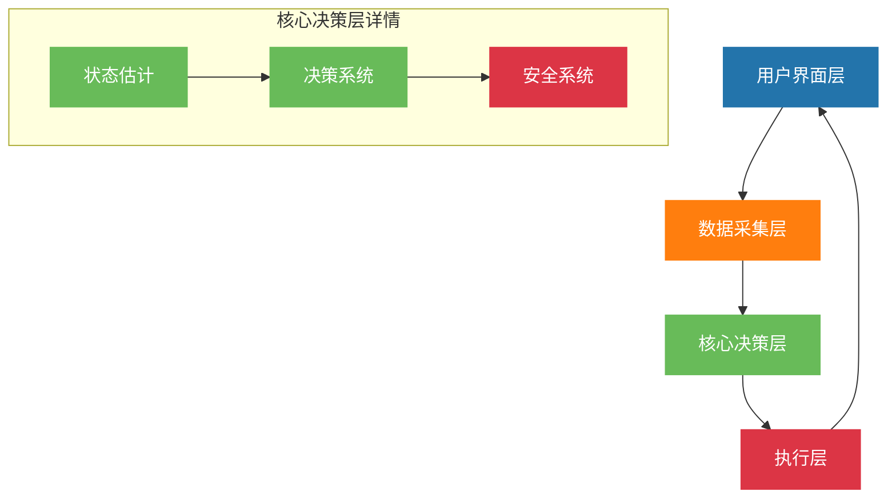

系统主要分为四个主要层级：

1. **用户界面层**
   - 数据显示
   - 用户输入
   - 告警提示

2. **数据采集层**
   - CGM数据流
   - 用户事件
   - 泵状态

3. **核心决策层**
   - 状态估计
     * 血糖预测模型
     * 活性胰岛素(IOB)计算
     * 活性碳水(COB)计算
   - 决策系统
     * 基础率计算
     * 大剂量计算
     * 临时基础率调整
   - 安全系统
     * 约束检查
     * 告警触发
     * 暂停规则

4. **执行层**
   - 指令生成
   - 指令验证
   - 指令执行

### 1.4 详细系统架构分解

以下是Loop Agent的详细分层架构，展示了各组件间的精确交互关系：

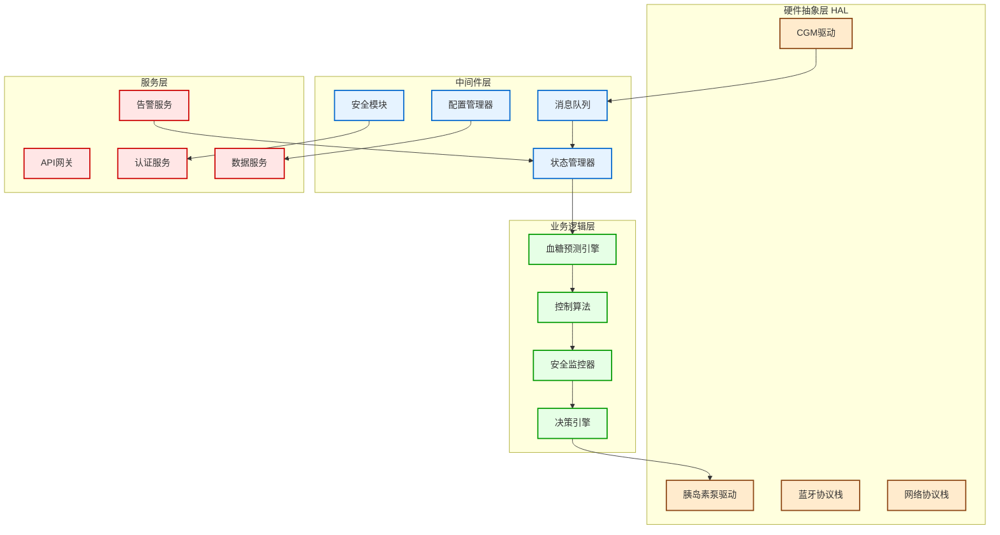

#### 1.4.1 硬件抽象层 (HAL)

**设计目标**：将底层硬件接口抽象化，确保系统可以适配多种CGM和胰岛素泵设备。

**核心组件**：
- **CGM驱动**：标准化血糖数据接收接口
  - 支持设备：Dexcom G6/G7, Abbott FreeStyle Libre, Medtronic Guardian
  - 数据格式：统一的血糖读数结构体
  - 异常处理：传感器失效、通信中断检测

- **胰岛素泵驱动**：标准化胰岛素输注控制接口  
  - 支持设备：Medtronic MiniMed, Omnipod, t:slim X2
  - 指令集：基础率设置、临时基础、大剂量输注
  - 安全机制：指令确认、状态回读、紧急停止

#### 1.4.2 中间件层

**设计目标**：提供系统级服务，确保数据流的可靠性和系统的稳定性。

**消息队列**：
- 实现：Redis Stream + 持久化存储
- 功能：异步处理、消息重试、死信队列
- 性能：支持1000+ msg/sec的血糖数据流

**状态管理器**：
- 模式：基于事件源（Event Sourcing）的状态管理
- 存储：内存状态 + PostgreSQL持久化
- 一致性：ACID事务保证状态一致性

## 2. 核心数据模型

### 2.1 实时循环状态表 (Loop_State)

这是系统最核心的数据结构，实时记录和更新所有决策所需的状态。

```csv
字段名,数据类型,必填,中文说明,更新来源,AI决策用途
glucose_value,DECIMAL_4_1,是,当前血糖值,CGM_Stream,最核心的输入
glucose_timestamp,DATETIME,是,当前血糖时间戳,CGM_Stream,判断数据新鲜度
glucose_trend,TINYINT,是,血糖趋势,"-2:急剧下降; -1:下降; 0:平稳; 1:上升; 2:急剧上升",CGM_Stream,预测血糖变化方向
predicted_glucose,JSON,是,未来血糖预测曲线,"e.g. [{""time"": 5, ""value"": 6.8}, ...]",状态估计算法,控制算法的核心输入
insulin_on_board,DECIMAL_5_2,是,活性胰岛素(IOB),胰岛素模型,计算胰岛素叠加效应，防止过量
carbs_on_board,DECIMAL_5_1,是,活性碳水(COB),碳水模型,估算食物对血糖的后续影响
current_basal_rate,DECIMAL_5_2,是,当前基础率,Pump_Log,计算增量/减量基础
loop_status,TINYINT,是,循环状态,"0:关闭; 1:开环; 2:闭环; 3:低血糖暂停",用户/安全系统,决定系统是否执行自动操作
last_bolus_time,DATETIME,否,上次大剂量时间,User_Event_Log,防止短时内重复大剂量
last_carb_time,DATETIME,否,上次进餐时间,User_Event_Log,用于餐后模式判断
```

### 2.2 用户事件日志表 (User_Event_Log)

用户输入是闭环系统不可或缺的一部分。

```csv
字段名,数据类型,必填,中文说明,数据来源
event_id,VARCHAR_32,是,事件ID,系统生成
event_time,DATETIME,是,事件时间,用户输入
event_type,TINYINT,是,事件类型,"1:进餐; 2:运动; 3:手动输注; 4:其他"
event_details,JSON,是,事件详情,"进餐:{carbs_g:50}, 运动:{duration_min:30, intensity:2}"
```

### 2.3 患者个性化配置表 (Patient_Profile)

存储每个用户的独特治疗参数，是实现个性化治疗的基础。

```csv
字段名,数据类型,必填,中文说明,AI用途
patient_id,VARCHAR_32,是,患者ID,关联用户
insulin_sensitivity_factor,JSON,是,胰岛素敏感系数(ISF),"分时段设置, e.g. [{time:'00:00', value:3.0}]"
carb_ratio,JSON,是,碳水化合物比例(CR),"分时段设置, e.g. [{time:'08:00', value:10}]"
target_glucose_range,JSON,是,目标血糖范围,"e.g. {low: 4.5, high: 7.8}"
max_bolus,DECIMAL_4_1,是,单次最大推注量,安全限制
max_basal_rate,DECIMAL_4_1,是,最大基础率,安全限制
insulin_action_duration,INT,是,胰岛素作用持续时间(小时),IOB模型计算
```

### 2.4 告警日志表 (Alert_Log)

记录系统产生的所有告警事件，用于安全监控和审计追踪。

```csv
字段名,数据类型,必填,中文说明,告警级别,处理要求
alert_id,VARCHAR_32,是,告警ID,所有级别,系统生成UUID
patient_id,VARCHAR_32,是,患者ID,所有级别,关联患者信息
alert_type,TINYINT,是,告警类型,"1:低血糖; 2:高血糖; 3:设备故障; 4:系统异常",所有级别,用于告警分类
alert_level,TINYINT,是,告警级别,"1:信息; 2:警告; 3:严重; 4:危急",所有级别,决定响应优先级
alert_timestamp,DATETIME,是,告警时间戳,所有级别,精确到毫秒
glucose_value,DECIMAL_4_1,否,相关血糖值,血糖告警,触发告警时的血糖值
alert_message,TEXT,是,告警详细信息,所有级别,包含上下文信息
is_acknowledged,BOOLEAN,否,是否已确认,警告及以上,默认false
acknowledged_by,VARCHAR_32,否,确认人员,警告及以上,用户ID或医生ID
acknowledged_time,DATETIME,否,确认时间,警告及以上,用户响应追踪
resolution_status,TINYINT,否,解决状态,"0:未处理; 1:处理中; 2:已解决; 3:已忽略",严重及以上,问题跟踪
```

### 2.5 系统状态日志表 (System_Status_Log)

追踪系统运行状态的所有变化，确保系统行为可追溯。

```csv
字段名,数据类型,必填,中文说明,记录用途
log_id,VARCHAR_32,是,日志ID,唯一标识每条状态记录
patient_id,VARCHAR_32,是,患者ID,关联患者状态变化
event_type,VARCHAR_50,是,事件类型,"LOOP_START, LOOP_STOP, MODE_CHANGE, SAFETY_TRIGGERED",事件分类
old_state,JSON,否,变更前状态,状态对比分析
new_state,JSON,是,变更后状态,当前状态记录
trigger_reason,TEXT,否,触发原因,故障分析和审计
system_version,VARCHAR_20,是,系统版本号,版本追踪
timestamp,DATETIME,是,记录时间戳,时间序列分析
performance_metrics,JSON,否,性能指标,"延迟、内存、CPU等",系统优化参考
```

### 2.6 设备通信日志表 (Device_Communication_Log)

记录与CGM和胰岛素泵的所有通信事件，用于设备连接问题诊断。

```csv
字段名,数据类型,必填,中文说明,通信监控
comm_id,VARCHAR_32,是,通信ID,唯一标识每次通信
patient_id,VARCHAR_32,是,患者ID,关联患者设备
device_type,TINYINT,是,设备类型,"1:CGM; 2:胰岛素泵",设备分类
device_id,VARCHAR_32,是,设备唯一标识,设备管理
communication_type,TINYINT,是,通信类型,"1:数据接收; 2:指令发送; 3:状态查询; 4:配置更新",操作分类
request_data,JSON,否,请求数据,发送内容记录
response_data,JSON,否,响应数据,接收内容记录
communication_status,TINYINT,是,通信状态,"0:成功; 1:超时; 2:失败; 3:重试中",状态跟踪
error_code,VARCHAR_20,否,错误代码,失败原因标识
latency_ms,INT,否,通信延迟(毫秒),性能监控
retry_count,TINYINT,否,重试次数,可靠性统计
timestamp,DATETIME,是,通信时间戳,时序分析
```

### 2.7 算法性能指标表 (Algorithm_Performance_Metrics)

存储算法预测准确性和性能指标，用于模型优化和质量监控。

```csv
字段名,数据类型,必填,中文说明,性能分析
metric_id,VARCHAR_32,是,指标ID,唯一标识
patient_id,VARCHAR_32,是,患者ID,个性化性能跟踪
algorithm_type,VARCHAR_30,是,算法类型,"LSTM_PREDICTOR, MPC_CONTROLLER, SAFETY_MONITOR",算法分类
prediction_horizon,INT,是,预测时长(分钟),"15, 30, 60, 120",时长分析
mae_value,DECIMAL_5_2,否,平均绝对误差,准确性指标
rmse_value,DECIMAL_5_2,否,均方根误差,准确性指标
prediction_accuracy_pct,DECIMAL_5_2,否,预测准确率(%),百分比准确性
computation_time_ms,INT,否,计算耗时(毫秒),性能指标
memory_usage_mb,DECIMAL_7_2,否,内存使用(MB),资源监控
model_version,VARCHAR_20,是,模型版本,版本跟踪
evaluation_timestamp,DATETIME,是,评估时间戳,时间序列
data_quality_score,DECIMAL_3_2,否,数据质量评分,"0.0-1.0",输入质量评估
```

## 5. 数据管理策略

### 5.1 数据备份和恢复策略

#### 5.1.1 分层备份策略

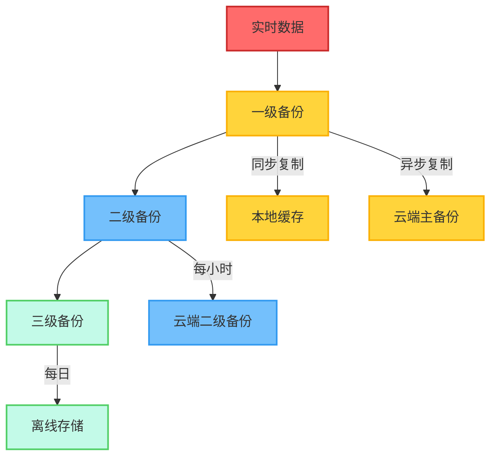

**备份实施策略**：
```python
class DataBackupStrategy:
    def __init__(self):
        self.backup_levels = {
            'critical': {
                'tables': ['Loop_State', 'Alert_Log', 'User_Event_Log'],
                'frequency': 'real_time',
                'retention': '7_years',
                'encryption': 'AES_256'
            },
            'important': {
                'tables': ['System_Status_Log', 'Device_Communication_Log'],
                'frequency': 'hourly', 
                'retention': '2_years',
                'encryption': 'AES_256'
            },
            'analytics': {
                'tables': ['Algorithm_Performance_Metrics'],
                'frequency': 'daily',
                'retention': '5_years', 
                'encryption': 'AES_128'
            }
        }
    
    async def execute_backup(self, level: str):
        """执行指定级别的数据备份"""
        config = self.backup_levels[level]
        
        for table in config['tables']:
            # 1. 数据导出
            data = await self.export_table_data(table)
            
            # 2. 数据加密
            encrypted_data = self.encrypt_data(data, config['encryption'])
            
            # 3. 压缩存储
            compressed_data = self.compress_data(encrypted_data)
            
            # 4. 多地点存储
            await self.store_backup(
                compressed_data, 
                table, 
                level,
                config['retention']
            )
            
    async def disaster_recovery(self, recovery_point_time: str):
        """灾难恢复流程"""
        try:
            # 1. 验证恢复点
            recovery_data = await self.locate_recovery_point(recovery_point_time)
            
            # 2. 数据完整性检查
            if not self.verify_data_integrity(recovery_data):
                raise DataIntegrityError("备份数据完整性验证失败")
            
            # 3. 恢复关键数据
            await self.restore_critical_tables(recovery_data)
            
            # 4. 验证恢复结果
            await self.validate_recovery_success()
            
            return {"status": "success", "recovery_point": recovery_point_time}
            
        except Exception as e:
            # 记录恢复失败日志
            await self.log_recovery_failure(e)
            raise
```

#### 5.1.2 离线容灾机制

```yaml
disaster_recovery_plan:
  # RTO (恢复时间目标)
  recovery_time_objective: 
    critical_functions: < 5min    # 安全监控必须快速恢复
    normal_operations: < 30min    # 正常功能恢复
    full_service: < 2hours        # 完整服务恢复
    
  # RPO (恢复点目标)  
  recovery_point_objective:
    patient_safety_data: 0        # 零数据丢失
    control_decisions: < 1min     # 最多丢失1分钟决策
    analytics_data: < 1hour       # 最多丢失1小时分析数据
    
  # 离线运行能力
  offline_capabilities:
    local_prediction: 72hours     # 本地预测模型可运行72小时
    safety_monitoring: continuous # 安全监控必须持续运行
    emergency_protocols: always   # 紧急协议始终可用
```

### 5.2 数据安全和隐私保护

#### 5.2.1 端到端加密架构

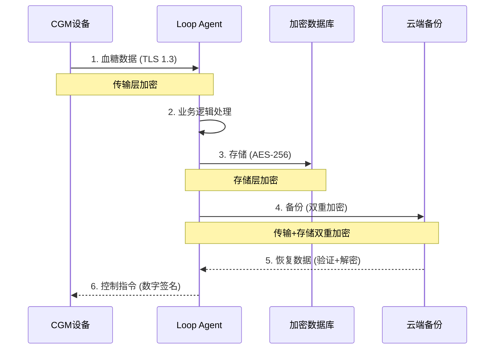

**加密实现**：
```python
import cryptography
from cryptography.fernet import Fernet
from cryptography.hazmat.primitives import hashes
from cryptography.hazmat.primitives.kdf.pbkdf2 import PBKDF2HMAC
import base64
import os

class MedicalDataEncryption:
    def __init__(self):
        self.master_key = self._load_master_key()
        self.encryption_suite = Fernet(self.master_key)
        
    def _load_master_key(self) -> bytes:
        """加载主密钥 (从安全存储中获取)"""
        # 实际环境中应从HSM或密钥管理服务获取
        password = os.environ.get('MASTER_PASSWORD').encode()
        salt = os.environ.get('ENCRYPTION_SALT').encode()
        
        kdf = PBKDF2HMAC(
            algorithm=hashes.SHA256(),
            length=32,
            salt=salt,
            iterations=100000,
        )
        return base64.urlsafe_b64encode(kdf.derive(password))
    
    def encrypt_patient_data(self, data: dict, patient_id: str) -> bytes:
        """加密患者数据"""
        # 1. 数据脱敏处理
        anonymized_data = self._anonymize_sensitive_fields(data)
        
        # 2. 添加完整性校验
        data_with_checksum = {
            'data': anonymized_data,
            'checksum': self._calculate_checksum(anonymized_data),
            'patient_hash': self._hash_patient_id(patient_id),
            'timestamp': time.time()
        }
        
        # 3. 序列化并加密
        serialized = json.dumps(data_with_checksum).encode()
        encrypted = self.encryption_suite.encrypt(serialized)
        
        return encrypted
    
    def decrypt_patient_data(self, encrypted_data: bytes, patient_id: str) -> dict:
        """解密患者数据"""
        try:
            # 1. 解密
            decrypted = self.encryption_suite.decrypt(encrypted_data)
            data_with_checksum = json.loads(decrypted.decode())
            
            # 2. 验证完整性
            if not self._verify_checksum(
                data_with_checksum['data'], 
                data_with_checksum['checksum']
            ):
                raise DataIntegrityError("数据完整性验证失败")
            
            # 3. 验证患者ID
            if data_with_checksum['patient_hash'] != self._hash_patient_id(patient_id):
                raise AuthorizationError("患者ID验证失败")
                
            return data_with_checksum['data']
            
        except Exception as e:
            # 记录解密失败事件
            self._log_decryption_failure(patient_id, str(e))
            raise
    
    def _anonymize_sensitive_fields(self, data: dict) -> dict:
        """敏感字段脱敏处理"""
        anonymized = data.copy()
        
        # 血糖值脱敏 - 保留临床意义但移除精确值
        if 'glucose_value' in anonymized:
            glucose = anonymized['glucose_value']
            if glucose < 4.0:
                anonymized['glucose_value'] = 'LOW'
            elif glucose > 10.0:
                anonymized['glucose_value'] = 'HIGH'  
            else:
                anonymized['glucose_value'] = 'NORMAL'
        
        # 移除直接标识信息
        sensitive_fields = ['device_serial', 'phone_number', 'email']
        for field in sensitive_fields:
            if field in anonymized:
                anonymized[field] = self._generate_hash(anonymized[field])
                
        return anonymized
```

#### 5.2.2 访问控制和审计

**基于角色的访问控制 (RBAC)**：
```yaml
access_control_matrix:
  # 患者角色
  patient:
    permissions:
      - read: own_glucose_data
      - write: user_events (meals, exercise)
      - read: own_alerts
      - write: system_preferences
    restrictions:
      - no_access: other_patients_data
      - no_access: system_configuration
      - no_access: algorithm_parameters
      
  # 医生角色
  doctor:
    permissions:
      - read: assigned_patients_data
      - write: treatment_parameters
      - read: all_alerts_for_patients
      - write: clinical_overrides
    restrictions:
      - no_access: unassigned_patients
      - no_access: system_administration
      - audit_log: all_patient_data_access
      
  # 系统管理员角色  
  admin:
    permissions:
      - read: system_status
      - write: system_configuration
      - read: aggregate_analytics (anonymized)
      - write: user_management
    restrictions:
      - no_access: individual_patient_data
      - no_access: clinical_decisions
      - audit_log: all_system_operations
```

**审计日志实现**：
```python
class AuditLogger:
    def __init__(self):
        self.audit_db = self._connect_audit_database()
        
    async def log_data_access(self, 
                             user_id: str, 
                             user_role: str,
                             accessed_resource: str, 
                             action: str,
                             patient_id: str = None):
        """记录数据访问审计日志"""
        audit_record = {
            'audit_id': self._generate_audit_id(),
            'timestamp': datetime.utcnow(),
            'user_id': user_id,
            'user_role': user_role,
            'action': action,  # CREATE, READ, UPDATE, DELETE
            'resource_type': accessed_resource,
            'patient_id': self._hash_if_exists(patient_id),
            'ip_address': self._get_client_ip(),
            'user_agent': self._get_user_agent(),
            'session_id': self._get_session_id(),
            'success': True,  # 将在异常情况下更新为False
            'risk_score': self._calculate_risk_score(user_role, action, accessed_resource)
        }
        
        # 异步写入审计数据库
        await self._write_audit_record(audit_record)
        
        # 高风险操作实时告警
        if audit_record['risk_score'] > 7:
            await self._trigger_security_alert(audit_record)
    
    def _calculate_risk_score(self, role: str, action: str, resource: str) -> int:
        """计算操作风险评分 (1-10)"""
        base_scores = {
            'patient': 1,
            'doctor': 3, 
            'admin': 5
        }
        
        action_multipliers = {
            'READ': 1.0,
            'CREATE': 1.5,
            'UPDATE': 2.0,
            'DELETE': 3.0
        }
        
        resource_weights = {
            'glucose_data': 2,
            'treatment_parameters': 4,
            'system_configuration': 3,
            'user_management': 4
        }
        
        base = base_scores.get(role, 5)
        multiplier = action_multipliers.get(action, 1.0)
        weight = resource_weights.get(resource, 1)
        
        return min(10, int(base * multiplier * weight))
```

## 3. 核心算法

### 3.1 血糖预测算法

血糖预测算法采用多模型融合方法，结合物理模型和机器学习模型，以提高预测准确性。

#### 3.1.1 物理模型部分 

使用改进的Bergman最小模型，下图展示了核心组件间的关系：

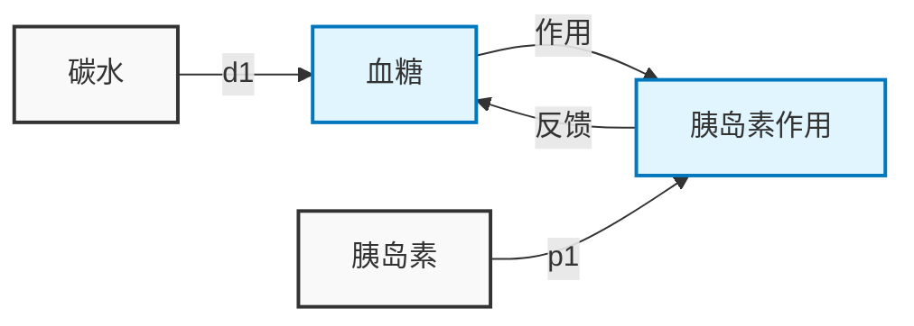

核心方程：

1) 血糖动力学方程：
```
dG/dt = -p1 * X * G + p2 * (Gb - G) + d1 * D
其中：
- G: 血糖浓度 (mmol/L)
- X: 胰岛素作用
- Gb: 基础血糖值
- D: 碳水摄入率
- p1, p2: 模型参数
```

2) 胰岛素作用方程：
```
dX/dt = -p3 * X + p4 * (I - Ib)
其中：
- I: 血浆胰岛素浓度
- Ib: 基础胰岛素浓度
- p3, p4: 胰岛素动力学参数
```

#### 3.1.2 机器学习模型

采用基于LSTM的深度学习模型，输入特征包括：

1. 历史血糖序列 (过去4小时，5分钟间隔)
2. 胰岛素输注记录
3. 碳水摄入记录
4. 运动数据
5. 时间特征(时间段、工作日/周末等)

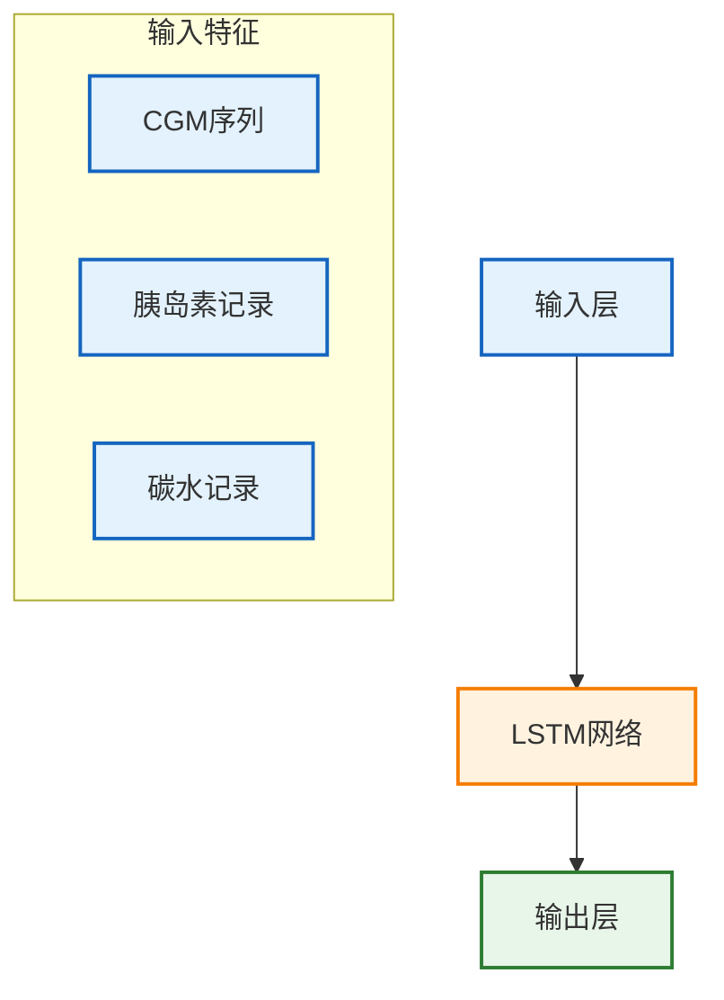
```

#### 3.1.3 模型融合策略

1) 短期预测 (0-30分钟)：物理模型权重较大
2) 中期预测 (30-60分钟)：两种模型权重接近
3) 长期预测 (60-120分钟)：机器学习模型权重较大

权重计算公式：
```
W_physics = exp(-λt)
W_ml = 1 - W_physics
其中:
- t: 预测时间点(分钟)
- λ: 衰减系数(默认0.02)
```

### 3.4 性能指标与优化

Loop Agent作为实时医疗控制系统，必须满足严格的性能要求。本节定义了关键性能指标(KPI)和优化策略。

#### 3.4.1 关键性能指标

**响应时间指标**：
```yaml
latency_requirements:
  # 数据处理延迟
  cgm_data_processing: 
    target: < 10s
    alert_threshold: > 30s
    critical_threshold: > 60s
    
  # 血糖预测延迟  
  glucose_prediction:
    target: < 15s
    alert_threshold: > 30s
    critical_threshold: > 45s
    
  # 控制决策延迟
  control_decision:
    target: < 30s
    alert_threshold: > 60s
    critical_threshold: > 120s
    
  # 胰岛素输注指令延迟
  insulin_command:
    target: < 5s
    alert_threshold: > 10s
    critical_threshold: > 15s
```

**预测准确性指标**：
```yaml
accuracy_metrics:
  # 短期预测准确性 (15分钟)
  short_term_prediction:
    target_mae: < 1.0 mmol/L  # 平均绝对误差
    target_rmse: < 1.5 mmol/L # 均方根误差
    acceptable_threshold: 85% # 85%的预测误差在±20%内
    
  # 中期预测准确性 (30分钟)  
  medium_term_prediction:
    target_mae: < 1.5 mmol/L
    target_rmse: < 2.0 mmol/L
    acceptable_threshold: 75%
    
  # 长期预测准确性 (60分钟)
  long_term_prediction:
    target_mae: < 2.0 mmol/L
    target_rmse: < 2.5 mmol/L
    acceptable_threshold: 65%
```

**系统可用性指标**：
```yaml
availability_metrics:
  # 系统在线时间
  system_uptime:
    target: 99.9%   # 每月停机时间 < 43分钟
    minimum: 99.5%  # 最低可接受水平
    
  # 设备连接稳定性
  device_connectivity:
    cgm_connection_success: > 98%
    pump_communication_success: > 99.5%
    cloud_sync_success: > 95%
    
  # 数据完整性
  data_completeness:
    cgm_data_coverage: > 95%    # 每日CGM数据覆盖率
    missing_data_gap: < 15min   # 最大数据缺失间隔
```

#### 3.4.2 性能监控实现

**实时性能监控系统**：

```python
import time
import asyncio
from datetime import datetime, timedelta
from typing import Dict, List

class PerformanceMonitor:
    def __init__(self):
        self.metrics_buffer = {}
        self.performance_history = []
        self.alert_handlers = []
        
    async def track_latency(self, operation_name: str, start_time: float):
        """跟踪操作延迟"""
        end_time = time.time()
        latency_ms = (end_time - start_time) * 1000
        
        # 记录性能指标
        await self.record_metric(f"{operation_name}_latency", latency_ms)
        
        # 检查是否超过阈值
        threshold = self.get_latency_threshold(operation_name)
        if latency_ms > threshold['critical']:
            await self.trigger_performance_alert(
                operation_name, 
                latency_ms, 
                'CRITICAL_LATENCY'
            )
            
    async def track_prediction_accuracy(self, 
                                      predicted_values: List[float],
                                      actual_values: List[float],
                                      prediction_horizon: int):
        """跟踪预测准确性"""
        import numpy as np
        
        # 计算MAE和RMSE
        mae = np.mean(np.abs(np.array(predicted_values) - np.array(actual_values)))
        rmse = np.sqrt(np.mean((np.array(predicted_values) - np.array(actual_values))**2))
        
        # 记录准确性指标
        await self.record_metric(f"prediction_mae_{prediction_horizon}min", mae)
        await self.record_metric(f"prediction_rmse_{prediction_horizon}min", rmse)
        
        # 检查准确性阈值
        accuracy_thresholds = self.get_accuracy_thresholds(prediction_horizon)
        if mae > accuracy_thresholds['mae_threshold']:
            await self.trigger_performance_alert(
                f"prediction_accuracy_{prediction_horizon}min",
                mae,
                'POOR_PREDICTION_ACCURACY'
            )
    
    async def monitor_system_resources(self):
        """监控系统资源使用情况"""
        import psutil
        
        while True:
            # CPU使用率
            cpu_percent = psutil.cpu_percent(interval=1)
            await self.record_metric("cpu_usage", cpu_percent)
            
            # 内存使用率
            memory = psutil.virtual_memory()
            await self.record_metric("memory_usage", memory.percent)
            
            # 检查资源使用阈值
            if cpu_percent > 80:
                await self.trigger_performance_alert(
                    "system_resources", 
                    cpu_percent, 
                    'HIGH_CPU_USAGE'
                )
                
            if memory.percent > 85:
                await self.trigger_performance_alert(
                    "system_resources",
                    memory.percent, 
                    'HIGH_MEMORY_USAGE'
                )
                
            await asyncio.sleep(60)  # 每分钟检查一次
```

#### 3.4.3 性能优化策略

**算法优化**：
```python
class OptimizedPredictionEngine:
    def __init__(self):
        self.prediction_cache = {}
        self.model_cache = {}
        
    async def predict_with_caching(self, input_data):
        """使用缓存优化预测性能"""
        # 生成缓存键
        cache_key = self.generate_cache_key(input_data)
        
        # 检查缓存
        if cache_key in self.prediction_cache:
            cached_result = self.prediction_cache[cache_key]
            if self.is_cache_valid(cached_result):
                return cached_result['prediction']
        
        # 执行预测
        start_time = time.time()
        prediction = await self.run_prediction_models(input_data)
        
        # 缓存结果
        self.prediction_cache[cache_key] = {
            'prediction': prediction,
            'timestamp': time.time(),
            'ttl': 300  # 5分钟TTL
        }
        
        # 记录性能
        await self.performance_monitor.track_latency(
            'glucose_prediction', 
            start_time
        )
        
        return prediction
        
    def optimize_model_inference(self):
        """模型推理优化"""
        # 1. 模型量化 - 减少内存占用
        # 2. 批处理 - 提高throughput  
        # 3. 异步处理 - 减少阻塞
        pass
```

**数据库优化**：
```sql
-- 为频繁查询的字段创建复合索引
CREATE INDEX CONCURRENTLY idx_loop_state_patient_timestamp 
ON Loop_State(patient_id, glucose_timestamp DESC);

-- 分区表优化历史数据查询
CREATE TABLE CGM_Data_Partitioned (
    glucose_value DECIMAL(4,1),
    timestamp TIMESTAMP,
    patient_id VARCHAR(32)
) PARTITION BY RANGE (timestamp);

-- 创建月度分区
CREATE TABLE CGM_Data_Y2024M01 PARTITION OF CGM_Data_Partitioned
    FOR VALUES FROM ('2024-01-01') TO ('2024-02-01');
```

#### 3.4.4 性能基准测试

**负载测试场景**：
```yaml
load_test_scenarios:
  # 正常负载测试
  normal_load:
    concurrent_patients: 100
    cgm_data_rate: 1 reading/5min per patient
    test_duration: 24 hours
    expected_avg_latency: < 15s
    
  # 峰值负载测试  
  peak_load:
    concurrent_patients: 500
    cgm_data_rate: 1 reading/1min per patient
    burst_events: 50 meal/exercise events simultaneously
    test_duration: 1 hour
    expected_avg_latency: < 30s
    
  # 异常情况测试
  failure_recovery:
    simulated_failures: 
      - cgm_disconnection: 10% patients
      - network_interruption: 30s intervals
      - database_slowdown: 2x normal latency
    recovery_time_target: < 2min
```

### 3.2 胰岛素输注决策算法

#### 3.2.1 基础率调整

基础率调整采用模型预测控制(MPC)方法，主要包含以下模块：


其中各模块功能如下：
1. 预测模块：血糖预测和IOB预测
2. 控制模块：目标区间、代价函数和优化器
3. 安全模块：最大调整量、最低血糖约束和最大IOB约束
4. 输出模块：基础率计算结果
```
```

代价函数设计：
```
J = Σ(w1*(G_pred - G_target)² + w2*(ΔI)² + w3*exp(-G_pred/G_danger))
其中：
- G_pred: 预测血糖值
- G_target: 目标血糖值
- ΔI: 胰岛素变化量
- G_danger: 危险血糖阈值
- w1,w2,w3: 权重系数
```

#### 3.2.2 大剂量计算

采用改进的渐进式大剂量计算方法：

1) 标准大剂量计算：
```
Bolus = (BG_current - BG_target)/ISF + Carbs/CR - IOB
其中：
- ISF: 胰岛素敏感系数
- CR: 碳水比例
- IOB: 活性胰岛素
```

2) 风险修正：
```
Risk_factor = 1 - 0.3 * (dBG/dt < -2) * (BG_current < 7)
Final_bolus = Bolus * Risk_factor
```

3) 进餐后续剂量：
```
Post_meal_bolus = max(0, (BG_current - BG_target)/ISF * f(t))
其中f(t)为时间衰减函数：
f(t) = exp(-0.01 * t)  // t为距离上次进餐时间(分钟)
```

## 4. 系统可靠性设计

### 4.1 故障分类与响应策略

基于IEC 62304医疗软件标准，Loop Agent采用三级故障分类体系：

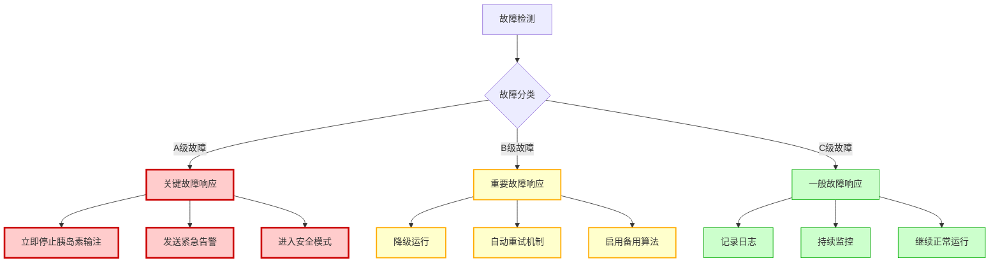

#### 4.1.1 A级故障（关键故障）- 立即停止

**触发条件**：
```javascript
// 血糖传感器完全失效
if (cgm_data_missing_duration > 30_minutes) {
    trigger_critical_fault("CGM_TOTAL_FAILURE");
}

// 胰岛素泵通信中断
if (pump_communication_failed && last_command_pending) {
    trigger_critical_fault("PUMP_COMMUNICATION_LOST");  
}

// 预测算法产生异常结果
if (predicted_glucose < 0 || predicted_glucose > 50) {
    trigger_critical_fault("ALGORITHM_INVALID_OUTPUT");
}
```

**响应动作**：
1. **立即停止**：暂停所有胰岛素输注指令
2. **告警升级**：向用户、医生、紧急联系人发送告警
3. **安全模式**：切换到只监测、不干预的被动模式
4. **数据保护**：将所有状态数据写入非易失性存储

#### 4.1.2 B级故障（重要故障）- 降级运行

**触发条件**：
```javascript
// 血糖数据延迟但未中断
if (cgm_data_delay > 15_minutes && cgm_data_delay <= 30_minutes) {
    trigger_major_fault("CGM_DATA_DELAYED");
}

// 网络连接不稳定
if (network_connectivity_ratio < 0.7) {
    trigger_major_fault("NETWORK_UNSTABLE");
}

// 预测准确性下降
if (prediction_accuracy < 0.6 && continuous_hours > 2) {
    trigger_major_fault("PREDICTION_DEGRADED");
}
```

**响应策略**：
1. **降级运行**：使用更保守的控制参数
2. **备用算法**：切换到基于规则的简化算法
3. **自动重试**：定期尝试恢复正常功能
4. **用户通知**：告知用户系统状态变化

#### 4.1.3 C级故障（一般故障）- 继续运行

**触发条件**：
```javascript
// 轻微的数据异常
if (cgm_reading_spike_detected && spike_duration < 5_minutes) {
    trigger_minor_fault("CGM_DATA_SPIKE");
}

// 配置参数轻微偏差  
if (user_config_validation_warning) {
    trigger_minor_fault("CONFIG_PARAMETER_WARNING");
}
```

### 4.2 异常恢复机制

#### 4.2.1 自动恢复策略

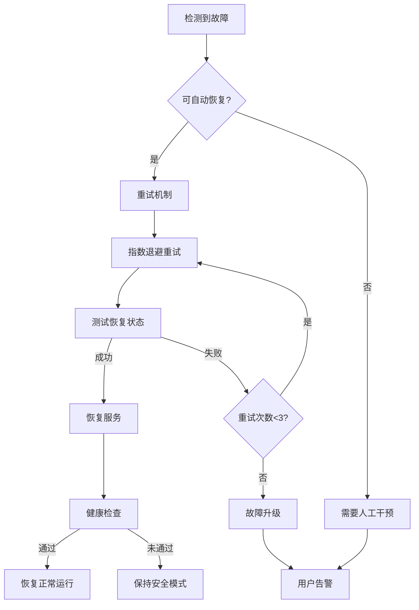

**重试算法实现**：
```python
class RetryMechanism:
    def __init__(self):
        self.max_retries = 3
        self.base_delay = 1.0  # 秒
        
    def exponential_backoff_retry(self, operation, fault_type):
        for attempt in range(self.max_retries):
            try:
                result = operation()
                if self.validate_result(result, fault_type):
                    return result
            except Exception as e:
                if attempt == self.max_retries - 1:
                    self.escalate_fault(fault_type, e)
                    raise
                
                # 指数退避：1s, 2s, 4s
                delay = self.base_delay * (2 ** attempt)
                time.sleep(delay)
```

#### 4.2.2 状态一致性保证

**事务性状态更新**：
```sql
-- 原子性状态更新示例
BEGIN TRANSACTION;
    UPDATE Loop_State 
    SET 
        glucose_value = @new_glucose,
        insulin_on_board = @new_iob,
        loop_status = @new_status,
        last_update = NOW()
    WHERE patient_id = @patient_id;
    
    INSERT INTO System_Status_Log (
        event_type, 
        old_state, 
        new_state, 
        timestamp
    ) VALUES (
        'STATE_UPDATE',
        @old_state_json,
        @new_state_json, 
        NOW()
    );
COMMIT;
```

### 4.3 监控与预警系统

#### 4.3.1 实时健康监控

**系统健康指标**：
```yaml
health_metrics:
  data_freshness:
    cgm_data_age: < 5min
    pump_status_age: < 2min
    
  system_performance:
    prediction_latency: < 30s
    decision_latency: < 60s
    memory_usage: < 80%
    
  communication_quality:
    cgm_connection_stability: > 95%
    pump_communication_success: > 99%
    cloud_sync_success: > 90%
```

**监控实现**：
```python
class HealthMonitor:
    def __init__(self):
        self.metrics = {}
        self.alert_thresholds = load_alert_thresholds()
        
    async def continuous_monitoring(self):
        while True:
            health_status = await self.collect_health_metrics()
            
            for metric, value in health_status.items():
                if self.is_threshold_violated(metric, value):
                    await self.trigger_alert(metric, value)
                    
            await asyncio.sleep(30)  # 每30秒检查一次
            
    def is_threshold_violated(self, metric, value):
        threshold = self.alert_thresholds.get(metric)
        if threshold:
            return value > threshold['critical'] or value < threshold['minimum']
        return False
```

### 3.3 安全监控系统

#### 3.3.1 预防性低血糖保护

系统采用多层级低血糖预防机制：

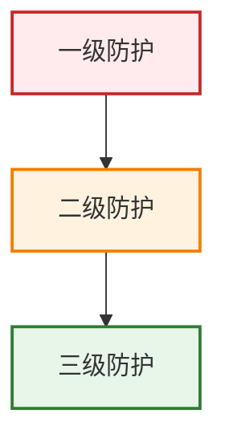

防护层级说明：
1. 一级防护：
   - 预测性暂停
   - 阈值暂停
2. 二级防护：
   - 降低基础率
   - 取消临时基础
3. 三级防护：
   - 用户警告
   - 碳水建议
```
```

触发条件：

1) 预测性暂停：
```
IF prediction_15min < 4.0 OR 
   (prediction_30min < 4.0 AND dBG/dt < -0.1)
THEN suspend_insulin()
```

2) 阈值暂停：
```
IF BG_current < 4.0 OR 
   (BG_current < 4.5 AND dBG/dt < -0.2)
THEN suspend_insulin()
```

3) 基础率降低：
```
IF 4.0 ≤ BG_current ≤ 5.0 AND dBG/dt < 0
THEN temp_basal = current_basal * 0.5
```

#### 3.3.2 高血糖保护

高血糖状态下的安全策略：

1) 最大剂量限制：
```
max_bolus = min(patient_max_bolus, 
                2 * typical_meal_bolus,
                (25 - BG_current) * weight / ISF)
```

2) 累积胰岛素限制：
```
IF IOB > 2 * max_bolus THEN
    temp_basal = 0
    cancel_bolus = true
END
```

3) 酮症预防：
```
IF BG > 14 AND last_bolus_time > 120min THEN
    suggest_site_change = true
    max_temp_basal = 2 * current_basal
END
```

## 6. 设备集成与通信

### 6.1 设备通信协议架构

Loop Agent与医疗设备间的通信是系统的关键环节，必须确保数据传输的实时性、准确性和安全性。

```mermaid
graph TB
    subgraph DeviceLayer[设备层]
        CGM[CGM设备]
        Pump[胰岛素泵]
        Phone[智能手机]
    end
    
    subgraph ProtocolLayer[协议层]
        BLE[蓝牙LE协议]
        WiFi[WiFi协议]
        Cellular[蜂窝网络]
    end
    
    subgraph AdapterLayer[适配器层]
        CGMAdapter[CGM适配器]
        PumpAdapter[泵适配器]
        NetworkAdapter[网络适配器]
    end
    
    subgraph SecurityLayer[安全层]
        Encryption[端到端加密]
        Authentication[设备认证]
        IntegrityCheck[完整性检查]
    end
    
    subgraph ApplicationLayer[应用层]
        LoopAgent[Loop Agent核心]
        DataProcessor[数据处理器]
        DecisionEngine[决策引擎]
    end
    
    %% 连接关系
    CGM --> BLE
    Pump --> BLE
    Phone --> WiFi
    Phone --> Cellular
    
    BLE --> CGMAdapter
    BLE --> PumpAdapter
    WiFi --> NetworkAdapter
    Cellular --> NetworkAdapter
    
    CGMAdapter --> Encryption
    PumpAdapter --> Authentication
    NetworkAdapter --> IntegrityCheck
    
    Encryption --> DataProcessor
    Authentication --> DataProcessor
    IntegrityCheck --> LoopAgent
    
    DataProcessor --> DecisionEngine
    LoopAgent --> DecisionEngine
    
    classDef device fill:#ffcccb,stroke:#cd5c5c,stroke-width:2px
    classDef protocol fill:#add8e6,stroke:#4682b4,stroke-width:2px
    classDef adapter fill:#90ee90,stroke:#32cd32,stroke-width:2px
    classDef security fill:#ffd700,stroke:#ffa500,stroke-width:2px
    classDef application fill:#dda0dd,stroke:#9370db,stroke-width:2px
    
    class CGM,Pump,Phone device
    class BLE,WiFi,Cellular protocol
    class CGMAdapter,PumpAdapter,NetworkAdapter adapter
    class Encryption,Authentication,IntegrityCheck security
    class LoopAgent,DataProcessor,DecisionEngine application
```

#### 6.1.1 CGM设备通信协议

**支持的CGM设备及协议**：

```python
class CGMProtocolHandler:
    def __init__(self):
        self.supported_devices = {
            'dexcom_g6': {
                'protocol': 'bluetooth_le',
                'service_uuid': '0000180f-0000-1000-8000-00805f9b34fb',
                'characteristic_uuid': '00002a19-0000-1000-8000-00805f9b34fb',
                'data_frequency': 60,  # 秒
                'authentication': 'shared_key'
            },
            'dexcom_g7': {
                'protocol': 'bluetooth_le',
                'service_uuid': '0000180a-0000-1000-8000-00805f9b34fb',
                'characteristic_uuid': '00002a23-0000-1000-8000-00805f9b34fb',
                'data_frequency': 60,
                'authentication': 'certificate_based'
            },
            'abbott_libre': {
                'protocol': 'nfc_bluetooth_bridge',
                'service_uuid': '0000180d-0000-1000-8000-00805f9b34fb',
                'characteristic_uuid': '00002a37-0000-1000-8000-00805f9b34fb',
                'data_frequency': 300,  # 5分钟
                'authentication': 'challenge_response'
            }
        }
    
    async def establish_cgm_connection(self, device_type: str, device_id: str):
        """建立CGM设备连接"""
        device_config = self.supported_devices.get(device_type)
        if not device_config:
            raise UnsupportedDeviceError(f"不支持的CGM设备: {device_type}")
        
        try:
            # 1. 蓝牙设备发现和配对
            ble_device = await self._discover_ble_device(
                device_id, 
                device_config['service_uuid']
            )
            
            # 2. 建立安全连接
            secure_connection = await self._establish_secure_connection(
                ble_device,
                device_config['authentication']
            )
            
            # 3. 订阅血糖数据通知
            await self._subscribe_glucose_notifications(
                secure_connection,
                device_config['characteristic_uuid']
            )
            
            # 4. 启动数据接收循环
            asyncio.create_task(
                self._glucose_data_receiver_loop(secure_connection, device_type)
            )
            
            return secure_connection
            
        except Exception as e:
            await self._log_connection_failure(device_type, device_id, str(e))
            raise DeviceConnectionError(f"CGM连接失败: {str(e)}")
    
    async def _glucose_data_receiver_loop(self, connection, device_type):
        """血糖数据接收循环"""
        while connection.is_connected:
            try:
                # 接收原始数据
                raw_data = await connection.read_glucose_data()
                
                # 数据验证和解析
                parsed_data = self._parse_glucose_reading(raw_data, device_type)
                
                # 数据质量检查
                if self._validate_glucose_data(parsed_data):
                    # 发送到Loop Agent核心处理
                    await self._send_to_loop_agent(parsed_data)
                else:
                    await self._handle_invalid_data(raw_data, parsed_data)
                    
                # 记录通信日志
                await self._log_cgm_communication(
                    device_type,
                    'DATA_RECEIVED',
                    len(raw_data),
                    'SUCCESS'
                )
                
            except ConnectionLostError:
                await self._handle_connection_lost(device_type)
                break
            except DataParseError as e:
                await self._handle_data_parse_error(e)
            except Exception as e:
                await self._handle_unexpected_error(e)
            
            await asyncio.sleep(1)  # 防止CPU过度占用
```

#### 6.1.2 胰岛素泵通信协议

**胰岛素泵指令接口**：

```python
class PumpControlInterface:
    def __init__(self):
        self.pump_protocols = {
            'medtronic_670g': {
                'protocol': 'proprietary_rf',
                'frequency': '916.5MHz',
                'encryption': 'AES128',
                'command_timeout': 30,
                'max_retry': 3
            },
            'omnipod_dash': {
                'protocol': 'bluetooth_le',
                'service_uuid': '1d14d6ee-fd63-4fa1-bfa4-8f47b42119f0',
                'command_characteristic': '1d14d6ee-fd63-4fa1-bfa4-8f47b42119f1',
                'encryption': 'curve25519',
                'command_timeout': 15,
                'max_retry': 2
            },
            'tandem_x2': {
                'protocol': 'bluetooth_le',
                'service_uuid': '0000180a-0000-1000-8000-00805f9b34fb',
                'command_characteristic': '00002a50-0000-1000-8000-00805f9b34fb',
                'encryption': 'AES256',
                'command_timeout': 20,
                'max_retry': 3
            }
        }
    
    async def send_basal_command(self, 
                               pump_type: str,
                               basal_rate: float,
                               duration_minutes: int,
                               patient_id: str):
        """发送基础率调整命令"""
        # 1. 安全性检查
        if not self._validate_basal_parameters(basal_rate, duration_minutes, patient_id):
            raise SafetyViolationError("基础率参数不安全")
        
        # 2. 构建命令
        command = {
            'type': 'TEMP_BASAL',
            'rate': basal_rate,
            'duration': duration_minutes,
            'timestamp': time.time(),
            'patient_id_hash': self._hash_patient_id(patient_id),
            'command_id': self._generate_command_id()
        }
        
        # 3. 数字签名
        signed_command = await self._sign_command(command, pump_type)
        
        # 4. 发送命令并等待确认
        try:
            response = await self._send_pump_command(
                pump_type,
                signed_command,
                timeout=self.pump_protocols[pump_type]['command_timeout']
            )
            
            # 5. 验证执行结果
            if response['status'] == 'SUCCESS':
                await self._log_successful_command(command, response)
                return True
            else:
                await self._handle_command_failure(command, response)
                return False
                
        except CommandTimeoutError:
            await self._handle_command_timeout(command, pump_type)
            return False
        except Exception as e:
            await self._handle_command_error(command, str(e))
            return False
    
    async def send_bolus_command(self,
                               pump_type: str, 
                               bolus_units: float,
                               bolus_type: str,  # 'NORMAL', 'DUAL', 'SQUARE'
                               patient_id: str):
        """发送大剂量输注命令"""
        # 1. 多重安全验证
        safety_checks = [
            self._validate_bolus_amount(bolus_units, patient_id),
            self._check_recent_bolus_history(patient_id),
            self._verify_current_glucose_level(patient_id),
            self._check_active_insulin_level(patient_id)
        ]
        
        if not all(await asyncio.gather(*safety_checks)):
            raise SafetyViolationError("大剂量安全检查未通过")
        
        # 2. 构建大剂量命令
        bolus_command = {
            'type': 'BOLUS',
            'units': bolus_units,
            'bolus_type': bolus_type,
            'timestamp': time.time(),
            'patient_id_hash': self._hash_patient_id(patient_id),
            'command_id': self._generate_command_id(),
            'safety_confirmation': True
        }
        
        # 3. 需要用户最终确认的大剂量
        if bolus_units > self._get_auto_bolus_limit(patient_id):
            user_confirmation = await self._request_user_confirmation(bolus_command)
            if not user_confirmation:
                await self._log_user_cancellation(bolus_command)
                return False
        
        # 4. 分步执行大剂量
        return await self._execute_bolus_with_monitoring(bolus_command, pump_type)
```

### 6.2 网络通信安全

#### 6.2.1 设备认证和密钥管理

```python
class DeviceSecurityManager:
    def __init__(self):
        self.device_certificates = {}
        self.session_keys = {}
        self.key_rotation_interval = 24 * 3600  # 24小时
        
    async def authenticate_device(self, device_id: str, device_type: str):
        """设备身份认证流程"""
        try:
            # 1. 证书验证
            device_cert = await self._retrieve_device_certificate(device_id)
            if not self._verify_certificate_chain(device_cert):
                raise AuthenticationError("设备证书验证失败")
            
            # 2. 挑战-响应认证
            challenge = self._generate_challenge()
            response = await self._send_challenge(device_id, challenge)
            
            if not self._verify_challenge_response(challenge, response, device_cert):
                raise AuthenticationError("挑战-响应认证失败")
            
            # 3. 生成会话密钥
            session_key = self._generate_session_key(device_id, device_type)
            self.session_keys[device_id] = {
                'key': session_key,
                'created_at': time.time(),
                'device_type': device_type
            }
            
            # 4. 建立安全通道
            secure_channel = await self._establish_secure_channel(
                device_id, 
                session_key
            )
            
            await self._log_successful_authentication(device_id, device_type)
            return secure_channel
            
        except Exception as e:
            await self._log_authentication_failure(device_id, device_type, str(e))
            raise
    
    async def rotate_session_keys(self):
        """会话密钥轮转"""
        current_time = time.time()
        
        for device_id, key_info in list(self.session_keys.items()):
            if current_time - key_info['created_at'] > self.key_rotation_interval:
                try:
                    # 生成新密钥
                    new_key = self._generate_session_key(
                        device_id, 
                        key_info['device_type']
                    )
                    
                    # 与设备协商密钥更新
                    if await self._negotiate_key_rotation(device_id, new_key):
                        # 更新本地密钥
                        self.session_keys[device_id] = {
                            'key': new_key,
                            'created_at': current_time,
                            'device_type': key_info['device_type']
                        }
                        
                        await self._log_key_rotation_success(device_id)
                    else:
                        await self._handle_key_rotation_failure(device_id)
                        
                except Exception as e:
                    await self._handle_key_rotation_error(device_id, str(e))
```

### 6.3 离线模式和数据同步

#### 6.3.1 离线运行架构

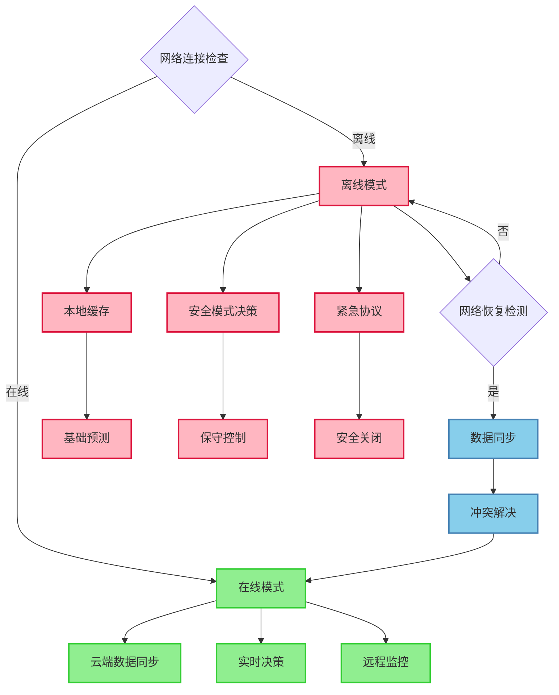

#### 6.3.2 离线数据管理

```python
class OfflineModeManager:
    def __init__(self):
        self.offline_storage = {}
        self.sync_queue = []
        self.last_sync_timestamp = 0
        self.offline_model = self._load_offline_prediction_model()
        
    async def enter_offline_mode(self, reason: str):
        """进入离线模式"""
        await self._log_offline_mode_entry(reason)
        
        # 1. 保存当前状态
        current_state = await self._capture_current_state()
        self.offline_storage['last_online_state'] = current_state
        
        # 2. 切换到保守参数
        await self._switch_to_conservative_parameters()
        
        # 3. 启用本地预测模型
        self.prediction_engine = OfflinePredictionEngine(self.offline_model)
        
        # 4. 减少非关键功能
        await self._disable_non_essential_features()
        
        # 5. 启动离线监控
        asyncio.create_task(self._offline_monitoring_loop())
        
    async def _offline_monitoring_loop(self):
        """离线模式监控循环"""
        while self.is_offline_mode:
            try:
                # 1. 检查网络连接
                if await self._check_network_connectivity():
                    await self.exit_offline_mode()
                    break
                
                # 2. 执行基础预测和控制
                await self._perform_offline_prediction_and_control()
                
                # 3. 监控安全状态
                await self._monitor_safety_conditions()
                
                # 4. 管理本地存储
                await self._manage_offline_storage()
                
                await asyncio.sleep(60)  # 每分钟检查一次
                
            except Exception as e:
                await self._handle_offline_error(e)
    
    async def exit_offline_mode(self):
        """退出离线模式，恢复在线功能"""
        try:
            # 1. 验证网络连接稳定性
            if not await self._verify_stable_connection():
                return False
            
            # 2. 同步离线期间的数据
            sync_result = await self._synchronize_offline_data()
            if not sync_result:
                raise SyncError("离线数据同步失败")
            
            # 3. 恢复在线参数和功能
            await self._restore_online_parameters()
            
            # 4. 重新启用完整功能
            await self._enable_full_features()
            
            # 5. 验证系统状态
            if await self._validate_system_integrity():
                self.is_offline_mode = False
                await self._log_online_mode_restoration()
                return True
            else:
                raise SystemIntegrityError("系统完整性验证失败")
                
        except Exception as e:
            await self._handle_online_restoration_error(e)
            return False
    
    async def _synchronize_offline_data(self):
        """同步离线期间的数据"""
        try:
            # 1. 上传离线期间的血糖数据
            glucose_data = self.offline_storage.get('glucose_readings', [])
            await self._upload_glucose_data_batch(glucose_data)
            
            # 2. 上传控制决策记录
            control_decisions = self.offline_storage.get('control_decisions', [])
            await self._upload_control_decisions_batch(control_decisions)
            
            # 3. 上传告警和事件
            alerts = self.offline_storage.get('alerts', [])
            await self._upload_alerts_batch(alerts)
            
            # 4. 下载服务器端更新
            server_updates = await self._download_server_updates(
                self.last_sync_timestamp
            )
            
            # 5. 解决数据冲突
            await self._resolve_data_conflicts(server_updates)
            
            # 6. 更新同步时间戳
            self.last_sync_timestamp = time.time()
            
            return True
            
        except Exception as e:
            await self._log_sync_error(str(e))
            return False
```

#### 6.3.3 智能数据同步策略

```python
class IntelligentSyncManager:
    def __init__(self):
        self.sync_priorities = {
            'critical': ['alerts', 'safety_events', 'control_decisions'],
            'important': ['glucose_readings', 'user_events'],
            'normal': ['performance_metrics', 'system_logs']
        }
        self.network_quality_threshold = 0.7
        
    async def adaptive_data_sync(self, network_quality: float):
        """自适应数据同步策略"""
        if network_quality >= self.network_quality_threshold:
            # 高质量网络：全量同步
            return await self._full_data_sync()
        elif network_quality >= 0.4:
            # 中等网络：优先级同步
            return await self._priority_based_sync()
        else:
            # 低质量网络：仅关键数据
            return await self._critical_only_sync()
    
    async def _priority_based_sync(self):
        """基于优先级的增量同步"""
        sync_results = {}
        
        # 按优先级顺序同步
        for priority in ['critical', 'important', 'normal']:
            data_types = self.sync_priorities[priority]
            
            for data_type in data_types:
                try:
                    # 检查网络状况
                    current_quality = await self._assess_network_quality()
                    if current_quality < 0.3:
                        break  # 网络太差，停止同步
                    
                    # 执行增量同步
                    result = await self._sync_data_type(data_type)
                    sync_results[data_type] = result
                    
                    if priority == 'critical' and not result:
                        # 关键数据同步失败，立即重试
                        result = await self._retry_critical_sync(data_type)
                        sync_results[data_type] = result
                        
                except NetworkError as e:
                    await self._handle_network_error_during_sync(data_type, e)
                    break
                except Exception as e:
                    await self._handle_sync_error(data_type, e)
        
        return sync_results
```

<function_calls>
<invoke name="TodoWrite">
<parameter name="todos">[{"content": "\u7f16\u5199\u67b6\u6784\u7ef4\u5ea6\u5185\u5bb9 - \u7cfb\u7edf\u96c6\u6210\u67b6\u6784\u56fe\u548c\u7ec4\u4ef6\u4ea4\u4e92", "status": "completed", "id": "1"}, {"content": "\u7f16\u5199\u9519\u8bef\u5904\u7406\u548c\u5f02\u5e38\u6062\u590d\u673a\u5236\u7ae0\u8282", "status": "completed", "id": "2"}, {"content": "\u7f16\u5199\u7cfb\u7edf\u6027\u80fd\u6307\u6807\u5b9a\u4e49\u7ae0\u8282", "status": "completed", "id": "3"}, {"content": "\u7f16\u5199\u6570\u636e\u7ef4\u5ea6\u5185\u5bb9 - \u8865\u5145\u6570\u636e\u6a21\u578b\u548c\u5b89\u5168\u7b56\u7565", "status": "completed", "id": "4"}, {"content": "\u7f16\u5199\u7f51\u7edc\u7ef4\u5ea6\u5185\u5bb9 - \u901a\u4fe1\u534f\u8bae\u548c\u79bb\u7ebf\u6a21\u5f0f", "status": "completed", "id": "5"}]