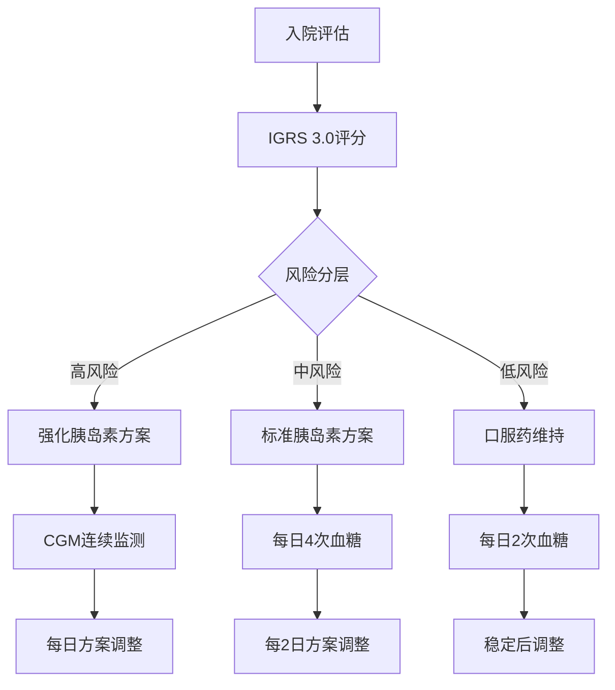

# CGMEHR患者分层后个性化干预实施策略

## 1. 基于IGRS 3.0的精准干预框架

### 1.1 高风险患者 (IGRS >60分) 强化管理方案

#### **药物治疗策略**
- **一线治疗**：胰岛素泵+CGM混合闭环系统
  - 基础率调整：根据CGM数据每2-4小时动态调整
  - 餐前大剂量：智能推荐系统结合碳水化合物计数
  - 低血糖预测暂停功能激活
- **二线加用**：GLP-1受体激动剂（司美格鲁肽2.4mg/周）
  - 适应症：BMI>27且存在心血管风险因素
  - 禁忌症筛查：胰腺炎病史、甲状腺髓样癌家族史
- **三线联合**：SGLT-2抑制剂（达格列净10mg/日）
  - 心肾保护作用，适用于eGFR>30ml/min/1.73m²

#### **监测频率与指标**
- **CGM监测**：连续监测，数据上传频率15分钟
- **关键指标**：TIR目标>70%，CV<36%，TBR<4%
- **医护随访**：每周1次，包括数据下载分析
- **生化检测**：每2周肝肾功能、每月HbA1c

#### **营养干预方案**
- **碳水化合物管理**：严格计数，1:10-1:15胰碳比
- **营养师指导**：每周1次，个体化食谱制定
- **膳食模式**：低GI饮食，地中海饮食模式优先
- **补充剂**：维生素D 800-1000IU/日，Omega-3 1-2g/日

#### **运动处方**
- **有氧运动**：中等强度，目标心率50-70% HRmax
- **频率**：每周150分钟，分5次执行
- **抗阻训练**：每周2次，大肌群训练
- **血糖监测**：运动前后CGM数据分析，调整胰岛素策略

### 1.2 中风险患者 (IGRS 21-60分) 标准化管理方案

#### **药物治疗策略**
- **基础治疗**：基础胰岛素（甘精胰岛素0.2-0.4U/kg/日）
- **餐时胰岛素**：门冬胰岛素或预混胰岛素30/70
- **口服联合**：二甲双胍1500-2000mg/日（分次服用）
- **必要时加用**：DPP-4抑制剂（西格列汀100mg/日）

#### **监测方案**
- **CGM使用**：间歇性扫描（FreeStyle Libre），每月14天
- **血糖监测**：每日4次指尖血糖（三餐前+睡前）
- **随访频率**：每2周1次，电话随访结合面诊
- **目标设定**：HbA1c<7%，餐前血糖4.4-7.0mmol/L

#### **生活方式干预**
- **糖尿病教育**：标准化DSMES课程，每月1次小组教育
- **饮食记录**：使用App记录，营养师每周审查
- **运动计划**：每周120分钟中等强度有氧运动
- **体重管理**：目标减重5-10%，每周称重

### 1.3 低风险患者 (IGRS ≤20分) 基础管理方案

#### **药物治疗策略**
- **首选**：二甲双胍单药治疗500-1000mg bid
- **二线选择**：磺脲类（格列美脲2-4mg/日）
- **新型药物**：根据患者特征选择SGLT-2i或GLP-1RA

#### **监测要求**
- **血糖监测**：每周2-3次指尖血糖
- **随访频率**：每月1次，主要为电话随访
- **季度评估**：每3月面诊，包括并发症筛查

## 2. 动态风险评估与干预调整机制

### 2.1 实时监测预警系统

#### **三级预警体系**
```
Level 1 预警 (黄色)：
- TIR 50-70%
- CV 20-36%
- 轻度低血糖 >4次/周
- 触发：护士电话随访

Level 2 预警 (橙色)：
- TIR <50%
- CV >36%
- 严重低血糖 >1次/周
- 触发：24小时内医师评估

Level 3 预警 (红色)：
- DKA风险 (血酮>1.5mmol/L)
- 严重低血糖昏迷
- 感染并发胰腺炎
- 触发：立即急诊处理
```

#### **风险重新分层触发条件**
- **升级触发**：连续2周目标未达标，严重不良事件
- **降级触发**：连续4周稳定达标，无不良事件
- **重新评估**：每3个月自动触发IGRS重新计算

### 2.2 个性化调整算法

#### **胰岛素剂量调整规则**
```python
def insulin_adjustment(current_tir, target_tir=70, cv_current, cv_target=36):
    """
    基于TIR和CV的胰岛素调整算法
    """
    if current_tir < target_tir - 10:
        if cv_current > cv_target:
            # 增加基础胰岛素，优化时间分布
            return "increase_basal", "optimize_timing"
        else:
            # 增加餐前大剂量
            return "increase_bolus", "maintain_basal"
    elif current_tir > target_tir + 5:
        # 减少胰岛素总量
        return "decrease_total", "monitor_closely"
    else:
        # 维持当前方案
        return "maintain", "continue_monitoring"
```

## 3. 临床决策支持系统设计

### 3.1 智能推荐引擎

#### **多因素决策矩阵**
| 患者特征 | 推荐治疗 | 替代方案 | 禁忌症 |
|---------|---------|---------|--------|
| 高风险+肾功能不全 | 胰岛素+GLP-1RA | 基础胰岛素强化 | SGLT-2i禁用 |
| 中风险+心血管疾病 | SGLT-2i+胰岛素 | GLP-1RA+二甲双胍 | 磺脲类慎用 |
| 低风险+肥胖 | GLP-1RA+二甲双胍 | SGLT-2i单药 | 胰岛素避免 |

### 3.2 治疗路径标准化

#### **住院期间管理流程**


### 3.3 出院过渡管理

#### **分层随访计划**
- **高风险患者**：出院1周内随访，CGM数据远程监控
- **中风险患者**：出院2周内随访，血糖日记审查
- **低风险患者**：出院1月内随访，电话指导为主

## 4. 质量改进与持续优化

### 4.1 关键绩效指标 (KPI)

#### **临床结局指标**
- **主要终点**：住院期间血糖达标率 (TIR>70%)
- **次要终点**：低血糖发生率、平均住院日、再住院率
- **安全性指标**：严重低血糖、DKA发生率

#### **过程质量指标**
- **依从性**：CGM佩戴依从性>80%
- **教育质量**：患者满意度>90%
- **医护效率**：平均随访时间<30分钟

### 4.2 持续改进机制

#### **月度质量会议**
- 回顾关键指标达成情况
- 分析不良事件根因
- 优化治疗方案和流程

#### **季度算法更新**
- 基于新收集数据重新训练模型
- 验证预测准确性
- 更新治疗推荐规则

## 5. 实施路径与时间线

### Phase 1 (月1-3)：试点实施
- 选择50例高风险患者进行试点
- 建立基础监测和预警系统
- 培训医护团队使用新流程

### Phase 2 (月4-6)：扩大推广
- 覆盖所有风险分层患者
- 完善决策支持系统功能
- 建立质量监控体系

### Phase 3 (月7-12)：优化完善
- 基于实施数据优化算法
- 扩展到门诊患者管理
- 建立长期随访体系

这个实施策略将患者分层结果转化为具体的临床行动，通过个性化、动态化的管理模式，最大化患者获益。