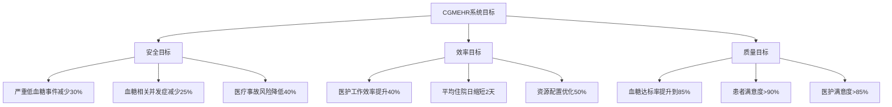
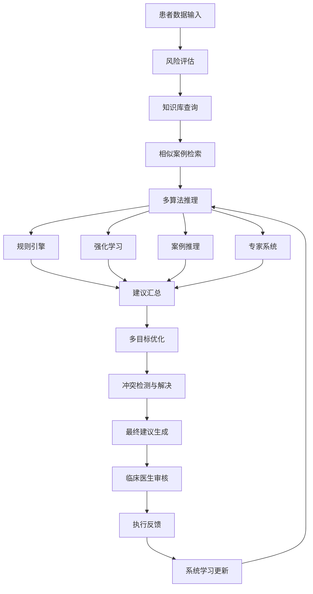
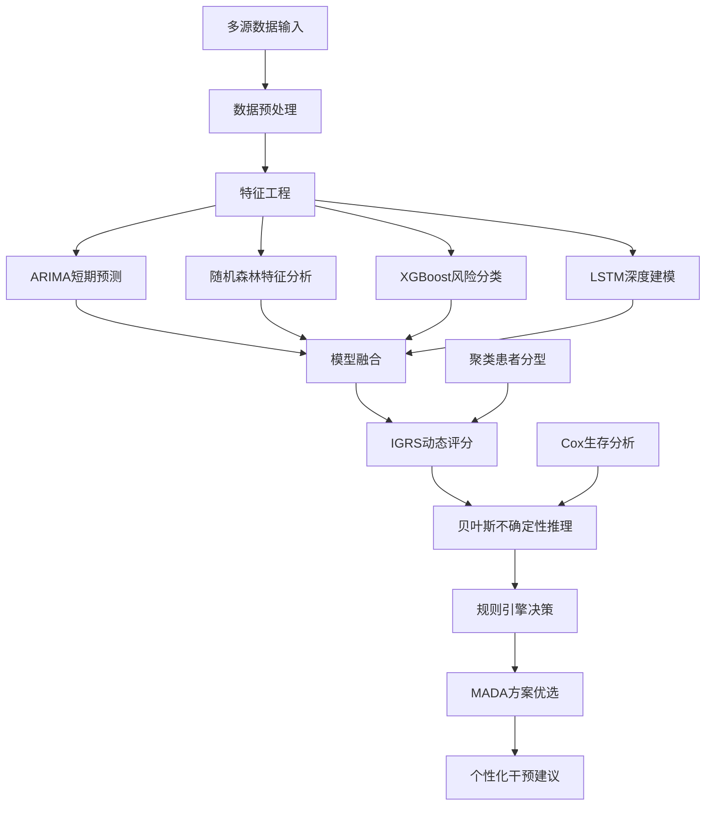
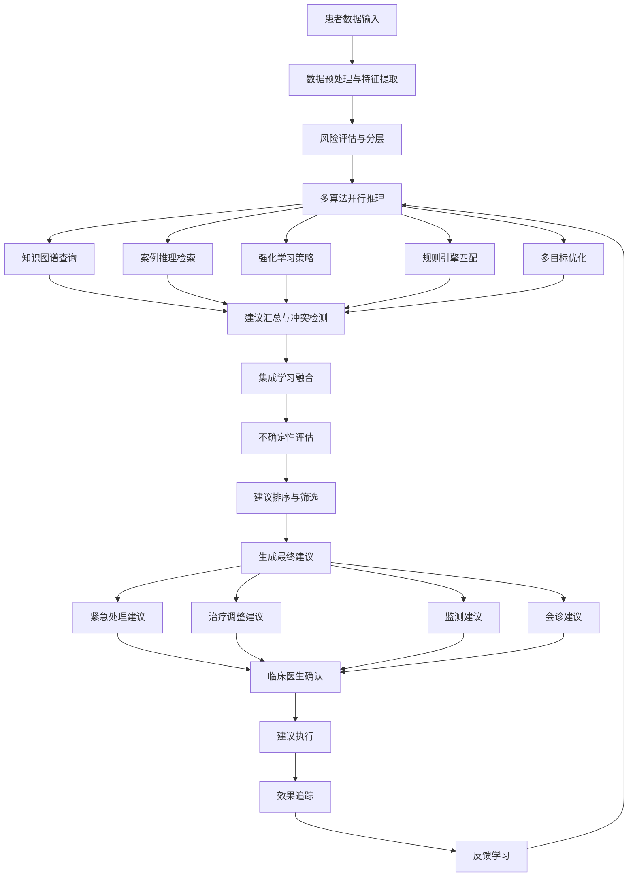
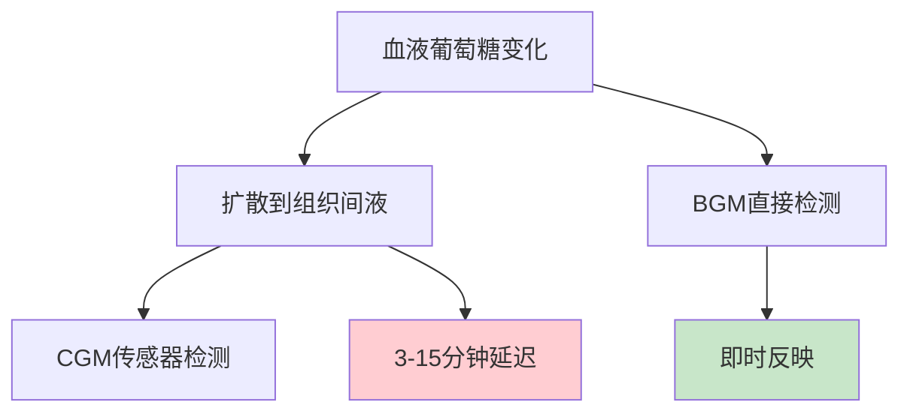
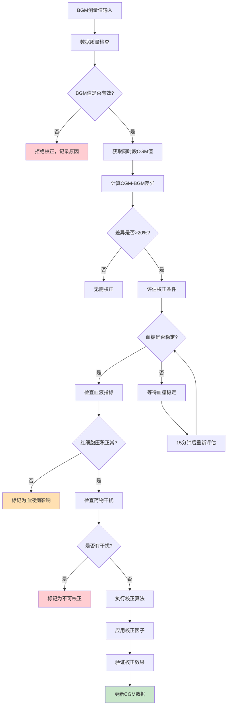
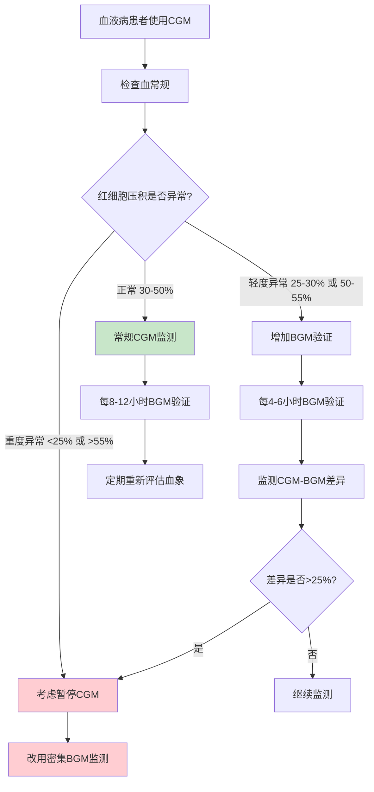

# CGMEHR系统算法与模型文档

## 0. 系统概述与领域背景

### 0.1 CGMEHR系统简介

**CGMEHR**（连续血糖监测与电子健康记录整合系统）是一个AI驱动的智能血糖管理平台，旨在将住院患者血糖管理从"被动抢救"转变为"主动预防"。

**系统本质**：把经验丰富的内分泌科医生的诊疗思路"数字化"，让系统能够24小时不间断地守护每一位患者的血糖安全。

### 0.2 核心技术组件

**CGM（连续血糖监测）**：
- 24小时自动血糖监测设备，每1-5分钟测一次血糖
- 相比传统方法（一天4-6次），CGM一天可测288-1440次
- 提供完整的血糖变化曲线，而非离散的时间点

**EHR（电子健康记录）**：
- 医院电子病历系统的数字化档案
- 包含检验报告、用药记录、诊断信息、手术记录等
- 提供患者的全面临床背景信息

**AI融合算法**：
- 将高频动态的CGM数据与静态/半静态的EHR数据智能融合
- 实现个性化、精准化的血糖风险评估和管理建议

### 0.3 系统实现目标



### 0.4 核心价值主张

1. **从"被动抢救"到"主动预防"**
   - 传统：血糖已经很危险了才发现 → 紧急抢救
   - CGMEHR：提前2小时预警血糖下降趋势 → 预防性干预

2. **从"经验判断"到"数据驱动"**
   - 传统：医生凭临床经验判断患者风险
   - CGMEHR：AI分析20万条真实数据，识别最重要的风险因子

3. **从"一刀切"到"个性化"**
   - 传统：所有糖尿病患者使用相同管理方案
   - CGMEHR：孕妇、老人、肾病患者各有专门的算法模型

### 0.5 辅助决策建议的四大来源

#### 5.1 临床指南和标准（权威来源）
- **ADA（美国糖尿病协会）**：血糖管理的"黄金标准"
- **ISPAD（国际儿童青少年糖尿病协会）**：儿童糖尿病管理规范
- **ACOG（美国妇产科医师学会）**：妊娠期血糖管理指南
- **KDOQI（美国肾脏病质量倡议）**：肾病患者血糖管理标准

*示例转化*：ADA指南"血糖<54mg/dL定义为严重低血糖" → 系统检测到该阈值时立即推送紧急警报

#### 5.2 循证医学证据（科学依据）
- **NICE-SUGAR研究**：重症患者血糖控制策略
- **ADVANCE研究**：2型糖尿病患者血糖控制目标
- **DCCT/EDIC研究**：1型糖尿病长期管理策略

*证据转化*：研究发现"TIR>70%与并发症显著相关" → 系统在TIR<70%时建议调整治疗方案

#### 5.3 专家知识和临床经验
多学科专家团队知识编码：
- 内分泌科医生：血糖管理核心决策逻辑
- 重症医学科医生：危重患者特殊情况处理
- 妇产科医生：妊娠期特殊需求管理
- 肾内科医生：肾功能影响的血糖处理策略
- 临床营养师：营养相关的血糖管理方案
- 临床药师：药物相互作用和剂量调整建议

#### 5.4 历史数据挖掘（数据驱动发现）
从20万条真实临床数据中学习：
- 识别高风险患者的共同特征模式
- 发现最危险的时间段和药物组合
- 挖掘预示不良事件的早期血糖信号

*数据驱动发现*：如"eGFR 7天内下降>25% + 胰岛素使用" → 低血糖风险增加300%

### 0.6 智能决策支持系统架构



---

## 1. ARIMA时间序列预测模型

### 1.1 算法原理
ARIMA(p,d,q) = 自回归(AR) + 差分(I) + 移动平均(MA)
- **AR(p)**：当前血糖值依赖于过去p个时间点的值
- **I(d)**：通过d次差分使数据平稳（去除趋势）
- **MA(q)**：当前值依赖于过去q个预测误差

### 1.2 优势
- 适合时间序列分析，能很好处理血糖数据的时序特征
- 成熟的统计学方法，理论基础扎实
- 能捕捉血糖数据的趋势和季节性模式
- 对于稳定生活模式患者预测准确度较高
- 计算复杂度相对较低，实时性好

### 1.3 缺点
- 假设未来模式与历史一致，无法适应突发变化
- 无法预测突发事件（意外进食、运动、药物）
- 预测时间窗口越长，误差累积越严重
- 对于非线性血糖波动建模能力有限
- 需要大量历史数据进行参数估计

### 1.4 实现方法
```python
# 数据预处理
glucose_series = preprocess_cgm_data(raw_data)
glucose_series = glucose_series.diff().dropna()  # 差分平稳化

# 模型识别
from statsmodels.tsa.arima.model import ARIMA
# 通过AIC/BIC准则选择最优(p,d,q)参数
best_aic = float('inf')
for p in range(5):
    for q in range(5):
        model = ARIMA(glucose_series, order=(p,1,q))
        fitted = model.fit()
        if fitted.aic < best_aic:
            best_aic = fitted.aic
            best_order = (p,1,q)

# 模型训练与预测
final_model = ARIMA(glucose_series, order=best_order)
fitted_model = final_model.fit()
forecast = fitted_model.forecast(steps=12)  # 预测未来12个时间点（60分钟）
```

### 1.5 适用场景
- 空腹状态下的基础血糖预测
- 稳定生活模式患者的短期趋势预警
- 作为基线模型与其他算法结果对比

---

## 2. IGRS 3.0动态风险评分模型

### 2.1 算法原理
基于鱼骨图分析的多维度风险因子量化评分系统，整合11个关键风险维度：
- CGM动态数据、EHR基线数据、动态干预数据
- 患者个体因素、临床应激因素、高级CGM衍生指标
- 药代动力学因素、动态临床轨迹、数据完整性
- 出院风险、社会心理因素

### 2.2 优势
- 全面覆盖血糖风险的各个维度，系统性强
- 实时动态评估，能快速响应患者状态变化
- 具有临床可解释性，医生能理解风险来源
- 支持特殊人群（妊娠、胰腺术后等）的专门评估
- 提供明确的风险分层和行动指令

### 2.3 缺点
- 规则复杂，需要大量领域专家知识维护
- 权重分配可能存在主观性，需要持续优化
- 对于罕见情况的处理可能不够完善
- 需要多系统数据支持，对数据质量要求高
- 规则更新和维护成本较高

### 2.4 实现方法
```python
class IGRS_Calculator:
    def __init__(self):
        self.base_rules = load_scoring_rules()
        self.special_models = {
            'pregnancy': MaternalFetalModel(),
            'pancreatectomy': PostPancreatectomyModel(),
            'dialysis': DialysisModel()
        }
    
    def calculate_risk(self, patient_data):
        # 1. 基础风险评分
        base_score = self.calculate_base_score(patient_data)
        
        # 2. 特殊人群附加评估
        special_adjustment = 0
        if patient_data.is_pregnant:
            special_adjustment += self.special_models['pregnancy'].calculate(patient_data)
        
        # 3. 紧急情况直接判定
        if self.is_emergency(patient_data):
            return {'level': 'URGENT', 'score': 100}
        
        # 4. 最终评分和分层
        final_score = base_score + special_adjustment
        risk_level = self.map_score_to_level(final_score)
        
        return {
            'score': final_score,
            'level': risk_level,
            'factors': self.explain_factors(patient_data)
        }
```

### 2.5 适用场景
- 住院患者血糖风险的实时评估
- 医护资源优先级分配决策
- 临床决策支持和预警系统

---

## 3. 随机森林（Random Forest）特征分析模型

### 3.1 算法原理
通过构建多个决策树并进行投票，识别对血糖风险最重要的特征因子。每棵树使用随机选择的特征子集和样本子集进行训练。

### 3.2 优势
- 能处理非线性特征关系，适合复杂医疗数据
- 自动特征选择，识别最重要的风险因子
- 对缺失值和异常值具有较强鲁棒性
- 不易过拟合，泛化能力强
- 能提供特征重要性排序，具有可解释性

### 3.3 缺点
- 模型复杂度较高，训练时间长
- 对于时序特征的处理能力有限
- 难以捕捉特征间的复杂交互关系
- 在处理高度不平衡数据时表现一般
- 模型大小较大，部署成本高

### 3.4 实现方法
```python
from sklearn.ensemble import RandomForestClassifier
from sklearn.model_selection import train_test_split

# 特征工程
features = extract_features(cgm_data, ehr_data)
# 包括：TIR, CV, MAGE, age, eGFR, medications等

# 模型训练
X_train, X_test, y_train, y_test = train_test_split(features, labels)
rf_model = RandomForestClassifier(
    n_estimators=100,
    max_depth=10,
    min_samples_split=5,
    random_state=42
)
rf_model.fit(X_train, y_train)

# 特征重要性分析
feature_importance = rf_model.feature_importances_
important_features = sorted(zip(feature_names, feature_importance), 
                          key=lambda x: x[1], reverse=True)
```

### 3.5 适用场景
- 识别最重要的血糖风险因子
- 特征选择和降维
- 为IGRS模型权重设定提供数据支持

---

## 4. XGBoost梯度提升模型

### 4.1 算法原理
通过迭代训练决策树，每次新树都专注于修正前面模型的错误，最终形成强分类器。使用梯度下降优化损失函数。

### 4.2 优势
- 预测精度高，在医疗预测任务中表现出色
- 支持并行计算，训练速度快
- 内置正则化，有效防止过拟合
- 能自动处理缺失值
- 提供特征重要性评估

### 4.3 缺点
- 超参数较多，调参复杂
- 对噪声敏感，需要高质量数据
- 模型可解释性较差
- 内存消耗大
- 容易出现过拟合（需要仔细调参）

### 4.4 实现方法
```python
import xgboost as xgb
from sklearn.model_selection import GridSearchCV

# 参数优化
param_grid = {
    'max_depth': [3, 6, 10],
    'learning_rate': [0.01, 0.1, 0.2],
    'n_estimators': [100, 500, 1000],
    'subsample': [0.8, 0.9, 1.0]
}

xgb_model = xgb.XGBClassifier()
grid_search = GridSearchCV(xgb_model, param_grid, cv=5, scoring='roc_auc')
grid_search.fit(X_train, y_train)

# 最优模型预测
best_model = grid_search.best_estimator_
predictions = best_model.predict_proba(X_test)[:, 1]
```

### 4.5 适用场景
- 血糖风险的精确分类预测
- 复杂非线性关系建模
- 模型融合中的强学习器

---

## 5. LSTM神经网络时序模型

### 5.1 算法原理
长短期记忆网络，通过门控机制选择性记忆和遗忘信息，专门处理序列数据中的长期依赖关系。

### 5.2 优势
- 专门设计用于处理时序数据，适合CGM时间序列
- 能捕捉长期依赖关系，记忆血糖的长期模式
- 对于血糖脆性和变异性建模能力强
- 可以处理变长序列
- 预测准确度高

### 5.3 缺点
- 训练时间长，计算资源需求大
- 需要大量数据进行训练
- 模型可解释性差，"黑箱"问题
- 超参数敏感，调参困难
- 容易过拟合，需要正则化

### 5.4 实现方法
```python
import tensorflow as tf
from tensorflow.keras.models import Sequential
from tensorflow.keras.layers import LSTM, Dense, Dropout

# 数据预处理
def create_sequences(data, seq_length=60):
    X, y = [], []
    for i in range(seq_length, len(data)):
        X.append(data[i-seq_length:i])
        y.append(data[i])
    return np.array(X), np.array(y)

# 模型构建
model = Sequential([
    LSTM(50, return_sequences=True, input_shape=(seq_length, n_features)),
    Dropout(0.2),
    LSTM(50, return_sequences=False),
    Dropout(0.2),
    Dense(25),
    Dense(1, activation='sigmoid')
])

model.compile(optimizer='adam', loss='binary_crossentropy', metrics=['accuracy'])
model.fit(X_train, y_train, epochs=100, batch_size=32, validation_split=0.2)
```

### 5.5 适用场景
- 血糖时间序列的深度建模
- 血糖脆性和变异性预测
- 长期血糖趋势预测

---

## 6. Cox回归生存分析模型

### 6.1 算法原理
分析各个协变量对"事件发生时间"的影响，用于预测血糖相关不良事件的发生风险和时间。

### 6.2 优势
- 专门处理"时间-事件"数据，适合医疗风险预测
- 能处理删失数据（部分患者未观察到事件）
- 提供风险比(HR)，便于临床解释
- 不需要假设特定的生存分布
- 能识别时间相关的风险因子

### 6.3 缺点
- 假设比例风险，实际可能不成立
- 对于非线性关系建模能力有限
- 需要较长的随访时间
- 对删失数据敏感
- 统计功效受样本量限制

### 6.4 实现方法
```python
from lifelines import CoxPHFitter
import pandas as pd

# 数据准备
survival_data = pd.DataFrame({
    'duration': time_to_event,  # 到事件发生的时间
    'event': event_occurred,    # 是否发生事件
    'age': patient_age,
    'TIR': time_in_range,
    'CV': coefficient_variation,
    'eGFR': kidney_function
})

# 模型拟合
cph = CoxPHFitter()
cph.fit(survival_data, duration_col='duration', event_col='event')

# 风险预测
risk_scores = cph.predict_partial_hazard(new_patient_data)
survival_function = cph.predict_survival_function(new_patient_data)
```

### 6.5 适用场景
- 血糖相关并发症风险评估
- 不良事件发生时间预测
- 临床试验效果评估

---

## 7. 聚类算法（K-means/层次聚类）

### 7.1 算法原理
根据血糖模式的相似性将患者分组，识别具有相似血糖管理需求的患者群体。

### 7.2 优势
- 无监督学习，不需要标注数据
- 能发现数据中的隐藏模式
- 支持个性化治疗方案设计
- 计算效率高
- 结果直观易懂

### 7.3 缺点
- 需要预先设定聚类数量
- 对初始值敏感（K-means）
- 难以处理非球形聚类
- 对噪声和异常值敏感
- 缺乏统计显著性检验

### 7.4 实现方法
```python
from sklearn.cluster import KMeans
from sklearn.preprocessing import StandardScaler

# 特征标准化
features = ['TIR', 'CV', 'MAGE', 'TBR', 'TAR', 'mean_glucose']
scaler = StandardScaler()
scaled_features = scaler.fit_transform(patient_features[features])

# K-means聚类
kmeans = KMeans(n_clusters=4, random_state=42)
cluster_labels = kmeans.fit_predict(scaled_features)

# 聚类结果分析
for i in range(4):
    cluster_patients = patient_features[cluster_labels == i]
    print(f"聚类 {i}: {len(cluster_patients)}名患者")
    print(f"平均TIR: {cluster_patients['TIR'].mean():.2f}")
    print(f"平均CV: {cluster_patients['CV'].mean():.2f}")
```

### 7.5 适用场景
- 患者分型和个性化管理
- 识别相似血糖模式的患者群体
- 临床试验分组和效果评估

---

## 8. 贝叶斯网络不确定性推理模型

### 8.1 算法原理
基于概率图模型，表示变量间的依赖关系，在不确定信息下进行推理和决策。

### 8.2 优势
- 能处理不确定性和缺失数据
- 具有很强的可解释性
- 能结合先验知识和专家经验
- 支持因果推理
- 提供概率形式的预测结果

### 8.3 缺点
- 网络结构设计复杂，需要专家知识
- 参数学习需要大量数据
- 计算复杂度高，推理速度慢
- 对于连续变量处理困难
- 难以处理大规模网络

### 8.4 实现方法
```python
from pgmpy.models import BayesianNetwork
from pgmpy.factors.discrete import TabularCPD
from pgmpy.inference import VariableElimination

# 网络结构定义
model = BayesianNetwork([
    ('Age', 'Hypoglycemia_Risk'),
    ('eGFR', 'Hypoglycemia_Risk'),
    ('CGM_CV', 'Hypoglycemia_Risk'),
    ('Insulin_Type', 'Hypoglycemia_Risk')
])

# 条件概率表定义
age_cpd = TabularCPD('Age', 3, [[0.3], [0.4], [0.3]])  # 年轻/中年/老年
# ... 其他CPD定义

model.add_cpds(age_cpd, egfr_cpd, cv_cpd, insulin_cpd, risk_cpd)

# 推理
inference = VariableElimination(model)
risk_prob = inference.query(
    variables=['Hypoglycemia_Risk'],
    evidence={'Age': 2, 'eGFR': 0, 'CGM_CV': 1}
)
```

### 8.5 适用场景
- 不确定环境下的血糖风险评估
- 结合专家知识的智能诊断
- 临床决策支持系统

---

## 9. 规则引擎决策支持系统

### 9.1 算法原理
基于if-then规则的专家系统，将临床指南和专家经验编码为可执行的规则集。

### 9.2 优势
- 高度可解释，医生容易理解和接受
- 规则可以直接对应临床指南
- 维护和更新相对简单
- 执行速度快
- 支持复杂的逻辑组合

### 9.3 缺点
- 规则制定需要大量专家参与
- 难以处理规则冲突
- 缺乏学习能力，无法自动优化
- 规则数量增长时维护困难
- 对于边界情况处理不够灵活

### 9.4 实现方法
```python
class GlycemicRuleEngine:
    def __init__(self):
        self.rules = self.load_clinical_rules()
    
    def evaluate(self, patient_data):
        recommendations = []
        
        # 规则1: 严重低血糖处理
        if patient_data.current_glucose < 54:
            recommendations.append({
                'action': 'IMMEDIATE_INTERVENTION',
                'priority': 'URGENT',
                'detail': '立即静脉推注50%葡萄糖20ml'
            })
        
        # 规则2: 老年患者低血糖风险
        if (patient_data.age > 65 and 
            patient_data.TBR > 4 and 
            patient_data.eGFR < 60):
            recommendations.append({
                'action': 'ADJUST_INSULIN',
                'priority': 'HIGH',
                'detail': '考虑减少胰岛素剂量20%'
            })
        
        return recommendations
```

### 9.5 适用场景
- 临床指南的自动化执行
- 标准化治疗建议生成
- 医护人员决策支持

---

## 10. 多属性决策分析（MADA）

### 10.1 算法原理
综合考虑多个评价指标（属性），通过权重分配和效用函数，为决策提供量化支持。

### 10.2 优势
- 能系统性处理多目标决策问题
- 提供透明的决策过程
- 支持权重的敏感性分析
- 结果易于解释和沟通
- 可以结合专家判断

### 10.3 缺点
- 权重设定具有主观性
- 对于大量属性处理复杂
- 假设属性间相互独立
- 需要将定性指标量化
- 决策者偏好可能影响结果

### 10.4 实现方法
```python
import numpy as np

def mada_analysis(alternatives, criteria, weights):
    """
    多属性决策分析
    alternatives: 决策方案矩阵 (n_alternatives × n_criteria)
    criteria: 评价准则类型 ('max' or 'min')
    weights: 权重向量
    """
    
    # 1. 数据标准化
    normalized = alternatives.copy()
    for j, criterion in enumerate(criteria):
        if criterion == 'max':
            normalized[:, j] = alternatives[:, j] / alternatives[:, j].max()
        else:
            normalized[:, j] = alternatives[:, j].min() / alternatives[:, j]
    
    # 2. 加权计算
    weighted_scores = np.dot(normalized, weights)
    
    # 3. 排序
    ranking = np.argsort(weighted_scores)[::-1]
    
    return weighted_scores, ranking

# 示例：选择最优血糖管理方案
alternatives = np.array([
    [85, 25, 0.8],  # 方案1: TIR, CV, 依从性
    [78, 30, 0.9],  # 方案2
    [90, 28, 0.7]   # 方案3
])

criteria = ['max', 'min', 'max']  # TIR越高越好，CV越低越好，依从性越高越好
weights = [0.5, 0.3, 0.2]

scores, ranking = mada_analysis(alternatives, criteria, weights)
```

### 10.5 适用场景
- 血糖管理方案优选
- 治疗效果综合评价
- 资源配置决策支持

---

## 算法协同工作流程

### 整体架构


### 算法选择策略
1. **实时预警**：优先使用IGRS + 规则引擎
2. **短期预测**：ARIMA + LSTM组合
3. **风险分层**：XGBoost + 随机森林
4. **个性化管理**：聚类 + MADA
5. **长期评估**：Cox回归 + 贝叶斯网络

这些算法各有特色，通过合理组合能够为CGMEHR系统提供全方位的智能决策支持。

---

## 11. 决策建议生成核心算法

### 11.1 知识图谱构建算法（Knowledge Graph）

#### 11.1.1 算法原理
将医学知识结构化存储为实体-关系网络，支持复杂医学推理和建议生成。

#### 11.1.2 优势
- 知识表示直观，易于理解和维护
- 支持复杂的多跳推理
- 便于整合多源医学知识
- 具有良好的可解释性
- 支持知识的动态更新

#### 11.1.3 缺点
- 知识图谱构建工作量大
- 实体和关系抽取准确率有限
- 推理效率相对较低
- 难以处理模糊和不确定知识
- 维护成本高

#### 11.1.4 实现方法
```python
class MedicalKnowledgeGraph:
    def __init__(self):
        self.entities = {
            "糖尿病": {"type": "disease", "severity": "chronic"},
            "低血糖": {"type": "symptom", "urgency": "high"}, 
            "胰岛素": {"type": "medication", "mechanism": "hormone"},
            "老年患者": {"type": "population", "risk_factor": "age"}
        }
        
        self.relationships = [
            ("老年患者", "易发生", "低血糖"),
            ("胰岛素", "可能导致", "低血糖"),
            ("低血糖", "治疗方法", "口服葡萄糖"),
            ("严重低血糖", "紧急处理", "静脉推注葡萄糖")
        ]
    
    def get_recommendations(self, patient_condition):
        # 基于患者情况和知识图谱生成建议
        recommendations = []
        
        # 查找相关实体和关系
        related_entities = self.find_related_entities(patient_condition)
        
        # 推理生成建议
        for entity in related_entities:
            treatment_relations = self.get_treatment_relations(entity)
            recommendations.extend(treatment_relations)
        
        return self.rank_recommendations(recommendations)
```

#### 11.1.5 适用场景
- 标准化临床指南的自动执行
- 复杂疾病关联分析
- 药物相互作用检查

### 11.2 自然语言处理算法（NLP）

#### 11.2.1 算法原理
从医学文献和临床指南中自动提取治疗建议规则，转化为可执行的决策逻辑。

#### 11.2.2 优势
- 能自动处理大量医学文献
- 及时更新最新医学进展
- 减少人工知识编码工作
- 支持多语言医学文献处理
- 能发现文献中的隐含规则

#### 11.2.3 缺点
- 医学术语识别准确率有限
- 难以处理复杂的逻辑关系
- 对文献质量依赖性强
- 可能引入错误或偏见
- 需要大量标注数据训练

#### 11.2.4 实现方法
```python
class MedicalNLP:
    def __init__(self):
        self.ner_model = load_medical_ner_model()
        self.relation_extractor = load_relation_model()
        
    def extract_guidelines(self, medical_text):
        # 从医学指南中提取"如果...那么..."的规则
        rules = []
        
        # 1. 命名实体识别
        entities = self.ner_model.extract(medical_text)
        
        # 2. 关系抽取
        relationships = self.relation_extractor.extract(medical_text, entities)
        
        # 3. 规则生成
        for rel in relationships:
            if rel.type == "CONDITION_TREATMENT":
                rule = self.convert_to_executable_rule(rel)
                rules.append(rule)
        
        return rules
    
    def convert_to_executable_rule(self, relationship):
        # 将自然语言关系转换为可执行规则
        condition = relationship.condition
        treatment = relationship.treatment
        
        return {
            'condition': self.parse_condition(condition),
            'action': self.parse_treatment(treatment),
            'confidence': relationship.confidence
        }
```

#### 11.2.5 适用场景
- 医学文献的自动知识提取
- 临床指南的快速更新
- 多语言医学知识整合

### 11.3 案例推理算法（Case-Based Reasoning）

#### 11.3.1 算法原理
基于"相似病例使用相似治疗"的原则，从历史成功案例中检索最佳处理方案。

#### 11.3.2 优势
- 直接利用临床经验
- 适合处理复杂非标准病例
- 学习成本低，容易理解
- 能处理不完整信息
- 随着案例积累性能提升

#### 11.3.3 缺点
- 需要大量高质量历史案例
- 相似度计算复杂
- 可能延续历史错误
- 对案例质量敏感
- 难以处理全新情况

#### 11.3.4 实现方法
```python
class CaseBasedReasoning:
    def __init__(self):
        self.case_database = self.load_historical_cases()
        self.similarity_weights = {
            'age': 0.2, 'diagnosis': 0.3, 'glucose_pattern': 0.3,
            'medications': 0.15, 'comorbidities': 0.05
        }
    
    def find_similar_cases(self, current_patient):
        similarities = []
        
        for case in self.case_database:
            similarity = self.calculate_similarity(current_patient, case)
            similarities.append((case, similarity))
        
        # 返回最相似的前5个案例
        return sorted(similarities, key=lambda x: x[1], reverse=True)[:5]
    
    def calculate_similarity(self, patient1, patient2):
        total_similarity = 0
        
        for feature, weight in self.similarity_weights.items():
            feature_similarity = self.feature_similarity(
                patient1[feature], patient2[feature], feature
            )
            total_similarity += feature_similarity * weight
        
        return total_similarity
    
    def generate_recommendation(self, similar_cases):
        # 分析相似案例的成功治疗方案
        successful_treatments = []
        
        for case, similarity in similar_cases:
            if case.outcome == "success":
                treatment_score = case.treatment_effectiveness * similarity
                successful_treatments.append((case.treatment, treatment_score))
        
        # 返回评分最高的治疗方案
        return max(successful_treatments, key=lambda x: x[1])[0]
```

#### 11.3.5 适用场景
- 复杂罕见病例的处理建议
- 新医生的辅助决策支持  
- 临床经验的传承和学习

### 11.4 强化学习算法（Reinforcement Learning）

#### 11.4.1 算法原理
通过与临床环境的交互，不断试错学习最优的血糖管理策略。

#### 11.4.2 优势
- 能自动发现最优策略
- 适应动态变化的临床环境
- 不需要大量标注数据
- 能处理序贯决策问题
- 持续学习改进

#### 11.4.3 缺点
- 学习过程可能影响患者
- 收敛速度慢
- 需要合理的奖励函数设计
- 可解释性差
- 对环境变化敏感

#### 11.4.4 实现方法
```python
class GlycemicRL:
    def __init__(self):
        self.q_table = {}  # 状态-动作价值表
        self.learning_rate = 0.1
        self.discount_factor = 0.9
        self.epsilon = 0.1  # 探索率
        
        self.actions = [
            'reduce_insulin_10%', 'reduce_insulin_20%',
            'increase_monitoring', 'request_consultation',
            'adjust_nutrition', 'no_change'
        ]
    
    def get_state(self, patient_data):
        # 将患者数据转换为状态向量
        return (
            patient_data.glucose_level_category,
            patient_data.age_group,
            patient_data.kidney_function_level,
            patient_data.medication_complexity
        )
    
    def choose_action(self, state):
        if random.random() < self.epsilon:
            # 探索：随机选择动作
            return random.choice(self.actions)
        else:
            # 利用：选择当前最优动作
            q_values = [self.q_table.get((state, action), 0) 
                       for action in self.actions]
            best_action_index = np.argmax(q_values)
            return self.actions[best_action_index]
    
    def update_q_value(self, state, action, reward, next_state):
        current_q = self.q_table.get((state, action), 0)
        
        # 计算下一状态的最大Q值
        next_q_values = [self.q_table.get((next_state, a), 0) 
                        for a in self.actions]
        max_next_q = max(next_q_values)
        
        # Q学习更新公式
        new_q = current_q + self.learning_rate * (
            reward + self.discount_factor * max_next_q - current_q
        )
        
        self.q_table[(state, action)] = new_q
    
    def calculate_reward(self, patient_before, patient_after, action_taken):
        # 根据血糖改善情况计算奖励
        glucose_improvement = self.glucose_improvement_score(
            patient_before.glucose_metrics, 
            patient_after.glucose_metrics
        )
        
        safety_score = self.safety_score(patient_after)
        efficiency_score = self.efficiency_score(action_taken)
        
        return glucose_improvement + safety_score + efficiency_score
```

#### 11.4.5 适用场景
- 个性化治疗策略优化
- 复杂多变环境的决策
- 长期治疗效果优化

### 11.5 多目标优化算法（Multi-Objective Optimization）

#### 11.5.1 算法原理
在血糖控制效果、安全性、患者依从性、治疗成本等多个目标间找到最佳平衡。

#### 11.5.2 优势
- 考虑多个相互冲突的目标
- 提供多个可行解供选择
- 符合临床实际需求
- 支持个性化偏好设置
- 决策过程透明

#### 11.5.3 缺点
- 计算复杂度高
- 目标权重设定困难
- 解的选择需要专业判断
- 可能出现次优解
- 对目标函数设计敏感

#### 11.5.4 实现方法
```python
class MultiObjectiveOptimizer:
    def __init__(self):
        self.objectives = {
            'efficacy': self.glucose_control_objective,      # 血糖控制效果
            'safety': self.hypoglycemia_risk_objective,      # 低血糖风险
            'convenience': self.treatment_burden_objective,   # 治疗负担
            'cost': self.treatment_cost_objective            # 治疗成本
        }
    
    def optimize_treatment(self, patient_data, preferences=None):
        # 定义决策变量（治疗方案参数）
        decision_variables = {
            'insulin_dose': (0, 100),      # 胰岛素剂量范围
            'monitoring_frequency': (2, 8), # 监测频率范围
            'medication_complexity': (1, 5)  # 方案复杂度
        }
        
        # 使用NSGA-II算法寻找帕累托最优解
        pareto_solutions = self.nsga2_algorithm(
            decision_variables, 
            self.objectives, 
            patient_data,
            population_size=100,
            generations=50
        )
        
        # 根据患者偏好选择最终方案
        if preferences:
            final_solution = self.select_preferred_solution(
                pareto_solutions, preferences
            )
        else:
            # 使用默认权重
            final_solution = self.weighted_selection(pareto_solutions)
        
        return final_solution
    
    def glucose_control_objective(self, solution, patient_data):
        # 预测血糖控制效果（最大化）
        predicted_tir = self.predict_tir(solution, patient_data)
        return predicted_tir
    
    def hypoglycemia_risk_objective(self, solution, patient_data):
        # 预测低血糖风险（最小化）
        risk_score = self.predict_hypoglycemia_risk(solution, patient_data)
        return -risk_score  # 转换为最大化问题
    
    def treatment_burden_objective(self, solution, patient_data):
        # 评估治疗负担（最小化）
        burden_score = (
            solution['monitoring_frequency'] * 0.3 +
            solution['medication_complexity'] * 0.7
        )
        return -burden_score
    
    def treatment_cost_objective(self, solution, patient_data):
        # 计算治疗成本（最小化）
        cost = (
            solution['insulin_dose'] * 0.5 +
            solution['monitoring_frequency'] * 2.0
        )
        return -cost
```

#### 11.5.5 适用场景
- 个性化治疗方案设计
- 资源受限环境下的决策
- 患者偏好驱动的治疗选择

### 11.6 集成学习算法（Ensemble Learning）

#### 11.6.1 算法原理
综合多个决策算法的建议，通过投票或加权平均提高决策的可靠性和准确性。

#### 11.6.2 优势
- 提高决策准确性和稳定性
- 减少个别算法的偏见
- 提供不确定性估计
- 增强系统鲁棒性
- 支持算法性能监控

#### 11.6.3 缺点
- 系统复杂度增加
- 计算资源需求大
- 可解释性降低
- 权重设定需要经验
- 维护成本高

#### 11.6.4 实现方法
```python
class DecisionEnsemble:
    def __init__(self):
        self.decision_makers = {
            'rule_based': RuleBasedSystem(),
            'case_based': CaseBasedReasoning(),
            'reinforcement': ReinforcementLearner(),
            'expert_system': ExpertSystem(),
            'multi_objective': MultiObjectiveOptimizer()
        }
        
        # 各系统的权重（可动态调整）
        self.weights = {
            'rule_based': 0.25,
            'case_based': 0.20,
            'reinforcement': 0.25,
            'expert_system': 0.20,
            'multi_objective': 0.10
        }
    
    def make_decision(self, patient_data):
        recommendations = {}
        confidences = {}
        
        # 收集各系统的建议
        for name, system in self.decision_makers.items():
            try:
                rec = system.recommend(patient_data)
                recommendations[name] = rec
                confidences[name] = rec.confidence * self.weights[name]
            except Exception as e:
                print(f"System {name} failed: {e}")
                confidences[name] = 0
        
        # 集成决策
        final_recommendation = self.aggregate_recommendations(
            recommendations, confidences
        )
        
        # 计算整体置信度和不确定性
        final_recommendation.confidence = sum(confidences.values())
        final_recommendation.uncertainty = self.calculate_uncertainty(
            recommendations, confidences
        )
        
        # 添加决策解释
        final_recommendation.explanation = self.generate_explanation(
            recommendations, confidences
        )
        
        return final_recommendation
    
    def aggregate_recommendations(self, recommendations, confidences):
        # 对于不同类型的建议使用不同的聚合策略
        
        # 1. 紧急程度：取最高级别
        urgency_levels = [rec.urgency for rec in recommendations.values()]
        final_urgency = max(urgency_levels)
        
        # 2. 具体行动：加权投票
        actions = {}
        for name, rec in recommendations.items():
            weight = confidences[name]
            for action in rec.actions:
                if action in actions:
                    actions[action] += weight
                else:
                    actions[action] = weight
        
        # 选择得票最高的行动
        final_actions = sorted(actions.items(), 
                             key=lambda x: x[1], reverse=True)[:3]
        
        return Recommendation(
            urgency=final_urgency,
            actions=[action for action, score in final_actions],
            action_scores=dict(final_actions)
        )
    
    def calculate_uncertainty(self, recommendations, confidences):
        # 计算决策的不确定性
        if len(recommendations) <= 1:
            return 1.0
        
        # 基于建议的一致性计算不确定性
        action_agreements = self.calculate_action_agreement(recommendations)
        urgency_agreements = self.calculate_urgency_agreement(recommendations)
        
        # 一致性越高，不确定性越低
        uncertainty = 1.0 - (action_agreements + urgency_agreements) / 2.0
        return min(uncertainty, 1.0)
    
    def generate_explanation(self, recommendations, confidences):
        # 生成决策解释
        explanation = {
            'contributing_systems': [],
            'confidence_breakdown': confidences,
            'decision_rationale': []
        }
        
        for name, rec in recommendations.items():
            if confidences[name] > 0.1:  # 只包含有效贡献的系统
                explanation['contributing_systems'].append({
                    'system': name,
                    'recommendation': rec.summary,
                    'confidence': confidences[name]
                })
        
        return explanation
```

#### 11.6.5 适用场景
- 高风险临床决策
- 复杂多变的患者情况
- 需要高可靠性的系统

### 11.7 决策建议生成完整流程



### 11.8 建议示例

#### 11.8.1 紧急情况建议
```json
{
  "urgency": "URGENT",
  "patient_id": "P001",
  "timestamp": "2024-01-15 14:30:00",
  "trigger": "血糖降至2.8mmol/L",
  "recommendations": [
    {
      "action": "立即静脉推注50%葡萄糖20ml",
      "priority": 1,
      "time_limit": "5分钟内",
      "executor": "责任护士"
    },
    {
      "action": "15分钟后复查血糖",
      "priority": 2,
      "time_limit": "15分钟后",
      "executor": "责任护士"
    }
  ],
  "rationale": "严重低血糖，需立即纠正",
  "confidence": 0.95
}
```

#### 11.8.2 预防性建议
```json
{
  "urgency": "HIGH",
  "patient_id": "P002", 
  "timestamp": "2024-01-15 09:00:00",
  "trigger": "TIR持续下降，夜间低血糖3次",
  "recommendations": [
    {
      "action": "减少长效胰岛素剂量20%",
      "priority": 1,
      "rationale": "降低夜间低血糖风险",
      "expected_effect": "夜间血糖稳定性改善"
    },
    {
      "action": "申请内分泌科会诊",
      "priority": 2,
      "rationale": "需要专业评估胰岛素方案",
      "timeline": "24小时内"
    }
  ],
  "confidence": 0.87
}
```

#### 11.8.3 个性化建议
```json
{
  "urgency": "MODERATE",
  "patient_id": "P003",
  "patient_profile": "75岁，独居，认知轻度下降",
  "recommendations": [
    {
      "action": "简化胰岛素方案",
      "details": "从一日多次改为一日两次",
      "rationale": "提高患者依从性，降低用药错误风险"
    },
    {
      "action": "联系家属加强监护",
      "rationale": "老年独居患者需要额外支持",
      "contact_info": "已通知女儿(138****1234)"
    },
    {
      "action": "增加血糖监测频率",
      "details": "从每日4次增加到6次",
      "duration": "1周"
    }
  ],
  "confidence": 0.78
}
```

通过这些决策支持算法的协同工作，CGMEHR系统能够为临床医护人员提供及时、准确、个性化的血糖管理建议，真正实现"智能化的临床决策支持"。

---

## 12. CGM数据质量管理与校正策略

### 12.1 CGM与BGM差异分析

#### 12.1.1 数值差异的主要原因

**生理学差异（根本原因）**：



- **CGM**：测量组织间液（皮下）的葡萄糖浓度
- **BGM**：测量血液（毛细血管）的葡萄糖浓度
- **生理延迟**：血糖变化后需3-15分钟才能反映到组织间液
- **个体差异**：延迟程度因血流、组织灌注而异

**技术和设备因素**：
- 传感器老化（使用7-14天后精度下降）
- 传感器安装位置和深度影响
- 不同品牌CGM的算法差异
- 环境干扰（温度、电磁场、机械压迫）

**药物干扰（按CGM品牌分类）**：

| 药物 | Dexcom G6/G7 | Medtronic Guardian | FreeStyle Libre |
|------|--------------|-------------------|-----------------|
| **对乙酰氨基酚** | ✅轻微影响 | ❌严重干扰(假性升高) | ⚠️中等影响 |
| **维生素C(>1g/天)** | ⚠️可能升高 | ⚠️可能升高 | ⚠️可能升高 |
| **羟基脲** | ❌严重干扰 | ❌严重干扰 | ❌严重干扰 |
| **多巴胺类** | ✅影响较小 | ⚠️中等影响 | ✅影响较小 |

#### 12.1.2 血液病对CGM准确性的影响

**红细胞压积异常的影响机制**：

正常范围：男性42-52%，女性37-47%

**红细胞压积过低（<30%，贫血）**：
- 血液黏度降低，组织灌注模式改变
- 氧气携带能力下降，影响组织代谢
- CGM读数通常**偏低**10-25%
- 血糖变化的响应延迟增加

**红细胞压积过高（>55%，红细胞增多症）**：
- 血液黏度增加，微循环阻力增大
- 葡萄糖从血液向组织间液的扩散受阻
- CGM读数可能**偏高**或**波动大**
- 响应血糖变化更加滞后

**具体血液病的影响**：

```python
class HematologyImpactAssessment:
    def assess_cgm_reliability(self, patient_blood_data):
        impact_levels = {
            'mild_anemia': {
                'hct_range': (30, 35),
                'cgm_accuracy': 'moderate_impact',
                'recommendation': '增加BGM验证至每4-6小时'
            },
            'severe_anemia': {
                'hct_range': (0, 25),
                'cgm_accuracy': 'severe_impact',
                'recommendation': '建议暂停CGM，改用密集BGM监测'
            },
            'polycythemia': {
                'hct_range': (55, 100),
                'cgm_accuracy': 'moderate_to_severe_impact',
                'recommendation': '谨慎使用CGM，每2-4小时BGM验证'
            }
        }
        
        hct = patient_blood_data.hematocrit
        
        for condition, criteria in impact_levels.items():
            if criteria['hct_range'][0] <= hct <= criteria['hct_range'][1]:
                return {
                    'condition': condition,
                    'reliability': criteria['cgm_accuracy'],
                    'action': criteria['recommendation']
                }
        
        return {'condition': 'normal', 'reliability': 'high', 'action': '常规监测'}
```

**CGM品牌对血液病的敏感性差异**：

| CGM品牌 | 对血液病敏感性 | 红细胞压积影响阈值 | 推荐处理 |
|---------|----------------|-------------------|----------|
| **Dexcom G6/G7** | 中等敏感 | <30% 或 >50% | 增加BGM验证 |
| **Medtronic Guardian** | 高敏感 | <35% 或 >50% | 考虑暂停使用 |
| **FreeStyle Libre** | 相对耐受 | <25% 或 >55% | 可继续使用但需验证 |

### 12.2 BGM校正CGM的可行性与策略

#### 12.2.1 校正可行性评估

**理论可行性**：**可以，但有严格条件**

✅ **适合校正的情况**：
- CGM读数与BGM差异>20%，且持续存在
- 血糖相对稳定（变化<3mmol/L/小时）
- 无明显药物干扰
- 传感器使用3-10天（性能稳定期）
- 红细胞压积在30-50%范围内

❌ **不适合校正的情况**：
- 血糖快速变化期（餐后2小时内）
- 存在严重药物干扰（如羟基脲、大剂量对乙酰氨基酚）
- 传感器即将到期（>10天）或刚安装（<24小时）
- 患者血流灌注不良
- 严重血液病（红细胞压积<25%或>55%）

#### 12.2.2 自动化校正算法

```python
class CGMCalibrationSystem:
    def __init__(self):
        self.calibration_history = []
        self.max_calibrations_per_day = 4
        
    def pre_calibration_check(self, patient_data, cgm_value, bgm_value):
        """校正前评估"""
        checks = {
            'time_sync': abs(cgm_value.timestamp - bgm_value.timestamp) < 300,  # 5分钟内
            'glucose_stable': self.calculate_glucose_trend(patient_data) < 3.0,  # <3mmol/L/h
            'no_drug_interference': self.check_drug_interference(patient_data),
            'hematocrit_normal': 25 <= patient_data.hematocrit <= 55,
            'sensor_valid': self.check_sensor_status(patient_data),
            'significant_difference': abs(cgm_value - bgm_value) / bgm_value > 0.2,
            'calibration_limit': len([c for c in self.calibration_history 
                                    if c.timestamp > now() - timedelta(hours=24)]) < self.max_calibrations_per_day
        }
        
        return all(checks.values()), checks
    
    def execute_calibration(self, cgm_value, bgm_value, patient_id):
        """执行校正"""
        # 1. 计算校正因子
        correction_factor = bgm_value / cgm_value
        
        # 2. 应用移动平均，避免过度校正
        if len(self.calibration_history) > 0:
            recent_factors = [cf for cf, timestamp in self.calibration_history 
                            if timestamp > now() - timedelta(hours=6)]
            if recent_factors:
                correction_factor = np.mean(recent_factors + [correction_factor])
        
        # 3. 限制校正幅度，避免突变
        correction_factor = np.clip(correction_factor, 0.7, 1.3)
        
        # 4. 应用校正
        calibrated_cgm = cgm_value * correction_factor
        
        # 5. 记录校正历史
        self.calibration_history.append((correction_factor, now()))
        
        return {
            'calibrated_value': calibrated_cgm,
            'correction_factor': correction_factor,
            'confidence': self.calculate_calibration_confidence(correction_factor)
        }
    
    def assess_calibration_risk(self):
        """评估校正风险"""
        risks = []
        
        # 频繁校正风险
        recent_calibrations = len([c for c in self.calibration_history 
                                 if c[1] > now() - timedelta(hours=6)])
        if recent_calibrations > 3:
            risks.append("频繁校正可能导致CGM算法不稳定")
        
        # 大幅度校正风险  
        if any(abs(c[0] - 1.0) > 0.3 for c in self.calibration_history[-3:]):
            risks.append("大幅度校正提示传感器可能存在问题")
        
        # 不一致校正风险
        if len(self.calibration_history) >= 5:
            recent_factors = [c[0] for c in self.calibration_history[-5:]]
            if np.std(recent_factors) > 0.15:
                risks.append("校正因子变化大，建议检查传感器")
                
        return risks
```

#### 12.2.3 校正流程设计



### 12.3 血液病患者的CGM管理策略

#### 12.3.1 风险评估流程



#### 12.3.2 不同血液病的CGM使用指南

```python
class HematologyPatientCGMGuideline:
    def get_monitoring_strategy(self, patient):
        strategies = {
            'mild_anemia': {
                'hct_range': (25, 30),
                'cgm_status': 'cautious_use',
                'bgm_frequency': 'every_4_hours',
                'decision_basis': 'bgm_confirmed',
                'special_notes': '关注CGM偏低趋势'
            },
            'severe_anemia': {
                'hct_range': (0, 25),
                'cgm_status': 'not_recommended',
                'bgm_frequency': 'every_2_hours',
                'decision_basis': 'bgm_only',
                'special_notes': '等血象改善后重新评估CGM使用'
            },
            'polycythemia': {
                'hct_range': (55, 100),
                'cgm_status': 'high_risk_use',
                'bgm_frequency': 'every_3_hours',
                'decision_basis': 'bgm_confirmed',
                'special_notes': '警惕CGM读数波动和延迟'
            },
            'acute_leukemia': {
                'hct_range': 'variable',
                'cgm_status': 'contraindicated',
                'bgm_frequency': 'every_1-2_hours',
                'decision_basis': 'bgm_only',
                'special_notes': '化疗期间禁用CGM，缓解期重新评估'
            },
            'thrombocytopenia': {
                'platelet_threshold': 20000,
                'cgm_status': 'bleeding_risk',
                'recommendation': '血小板<20k时避免CGM安装',
                'alternative': '口服葡萄糖耐量试验监测'
            }
        }
        
        hct = patient.hematocrit
        platelet = patient.platelet_count
        
        # 血小板过低的特殊处理
        if platelet < 20000:
            return strategies['thrombocytopenia']
        
        # 根据红细胞压积分类
        for condition, criteria in strategies.items():
            if 'hct_range' in criteria and criteria['hct_range'] != 'variable':
                if criteria['hct_range'][0] <= hct <= criteria['hct_range'][1]:
                    return criteria
        
        return {'cgm_status': 'normal_use', 'bgm_frequency': 'every_8_hours'}
```

#### 12.3.3 特殊情况处理

**输血对CGM的影响**：
```python
def handle_transfusion_impact(patient, transfusion_type):
    recommendations = {
        'pre_transfusion': [
            '输血前进行BGM基线测量',
            '暂时降低CGM数据权重'
        ],
        'during_transfusion': [
            '每小时BGM监测',
            'CGM数据仅作趋势参考',
            '密切观察血糖波动'
        ],
        'post_transfusion': [
            '输血完成后2小时进行BGM验证',
            '评估新的红细胞压积对CGM的影响',
            '必要时重新校正CGM'
        ]
    }
    
    if transfusion_type == 'packed_rbc':
        recommendations['special_notes'] = [
            '红细胞输注显著改变血液黏度',
            '预期CGM准确性在24小时内逐步恢复',
            '输血期间建议每2小时BGM验证'
        ]
    
    return recommendations
```

**造血干细胞移植患者**：
- **移植前**：化疗导致血象异常，CGM完全不可靠
- **移植后早期**：造血功能恢复期，CGM准确性逐渐改善
- **感染期**：炎症反应影响血糖调节，增加BGM监测
- **GVHD期间**：激素治疗影响血糖，需密切监测

### 12.4 数据质量监控与预警系统

#### 12.4.1 实时质量评估算法

```python
class CGMDataQualityMonitor:
    def __init__(self):
        self.quality_metrics = {
            'accuracy': 0.0,
            'precision': 0.0,
            'completeness': 0.0,
            'stability': 0.0
        }
        
    def assess_real_time_quality(self, cgm_data, patient_data):
        quality_score = 0
        alerts = []
        
        # 1. 准确性评估（基于最近的BGM对比）
        recent_bgm = self.get_recent_bgm_values(patient_data, hours=6)
        if recent_bgm:
            accuracy = self.calculate_mard(cgm_data, recent_bgm)
            if accuracy > 20:  # MARD > 20%
                alerts.append({
                    'type': 'accuracy_warning',
                    'message': f'CGM准确性下降，MARD: {accuracy:.1f}%',
                    'action': '建议BGM验证'
                })
            quality_score += max(0, 100 - accuracy * 2)
        
        # 2. 数据完整性评估
        completeness = self.calculate_data_completeness(cgm_data, hours=24)
        if completeness < 80:
            alerts.append({
                'type': 'completeness_warning',
                'message': f'CGM数据缺失率过高: {100-completeness:.1f}%',
                'action': '检查传感器连接'
            })
        quality_score += completeness
        
        # 3. 血液学影响评估
        hct_impact = self.assess_hematocrit_impact(patient_data.hematocrit)
        if hct_impact['risk_level'] == 'high':
            alerts.append({
                'type': 'hematology_warning',
                'message': f'血液学异常影响CGM准确性: {hct_impact["description"]}',
                'action': hct_impact['recommendation']
            })
            quality_score -= 30
        
        # 4. 药物干扰评估
        drug_interference = self.check_drug_interference_detailed(patient_data.medications)
        if drug_interference['interference_level'] == 'severe':
            alerts.append({
                'type': 'drug_interference',
                'message': f'严重药物干扰: {drug_interference["drug_name"]}',
                'action': '考虑暂停CGM使用'
            })
            quality_score -= 50
        
        return {
            'overall_quality_score': max(0, min(100, quality_score / 2)),
            'quality_level': self.categorize_quality(quality_score / 2),
            'alerts': alerts,
            'recommendations': self.generate_quality_recommendations(alerts)
        }
    
    def categorize_quality(self, score):
        if score >= 85:
            return 'excellent'
        elif score >= 70:
            return 'good'
        elif score >= 50:
            return 'acceptable'
        else:
            return 'poor'
    
    def generate_quality_recommendations(self, alerts):
        recommendations = []
        
        alert_types = [alert['type'] for alert in alerts]
        
        if 'accuracy_warning' in alert_types:
            recommendations.append('增加BGM验证频率至每4小时')
        
        if 'hematology_warning' in alert_types:
            recommendations.append('考虑血液学咨询，评估是否需要暂停CGM')
        
        if 'drug_interference' in alert_types:
            recommendations.append('与药剂师协商替代药物或调整监测策略')
        
        if len(alerts) >= 3:
            recommendations.append('建议暂时改用传统BGM监测')
        
        return recommendations
```

#### 12.4.2 预警阈值设定

```python
CGM_QUALITY_THRESHOLDS = {
    'mard_warning': 20,      # MARD > 20%时警告
    'mard_critical': 30,     # MARD > 30%时严重警告
    'completeness_min': 80,  # 数据完整性 < 80%时警告
    'hct_abnormal_mild': {'low': 30, 'high': 50},    # 轻度异常
    'hct_abnormal_severe': {'low': 25, 'high': 55},   # 严重异常
    'bgm_cgm_difference': 25,  # BGM-CGM差异 > 25%时警告
    'calibration_frequency_max': 4,  # 24小时内最多校正次数
    'sensor_age_warning': 10,  # 传感器使用>10天时警告
}
```

通过这套完整的CGM数据质量管理与校正策略，CGMEHR系统能够：

1. **实时识别**CGM数据质量问题
2. **智能评估**是否适合进行BGM校正
3. **自动处理**血液病等特殊情况
4. **动态调整**监测策略和预警阈值
5. **提供个性化**的数据质量改善建议

这确保了系统在各种临床情况下都能提供可靠、准确的血糖监测数据，为临床决策提供坚实的数据基础。