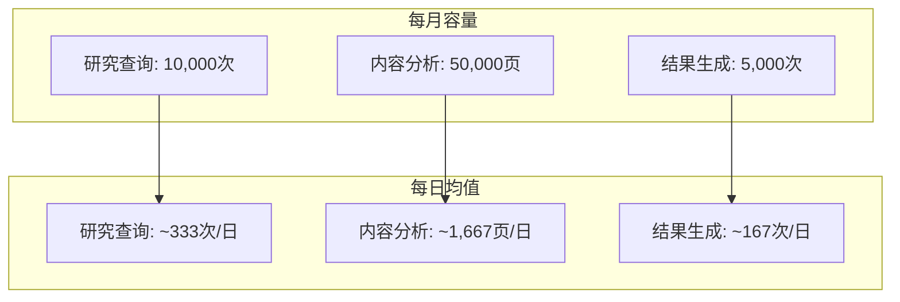
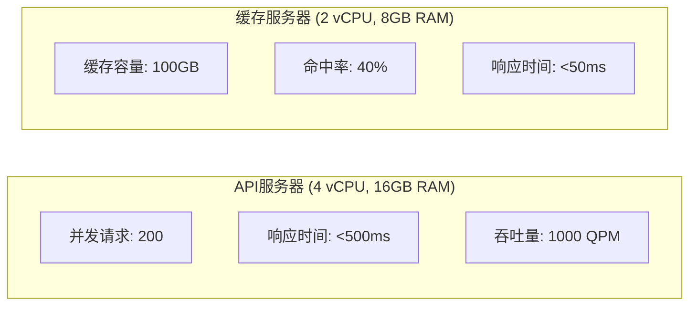
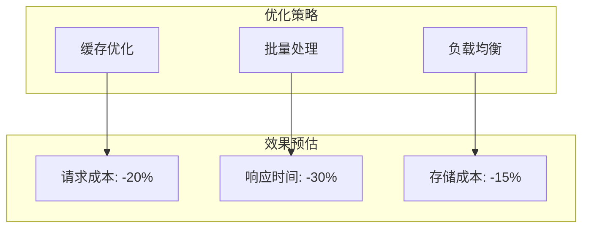

# 代谢疾病研究助手 - 容量与使用量分析

## 1. 当前预估配置支持量

### 1.1 API调用容量


### 1.2 用户支持量分析

| 用户类型 | 日均使用量 | 月度容量支持用户数 |
|---------|-----------|-----------------|
| 重度用户 | 10次查询/日 | 33用户 |
| 中度用户 | 5次查询/日 | 66用户 |
| 轻度用户 | 2次查询/日 | 165用户 |
| 混合用户群 | 5次查询/日 | ~80用户 |

### 1.3 机构支持量

| 机构规模 | 研究人员数量 | 支持机构数 |
|---------|------------|-----------|
| 大型医院 | 30-50人 | 2-3家 |
| 中型医院 | 15-30人 | 4-5家 |
| 小型医院 | 5-15人 | 8-10家 |
| 研究机构 | 10-20人 | 5-6家 |

## 2. 资源利用分析

### 2.1 服务器资源


### 2.2 存储容量
- 数据存储：500GB SSD
  - 研究数据：200GB
  - 缓存数据：100GB
  - 系统数据：50GB
  - 预留空间：150GB

### 2.3 带宽使用
- CDN流量：1TB/月
  - 文档下载：400GB
  - API响应：300GB
  - 系统数据：200GB
  - 预留：100GB

## 3. 扩展方案

### 3.1 小规模扩展（100-200用户）
| 资源调整 | 增加成本/月 | 新增容量 |
|---------|------------|---------|
| API调用 | +$4,250 | 翻倍 |
| 服务器 | +$200 | 双倍并发 |
| 存储 | +$50 | +500GB |
| 总计 | +$4,500 | 支持200用户 |

### 3.2 中规模扩展（200-500用户）
| 资源调整 | 增加成本/月 | 新增容量 |
|---------|------------|---------|
| API调用 | +$12,750 | 3倍容量 |
| 服务器集群 | +$800 | 4倍并发 |
| 分布式存储 | +$300 | +2TB |
| 总计 | +$13,850 | 支持500用户 |

### 3.3 大规模扩展（500-1000用户）
| 资源调整 | 增加成本/月 | 新增容量 |
|---------|------------|---------|
| API调用 | +$29,750 | 7倍容量 |
| 服务器集群 | +$2,000 | 10倍并发 |
| 分布式系统 | +$1,000 | 完整集群 |
| 总计 | +$32,750 | 支持1000用户 |

## 4. 优化建议

### 4.1 成本效益优化


### 4.2 具体措施

1. **智能缓存策略**
   - 热点数据预缓存
   - 用户行为分析
   - 自适应缓存期限
   ```python
   class AdaptiveCache:
       def __init__(self):
           self.hot_data = defaultdict(int)
           self.cache_policy = self._calculate_policy()
   
       def _calculate_policy(self):
           """基于使用频率动态调整缓存策略"""
           pass
   ```

2. **请求合并处理**
   - 相似查询合并
   - 批量API调用
   - 结果复用
   ```python
   class RequestBatcher:
       def __init__(self, window_size: int = 100):
           self.queue = []
           self.window_size = window_size
   
       async def batch_process(self, requests: List[Request]):
           """批量处理请求"""
           pass
   ```

3. **资源动态分配**
   - 峰值自动扩容
   - 低谷资源回收
   - 区域负载均衡
   ```python
   class ResourceManager:
       def __init__(self):
           self.resources = ResourcePool()
           self.monitor = LoadMonitor()
   
       async def adjust_resources(self):
           """动态调整资源配置"""
           pass
   ```

## 5. 使用量监控

### 5.1 监控指标
1. **用户级别**
   - 日活跃用户数
   - 平均查询次数
   - 响应满意度
   - 使用高峰期

2. **系统级别**
   - API调用量
   - 资源使用率
   - 响应时间
   - 错误率

### 5.2 告警阈值
| 指标 | 警告阈值 | 严重阈值 | 处理措施 |
|------|---------|---------|---------|
| API使用量 | 80% | 90% | 自动扩容 |
| 响应时间 | >800ms | >1s | 负载均衡 |
| 错误率 | >1% | >5% | 服务降级 |
| 存储使用 | 70% | 85% | 清理/扩容 |

## 6. 扩展建议

### 6.1 近期扩展（1-3个月）
1. 实现智能缓存
2. 优化批处理
3. 监控系统部署

### 6.2 中期扩展（3-6个月）
1. 分布式架构
2. 区域部署
3. 资源池扩充

### 6.3 长期扩展（6-12个月）
1. 多区域部署
2. 智能负载均衡
3. 预测式扩容
