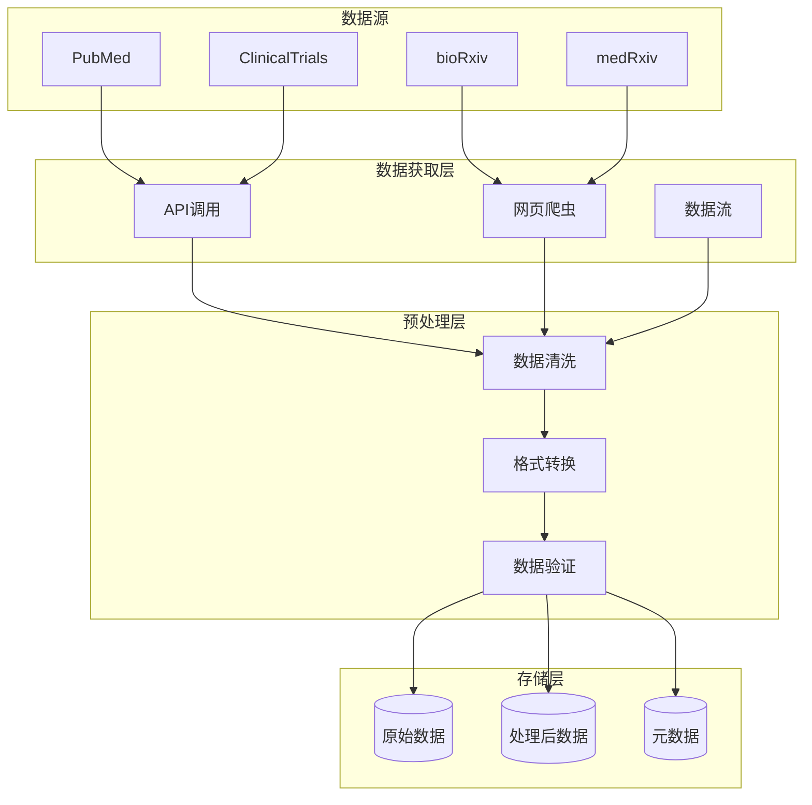
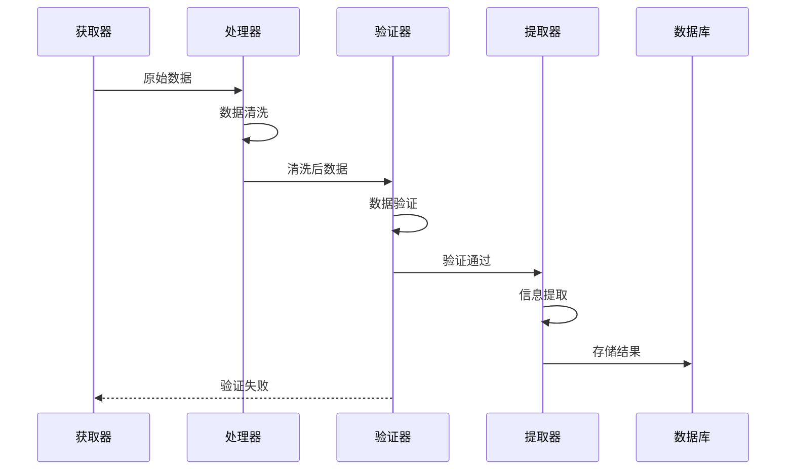
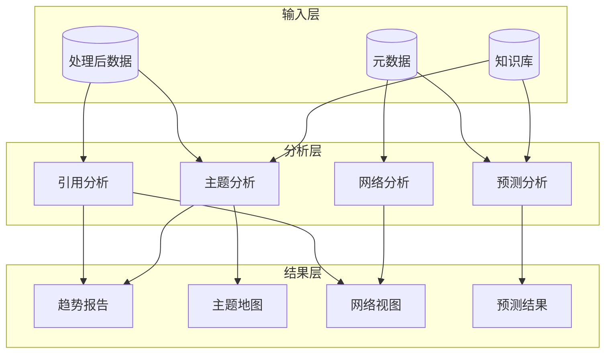
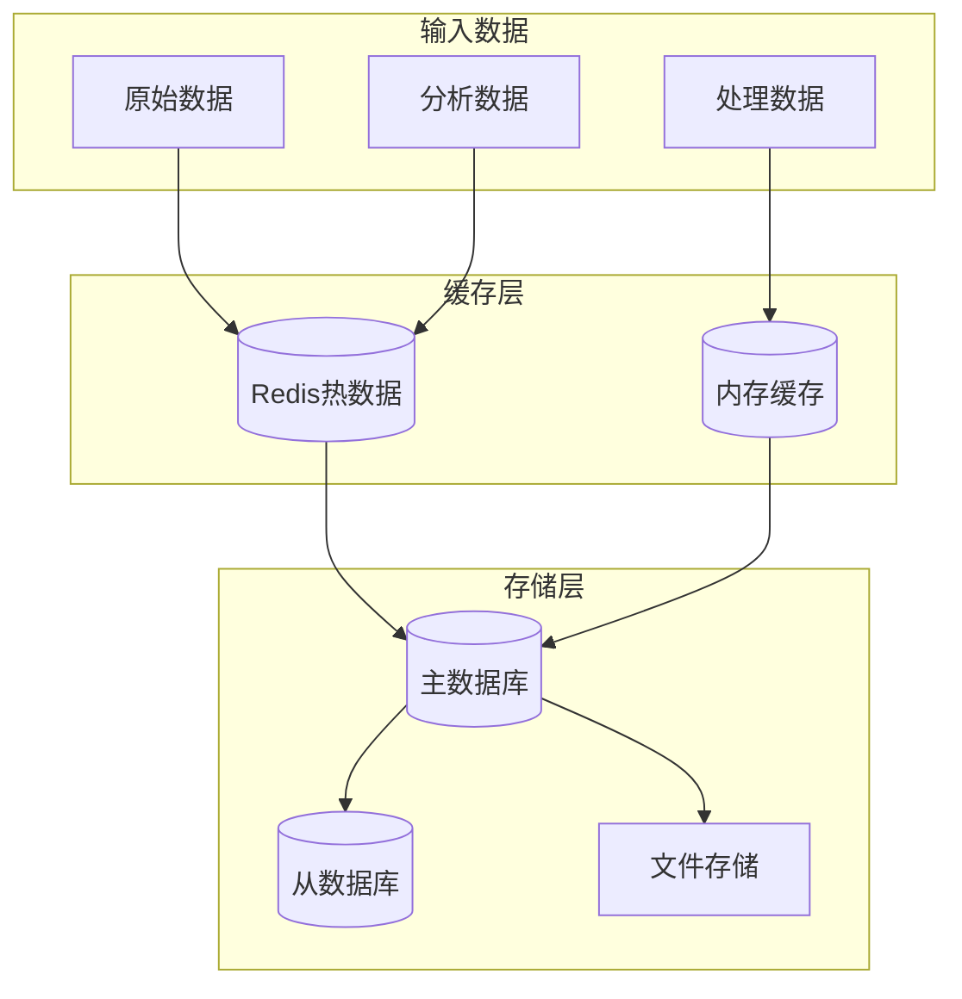
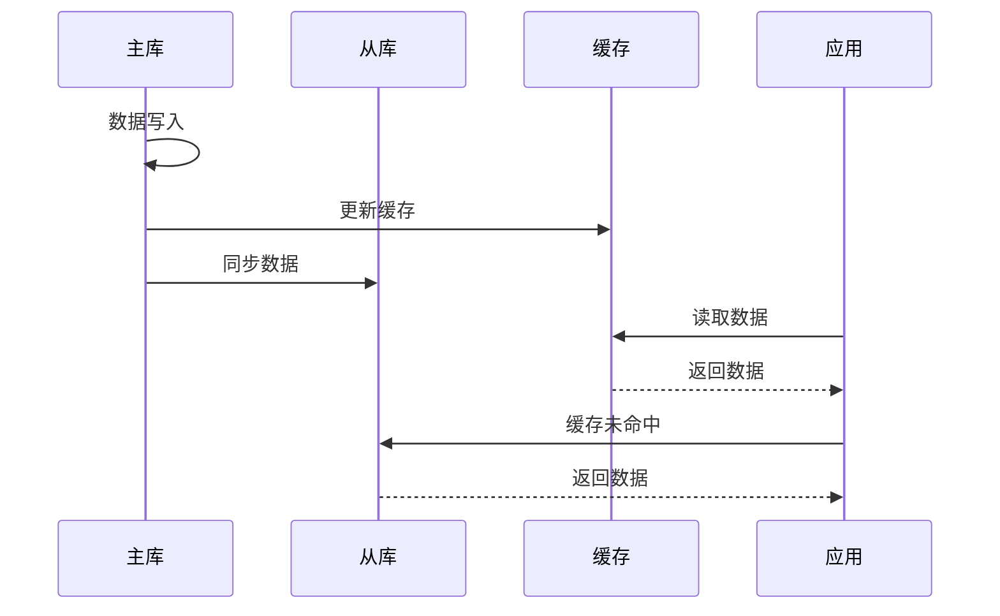
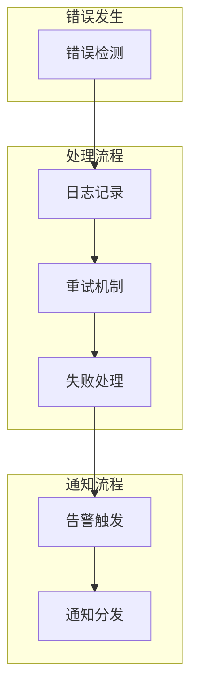
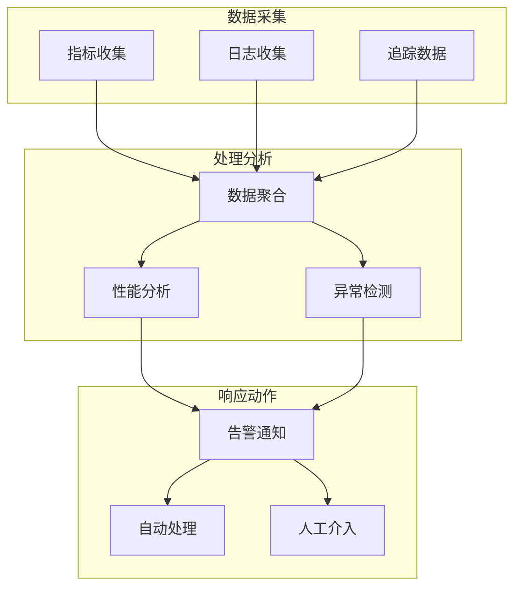

# 代谢疾病研究助手 - 数据流程设计

## 1. 数据采集流程



### 1.1 数据获取策略

```python
class DataFetchStrategy:
    """数据获取策略"""
    
    async def fetch_pubmed(self, query: str, days: int) -> List[Paper]:
        """获取PubMed数据
        1. 构建API请求
        2. 发送请求获取数据
        3. 解析响应数据
        4. 验证数据完整性
        """
        pass
    
    async def fetch_preprints(self, sources: List[str]) -> List[Paper]:
        """获取预印本数据
        1. 初始化爬虫
        2. 设置过滤条件
        3. 执行数据爬取
        4. 提取目标数据
        """
        pass
    
    async def fetch_clinical_trials(self, condition: str) -> List[Trial]:
        """获取临床试验数据
        1. 查询试验数据库
        2. 过滤相关试验
        3. 提取试验信息
        4. 关联相关文献
        """
        pass
```

## 2. 数据处理流程



### 2.1 数据处理策略

```python
class DataProcessor:
    """数据处理器"""
    
    def clean_data(self, data: RawData) -> CleanData:
        """数据清洗
        1. 去除无效字符
        2. 统一格式
        3. 补充缺失值
        4. 标准化处理
        """
        pass
    
    def validate_data(self, data: CleanData) -> bool:
        """数据验证
        1. 完整性检查
        2. 格式检查
        3. 一致性检查
        4. 有效性检查
        """
        pass
    
    def extract_info(self, data: CleanData) -> ProcessedData:
        """信息提取
        1. 提取元数据
        2. 提取关键信息
        3. 建立关联关系
        4. 生成索引
        """
        pass
```

## 3. 分析处理流程



### 3.1 分析流程实现

```python
class AnalysisFlow:
    """分析流程"""
    
    async def analyze_citations(self, papers: List[Paper]) -> CitationAnalysis:
        """引用分析
        1. 构建引用网络
        2. 计算影响力指标
        3. 识别关键文献
        4. 生成引用报告
        """
        pass
    
    async def analyze_topics(self, papers: List[Paper]) -> TopicAnalysis:
        """主题分析
        1. 提取研究主题
        2. 计算主题相关性
        3. 追踪主题演变
        4. 生成主题地图
        """
        pass
    
    async def predict_trends(self, historical_data: Dict) -> TrendPrediction:
        """趋势预测
        1. 数据预处理
        2. 特征工程
        3. 模型预测
        4. 结果验证
        """
        pass
```

## 4. 存储流程



### 4.1 存储策略

```python
class StorageStrategy:
    """存储策略"""
    
    async def store_raw_data(self, data: RawData):
        """存储原始数据
        1. 数据分类
        2. 选择存储方式
        3. 执行存储
        4. 更新索引
        """
        pass
    
    async def store_processed_data(self, data: ProcessedData):
        """存储处理后数据
        1. 数据转换
        2. 建立关联
        3. 更新缓存
        4. 同步存储
        """
        pass
    
    async def store_analysis_result(self, result: AnalysisResult):
        """存储分析结果
        1. 结果验证
        2. 格式转换
        3. 数据关联
        4. 多级存储
        """
        pass
```

## 5. 数据同步流程



### 5.1 同步策略

```python
class SyncStrategy:
    """同步策略"""
    
    async def sync_to_replica(self, data: Any):
        """同步到从库
        1. 准备同步数据
        2. 检查从库状态
        3. 执行同步操作
        4. 验证同步结果
        """
        pass
    
    async def update_cache(self, data: Any):
        """更新缓存
        1. 确定缓存策略
        2. 更新缓存数据
        3. 设置过期时间
        4. 清理旧缓存
        """
        pass
```

## 6. 错误处理流程



### 6.1 错误处理策略

```python
class ErrorHandler:
    """错误处理器"""
    
    async def handle_fetch_error(self, error: Exception):
        """处理获取错误
        1. 记录错误信息
        2. 尝试重新获取
        3. 降级处理
        4. 发送通知
        """
        pass
    
    async def handle_process_error(self, error: Exception):
        """处理分析错误
        1. 保存现场
        2. 记录错误
        3. 回滚操作
        4. 通知相关方
        """
        pass
```

## 7. 监控流程



### 7.1 监控策略

```python
class MonitorStrategy:
    """监控策略"""
    
    async def monitor_performance(self):
        """性能监控
        1. 收集性能指标
        2. 分析性能数据
        3. 生成性能报告
        4. 触发优化建议
        """
        pass
    
    async def monitor_errors(self):
        """错误监控
        1. 收集错误信息
        2. 分析错误模式
        3. 生成错误报告
        4. 触发处理流程
        """
        pass
```
