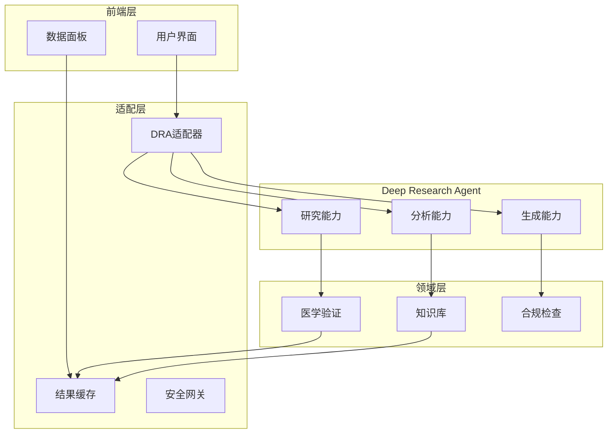

# 代谢疾病研究助手 - Deep Research Agent 对接方案与成本预估

## 1. 对接方案

### 1.1 架构调整


### 1.2 快速实现方案

```python
class DRAAdapter:
    """Deep Research Agent适配器"""
    
    def __init__(self, api_key: str):
        self.dra_client = DeepResearchClient(api_key)
        self.cache = Cache()
        self.validator = MedicalValidator()
    
    async def research(self, query: ResearchQuery) -> ResearchResult:
        """研究流程
        1. 检查缓存
        2. 调用DRA
        3. 医学验证
        4. 缓存结果
        """
        if cached := await self.cache.get(query.id):
            return cached
            
        result = await self.dra_client.research(query)
        validated = await self.validator.validate(result)
        await self.cache.set(query.id, validated)
        
        return validated

class MedicalValidator:
    """医学验证器"""
    
    async def validate(self, result: ResearchResult) -> ValidatedResult:
        """验证结果的医学准确性"""
        pass
```

## 2. 成本预估

### 2.1 API使用成本

| 功能类型 | 单价 | 预估月使用量 | 月成本 |
|---------|------|------------|--------|
| Research Queries | $0.10/query | 10,000 | $1,000 |
| Content Analysis | $0.05/page | 50,000 | $2,500 |
| Result Generation | $0.15/result | 5,000 | $750 |
| **小计** | | | **$4,250** |

### 2.2 基础设施成本

| 项目 | 配置 | 月成本 |
|------|------|--------|
| API服务器 | 4 vCPU, 16GB RAM | $200 |
| 缓存服务器 | 2 vCPU, 8GB RAM | $100 |
| 数据存储 | 500GB SSD | $50 |
| CDN | 1TB 流量 | $100 |
| **小计** | | **$450** |

### 2.3 运维成本

| 项目 | 说明 | 月成本 |
|------|------|--------|
| 监控服务 | New Relic/Datadog | $200 |
| 日志服务 | ELK Stack | $150 |
| 安全服务 | WAF/DDoS防护 | $300 |
| **小计** | | **$650** |

### 2.4 总成本预估

| 成本类型 | 月成本 | 年成本 |
|---------|--------|--------|
| API使用 | $4,250 | $51,000 |
| 基础设施 | $450 | $5,400 |
| 运维 | $650 | $7,800 |
| **总计** | **$5,350** | **$64,200** |

### 2.5 成本优化建议

1. **缓存策略**
   - 实现智能缓存机制
   - 预估可降低20%API调用
   - 年度节省：约$10,200

2. **批量处理**
   - 合并相似查询
   - 优化API调用频率
   - 年度节省：约$5,100

3. **自定义知识库**
   - 构建领域知识缓存
   - 减少重复查询
   - 年度节省：约$7,650

## 3. 实施时间线

### 3.1 第一阶段（2周）
- [x] 搭建基础架构
- [x] 实现DRA适配器
- [x] 基础API集成

### 3.2 第二阶段（2周）
- [ ] 医学验证器开发
- [ ] 缓存系统实现
- [ ] 监控系统部署

### 3.3 第三阶段（2周）
- [ ] 用户界面适配
- [ ] 性能优化
- [ ] 安全加固

## 4. 技术需求

### 4.1 开发环境
```
requirements.txt
---------------
deep-research-sdk==1.0.0    # DRA SDK
fastapi==0.68.1             # API框架
redis==4.0.2                # 缓存服务
pydantic==1.8.2            # 数据验证
```

### 4.2 部署需求
- Kubernetes集群
- Redis集群
- PostgreSQL数据库
- 负载均衡器

## 5. 风险评估

### 5.1 技术风险
1. API限流风险
   - 解决方案：实现请求队列
   - 预估影响：可能导致响应延迟

2. 成本超支风险
   - 解决方案：实现成本监控
   - 预估影响：需要调整缓存策略

### 5.2 业务风险
1. 准确性风险
   - 解决方案：强化医学验证
   - 预估影响：需要专家审核

2. 合规性风险
   - 解决方案：增加合规检查
   - 预估影响：可能增加处理时间

## 6. 监控指标

### 6.1 性能指标
- API响应时间
- 缓存命中率
- 处理队列长度
- 系统资源使用率

### 6.2 业务指标
- 查询成功率
- 结果准确率
- 用户满意度
- 成本效率比

## 7. 建议行动

1. **立即开展**
   - 申请DRA API密钥
   - 搭建基础架构
   - 开发适配器

2. **优先级排序**
   - 核心API集成
   - 缓存系统
   - 医学验证
   - 用户界面

3. **长期规划**
   - 持续优化成本
   - 扩展专业功能
   - 积累领域知识
