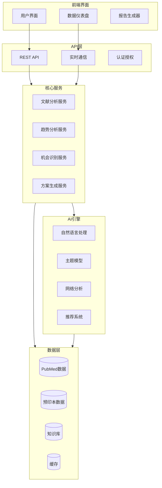
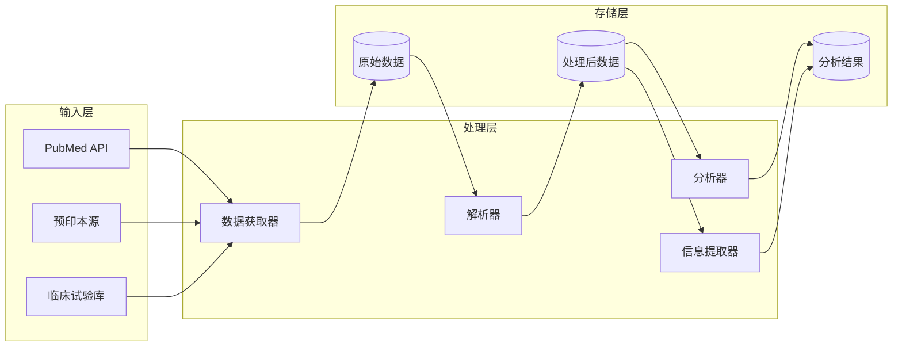
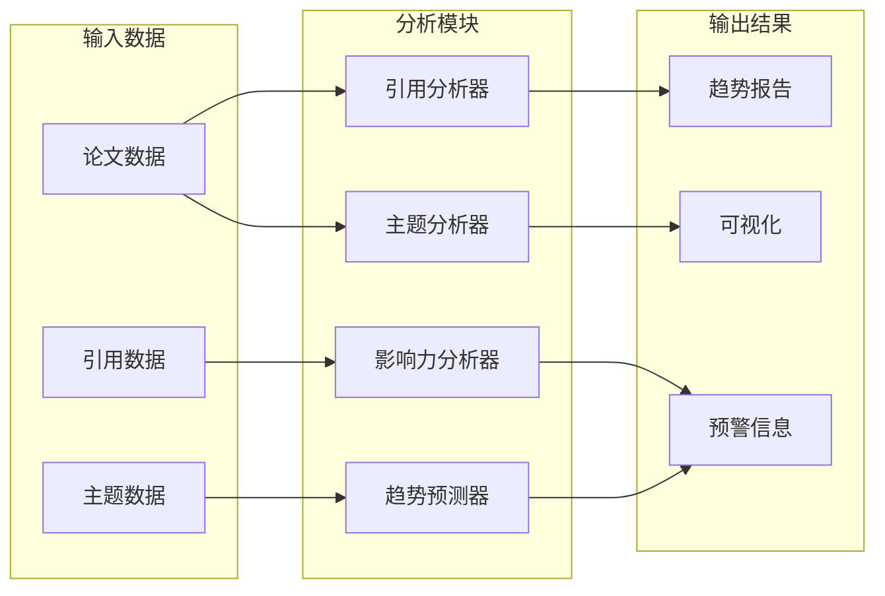
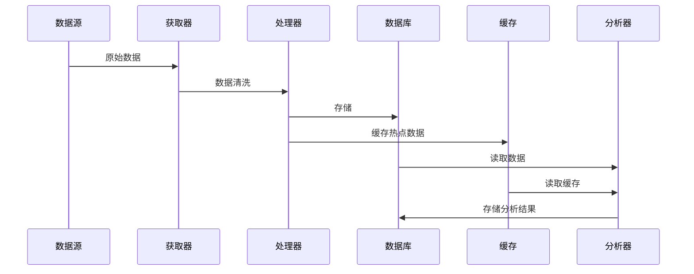
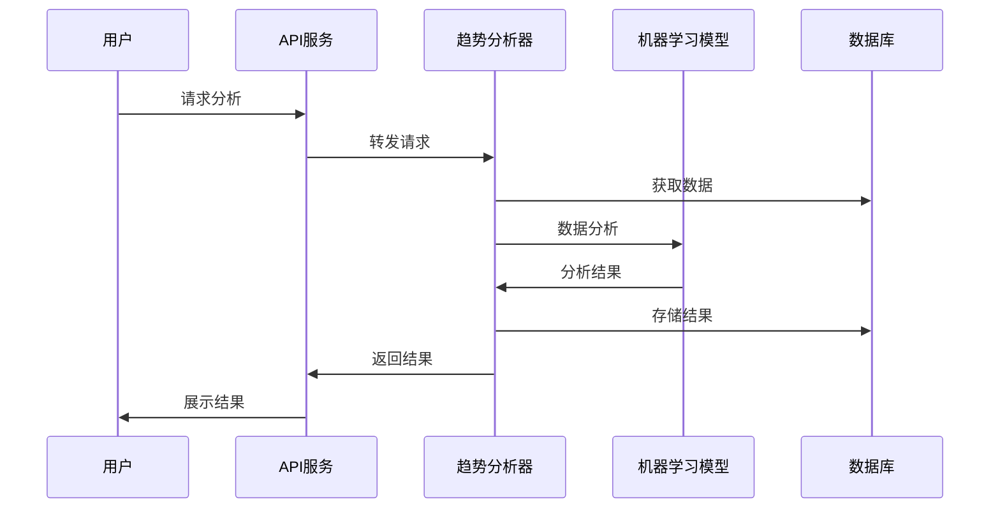
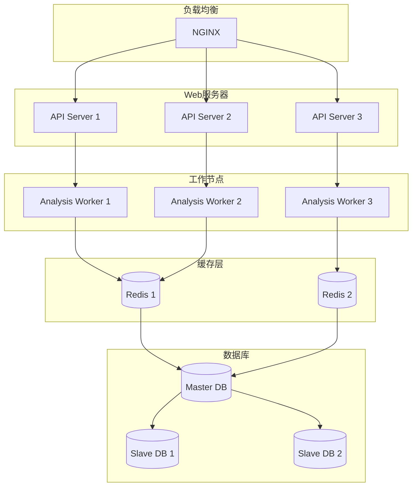
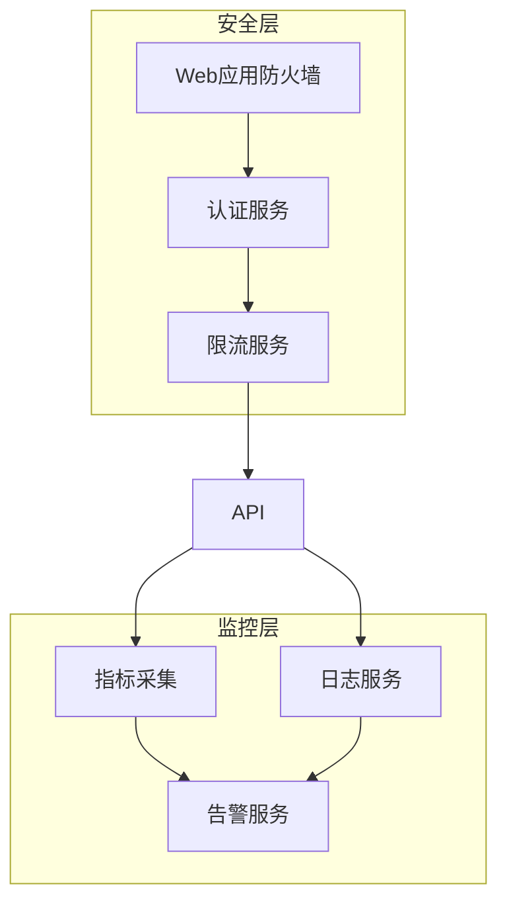

# 代谢疾病研究助手 - 系统架构设计

## 1. 整体架构



## 2. 核心服务架构

### 2.1 文献分析服务



### 2.2 趋势分析服务



## 3. 数据流设计

### 3.1 文献数据流



### 3.2 分析流程



## 4. 模块设计

### 4.1 数据获取模块

```python
class DataFetcher:
    """数据获取器基类"""
    
    async def fetch(self, query: str) -> List[Document]:
        """获取数据"""
        pass
    
    async def validate(self, data: Document) -> bool:
        """验证数据"""
        pass
    
    async def preprocess(self, data: Document) -> Document:
        """预处理数据"""
        pass

class PubMedFetcher(DataFetcher):
    """PubMed数据获取器"""
    
    async def fetch(self, query: str) -> List[Document]:
        """获取PubMed数据"""
        pass

class PreprintFetcher(DataFetcher):
    """预印本数据获取器"""
    
    async def fetch(self, query: str) -> List[Document]:
        """获取预印本数据"""
        pass
```

### 4.2 分析模块

```python
class Analyzer:
    """分析器基类"""
    
    async def analyze(self, data: List[Document]) -> Analysis:
        """分析数据"""
        pass
    
    async def validate_result(self, result: Analysis) -> bool:
        """验证结果"""
        pass
    
    async def store_result(self, result: Analysis) -> bool:
        """存储结果"""
        pass

class CitationAnalyzer(Analyzer):
    """引用分析器"""
    
    async def analyze_network(self, papers: List[Paper]) -> NetworkAnalysis:
        """分析引用网络"""
        pass

class TopicAnalyzer(Analyzer):
    """主题分析器"""
    
    async def extract_topics(self, papers: List[Paper]) -> List[Topic]:
        """提取主题"""
        pass
```

## 5. 数据模型

### 5.1 文献模型

```python
@dataclass
class Paper:
    """论文数据模型"""
    id: str
    title: str
    authors: List[str]
    abstract: str
    keywords: List[str]
    publication_date: datetime
    journal: str
    citations: List[str]
    full_text: Optional[str]
    metadata: Dict

@dataclass
class Analysis:
    """分析结果模型"""
    paper_id: str
    analysis_type: str
    result: Dict
    timestamp: datetime
    confidence: float
    metadata: Dict
```

### 5.2 趋势模型

```python
@dataclass
class Trend:
    """趋势数据模型"""
    topic: str
    timeframe: Tuple[datetime, datetime]
    momentum: float
    volume: int
    key_papers: List[str]
    related_topics: List[str]
    prediction: Dict

@dataclass
class Impact:
    """影响力数据模型"""
    paper_id: str
    citation_count: int
    citation_velocity: float
    author_impact: float
    journal_impact: float
    altmetrics: Dict
```

## 6. API设计

### 6.1 REST API

```python
@router.get("/papers/search")
async def search_papers(
    query: str,
    start_date: datetime = None,
    end_date: datetime = None,
    limit: int = 100
) -> List[Paper]:
    """搜索论文"""
    pass

@router.post("/analysis/trend")
async def analyze_trend(
    topic: str,
    timeframe: Tuple[datetime, datetime],
    analysis_type: str
) -> TrendAnalysis:
    """分析趋势"""
    pass
```

### 6.2 WebSocket API

```python
@websocket("/ws/updates")
async def paper_updates(websocket: WebSocket):
    """实时更新"""
    await websocket.accept()
    while True:
        try:
            data = await get_updates()
            await websocket.send_json(data)
        except Exception as e:
            await websocket.close()
            break
```

## 7. 部署架构



## 8. 安全架构


