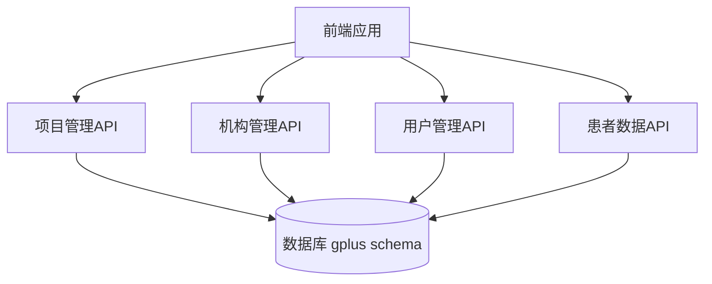
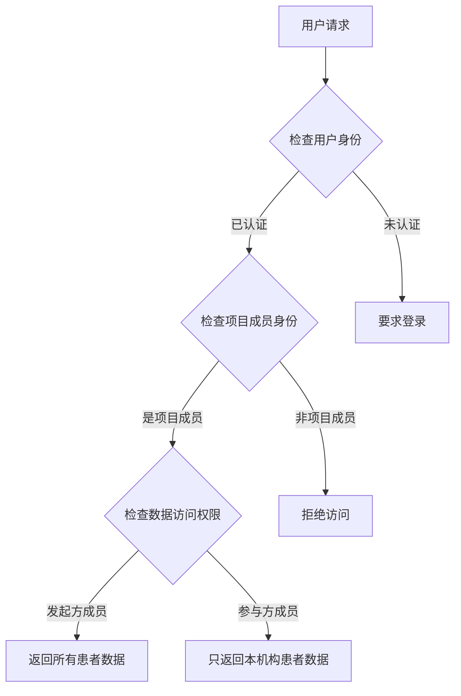
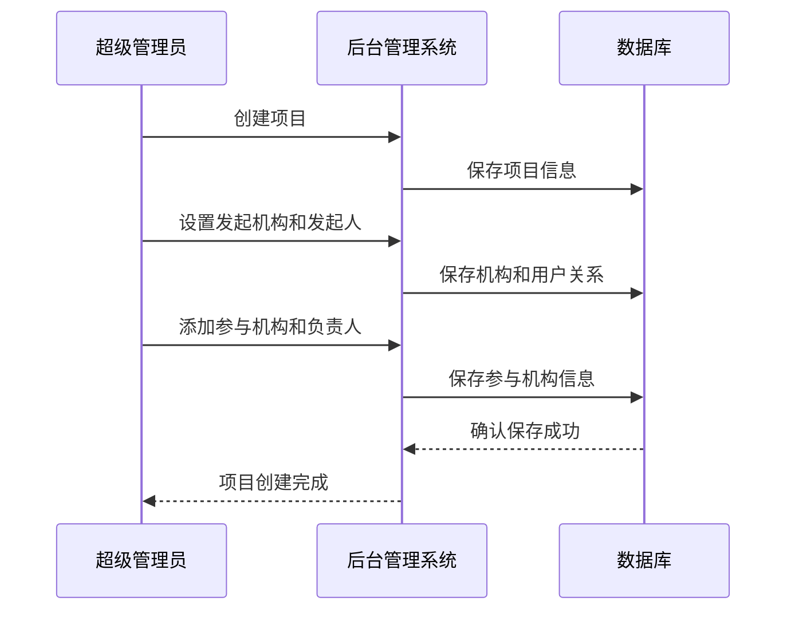
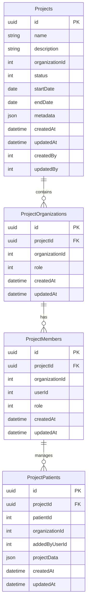

# Architecture for PRD for 科研项目协作平台

Status: Approved

## Technical Summary

本架构文档描述了科研项目协作平台的技术实现方案。该平台采用多租户架构，实现了严格的数据隔离，允许不同机构在保护数据隐私的前提下进行科研合作。后端采用NestJS框架构建模块化API，前端使用React和Ant Design Pro提供直观的用户界面。数据存储使用PostgreSQL，通过TypeORM实现对象关系映射。整个系统架构注重安全性、可扩展性和性能，确保科研数据的安全共享和有效分析。

## Technology Table

| 技术/组件        | 描述                                     |
|-----------------|------------------------------------------|
| TypeScript      | 主要开发语言，用于前后端                   |
| NestJS 11       | 后端API框架，提供模块化和依赖注入系统      |
| TypeORM         | ORM框架，用于数据库交互和实体映射          |
| PostgreSQL 16   | 关系型数据库，使用gplus schema             |
| React 16        | 前端UI框架                                |
| Ant Design 4.x  | UI组件库                                  |
| Ant Design Pro  | 后台管理系统框架，与Ant Design同步版本     |
| UmiJS (最新版)   | 前端应用框架，提供路由、状态管理等功能     |
| JWT             | 用户认证和授权令牌                         |
| Redis           | 缓存服务，用于提高系统性能                 |
| Docker          | 容器化部署方案                            |

## Architectural Diagrams

### 系统架构图



### 核心流程图：数据访问控制



### 项目创建流程



## Data Models, API Specs, Schemas, etc...

### 数据库实体关系图



### 主要API端点定义

#### 项目管理API

| 端点                                | 方法   | 描述                            | 权限              |
|------------------------------------|--------|--------------------------------|------------------|
| /api/admin/projects                | GET    | 获取项目列表（需要分页）          | 超级管理员        |
| /api/admin/projects                | POST   | 创建新项目                       | 超级管理员        |
| /api/admin/projects/:id            | GET    | 获取项目详情                     | 超级管理员        |
| /api/admin/projects/:id            | PUT    | 更新项目信息                     | 超级管理员        |
| /api/admin/projects/:id            | DELETE | 删除项目                         | 超级管理员        |
| /api/admin/projects/:id/orgs       | GET    | 获取项目参与机构列表（无需分页）   | 超级管理员        |
| /api/admin/projects/:id/orgs       | POST   | 添加参与机构                     | 超级管理员        |
| /api/admin/projects/:id/orgs/:orgId| DELETE | 移除参与机构                     | 超级管理员        |
| /api/admin/projects/:id/orgs/:orgId/members | GET | 获取机构项目成员列表（无需分页） | 超级管理员       |
| /api/admin/projects/:id/orgs/:orgId/members       | POST   | 添加机构成员                         | 超级管理员        |
| /api/admin/projects/:id/orgs/:orgId/members/:memberId | DELETE | 移除机构成员                         | 超级管理员        |

#### 机构项目API

| 端点                                  | 方法   | 描述                            | 权限              |
|--------------------------------------|--------|--------------------------------|------------------|
| /api/projects                        | GET    | 获取用户可访问的项目列表（无需分页） | 已认证用户        |
| /api/projects/:id                    | GET    | 获取项目详情                     | 项目成员          |
| /api/projects/:id/members            | GET    | 获取项目成员列表（无需分页）       | 机构管理员        |
| /api/projects/:id/members            | POST   | 添加项目成员                     | 机构管理员        |
| /api/projects/:id/members/:memberId    | DELETE | 移除项目成员                     | 机构管理员        |
| /api/projects/:id/patients           | GET    | 获取项目患者列表（需要分页）       | 项目成员          |
| /api/projects/:id/patients           | POST   | 添加患者到项目                   | 项目成员          |
| /api/projects/:id/patients/:patientId| DELETE | 从项目移除患者                   | 项目成员          |

## Project Structure

```
/server/src/modules/project/
├── dto/
│   ├── project.dto.ts               # 项目DTO定义
│   ├── project-organization.dto.ts  # 项目机构DTO定义
│   ├── project-member.dto.ts        # 项目成员DTO定义
│   ├── project-patient.dto.ts       # 项目患者DTO定义
│   └── project.ro.ts                # 项目响应对象定义
├── entities/
│   ├── project.entity.ts            # 项目实体定义
│   ├── project-organization.entity.ts # 项目机构实体定义
│   ├── project-member.entity.ts     # 项目成员实体定义
│   └── project-patient.entity.ts    # 项目患者实体定义
├── controllers/
│   ├── admin-project.controller.ts  # 后台项目管理控制器
│   └── project.controller.ts        # 普通项目控制器
├── services/
│   ├── project.service.ts           # 项目服务实现
│   └── project-access.service.ts    # 项目访问控制服务
├── guards/
│   └── project-access.guard.ts      # 项目访问权限守卫
├── project.module.ts                # 项目模块定义
└── project.subscriber.ts            # 项目实体订阅者

/client/src/pages/
├── Admin/
│   ├── Project/
│   │   ├── ProjectList.tsx                # 项目列表组件
│   │   ├── ProjectEditor.tsx              # 项目创建/编辑组件
│   │   ├── ProjectDetail.tsx              # 项目详情组件
│   │   ├── OrganizationManagement.tsx     # 机构管理组件
│   │   └── SelectOrganizations.tsx        # 机构选择组件
├── Project/
│   ├── ProjectList.tsx                    # 用户项目列表组件
│   ├── ProjectDetail.tsx                  # 项目详情组件
│   ├── MemberManagement.tsx               # 成员管理组件
│   └── PatientManagement.tsx              # 患者管理组件
└── components/                            # 共用组件
```

## Infrastructure

系统将部署在现有的基础设施上，利用Docker容器化技术实现应用的一致性部署和扩展。

主要基础设施组件：
- 应用服务器：运行NestJS后端API服务
- 数据库服务器：运行PostgreSQL数据库
- 缓存服务器：运行Redis缓存
- 静态资源服务器：用于前端资源和文件存储
- 负载均衡器：分发流量并提供SSL终止

## Deployment Plan

部署将遵循以下步骤：
1. 数据库迁移脚本准备（使用TypeORM迁移）
   - 使用 `npm run migration:generate --name=Project` 自动生成迁移脚本
   - 检查迁移脚本确保表结构正确
   - 执行迁移脚本创建数据库表
2. 开发环境部署和测试
3. 测试环境部署和验证
4. 生产环境部署

部署策略：
- 采用蓝绿部署策略减少停机时间
- 实现自动化部署流程
- 建立监控和告警机制

## Change Log

| 变更 | 日期 | 描述 |
|-----|------|-----|
| 初始草稿 | | 初始架构设计文档 | 
| 修改1 | | 移除API网关、添加API前缀、更新前端目录结构、添加数据库迁移详情 | 