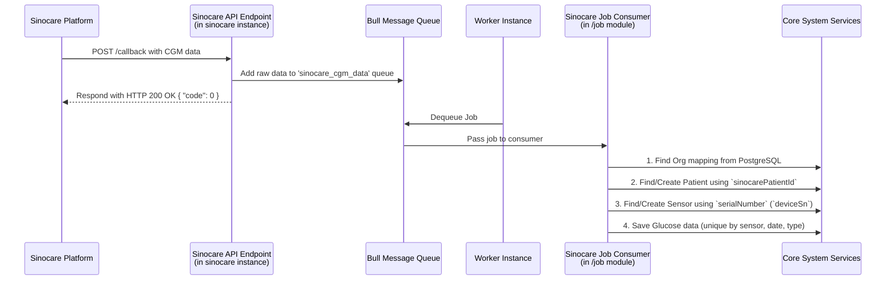

# Sinocare CGM 数据集成计划

本文档旨在详细阐述集成三诺（Sinocare）CGM数据推送服务的开发计划和技术方案。

## 1. 整体概述

根据《三诺推送CGM数据规范文档》，三诺IoT云平台会通过HTTP POST请求，将CGM设备数据实时推送到我方指定的服务器地址。为确保系统响应的敏捷性和数据处理的可靠性，本次集成采用**"接收与处理分离"**的架构：

1.  **数据接收（sinocare实例）**: 在 `server/src/modules/sinocare` 中创建一个轻量级模块，并部署为一个独立的`sinocare`实例。它仅负责提供一个API端点，用于接收、校验数据并将其快速推送到消息队列。
2.  **数据处理（worker实例）**: 在 `server/src/modules/job` 模块中创建一个新的消费者（`sinocare.consumer.ts`），订阅相应队列，异步执行所有核心业务逻辑，包括数据解析、实体创建和数据存储。

## 2. 数据处理流程

为了满足三诺接口5秒内必须响应的超时要求，并确保数据处理的健壮性，我们将采用异步处理模型。

## 3. 设计决策

根据您的反馈，最终设计决策如下：

1.  **安全性**: 采用**IP白名单**机制对回调来源进行验证。相关IP地址将作为环境变量进行配置。

2.  **机构映射**: 新建一个 **PostgreSQL** 表 `sinocare_org_mapping` 用于存储三诺 `customerName` 与我们系统 `organizationId` 的映射关系。如果消费者在处理数据时找不到映射，该任务将被视为失败。

3.  **患者识别**: 在 `gplus.patient` 表中新增一个 `sinocarePatientId` 字段，用于存储三诺推送的 `patientId`。这将作为在指定机构内查找或创建患者的唯一标识。

4.  **设备识别**: 三诺推送的 `deviceSn` 将直接映射到我们系统 `sensor` 表的 `serialNumber` 字段。同时，为三诺设备新增一个 `SensorType` 枚举值，例如 `SensorType.SINOCARE`。

5.  **数据去重**: 血糖数据将依据 `(sensorId, date, type)` 的组合唯一性约束进行存储，该约束已在数据库层面由 `@Unique('uq_sensor_date_type', ...)` 定义。三诺载荷中的 `testId` 字段将被忽略。

### 3.1 字段映射关系

以下为三诺数据载荷与本系统实体字段的核心映射关系：

| Sinocare Field | G-Plus Field | Notes |
| :--- | :--- | :--- |
| `customerName` | `sinocare_org_mapping` -> `organization.id` | 用于查找机构ID |
| `patientId` | `gplus.patient.sinocarePatientId` | 患者主标识 |
| `idCard` | `public.Patients.identity` | 患者身份证号 |
| `patientName` | `public.Patients.name` | 患者姓名 |
| `visitId` | `public.Treatment.number` | 住院记录关联（暂定） |
| `deviceSn` | `sensor.serialNumber` | 传感器唯一序列号 |
| `testTime` | `glucose.date` | 血糖记录时间 |
| `testResult` | `glucose.value` | 血糖值，需从字符串转换为数字(mg/dL) |
| `serialNo` | `glucose.number` | 血糖记录的序列号，对应数据表`number`字段 |
| `status` | `(业务逻辑)` | `1`代表无效数据，消费者在处理时需要过滤 |
| `cgmStatus` | `sensor.status` | 直接存储数值，前端根据传感器类型处理显示逻辑 |

**忽略字段**: `testId`, `increMinute`, `cgmDay`, `inSerialId`, `low`, `high` 将被忽略。

## 4. 开发实施计划

### 阶段一：模块搭建与环境准备

1.  **创建模块目录**: 新建 `server/src/modules/sinocare`。
2.  **定义工具类 (`sinocare.utils.ts`)**: 定义队列名称（`SINOCARE_QUEUE_NAME`）和任务名称。
3.  **定义DTOs (`sinocare/dto/`)**: 为三诺推送的数据结构创建TypeScript类型定义。
4.  **定义Entity (`sinocare/entities/`)**:
    *   `sinocare-org-mapping.entity.ts`: 定义机构映射表的PostgreSQL Entity。
    *   `sinocare-cgm-log.schema.ts`: （可选，但建议）在`cache`数据库中定义用于存储原始回调日志的Schema，便于调试。
5.  **定义模块 (`sinocare.module.ts`)**: 声明`sinocare`模块，并引入`BullModule`。

### 阶段二：API端点与任务入队 (sinocare 实例)

1.  **创建控制器 (`sinocare-open.controller.ts`)**:
    *   实现 `POST /api/open/sinocare/callback` 端点。
    *   实现IP白名单中间件或守卫。
    *   校验请求体 `reservedCode` 字段。
    *   将原始请求体（rawBody）作为任务载荷，添加到`SINOCARE_QUEUE_NAME`队列中。
    *   立即返回 `{"code":0,"msg":"SUCCESS"}`。

### 阶段三：核心业务逻辑实现 (worker 实例)

1.  **创建消费者 (`server/src/modules/job/sinocare.consumer.ts`)**:
    *   创建一个新的 `Bull` 消费者，处理 `SINOCARE_QUEUE_NAME` 队列中的任务。
    *   **核心处理逻辑**:
        1.  **机构查找**: 从 `sinocare_org_mapping` 表中根据 `customerName` 查找 `organizationId`。若无，则任务失败。
        2.  **患者管理**: 使用 `organizationId` 和 `sinocarePatientId` 在 `gplus.patient` 表中查找患者。若不存在，则调用 `patientService` 创建新患者。
        3.  **传感器管理**: 使用 `serialNumber` (`deviceSn`) 查找传感器，并赋予新的`SensorType.SINOCARE`类型。若不存在，则创建。
        4.  **血糖存储**: 调用 `glucoseProcessService` 存储血糖数据。数据唯一性由 `(sensor, date, type)` 保证。对于 `status: "1"` 的无效数据，进行过滤。

### 阶段四：集成、测试与部署

1.  **模块集成**:
    *   在 `app.module.ts` 中为 `sinocare` 新增一个独立的实例配置。
    *   在 `job.module.ts` 中，注册 `SinocareConsumer` 并将 `SINOCARE_QUEUE_NAME` 添加到 `BullModule` 配置中。
2.  **数据库迁移**:
    *   创建新的数据库迁移脚本，用于：
        *   在PostgreSQL中创建 `sinocare_org_mapping` 表。
        *   为 `gplus.patient` 表增加 `sinocarePatientId` 字段。
3.  **配置管理**:
    *   在 `.env` 文件中添加三诺回调的IP白名单列表。
    *   初始化 `sinocare_org_mapping` 表中的映射数据。
4.  **测试**:
    *   为 `SinocareConsumer` 编写单元测试。
    *   使用`Postman`或`curl`模拟三诺的POST请求，进行端到端的集成测试。
